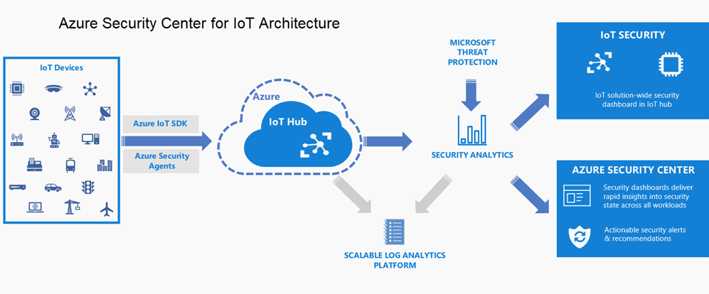

# Azure Security Center for IoT architecture

This article explains the functional system architecture of the Azure Security Center for IoT solution.

## Azure Security Center for IoT components

Azure Security Center for IoT is composed of the following components:

- IoT Hub integration
- Device agents (optional)
- Send security message SDK
- Analytics pipeline

### Azure Security Center for IoT workflows

Azure Security Center for IoT works in one of two feature workflows: Built-in and Enhanced

### Built-in

In **Built-in** mode, Azure Security Center for IoT is enabled when you elect to turn on the **Security** option in your IoT Hub. Offering real-time monitoring, recommendations and alerts, Built-in mode offers single-step device visibility and unmatched security. Build-in mode does not require agent installation on any devices and uses advanced analytics on logged activities to analyze and protect your field device.

### Enhanced

In **Enhanced** mode, after turning on the **Security** option in your IoT Hub and installing Azure Security Center for IoT device agents on your devices, the agents collect, aggregate and analyze raw security events from your devices. Raw security events can include IP connections, process creation, user logins, and other security-relevant information. Azure Security Center for IoT device agents also handle event aggregation to help avoid high network throughput. The agents are highly customizable, allowing you to use them for specific tasks, such as sending only important information at the fastest SLA, or for aggregating extensive security information and context into larger segments, avoiding higher service costs.

Device agents, and other applications use the **Azure send security message SDK** to send security information into Azure IoT Hub. IoT Hub picks up this information and forwards it to the Azure Security Center for IoT service.

Once the Azure Security Center for IoT service is enabled, in addition to the forwarded data, IoT Hub also sends out all of its internal data for analysis by Azure Security Center for IoT. This data includes device-cloud operation logs, device identities, and Hub configuration. All of this information helps to create the Azure Security Center for IoT analytics pipeline.

Azure Security Center for IoT analytics pipeline also receives additional threat intelligence streams from various sources within Microsoft and Microsoft partners. The Azure Security Center for IoT entire analytics pipeline works with every customer configuration made on the service (such as custom alerts and use of the send security message SDK).

Using the analytics pipeline, Azure Security Center for IoT combines all of the streams of information to generate actionable recommendations and alerts. The pipeline contains both custom rules created by security researchers and experts as well as   machine learning models searching for deviation from standard device behavior and risk analysis.

Azure Security Center for IoT recommendations and alerts (analytics pipeline output) is written to the Log Analytics workspace of each customer. Including the raw events in the workspace as well as the alerts and recommendations enables deep dive investigations and queries using the exact details of the suspicious activities detected.

## Next steps

In this article, you learned about the basic architecture and workflow of Azure Security Center for IoT solution. To learn more about prerequisites, how to get started and enable your security solution in IoT Hub, see the following articles:

- [Service prerequisites](service-prerequisites.md)
- [Getting started](getting-started.md)
- [Configure your solution](quickstart-configure-your-solution.md)
- [Enable security in IoT Hub](quickstart-onboard-iot-hub.md)
- [Azure Security Center for IoT FAQ](resources-frequently-asked-questions.md)
- [Azure Security Center for IoT security alerts](concept-security-alerts.md)
