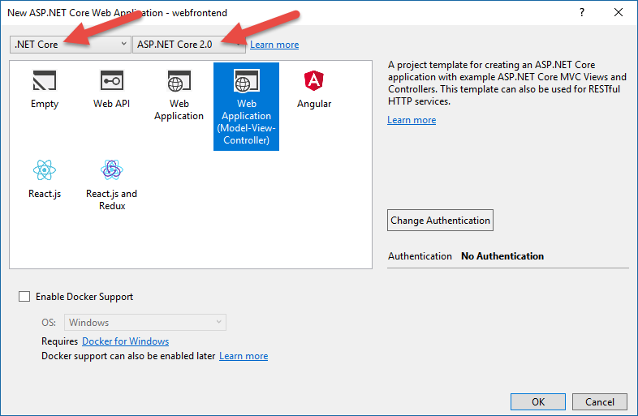
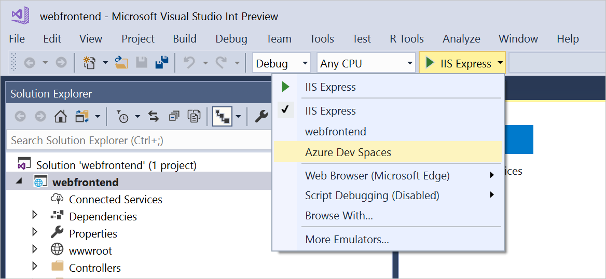
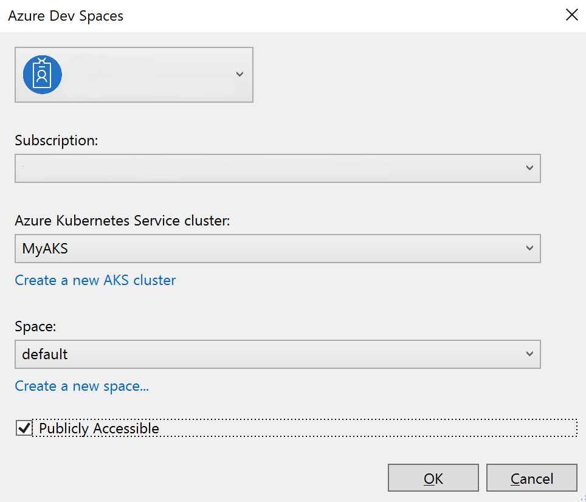
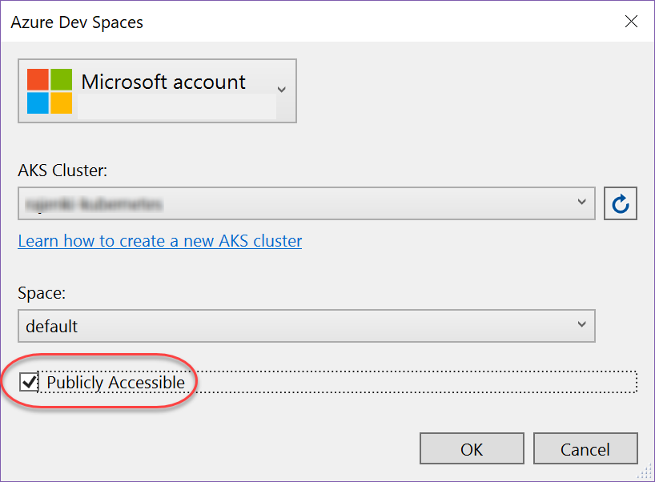
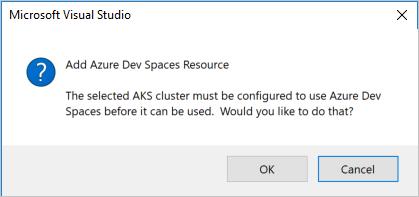
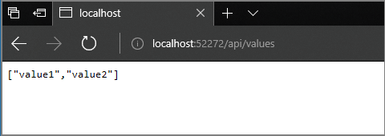
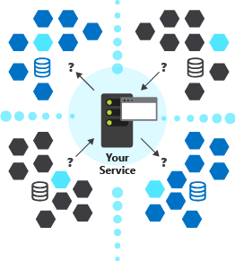
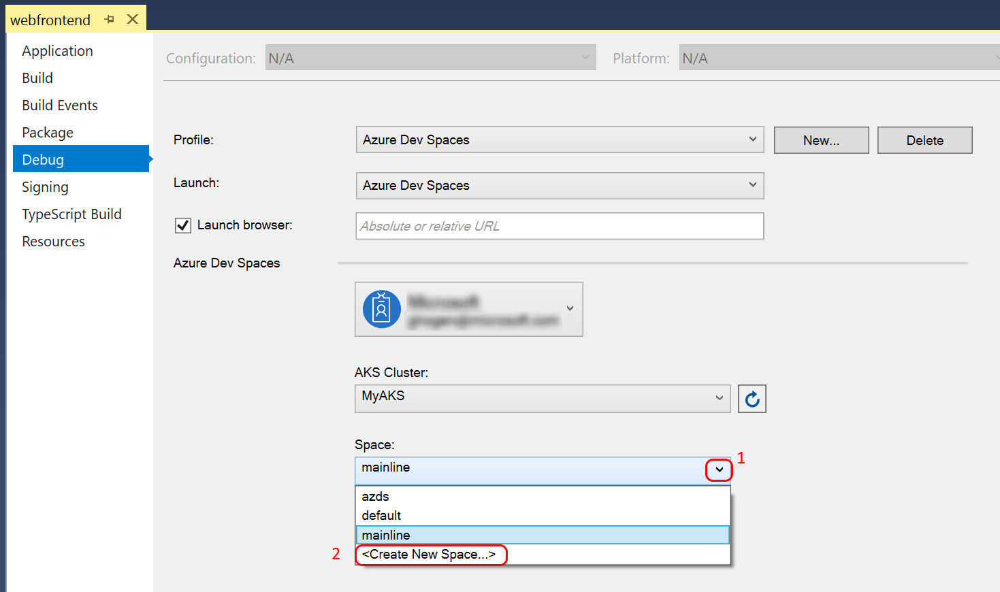
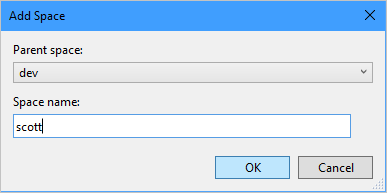
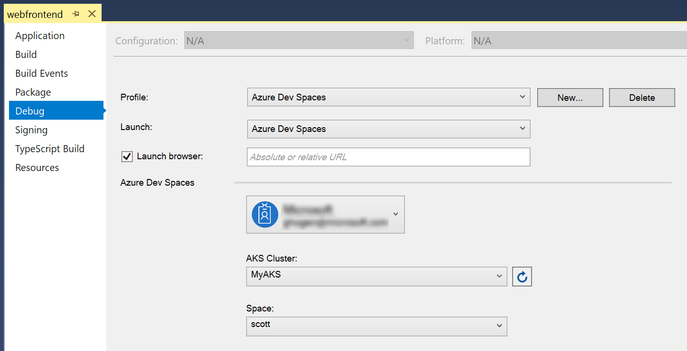

# Get Started on Azure Dev Spaces with .NET Core and Visual Studio

In this guide, you will learn how to:

- Set up Azure Dev Spaces with a managed Kubernetes cluster in Azure.
- Iteratively develop code in containers using Visual Studio.
- Independently develop two separate services, and used Kubernetes' DNS service discovery to make a call to another service.
- Productively develop and test your code in a team environment.

[!INCLUDE[](includes/see-troubleshooting.md)]

[!INCLUDE[](includes/portal-aks-cluster.md)]

## Get the Visual Studio tools
1. Install the latest version of [Visual Studio 2017](https://www.visualstudio.com/vs/)
1. In the Visual Studio installer make sure the following Workload is selected:
    * ASP.NET and web development
1. Install the [Visual Studio extension for Azure Dev Spaces](https://aka.ms/get-azds-visualstudio)

## Create a web app running in a container

In this section, you'll create a ASP.NET Core web app and get it running in a container in Kubernetes.

### Create an ASP.NET web app

From within Visual Studio 2017, create a new project. Currently, the project must be an **ASP.NET Core Web Application**. Name the project '**webfrontend**'.


Select the **Web Application (Model-View-Controller)** template and be sure you're targeting **.NET Core** and **ASP.NET Core 2.0** in the two dropdowns at the top of the dialog. Click **OK** to create the project.




### Enable Dev Spaces for an AKS cluster

With the project you just created open, select **Azure Dev Spaces** from the launch settings dropdown, as shown below.



In the dialog that is displayed next, make sure you are signed in with the appropriate account, and then either select an existing Kubernetes cluster.



Leave the **Space** dropdown defaulted to `default` for now. Later, you'll learn more about this option. Check the **Publicly Accessible** checkbox so the web app will be accessible via a public endpoint. This setting isn't required, but it will be helpful to demonstrate some concepts later in this walkthrough. But don’t worry, in either case you will be able to debug your website using Visual Studio.



Click **OK** to select or create the cluster.

If you choose a cluster that hasn't been enabled to work with Azure Dev Spaces, you'll see a message asking if you want to configure it.



Choose **OK**.

 A background task will be started to accomplish this. It will take a number of minutes to complete. To see if it's still being created, hover your pointer over the **Background tasks** icon in the bottom left corner of the status bar, as shown in the following image.


> [!Note]
> Until the dev space is successfully created you cannot debug your application.

### Look at the files added to project
While you wait for the dev space to be created, look at the files that have been added to your project when you chose to use a dev space.

First, you can see a folder named `charts` has been added and within this folder a [Helm chart](https://docs.helm.sh) for your application has been scaffolded. These files are used to deploy your application into the dev space.

You will see a file named `Dockerfile` has been added. This file has information needed to package your application in the standard Docker format.

Lastly, you will see a file named `azds.yaml`, which contains development-time configuration that is needed by the dev space.


## Debug a container in Kubernetes
Once the dev space is successfully created, you can debug the application. Set a breakpoint in the code, for example on line 20 in the file `HomeController.cs` where the `Message` variable is set. Click **F5** to start debugging. 

Visual Studio will communicate with the dev space to build and deploy the application and then open a browser with the web app running. It might seem like the container is running locally, but actually it's running in the dev space in Azure. The reason for the localhost address is because Azure Dev Spaces creates a temporary SSH tunnel to the container running in Azure.

Click on the **About** link at the top of the page to trigger the breakpoint. You have full access to debug information just like you would if the code was executing locally, such as the call stack, local variables, exception information, and so on.

## Call another container
In this section you're going to create a second service, `mywebapi`, and have `webfrontend` call it. Each service will run in separate containers. You'll then debug across both containers.


### Download sample code for *mywebapi*
For the sake of time, let's download sample code from a GitHub repository. Go to https://github.com/Azure/dev-spaces and select **Clone or Download** to download the GitHub repository. The code for this section is in `samples/dotnetcore/getting-started/mywebapi`.

### Run *mywebapi*
1. Open the project `mywebapi` in a *separate Visual Studio window*.
1. Select **Azure Dev Spaces** from the launch settings dropdown as you did previously for the `webfrontend` project. Rather than creating a new AKS cluster this time, select the same one you already created. As before, leave the Space defaulted to `default` and click **OK**. In the Output window, you may notice Visual Studio starts to "warm up" this new service in your dev space in order to speed things up when you start debugging.
1. Hit F5, and wait for the service to build and deploy. You'll know it's ready when the Visual Studio status bar turns orange
1. Take note of the endpoint URL displayed in the **Azre Dev Spaces for AKS** pane in the **Output** window. It will look something like http://localhost:\<portnumber\>. It might seem like the container is running locally, but actually it's running in the dev space in Azure.
2. When `mywebapi` is ready, open your browser to the localhost address and append `/api/values` to the URL to invoke the default GET API for the `ValuesController`. 
3. If all the steps were successful, you should be able to see a response from the `mywebapi` service that looks like this.

    

### Make a request from *webfrontend* to *mywebapi*
Let's now write code in `webfrontend` that makes a request to `mywebapi`. Switch to the Visual Studio window that has the `webfrontend` project. In the `HomeController.cs` file *replace* the code for the About method with the following code:

   ```csharp
   public async Task<IActionResult> About()
   {
      ViewData["Message"] = "Hello from webfrontend";

      using (var client = new System.Net.Http.HttpClient())
            {
                // Call *mywebapi*, and display its response in the page
                var request = new System.Net.Http.HttpRequestMessage();
                request.RequestUri = new Uri("http://mywebapi/api/values/1");
                if (this.Request.Headers.ContainsKey("azds-route-as"))
                {
                    // Propagate the dev space routing header
                    request.Headers.Add("azds-route-as", this.Request.Headers["azds-route-as"] as IEnumerable<string>);
                }
                var response = await client.SendAsync(request);
                ViewData["Message"] += " and " + await response.Content.ReadAsStringAsync();
            }

      return View();
   }
   ```

The preceding code example forwards the `azds-route-as` header from the incoming request to the outgoing request. You'll see later how this facilitates a more productive development experience in team scenarios.

### Debug across multiple services
1. At this point, `mywebapi` should still be running with the debugger attached. If it is not, hit F5 in the `mywebapi` project.
1. Set a breakpoint in the `Get(int id)` method in the `Controllers/ValuesController.cs` file that handles `api/values/{id}` GET requests.
1. In the `webfrontend` project where you pasted the above code, set a breakpoint just before it sends a GET request to `mywebapi/api/values`.
1. Hit F5 in the `webfrontend` project. Visual Studio will again open a browser to the appropriate localhost port and the web app will be displayed.
1. Click on the “**About**” link at the top of the page to trigger the breakpoint in the `webfrontend` project. 
1. Hit F10 to proceed. The breakpoint in the `mywebapi` project will now be triggered.
1. Hit F5 to proceed and you will be back in the code in the `webfrontend` project.
1. Hitting F5 one more time will complete the request and return a page in the browser. In the web app, the About page will display a message concatenated by the two services: "Hello from webfrontend and Hello from mywebapi."

Well done! You now have a multi-container application where each container can be developed and deployed separately.

## Learn about team development

So far you've run your application's code as if you were the only developer working on the app. In this section, you'll learn how Azure Dev Spaces streamlines team development:
* Enable a team of developers to work in the same environment, by working in a shared dev space or in distinct dev spaces as needed..
* Supports each developer iterating on their code in isolation and without fear of breaking others.
* Test code end-to-end, prior to code commit, without having to create mocks or simulate dependencies.

### Challenges with developing microservices
Your sample application isn't very complex at the moment. But in real-world development, challenges soon emerge as you add more services and the development team grows.

Picture yourself working on a service that interacts with dozens of other services.

- It can become unrealistic to run everything locally for development. Your dev machine may not have enough resources to run the entire app. Or, perhaps your app has endpoints that need to be publicly reachable (for example, your app responds to a webhook from a SaaS app).
- You can try to only run the services that you depend on, but this means you'd need know the full closure of dependencies (for example, dependencies of dependencies). Or, it's a matter of not easily knowing how to build and run your dependencies because you didn't work on them.
- Some developers resort to simulating, or mocking up, many of their service dependencies. This can help sometimes, but managing those mocks can soon take on its own development effort. Plus, this leads to your dev environment looking different from production, and subtle bugs can creep in.
- It follows that doing any type of end-to-end testing becomes difficult. Integration testing can only realistically happen after a commit, which means you see problems later in the development cycle.

    

### Work in a shared dev space
With Azure Dev Spaces, you can set up a *shared* dev space in Azure. Each developer can focus on just their part of the application, and can iteratively develop *pre-commit code* in a dev space that already contains all the other services and cloud resources that their scenarios depend on. Dependencies are always up-to-date, and developers are working in a way that mirrors production.

### Work in your own space
As you develop code for your service, and before you're ready to check it in, code often won't be in a good state. You're still iteratively shaping it, testing it, and experimenting with solutions. Azure Dev Spaces provides the concept of a **space**, which allows you to work in isolation, and without the fear of breaking your team members.

Do the following to make sure both your `webfrontend` and `mywebapi` services are running **in the `default` dev space**.
1. Close any F5/debug sessions for both services, but keep the projects open in their Visual Studio windows.
2. Switch to the Visual Studio window with the `mywebapi` project and press Ctrl+F5 to run the service without the debugger attached
3. Switch to the Visual Studio window with the `webfrontend` project and press Ctrl+F5 to run it as well.

> [!Note]
> It is sometimes necessary to refresh your browser after the web page is initially displayed 
> following a Ctrl+F5.

Anyone who opens the public URL and navigates to the web app will invoke the code path you have written which runs through both services using the default `default` space. Now suppose you want to continue developing `mywebapi` - how can you do this and not interrupt other developers who are using the dev space? To do that, you'll set up your own space.

### Create a new dev space
From within Visual Studio, you can create additional spaces that will be used when you F5 or Ctrl+F5 your service. You can call a space anything you'd like, and you can be flexible about what it means (ex. `sprint4` or `demo`).

Do the following to create a new space:
1. Switch to the Visual Studio window with the `mywebapi` project.
2. Right-click on the project in **Solution Explorer** and select **Properties**.
3. Select the **Debug** tab on the left to show the Azure Dev Spaces settings.
4. From here, you can change or create the cluster and/or space that will be used when you F5 or Ctrl+F5. *Make sure the Azure Dev Space you created earlier is selected*.
5. In the Space dropdown, select **<Create New Space…>**.

    

6. In the **Add Space** dialog, type in a name for the space and click **OK**. You can use your name (for example, "scott") for the new space so that it is identifiable to your peers what space you're working in.

    

7. You should now see your AKS cluster and new Space selected on the project properties page.

    

### Update code for *mywebapi*

1. In the `mywebapi` project make a code change to the `string Get(int id)` method in file `Controllers/ValuesController.cs` as follows:
 
    ```csharp
    [HttpGet("{id}")]
    public string Get(int id)
    {
        return "mywebapi now says something new";
    }
    ```

2. Set a breakpoint in this updated block of code (you may already have one set from before).
3. Hit F5 to start the `mywebapi` service. This will start the service in your cluster using the selected space, which in this case is `scott`.

Here is a diagram that will help you understand how the different spaces work. The blue path shows a request via the `default` space, which is the default path used if no space is prepended to the URL. The green path shows a request via the `default/scott` space.


This built-in capability of Azure Dev Spaces enables you to test code end-to-end in a shared environment without requiring each developer to re-create the full stack of services in their space. This routing requires propagation headers to be forwarded in your app code, as illustrated in the previous step of this guide.

### Test code running in the `default/scott` space
To test your new version of `mywebapi` in conjunction with `webfrontend`, open your browser to the public access point URL for `webfrontend` (for example, http://webfrontend.123456abcdef.eastus.aksapp.io) and go to the About page. You should see the original message "Hello from webfrontend and Hello from mywebapi".

Now, add the "scott.s." part to the URL so it reads something like http://scott.s.webfrontend.123456abcdef.eastus.aksapp.io and refresh the browser. The breakpoint you set in your `mywebapi` project should get hit. Click F5 to proceed and in your browser you should now see the new message "Hello from webfrontend and mywebapi now says something new." This is because the path to your updated code in `mywebapi` is running in the `default/scott` space.

[!INCLUDE[](includes/well-done.md)]

[!INCLUDE[](includes/clean-up.md)]
