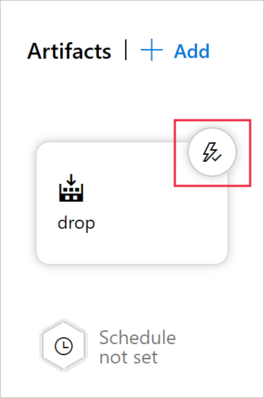
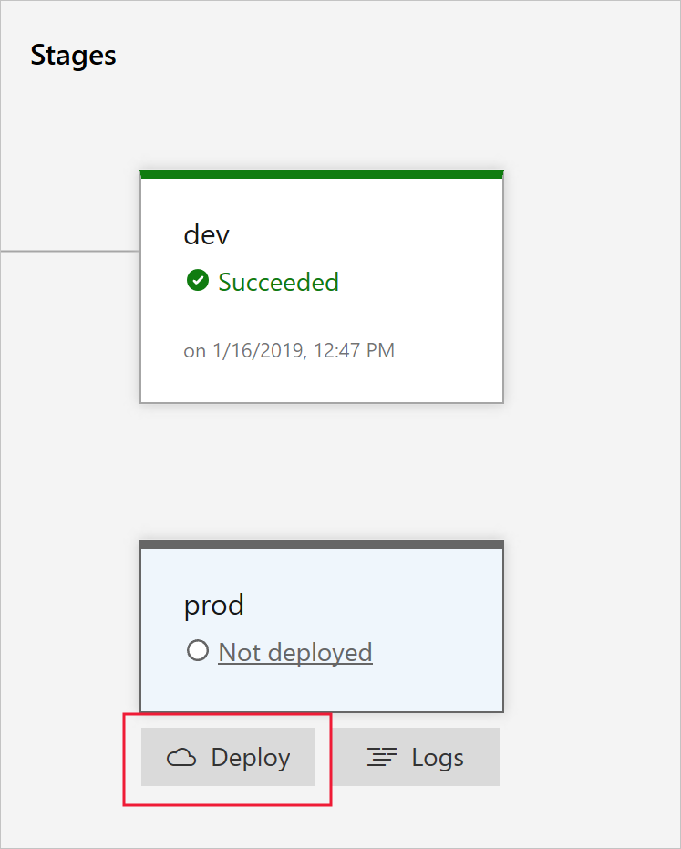

# Sample app CI/CD on an Azure Dev Spaces-enabled cluster

In this how-to, we will guide you on setting up a simple CI/CD (continuous integration/continuous deployment) pipeline for our sample application using Azure DevOps Pipelines, on the same DevSpaces-enabled cluster you've been using for inner-loop development.

## Prerequisites
### Download sample code
For the sake of time, let's create a fork of our sample code GitHub repository. Go to https://github.com/Azure/dev-spaces and select **Fork**. Once the fork process is complete, **Clone** your forked version of the repository locally. By default the `master` branch will have been checked out, but we've included some time-saving changes in the `azds_updates` branch, which should also have been transferred during your fork

> [!Note]
> We specifically want the `azds_updates` branch for this step, *not* the `master` branch. The `azds_updates` branch contains updates we asked you to make manually in the previous tutorial section, as well as some pre-made YAML and JSON files for streamlining the deployment of the CI/CD system.

### Azure Container Registry
This CI/CD pipeline is written to utilize [Azure Container Registry](https://azure.microsoft.com/en-us/services/container-registry/), which you'll need to deploy separately before running this tutorial. You'll need to enable the "admin account", and have the **username** and **password** for the ACR instance handy so they can be plugged into the build pipeline variables. For more information on the ACR admin account, [click here](https://docs.microsoft.com/en-us/azure/container-registry/container-registry-authentication#admin-account).

> [!Important]
> **Authorizing your AKS cluster to pull from your Azure Container Registry**
>
> Your Kubernetes cluster will also need authorization to _pull_ the images from your private ACR registry. This is most easily accomplished by assigning the "Contributor" role (or the more specific "AcrPull" role), to the service principal that was used to create your AKS cluster. If you're unsure which service principal you used, you can get the service principal ID by executing the following AzureCLI command: `az aks show -g <resource group> -n <resource name> -o yaml`. Look for the `servicePrincipalProfile:` section.
>
> Another method for accomplishing this would be to create a secret in Kubernetes containing the "admin account" credentials for your ACR instance, then referencing the secret in your Pod deployment spec. This strategy is described [here](https://kubernetes.io/docs/tasks/configure-pod-container/pull-image-private-registry/). Note that for the purposes of this document we'll assume you've already completed either step.

### Azure DevOps team project
You'll need an Azure DevOps organization, with a project created inside it, in order to deploy new CI/CD pipelines for our sampleapps. For more information on creating a DevOps project, [click here](https://docs.microsoft.com/en-us/azure/devops/organizations/projects/create-project?view=vsts&tabs=new-nav).

## CI/CD strategy

After using DevSpaces and getting used to how easy it is to convert code into a running Kubernetes service, it may be tempting to try and use the DevSpaces tooling in your CI/CD system to "up" your projects to avoid having to build & push a Docker image to a repository, set per-release Helm chart variables, etc. However, for a variety of reasons, we don't recommend going with that approach.

The biggest reason being that one of the primary goals of Azure DevSpaces is to make inner-loop development scenarios run as _closely_ as possible to a Production environment. This provides more predictability & confidence for developers, by avoiding the addition of development-only configuration or runtimes.

So, a CI/CD system in a DevSpaces-enabled environment ideally shouldn't look much different than CI/CD in a non-DevSpaces environment. This tutorial will guide you on how to create a simple CI/CD system for our sample applications, but none of the components or strategies used should look much different than what you may already be used to.

### DevSpaces setup
Before we begin, execute the following:
```cmd
azds space select -n dev -y
```
This will create/configure a new space called "dev" in your cluster. The CI/CD pipeline you're about to deploy will automatically push all changes you make to your forked `azds_updates` branch into this space. The idea will be that "dev" will always contain the latest state of the repository, a "baseline", so that developers can create "child spaces" from "dev" to test their isolated changes within the context of the larger app. (This is discussed in more detail in the DevSpaces tutorials.)

The proposed hierarchy is visualized below:


### Creating the build definition
In the `azds_updates` branch we've included a simple [Azure Pipeline YAML](https://docs.microsoft.com/en-us/azure/devops/pipelines/yaml-schema?view=vsts&tabs=schema) that defines the build steps required for *mywebapi* and *webfrontend*.

Depending on the language you've chosen, the pipeline YAML has been checked-in at a path like: `samples/{{ language }}/getting-started/azure-pipelines.{{ language }}.yml`

To create a Pipeline from this file:
1. On your DevOps project main page, navigate to Pipelines > Builds
1. Select the option to create a **New** build pipeline
1. Select **GitHub** as the source, authorize with your GitHub account if necessary, and select the `azds_updates` branch from your forked version of the dev-spaces sampleapp repository
1. Select "Configuration as code", or "YAML", as your template
1. You should now be presented with a configuration page for your build pipeline. As mentioned above enter the following for the "YAML file path": `samples/{{ language }}/getting-started/azure-pipelines.{{ language }}.yml`
1. Your pipeline needs to be configured with **Azure Container Registry credentials** so we have somewhere to host your images. To do this, to the Variables tab.
1. Manually add `dockerId` as a variable. Typically this is the name of your ACR instance. E.g. "\<dockerId\>.azurecr.io"
1. Manually add `dockerPassword` as a variable. Be sure to specify this as a Secret (by selecting the lock icon) for security purposes.
1. Select "Save & queue"

If all goes well, you now have a CI solution that will automatically build *mywebapi* and *webfrontend* for any update pushed to the `azds_updates` branch of your GitHub fork! Now for the other half; continuous deployment (CD) of these builds.

### Creating the release definition
Azure DevOps Pipelines does not (yet) support configuration-as-code in the same way as build definitions. But we have provided a .json file that can be used to easily import an example release pipeline into your project.

The language-independent release .json has been checked-in at `samples/release.json`

> [!Note]
> If you're working in a brand-new DevOps Project that doesn't yet contain a release definition, you'll need to first create an empty release definition before proceeding. This is because the "Import" option doesn't display in the UI if you don't have any existing release definitions.

To create a release definition from our .json file:
1. On your DevOps project main page, navigate to Pipelines > Releases
1. On the left, click the "+ New" button, then click "Import a pipeline"
1. Select the .json file at `samples/release.json`
1. Click Ok

Once loaded, you should be presented with the release definition edit page, and on the Pipeline pane. You may notice there are red warning icons on this screen, but don't worry! There are a few project-specific settings we must configure before we're done.

5. On the left of the Pipeline pane, click the "Add an artifact" bubble.
1. In the 'Source dropdown', select the build pipeline we created a little earlier in this document.
1. For the 'Default version', we recommend choosing "Latest from the build pipeline default branch". (No tags need to be specified.)
1. **IMPORTANT** Set the 'Source alias' to "drop". (The predefined release tasks use this alias.)
1. Click 'Add'.
1. Now click the lightning bolt icon on the newly created "drop" artifact source, as shown below:



11. Enable the 'Continuous deployment trigger'
1. Now go to the Tasks pane. The 'dev' stage should be selected, and you should be presented with 3 red dropdown controls like below:


13. Specify the subscription, resource group, cluster you're using with Azure DevSpaces.
1. There should be only 1 more section showing red at this point; the "Agent job" section. Go there and specify "Hosted Ubuntu 1604" as the agent pool for this stage.
1. Hover over the 'Tasks' selector at the top, select "prod", and repeat steps 13 & 14 for the prod stage.
1. Click 'Save' in the upper-right, and 'OK'
1. Click '+ Release' (next to the Save button), and 'Create a release'
1. The latest build from your build pipeline should already be selected in the Artifacts section. So, cross your fingers and hit 'Create'!

An automated release process will now begin, deploying the *mywebapi* and *webfrontend* charts to your Kubernetes cluster in the 'dev' top-level space. (We will discuss the 'prod' deployment stage further in a later section.)

### Accessing your 'dev' services
After deployment, the 'dev' version of *webfrontend* can be accessed with a public URL like: `http://dev.webfrontend.<hash>.<region>.aksapp.io`.

### Well done!
You now have a fully automated CI/CD pipeline for your Github fork of the DevSpaces sample apps. Each time you checkin, the build pipeline will build and push the *mywebapi* and *webfrontend* images to your custom ACR instance. Then the release pipeline will deploy the Helm chart for each app into the 'dev' space on your DevSpaces-enabled cluster.

In the DevSpaces tutorials, we talk about how a CI/CD system like this helps to establish a "baseline" of your services which can be leveraged together with DevSpaces functionality to assist with team development of complex microservice applications.

# Deploying to Production
While completing the tutorial above you may have noticed a 'prod' stage has been defined for you:


We have a few general recommendations on running your applications in production.

### Promoting a release to production
To manually promote a particular release to 'prod' using the CI/CD system we've set up during this tutorial:
1. Open a previously successful release on the DevOps portal
1. Hover over the 'prod' stage
1. Select Deploy



### Accessing your 'prod' services
Our CI/CD pipeline example makes use of variables to change the DNS prefix for *webfrontend* depending on which environment is being deployed. So to access your 'prod' services, you can use a URL like: `http://prod.webfrontend.<hash>.<region>.aksapp.io`.

### DevSpaces instrumentation in production
Although DevSpaces instrumentation has been designed _not_ to get in the way of normal operation of your application, we recommend running your production workloads in a non-DevSpaces-enabled Kubernetes namespace. This means you should either create your production namespace using the `kubectl` CLI, or allow your CI/CD system to create it during the first Helm deployment. (Note that "selecting" or otherwise creating a space using DevSpaces tooling will add DevSpaces instrumentation to that namespace.)

Here is an example namespace structure that supports feature development, the 'dev' environment, _and_ production, all in a single Kubernetes cluster:


> [!Tip]
> If you've already created a `prod` space, and would simply like to exclude it from DevSpaces instrumentation (without deleting it!), you can do so with the following DevSpaces CLI command:
>
> `azds space remove -n prod --no-delete`
>
> You may need to delete all pods in the `prod` namespace after doing this so they can be recreated without DevSpaces instrumentation.