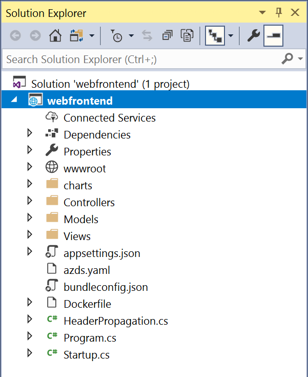

# Quickstart: Create a Kubernetes development environment with Azure Dev Spaces (.NET Core and Visual Studio)

In this guide, you will learn how to:

1. Create a Kubernetes-based environment in Azure that is optimized for development.
1. Iteratively develop code in containers using Visual Studio.

[!INCLUDE]

## Install the Azure Dev Spaces CLI
Azure Dev Spaces requires minimal local machine setup. Most of your development environment's configuration gets stored in the cloud, and is shareable with other users.

1. Install [Git for Windows](https://git-scm.com/downloads), select the default install options. 
1. Download **kubectl.exe** from [this link](https://storage.googleapis.com/kubernetes-release/release/v1.9.0/bin/windows/amd64/kubectl.exe) and **save** it to a location on your PATH.
1. Download and run the [Azure Dev Spaces CLI Installer](https://aka.ms/get-azds-windows). 

[!INCLUDE]

[!INCLUDE]

## Get Kubernetes Debugging Tools
While you can use the Azure Dev Spaces CLI as a standalone tool, rich features like **Kubernetes debugging** are available for .NET Core developers using **VS Code** or **Visual Studio**.

### Visual Studio debugging 
1. Install the latest version of [Visual Studio 2017](https://www.visualstudio.com/vs/)
1. In the Visual Studio installer make sure the following Workload is selected:
    * ASP.NET and web development
1. Install the [Visual Studio extension for Azure Dev Spaces](https://aka.ms/get-azds-visualstudio)

You're now ready to Create an ASP.NET web app with Visual Studio.

## Create an ASP.NET web app

From within Visual Studio 2017, create a new project. Currently, the project must be an **ASP.NET Core Web Application**. Name the project '**webfrontend**'.

Select the **Web Application (Model-View-Controller)** template and be sure you're targeting **.NET Core** and **ASP.NET Core 2.0** in the two dropdowns at the top of the dialog. Click **OK** to create the project.

## Create a dev environment in Azure

With Azure Dev Spaces, you can create Kubernetes-based development environments that are fully managed by Azure and optimized for development. With the project you just created open, select **Azure Dev Spaces** from the launch settings dropdown, as shown below.

In the dialog that is displayed next, make sure you are signed in with the appropriate account, and then select an existing cluster.

Leave the **Space** dropdown defaulted to `mainline` for now. Later, you'll learn more about this option. Check the **Publicly Accessible** checkbox so the web app will be accessible via a public endpoint. This setting isn't required, but it will be helpful to demonstrate some concepts later in this walkthrough. But don’t worry, in either case you will be able to debug your website using Visual Studio.

Click **OK** to select or create the development environment. A background task will be started to accomplish this, it will take a number of minutes to complete. To see if it's still being created, hover your pointer over the **Background tasks** icon in the bottom left corner of the status bar, as shown in the following image.

> [!Note]
Until the development environment is successfully created you cannot debug your application.

## Look at the files added to project
While you wait for the development environment to be created, look at the files that have been added to your project when you chose to use a development environment.

First, you can see a folder named `charts` has been added and within this folder a [Helm chart](https://docs.helm.sh) for your application has been scaffolded. These files are used to deploy your application into the development environment.

You will see a file named `Dockerfile` has been added. This file has information needed to package your application in the standard Docker format. A `HeaderPropagation.cs` file is also created, we will discuss this file later in the walkthrough. 

Lastly, you will see a file named `azds.yaml`, which contains configuration information that is needed by the development environment, such as whether the application should be accessible via a public endpoint.

## Debug a container in Kubernetes
Once the development environment is successfully created, you can debug the application. Set a breakpoint in the code, for example on line 20 in the file `HomeController.cs` where the `Message` variable is set. Click **F5** to start debugging. 

Visual Studio will communicate with the development environment to build and deploy the application and then open a browser with the web app running. It might seem like the container is running locally, but actually it's running in the development environment in Azure. The reason for the localhost address is because Azure Dev Spaces creates a temporary SSH tunnel to the container running in Azure.

Click on the **About** link at the top of the page to trigger the breakpoint. You have full access to debug information just like you would if the code was executing locally, such as the call stack, local variables, exception information, and so on.

## Next steps

> [!div class="nextstepaction"]
> [Working with multiple containers and team development](get-started-netcore-visualstudio.md)