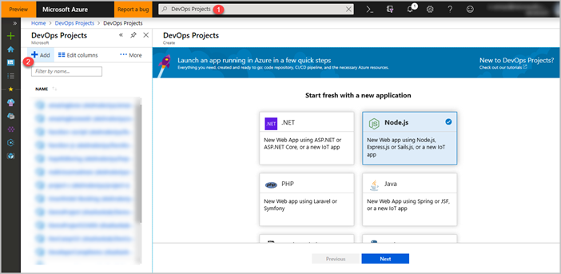
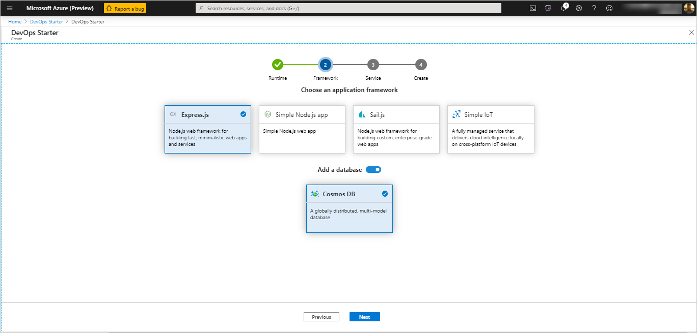
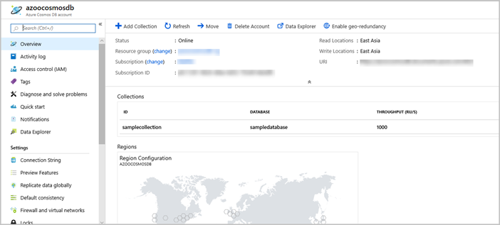
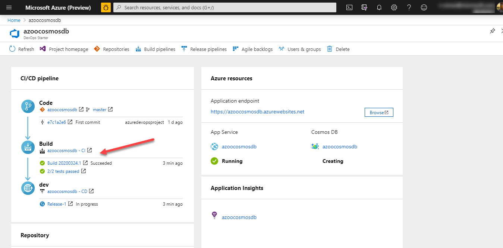

# Deploy Node.js apps powered by Azure Cosmos DB with DevOps Projects

Azure DevOps Projects offers a streamlined experience where you can create a continuous integration (CI) and continuous deployment (CD) pipeline to Azure. You do this by using your existing code and Git repository (repo) or by selecting a sample application.

DevOps Projects also:

* Automatically creates Azure resources, such as Azure Cosmos DB, Azure Application Insights, Azure App Service, and App Service plans

* Creates and configures a CI/CD release pipeline in Azure DevOps

In this tutorial, you will:

> [!div class="checklist"]
> * Use DevOps Projects to deploy a Node.js app powered by Azure Cosmos DB
> * Configure Azure DevOps and an Azure subscription
> * Examine Azure Cosmos DB
> * Examine the CI pipeline
> * Examine the CD pipeline
> * Commit the changes to Git and automatically deploy them to Azure
> * Clean up the resources

## Prerequisites

You need an Azure subscription, which you can get through [Visual Studio Dev Essentials](https://visualstudio.microsoft.com/dev-essentials/) for free.

## Use DevOps Projects to deploy Node.js app

DevOps Projects creates a CI/CD pipeline in Azure Pipelines. You can create a new Azure DevOps organization or use an existing organization. DevOps Projects also creates Azure resources, such as Azure Cosmos DB, Application Insights, App Service, and App Service plans, in the Azure subscription of your choice.

1. Sign in to the [Azure portal](https://portal.azure.com).

1. In the left pane, select **Create a resource**.

1. In the search box, enter **DevOps Projects**, and then select **Add**.

   

1. Select **Node.js** as the runtime, and then select **Next**. Under **Choose an application framework**, select **Express.js**.

1. Enable the section **Add a database** for **Cosmos DB**, and then select **Next**.

    

    Azure DevOps Projects supports various application frameworks, such as **Express.js**, **Sample Node.js app**, and **Sail.js**. In this tutorial, we use **Express.js**.

1. Select an Azure service to deploy the application, and then select **Next**. Your options include Windows Web App, Azure Kubernetes Service, and Azure Web App for Containers. In this tutorial, we use **Windows Web App**.

## Configure Azure DevOps and Azure subscription

1. Enter a name for your Azure DevOps project.

1. Create a new Azure DevOps organization, or select an existing organization.

1. Select your Azure subscription.

1. To view additional Azure configuration settings or identify the pricing tier and location, select **Additional settings**. This pane shows various options for configuring the pricing tier and location of Azure services.

1. Exit the Azure configuration area, and then select **Done**.

1. The process finishes after a few minutes. A sample Node.js app is set up in a Git repo in your Azure DevOps organization. Then, Azure Cosmos DB, App Service, App Service plan, and Application Insights resources are created, as well as a CI/CD pipeline. Your app is then deployed to Azure.

   After all these processes finish, the Azure DevOps Project dashboard displays in the Azure portal. You can also go to the DevOps Projects dashboard directly from **All resources** in the Azure portal.

   This dashboard provides visibility into your Azure DevOps code repository, your CI/CD pipeline, and your Azure Cosmos DB. You can configure additional CI/CD options in your Azure DevOps pipeline. On the right side of the dashboard, select **Azure Cosmos DB** to view these options.

## Examine Azure Cosmos DB

DevOps Projects automatically configures Azure Cosmos DB, which you can explore and customize. To familiarize yourself with Azure Cosmos DB, do the following:

1. Go to the DevOps Projects dashboard.

    

1. At the right, select Azure Cosmos DB. A pane opens for Azure Cosmos DB. From this view, you can perform various actions, such as monitoring operations and searching logs.

    

## Examine the CI pipeline

DevOps Projects automatically configures a CI/CD pipeline in your Azure DevOps organization. You can explore and customize the pipeline. To familiarize yourself with it, do the following:

1. Go to the DevOps Projects dashboard.

1. Select the hyperlink under **Build**. A browser tab displays the build pipeline for your new project.

    

1. Select **Edit**. In this pane, you can examine the various tasks for your build pipeline. The build performs various tasks, such as fetching source code from the Git repo, building the application, running unit tests, and publishing outputs that are used for deployments.

1. Select **Triggers**. DevOps Projects automatically creates a CI trigger, and every commit to the repo starts a new build. You can choose to include or exclude branches from the CI process.

1. Select **Retention**. Depending on your scenario, you can specify policies to keep or remove a certain number of builds.

1. At the top of the build pipeline, select the build pipeline name.

1. Change the name of your build pipeline to something more descriptive, and then select **Save** from the **Save & queue** dropdown.

1. Under your build pipeline name, select **History**. This pane displays an audit trail of your recent changes for the build. Azure DevOps keeps track of any changes made to the build pipeline, and it allows you to compare versions.

## Examine the CD release pipeline

DevOps Projects automatically creates and configures the necessary steps to deploy from your Azure DevOps organization to your Azure subscription. These steps include configuring an Azure service connection to authenticate Azure DevOps to your Azure subscription. The automation also creates a release pipeline, which provides the CD to Azure. To learn more about the release pipeline, do the following:

1. Go to **Pipelines** and select **Releases**.

1. Select **Edit**.

1. Under **Artifacts**, select **Drop**. The build pipeline you examined in the previous steps produces the output that's used for the artifact.

1. To the right of the **Drop** icon, select **Continuous deployment trigger**. This release pipeline has enabled continuous deployment trigger, which executes a deployment every time a new build artifact is available. You can disable the trigger so that your deployments execute manually.

1. At the right, select the section **View releases** to display a history of releases.

1. Select the release, which will display the pipeline. Select any environment to check the release summary, commits, or associated work items.

1. Select **Commits**. This view shows code commits that are associated with this deployment. Compare releases to view the commit differences between deployments.

1. Select **View Logs**. The logs contain useful information about the deployment process. You can view them both during and after deployments.

## Commit code changes and execute the CI/CD pipeline

> [!NOTE]
> The following procedure tests the CI/CD pipeline by making a simple text change.

You're now ready to collaborate with a team on your app by using a CI/CD process that deploys your latest work to your App Service. Each change to the Git repo starts a build in Azure DevOps, and a CD pipeline executes a deployment to Azure. Follow the procedure in this section, or use another technique to commit changes to your repo. For example, you can clone the Git repo in your favorite tool or IDE, and then push changes to this repo.

1. In the Azure DevOps menu, select **Repos** and then **Files**. Then go to your repo.

1. The repo already contains code based on the application language that you chose in the creation process. Open the **Application/views/index.pug** file.

1. Select **Edit**, and then make a change to **line number 15**. For example, you can change it to "My First deployment to Azure App Service powered by Azure Cosmos DB."

1. In the upper-right corner, select **Commit**, and then select **Commit** again to push your change.

     After a few seconds, a build starts in Azure DevOps and a release executes to deploy the changes. Monitor the build status on the DevOps Projects dashboard or in the browser with your Azure DevOps organization.

## Clean up resources

Delete the related resources you've created when you don't need them anymore. Use the **Delete** functionality on the DevOps Projects dashboard.

## Next steps

You can modify these build and release pipelines to meet the needs of your team. You can also use this CI/CD pattern as a template for your other pipelines. In this tutorial, you learned how to:

> [!div class="checklist"]
> * Use DevOps Projects to deploy a Node.js app powered by Azure Cosmos DB
> * Configure Azure DevOps and an Azure subscription 
> * Examine Azure Cosmos DB
> * Examine the CI pipeline
> * Examine the CD pipeline
> * Commit changes to Git and automatically deploy them to Azure
> * Clean up resources
