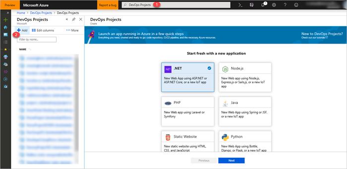
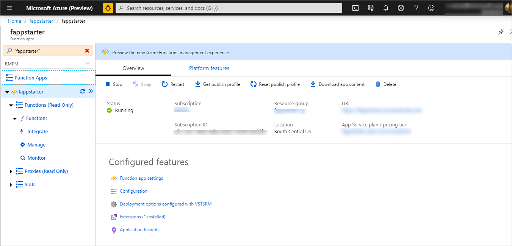
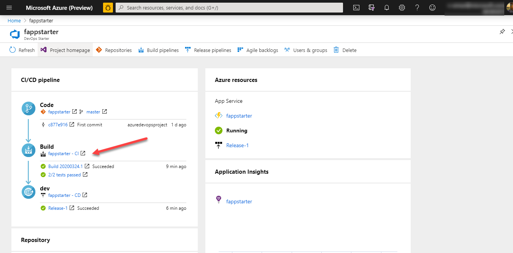

# Continuously deploy to Azure Functions with DevOps Projects

Azure DevOps Projects presents a simplified experience where you can bring your existing code and Git repo or choose a sample application to create a continuous integration (CI) and continuous delivery (CD) pipeline to Azure.

DevOps Projects also:

* Automatically creates Azure resources, such as Azure Functions

* Creates and configures a release pipeline in Azure DevOps for CI/CD

In this tutorial, you will:

> [!div class="checklist"]
>* Use DevOps Projects to deploy an ASP.NET app to Azure Function
>* Configure Azure DevOps and an Azure subscription
>* Examine the Azure Function
>* Examine the CI pipeline
>* Examine the CD pipeline
>* Commit changes to Git and automatically deploy them to Azure
>* Clean up resources

Currently the supported runtimes for functions are **.NET** and **Node.js**. We use. NET runtime for this tutorial to deploy to Azure Functions. 

## Prerequisites

* An Azure subscription. You can get one free through [Visual Studio Dev Essentials](https://visualstudio.microsoft.com/dev-essentials/)

## Use DevOps Projects to deploy an ASP.NET app to Azure Functions

DevOps Projects creates a CI/CD pipeline in Azure Pipelines. You can create a new Azure DevOps organization or use an existing organization. DevOps Projects also creates Azure resources, such as an IoTHub, in the Azure subscription of your choice.

1. Sign in to the [Azure portal](https://portal.azure.com)

1. In the left pane, select **Create a resource**.

1. In the search box, type **DevOps Projects**, and then click **Add**.

   

1. Select **.NET**, and then select **Next**. Under **Choose an application framework**, select **ASP.NET** and click **Next**.

1. Select **Function App** and then select **Next**.

## Configure Azure DevOps and Azure subscription

1. Enter a name for your Azure DevOps project.

1. Create a new Azure DevOps organization, or select an existing organization.

1. Select your Azure subscription.

1. To view additional Azure configuration settings and to identify the pricing tier and location, click on Additional settings. This pane displays various options for configuring the pricing tier and location of Azure services.

1. Exit the Azure configuration area, and then select Done.

1. After a few minutes, the process is completed. A sample ASP.NET app is set up in a Git repo in your Azure DevOps organization, a Function App, and Application Insights is created, a CI/CD pipeline is executed, and your app is deployed to Azure.

   After all this is completed, the Azure DevOps Project dashboard is displayed in the Azure portal. You can also go to the DevOps Projects dashboard directly from **All resources** in the Azure portal.

   This dashboard provides visibility into your Azure DevOps code repository, your CI/CD pipeline, and your Azure Function. You can configure additional CI/CD options in your Azure DevOps pipeline. At the right, select **Function App** to view.

## Examine the Function App

DevOps Projects automatically configures function app, which you can explore and customize. To get to know the function app, do the following:

1. Go to the DevOps Projects dashboard.

    

1. At the right, select the function app. A pane opens for the function app. From this view you can perform various actions such as operations monitoring, searching logs.

    

## Examine the CI pipeline

DevOps Projects automatically configures a CI/CD pipeline in your Azure DevOps organization. You can explore and customize the pipeline. To familiarize yourself with it, do the following:

1. Go to the DevOps Projects dashboard.

1. Click on the hyperlink under **Build**. A browser tab displays the build pipeline for your new project.

    

1. Select **Edit**. In this pane, you can examine the various tasks for your build pipeline. The build performs various tasks, such as fetching source code from the Git repo, building the application, running unit tests, and publishing outputs that are used for deployments.

1. Select **Triggers**. DevOps Projects automatically creates a CI trigger, and every commit to the repo starts a new build. Optionally, you can choose to include or exclude branches from the CI process.

1. Select **Retention**. Depending on your scenario, you can specify policies to keep or remove a certain number of builds.

1. At the top of the build pipeline, select the build pipeline name.

1. Change the name of your build pipeline to something more descriptive, and then select **Save** from the **Save & queue** dropdown.

1. Under your build pipeline name, select **History**. This pane displays an audit trail of your recent changes for the build. Azure DevOps keep track of any changes made to the build pipeline, and it allows you to compare versions.

## Examine the CD release pipeline

DevOps Projects automatically creates and configures the necessary steps to deploy from your Azure DevOps organization to your Azure subscription. These steps include configuring an Azure service connection to authenticate Azure DevOps to your Azure subscription. The automation also creates a release pipeline, which provides the CD to Azure. To learn more about the release pipeline, do the following:

1. Navigate to the **Pipelines | Releases**.

1. Click on **Edit**.

1. Under **Artifacts**, select **Drop**. The build pipeline you examined in the previous steps produces the output that's used for the artifact.

1. At the right of the **Drop** icon, select **Continuous deployment trigger**. This release pipeline has an enabled CD trigger, which executes a deployment every time a new build artifact is available. Optionally, you can disable the trigger so that your deployments require manual execution.

1. At the right, select **View releases** to display a history of releases.

1. Click on the release, which will display the pipeline. Click on any environment to check the release **Summary, Commits**, associated **Work Items**.

1. Select **Commits**. This view shows code commits that are associated with this deployment. Compare releases to view the commit differences between deployments.

1. Select **View Logs**. The logs contain useful information about the deployment process. You can view them both during and after deployments.

## Commit code changes and execute CI/CD

> Note: The following procedure tests the CI/CD pipeline by making a simple text change.

You're now ready to collaborate with a team on your app by using a CI/CD process that automatically deploys your latest work to your Azure Function. Each change to the Git repo starts a build in Azure DevOps, and a CD pipeline executes a deployment to Azure. Follow the procedure in this section, or use another technique to commit changes to your repo. For example, you can clone the Git repo in your favorite tool or IDE, and then push changes to this repo.

1. In the Azure DevOps menu, select **Repos | Files**, and then go to your repo.

1. The repository already contains code called **SampleFunctionApp** based on the application language that you chose in the creation process. Open the **Application/SampleFunctionApp/Function1.cs** file.

1. Select **Edit**, and then make a change to **line number 31** . For example, you can update it to **Hello there! Welcome to Azure Functions using DevOps Projects**

1. At the top right, select **Commit**, and then select **Commit** again to push your change.

1. Open the **Application/SampleFunctionApp.Test/Function1TestRunner.cs** file. 

1. Select **Edit**, and then make a change to **line number 21**. For example, you can update it to **Hello there! Welcome to Azure Functions using Azure DevOps Projects**.

     After a few moments, a build starts in Azure DevOps and a release executes to deploy the changes. Monitor the build status on the DevOps Projects dashboard or in the browser with your Azure DevOps organization.

## Clean up resources

You can delete the related resources that you created when you don't need them anymore. Use the **Delete** functionality on the DevOps Projects dashboard.

## Next steps

You can optionally modify these build and release pipelines to meet the needs of your team. You can also use this CI/CD pattern as a template for your other pipelines. In this tutorial, you learned how to:

> [!div class="checklist"]
> * Use DevOps Projects to deploy an ASP.NET Core app to Azure Function
> * Configure Azure DevOps and an Azure subscription 
> * Examine the Azure Function
> * Examine the CI pipeline
> * Examine the CD pipeline
> * Commit changes to Git and automatically deploy them to Azure
> * Clean up resources

