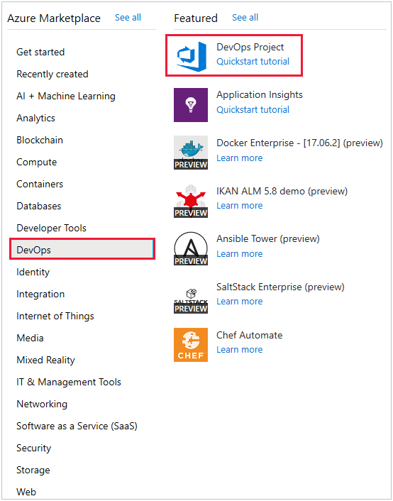
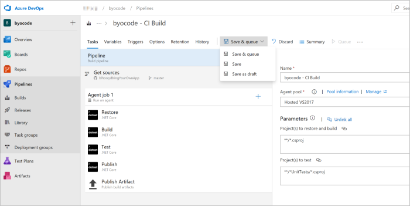

# Tutorial: Create a CI/CD pipeline for your existing code by using Azure DevOps Projects

Azure DevOps Projects presents a simplified process for creating a continuous integration (CI) and continuous delivery (CD) pipeline to Azure. You can bring your existing code and Git repo, or you can select a sample application.

You will:

> [!div class="checklist"]
> * Use DevOps Projects to create a CI/CD pipeline
> * Configure access to your GitHub repo and choose a framework
> * Configure Azure DevOps and an Azure subscription 
> * Commit changes to GitHub and automatically deploy them to Azure
> * Examine the Azure Pipelines CI/CD pipeline
> * Clean up resources

## Prerequisites

* An Azure subscription. You can get one free through [Visual Studio Dev Essentials](https://visualstudio.microsoft.com/dev-essentials/).
* Access to a GitHub or external Git repo that contains .NET, Java, PHP, Node.js, Python, or static web code.

## Sign in to the Azure portal

Azure DevOps Projects creates a CI/CD pipeline in Azure Pipelines. You can create a new Azure DevOps organization or use an existing organization. Azure DevOps Projects also creates Azure resources in the Azure subscription of your choice.

1. Sign in to the [Azure portal](https://portal.azure.com).

1. In the left pane, select **+Create a resource** in the left navigation bar. Search for **DevOps Projects**, and then select **Create**.

   

1. Select **Bring your own code**, and then select **Next**.

## Configure access to your GitHub repo and select a framework

1. Select either **GitHub** or an external **Git** code repository. For this tutorial, select **GitHub**. You might be required to authenticate with GitHub the first time to allow Azure to access your GitHub repository.

1. Select a **Repository** and a **Branch**, and then select **Next**.

1. If you're using Docker containers, change **Is app Dockerized** to **YES**. For this tutorial, leave **NO** selected, and then select **Next**. For more information about using Docker containers, hover over the **i** icon.

   

1. From the drop-down menus, select an **application runtime** and an **application framework**, and then select **Next**. The application framework dictates the type of Azure service deployment target that’s available.

1. Select an **Azure service** to deploy the application, and then select **Next**.

## Configure Azure DevOps and an Azure subscription

1. Enter a name for **Project name**.

1. Create a new free organization in **Azure DevOps Organization** or select an existing organization from the drop-down menu.

1. Select your subscription in **Azure Subscription**, and either enter a name in **Web app** or use the default. Select a **Location**, and then select **Done**. After a few minutes, the DevOps Projects deployment overview is displayed in the Azure portal.

1. Select **Go to resource** to view the DevOps Projects dashboard. In the upper-right corner, pin the **Project** to your dashboard for quick access. Azure DevOps Projects automatically configures a CI build and release trigger. Your code remains in your GitHub repo or another external repo, and a sample app is set up in a repo in **Azure DevOps Organization**. Azure DevOps Projects runs the build and deploys the app to Azure.

   

1. The dashboard shows your code repo, your CI/CD pipeline, and your app in Azure. At the right, under Azure resources, select **Browse** to view your running app.

## Commit changes to GitHub and automatically deploy them to Azure

You're now ready to collaborate on your app with a team. The CI/CD process automatically deploys your latest work to your website. Each change to the GitHub repo starts a build in Azure DevOps, and a CD pipeline runs a deployment to Azure.

1. From your DevOps Projects dashboard, select **Repositories**. Your GitHub repository opens in a new browser tab. Make a change to your application, and then select **Commit changes**.

1. After a few moments, a build starts in Azure Pipelines. You can monitor the build status in the DevOps Projects dashboard. You can also monitor it in your Azure DevOps organization by selecting the **Build pipelines** tab from the DevOps Projects dashboard.

## Examine the Azure Pipelines CI/CD pipeline

Azure DevOps Projects automatically configures a CI/CD pipeline in Azure Pipelines. Explore and customize the pipeline as needed. To familiarize yourself with the build and release pipelines, do the following:

1. From the DevOps Projects dashboard, select **Build pipelines**.

1. After your **Azure Pipelines** page opens, you'll see a history of the most recent builds and the status for each build.

   

1. In the upper-right corner of the **Builds** page, you can select **Edit** to change the current build, **Queue** to add a new build, or the vertical ellipsis button (**&#8942;**) to open a menu with more options. Select **Edit**.

1. The build does various tasks, such as fetching sources from the repo, restoring dependencies, and publishing outputs for deployments. To the right, under **Name**, change the build pipeline name to something more descriptive. Select **Save & Queue**, and then select **Save**. Enter a comment, and then select **Save** again.

   

1. To see an audit trail of your recent changes for the build, select the **History** tab.  Azure DevOps tracks any changes made to the build pipeline and allows you to compare versions.

1. Select the **Triggers** tab. Azure DevOps Projects automatically creates a CI trigger with some default settings. You can set triggers such as **Enable continuous integration** to run a build each time you commit a code change. You can also set triggers to schedule builds to run at specific times.

## Clean up resources

When you no longer need the Azure App service and related resources that you created in this tutorial, you can delete them. Use the **Delete** functionality on the DevOps Projects dashboard.

## Next steps

When you configured your CI/CD process in this tutorial, you automatically created a build and release pipeline in Azure DevOps Projects. You can modify these build and release pipelines to meet the needs of your team.

To learn more about the CI/CD pipeline, see:

> [!div class="nextstepaction"]
> [Define your multi-stage continuous deployment (CD) pipeline](https://docs.microsoft.com/azure/devops/pipelines/release/define-multistage-release-process?view=vsts)

To learn more about application monitoring, see:
  
 > [!div class="nextstepaction"]
 > [What is Azure monitor?](https://docs.microsoft.com/azure/azure-monitor/overview)
