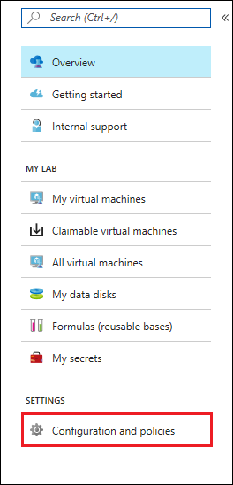

# Add an internal support statement to a lab in Azure DevTest Labs

Azure DevTest Labs lets you customize your lab with an internal support statement that provides users with support information about the lab. For example, you can list the contact information to assist a user that might need help with troubleshooting or accessing resources in the lab.

An internal support statement is intended to let you post lab information that doesn't typically change too often. To notify users about lab info that is more temporary in nature – such as recent updates to lab policies – see [Post announcement in a lab](devtest-lab-announcements.md).

You can easily disable or edit a support statement after it is no longer applicable.

## Steps to add a support statement to an existing lab

1. Sign in to the [Azure portal](http://go.microsoft.com/fwlink/p/?LinkID=525040).
1. If necessary, select **All Services**, and then select **DevTest Labs** from the list. (Your lab might already be shown on the Dashboard under **All Resources**).
1. From the list of labs, select the lab in which you want to add a support statement.  
1. On the lab's **Overview** area, select **Configuration and policies**.  

    

1. On the left under **SETTINGS**, select **Internal support**.

    

1. To create an internal support message for the users in this lab, set Enabled to **Yes**.

1. In the **Support message** field, enter the internal support statement that you want to present to your lab users. The support message accepts Markdown. As you enter the message text, you can view the **Preview** area at the bottom of the screen to see how the message appears to users.

    

1. Select **Save** once your support statement is ready to post.

When you no longer want to show this support message to lab users, return to the **Internal support** page and set **Enabled** to **No**.

## Steps for users to view the support message

1. From the [Azure portal](http://go.microsoft.com/fwlink/p/?LinkID=525040), select a lab.

1. On the lab's **Overview** area, select **Internal support**.  

    

1. If a support message is posted, the user can view it from the Internal support pane.

    

[!INCLUDE [devtest-lab-try-it-out](../../includes/devtest-lab-try-it-out.md)]

## Next steps
* Internal support statements are typically used to provide support information that doesn't change that frequently. You can also learn how to [post an announcement to a lab](devtest-lab-announcements.md) that informs users of more temporary changes or updates to the lab.
* [Set policies and schedules](devtest-lab-set-lab-policy.md) provides information about how you can apply other restrictions and conventions across your subscription by using customized policies.