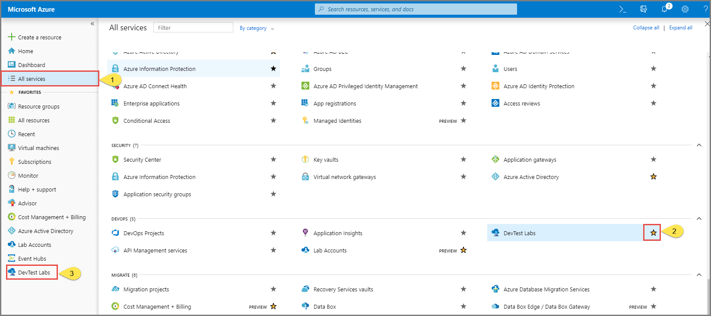

# View activity logs for Azure DevTest Labs and set alerts
After you create one or more labs, you'll likely want to monitor how and when your labs are accessed, modified, and managed, and by whom. Azure DevTest Labs uses Azure Monitor, specifically **activity logs**, to provide information these operations against labs. 

This article explains how to view  activity logs for a lab in Azure DevTest Labs, and set alerts on activity log events (for example: VM is started, VM is stopped).

## View activity log for a lab

1. Sign in to the [Azure portal](https://portal.azure.com).
1. Select **All Services**, and then select **DevTest Labs** in the **DEVOPS** section. If you select * (star) next to **DevTest Labs** in the **DEVOPS** section. This action adds **DevTest Labs** to the left navigational menu so that you can access it easily the next time. Then, you can select **DevTest Labs** on the left navigational menu.

    
1. From the list of labs, select your lab.
1. On the home page for the lab, select **Configurations and policies** on the left menu. 

    :::image type="content" source="./media/activity-logs/configuration-policies-link.png" alt-text="Select Configuration and policies on the left menu":::
1. On the **Configuration and policies** page, select **Activity log** on the left menu under **Manage**. You should see entries for operations done on the lab. 

    :::image type="content" source="./media/activity-logs/activity-log.png" alt-text="Activity log":::    
1. Select an event to see details about it. On the **Summary** page, you see information such as operation name, time stamp, and who did the operation. 
    
    :::image type="content" source="./media/activity-logs/stop-vm-event.png" alt-text="Stop VM event - summary":::        
1. Switch to the **JSON** tab to see more details. In the following example, you can see the name of the VM and the operation done on the VM (stopped).

    :::image type="content" source="./media/activity-logs/stop-vm-event-json.png" alt-text="Stop VM event - JSON":::           
1. Switch to the **Change history (Preview)** tab to see the history of changes. In the following example, you see the change that was made on the VM. 

    :::image type="content" source="./media/activity-logs/change-history.png" alt-text="Stop VM event - Change history":::             
1. Select the change in the change history list to see more details about the change. 

    :::image type="content" source="./media/activity-logs/change-details.png" alt-text="Stop VM event - Change details":::             

For more information about activity logs, see [Azure Activity Log](../azure-monitor/platform/activity-log.md).

## Set alerts for activity log events
In this example, you create an alert for all administrative operations on a lab with an action that sends an email to subscription owners. 

1. In the search bar of the Azure portal, type **Monitor**, and then select **Monitor** from the results list. 

    :::image type="content" source="./media/activity-logs/search-monitor.png" alt-text="Search for Monitor":::        
1. Select **Alerts** on the left menu, and then select **New alert rule** on the toolbar. 

    :::image type="content" source="./media/activity-logs/alerts-page.png" alt-text="Alerts page":::    
1. On the **Create alert rule** page, click **Select resource**. 

    :::image type="content" source="./media/activity-logs/select-resource-link.png" alt-text="Select resource for the alert":::        
1. Select **DevTest Labs** for **Filter by resource type**, select your lab in the list, and then select **Done**.

    :::image type="content" source="./media/activity-logs/select-lab-resource.png" alt-text="Select your lab as the resource":::
1. Back on the **Create alert rule** page, click **Select condition**. 

    :::image type="content" source="./media/activity-logs/select-condition-link.png" alt-text="Select condition link":::    
1. On the **Configure signal logic** page, select a signal supported by DevTest Labs. 

    :::image type="content" source="./media/activity-logs/select-signal.png" alt-text="Select signal":::
1. Filter by **event level** (Verbose, Informational, Warning, Error, Critical, All), **status** (Failed, Started, Succeeded), and **who initiated** the event. 
1. Select **Done** to complete configuring the condition. 

    :::image type="content" source="./media/activity-logs/configure-signal-logic-done.png" alt-text="Configure signal logic - done":::
1. You have specified for the scope (lab) and the condition for the alert. Now, you need to specify an action group with actions to be run when the condition is met. Back on the **Create alert rule** page, choose **Select action group**. 

    :::image type="content" source="./media/activity-logs/select-action-group-link.png" alt-text="Select action group link":::
1. Select **Create action group** link on the toolbar. 

    :::image type="content" source="./media/activity-logs/create-action-group-link.png" alt-text="Create action group link":::
1. On the **Add action group** page, follow these steps:
    1. Enter a **name** for the action group.
    1. Enter a **short name** for the action group. 
    1. Select the **resource group** in which you want the alert to be created. 
    1. Enter a **name for the action**. 
    1. Select the **action type** (in this example, **Email Azure Resource Manager Role**). 

        :::image type="content" source="./media/activity-logs/add-action-group.png" alt-text="Add action group page":::
    1. On the **Email Azure Resource Manager Role** page, select the role. In this example, it's **Owner**. Then, select **OK**. 

        :::image type="content" source="./media/activity-logs/select-role.png" alt-text="Select role":::            
    1. Select **OK** on the **Add action group** page. 
1. Now, on the **Create alert rule** page, enter a name for the alert rule, and then select **OK**. 

    :::image type="content" source="./media/activity-logs/create-alert-rule-done.png" alt-text="Create alert rule - done":::

## Next steps
To learn more about creating action groups using different action types, see [Create and manage action groups in the Azure portal](../azure-monitor/platform/action-groups.md).

To learn more about activity logs, see  [Azure Activity Log](../azure-monitor/platform/activity-log.md).

To learn about setting alerts on activity logs, see [Alerts on activity log](../azure-monitor/platform/activity-log-alerts.md).

