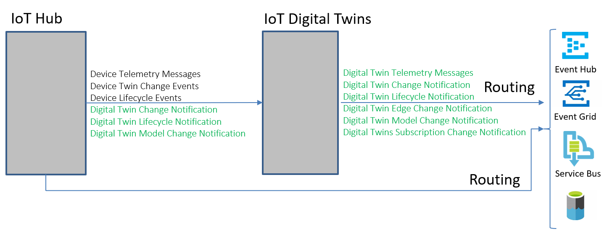

---
# Mandatory fields.
title: Route Azure Digital Twins events to external services
titleSuffix: Azure Digital Twins
description: Understand how to route events from Azure Digital Twins to other Azure Services.
author: baanders
ms.author: baanders # Microsoft employees only
ms.date: 2/27/2020
ms.topic: conceptual
ms.service: digital-twins

# Optional fields. Don't forget to remove # if you need a field.
# ms.custom: can-be-multiple-comma-separated
# ms.reviewer: MSFT-alias-of-reviewer
# manager: MSFT-alias-of-manager-or-PM-counterpart
---

# Event routes (preview)

It is often useful for data from Azure Digital Twins to be sent to downstream data services for additional storage or processing. For example, a hospital may want to send Azure Digital Twins event data to [Time Series Insights](../time-series-insights/time-series-insights-update-overview.md), to record time series data of handwashing-related events for bulk analytics.

Data egress is handled using **event routes**. An event route lets you send event data from nodes in Azure Digital Twins to custom-defined endpoints in your subscriptions. Some example endpoints are an [Event Hub](../event-hubs/event-hubs-about.md), an [Event Grid](../event-grid/overview.md), or a [Service Bus](../service-bus-messaging/service-bus-messaging-overview.md). 

These are the event types emitted by Azure Digital Twins that are available for routing:
* Digital twin change notification
* Digital twin life-cycle notification
* Digital twin edge Change notification
* Digital twin telemetry messages

The following diagram illustrates the flow of event data through a larger IoT solution with an Azure Digital Twins component:

## Uses for event routes

Event routes are designed for sending data to external resources. They excel at sending bulk event data from Azure Digital Twins to downstream resources such as Time Series Insights, storage, and analytics solutions.

During the current preview release, they are also used to handle events within the digital twin graph and send data from twin to twin. You can use event routes to affect Azure Digital Twins resources by connecting routes to compute resources such as [Azure Functions](azure-functions/functions-overview.md). Note that events sent via routes come without context. As a result, a compute resource that wants to modify the Azure Digital Twins graph in response to an event passed via event route must either:
* know the twin it wants to modify in advance, or
* use a query or navigation through the graph to find the appropriate target. 

It also needs to establish security and access permissions independently.

## Create a route endpoint

To define an event route, developers first must define endpoints. An **endpoint** is a destination outside of Azure Digital Twins that supports a route connection. Supported destinations in current preview release are:
* EventGrid custom topics
* EventHub
* Service Bus

Endpoints are set up using control plane APIs, or via the portal. An endpoint definition gives:
* The endpoint's ID (or friendly name)
* The endpoint type, such as Event Grid, Event Hub or other
* The primary connection string and secondary connection string to authenticate 
* The topic path of the endpoint, such as *your-topic.westus.eventgrid.azure.net*

The endpoint APIs that are available in control plane are:
* Create endpoint
* Get list of endpoints
* Get endpoint by ID (similar to above, but pass in endpointID)
* Delete endpoint by ID
* Get endpoint health (this function is similar to the IoT Hub API's [`GetEndpointHealth`](https://docs.microsoft.com/rest/api/iothub/iothubresource/getendpointhealth))

## Create a route
 
Event routes are created with the following [Azure Digital Twins API](concepts-use-apis.md) call: 

`Response RegisterEventRoute(string routeId, string endpointId, string topic, string filter);`

* The `endpointId` identifies an endpoint, such as an Event Hub, Event Grid, or Service Bus. These endpoints must be created in your subscription and attached to Azure Digital Twins using control plane APIs before making this registration call.
* If a topic is specified and the registered endpoint supports topics, the `topic` field is used to send the message to the specified topic. 
* By default, an event route accepts and routes every single message generated by the system. The `filter` parameter allows you to selectively route messages based on event types (such as telemetry events, twin property change events, life-cycle events, etc.), or by other parameters such as twin type. In this way, you can create selective routes. 

### Create selective routes with filters

To selectively route event messages as described above, you will provide a filter expressed as a **message routing query**. Filters are written in a single query language.

These are the categories of filters that are supported: 
* Filter on message type
* Filter on twin instance (no traversal of graph)
* Filter on message/notification body
* Filter on message properties

### Types of event messages

A common way to implement selective routing is to filter based on message type. Different types of events in IoT Hub and Azure Digital Twins produce different types of notification messages, as described below.

[!INCLUDE [digital-twins-v2-notifications.md](../../includes/digital-twins-v2-notifications.md)]

## Next steps

See how to design and set up an event route:
* [Route event data](how-to-route-events.md)