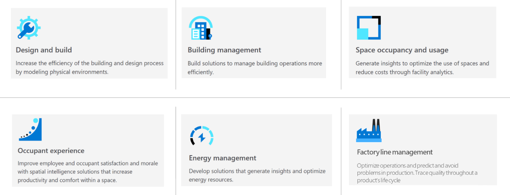
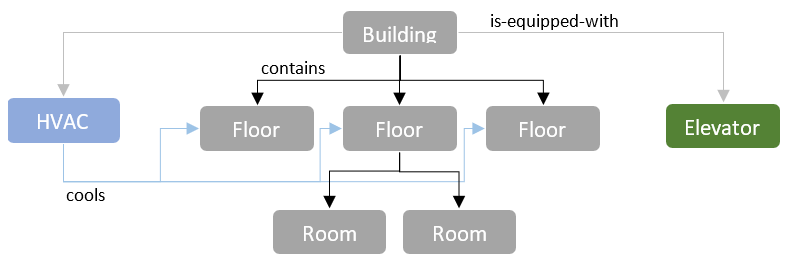
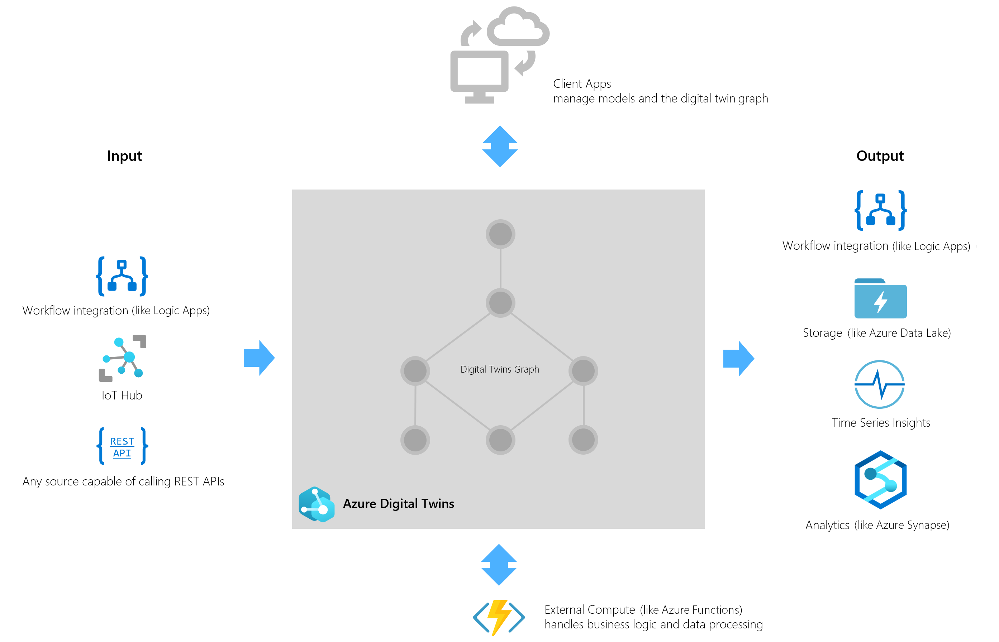

---
# Mandatory fields.
title: What is Azure Digital Twins?
description: Overview of what can be done with Azure Digital Twins.
author: baanders
ms.author: baanders # Microsoft employees only
ms.date: 3/12/2020
ms.topic: overview
ms.service: digital-twins

# Optional fields. Don't forget to remove # if you need a field.
# ms.custom: can-be-multiple-comma-separated
# ms.reviewer: MSFT-alias-of-reviewer
# manager: MSFT-alias-of-manager-or-PM-counterpart
---

# What is Azure Digital Twins?

Azure Digital Twins is a developer platform for next-generation IoT solutions that lets you create, run, and manage digital representations of your business environment, securely and efficiently in the cloud. With Azure Digital Twins, creating live operational state representations is quick and cost-effective, and digital representations stay current with real-time data from IoT and other data sources.

Using Azure Digital Twins' flexible twin type definitions, you can make Azure Digital Twins solutions that represent a large variety of business scenarios: buildings, factory floors, energy grids, construction processes, bulk manufacturing processes in chemistry, and more. Digital twin-based IoT solutions can support many insights, such as remote monitoring, maintenance, prediction, forecasting, simulation, and optimization of operations. 

Here are some more uses of Azure Digital Twins:

 
Azure Digital Twins does the hard work of translating a device-centric view of the world into always-up-to-date, business-focused insights, allowing you to concentrate on your business problems instead of complex distributed systems infrastructure.

## Azure Digital Twins key capabilities

Here is a summary of what you can do with Azure Digital Twins.

### Represent your real-world business environment

In Azure Digital Twins, you define the digital twin types that represent the people, places, and things in your physical environment, as well as the relationships between them, using custom **twin types**. You can think of these twin type definitions as a specialized vocabulary to describe your business. For a building management solution, for example, you might define twin types such as "building", "floor", "room", "elevator" and "HVAC system". Twin types are expressed in terms of persistent state properties, telemetry events, commands, relationships, and components.

Once you have defined the vocabulary for your business, you can represent your concrete environment by creating Azure digital twins from the twin types you previously defined, and connecting them into a graph. For example, using the twin types described above for a building management solution, you can create a **twin graph** that represents the office building you are in with its many floors, rooms, etc.

The arrows in the illustration below show different semantic relationships between the digital twins in the representation. For example, the building *contains* three floors, and each floor *contains* several rooms. The building also *is-equipped-with* an HVAC system and an elevator. The HVAC system *cools* specific floors. 

You can think of the twin types as nouns in a description of your world, and the relationships as verbs.

### Process incoming data and propagate state through the twin graph

Azure Digital Twins digital representations are meant to be live, up-to-date representations of the state of the real world. To keep digital twins updated, Azure Digital Twins provides a comprehensive event processing system. You can, for example, process events to manage incoming telemetry from devices, state changes within your twin graph, or life-cycle events generated when Azure digital twins are created or modified. Azure Digital Twins provides a convenient data processing framework for you to apply custom code to incoming data streams of IoT and business data. 

Routing events allows you to:
* Compute properties on a digital twin from sensor input (such as aggregating data from temperature, humidity, and noise sensors into a *comfort* property on a "room" twin)
* Propagate state through the twin graph (such as calculating an average *comfort* for a floor in a building, when the *comfort* property of any of the rooms on the floor changes)
* Apply complex external simulation or machine learning processors (such as calculating the energy efficiency of a wind turbine based on current operational parameters)
* Send data to downstream destinations (such as storing it for long-term bulk analytics or triggering workflow integrations)

### Query the digital representation of your environment to answer business questions

Once you have created a graph of Azure digital twins, you can run queries against the digital twins, their states, and their relationships. Depending on the state information you represented and the sensors you have connected to drive your digital representation, queries might be used to answer a broad range of questions about your environment.

Here are some examples of insights you can gather:
* Which zones or floors in building 7 are warmer than 75 degrees F? 
* Which campus contains meeting room 47?
* Which power station has surplus capacity that is accessible to a particular customer?   

### Manage access

Using fine-grained, twin-level access control, you can define the policies for data access in Azure Digital Twins.

### Work with with IoT Hub for device-centric scenarios

Azure Digital Twins can represent IoT devices managed by [IoT Hub](../iot-hub/about-iot-hub.md) as part of your twin graph, where you can connect them via relationships and query them like all other Azure digital twins.

## Azure Digital Twins in a solution context

Azure Digital Twins is commonly used in combination with other Azure services as part of a larger IoT solution. A typical such solution using Azure Digital Twins contains the following parts:
* The Azure Digital Twins service instance. This stores your twin types and your twin graph with its state, and orchestrates event processing.
* One or more client apps that drive the Azure Digital Twins instance by configuring twin types, creating topology, and extracting insights from the twin graph.
* One or more external compute resources to process events generated by Azure Digital Twins, or connected data sources such as devices. One common way to provide compute resources is via [Azure Functions](../azure-functions/functions-overview.md).
* An IoT hub to provide device management and IoT data stream capabilities.
* Downstream services to handle tasks such as workflow integration (like [MS Flow](https://flow.microsoft.com/)), cold storage, time series integration, or analytics. 

The following diagram shows where Azure Digital Twins lies in the context of a larger Azure IoT solution.

## Next steps

If you have worked with the previous preview release of Azure Digital Twins, learn what has changed:
* [Differences from Public Preview 1](overview-differences.md)

To start learning about the key elements of Azure Digital Twins, visit:
* [Create a twin type](concepts-models.md)
* [Create digital twins and the twin graph](concepts-twins-graph.md)
* [Query the twin graph](concepts-query-graph.md)