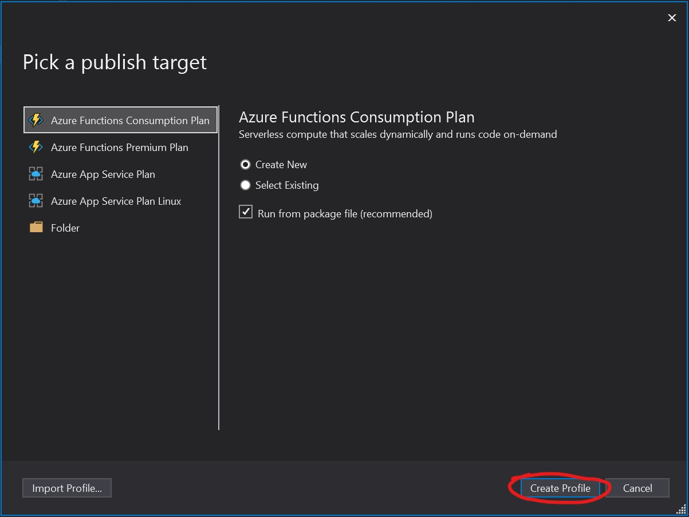
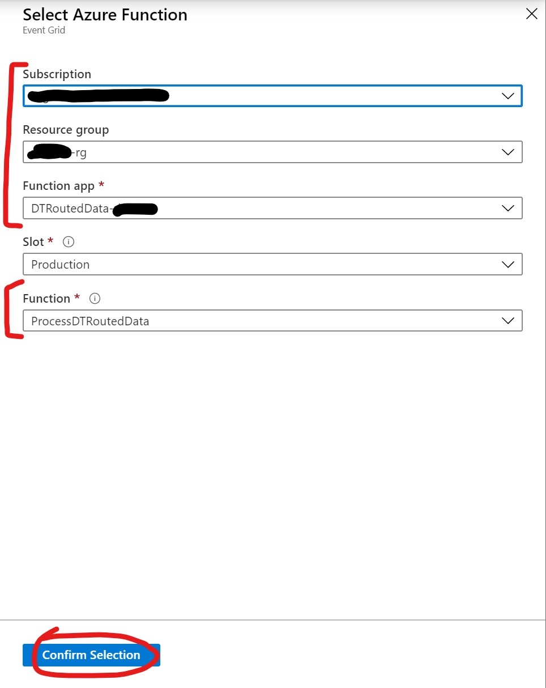
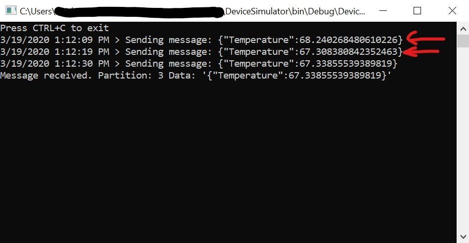
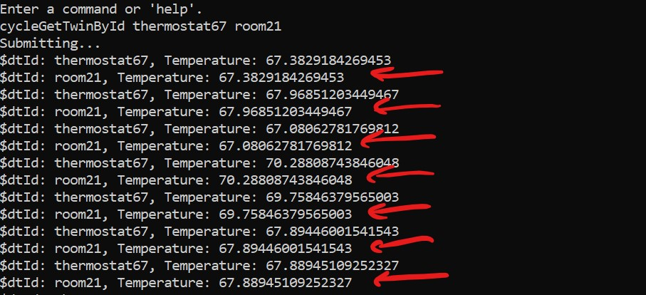

---
# Mandatory fields.
title: Handle events with an Azure Functions app
titleSuffix: Azure Digital Twins
description: Tutorial to create an Azure Functions app that handles Azure Digital Twins events
author: baanders
ms.author: baanders # Microsoft employees only
ms.date: 4/7/2020
ms.topic: tutorial
ms.service: digital-twins

# Optional fields. Don't forget to remove # if you need a field.
# ms.custom: can-be-multiple-comma-separated
# ms.reviewer: MSFT-alias-of-reviewer
# manager: MSFT-alias-of-manager-or-PM-counterpart
---

### 3. Handle events with an Azure Functions app

Welcome to the final step of our building scenario tutorial. You'll be completing this section of the pipeline:


This step involves 
* Creating an Azure Digital Twins endpoint to Event Grid
* Setting up a route within Azure Digital Twins to send property change events to the Azure Digital Twins endpoint
* Deploying an Azure Functions app

#### Create an event grid topic, Azure Digital Twins endpoint and Azure Digital Twins route

Submit the following command in PowerShell to create the event grid topic

```bash
az eventgrid topic create -g <your-resource-group> --name <your-event-grid-topic> -l westcentralus
```

Create your Azure Digital Twins endpoint (`<your-Azure-Digital-Twins-endpoint>`) pointing to your event grid topic, filling in the fields for your resource names and resource group

```bash
az dt endpoints add eventgrid --dt-name <your-Azure-Digital-Twins-instance> --eventgrid-resource-group <your-resource-group> --eventgrid-topic <your-event-grid-topic> --endpoint-name <your-Azure-Digital-Twins-endpoint>
```

Verify the "privisioningState" is "Succeeded"

```bash
az dt endpoints show --dt-name <your-Azure-Digital-Twins-instance> --endpoint-name <your-Azure-Digital-Twins-endpoint> 
```

Save your event grid topic and your Azure Digital Twins endpoint from above. You will use them later.

Create an Azure Digital Twins route (`<your-Azure-Digital-Twins-route>`) pointing to your Azure Digital Twins endpoint (`<your-Azure-Digital-Twins-endpoint>`), filling in the fields for your resource names and resource group

```bash
az dt routes add --dt-name <your-Azure-Digital-Twins-instance> --endpoint-name <your-Azure-Digital-Twins-endpoint> --route-name <your-Azure-Digital-Twins-route>
```

#### Deploy DTRoutedData function app

This Functions App is fired when events are emitted in Azure Digital Twins - it  updates the _Temperature_ field on the _Room_ twin.

Open the **DigitalTwinsSample** solution in Visual Studio. 

Navigate to *DTRoutedData >* **ProcessDTRoutedData.cs**, change `adtInstanceUrl` to your Azure Digital Twins instance hostname
```
const string AdtInstanceUrl = "https://<your-Azure-Digital-Twins-instance-hostname>"
```

Right-click the *ProcessDTRoutedData* project file in the **Solution Explorer** and select **Publish**


Select **Create profile**



* Fill in a new **Name** for the Functions App (*\<your-DTRoutedData-function>*) 
* **Subscription**: *DigitalTwins-Dev-Test-26*
* **Resource Group**: *\<your-resource-group>*
* **Azure Storage**: *\<your-azure-storage>


Select **Publish**


> [!TIP]
> If your Functions App doesn't deploy correctly, check out the **Publishing the Functions App isn't working** topic in **Troubleshooting** (at the end of this file)

#### Create an Event Grid subscription from your event grid topic to your *ProcessDTRoutedData* Azure function

In [Azure portal - event grid topics](https://portal.azure.com/#blade/HubsExtension/BrowseResource/resourceType/Microsoft.EventGrid%2Ftopics), navigate to your event grid topic (*\<your-event-grid-topic>*) and select **+ Event Subscription**


Choose a new name for your Event grid subscription (*\<your-event-grid-subscription>*), select *Azure Function* for the **Event type** and select **Select an endpoint**


In the pane that appears, the fields should auto-populate. If not, fill in the field based on the function you just deployed
* **Subscription**: *\<your-subscription-id>*
* **Resource group** *\<your-resource-group>*
* **Function app** (*\<your-DTRoutedData-function>*
* **Function**: *ProcessDTRoutedData* 



Finally, select **Create** on the "Create Event Subscription" page.

#### Start the simulation and see the results

Start () the **DeviceSimulator** project in Visual Studio.

The following console should pop up with messages being sent. You won't need to do anything with this console.



Start () the **DigitalTwinsSample** project in Visual Studio

Run the following command in the new console that pops up.

```bash
cycleGetTwinById thermostat67 room21
```

You should see the live updated temperatures *from your Azure Digital Twins instance*. You'll notice you have both **thermostat67** and **room21** temperatures being updated.


You've completed this sample.