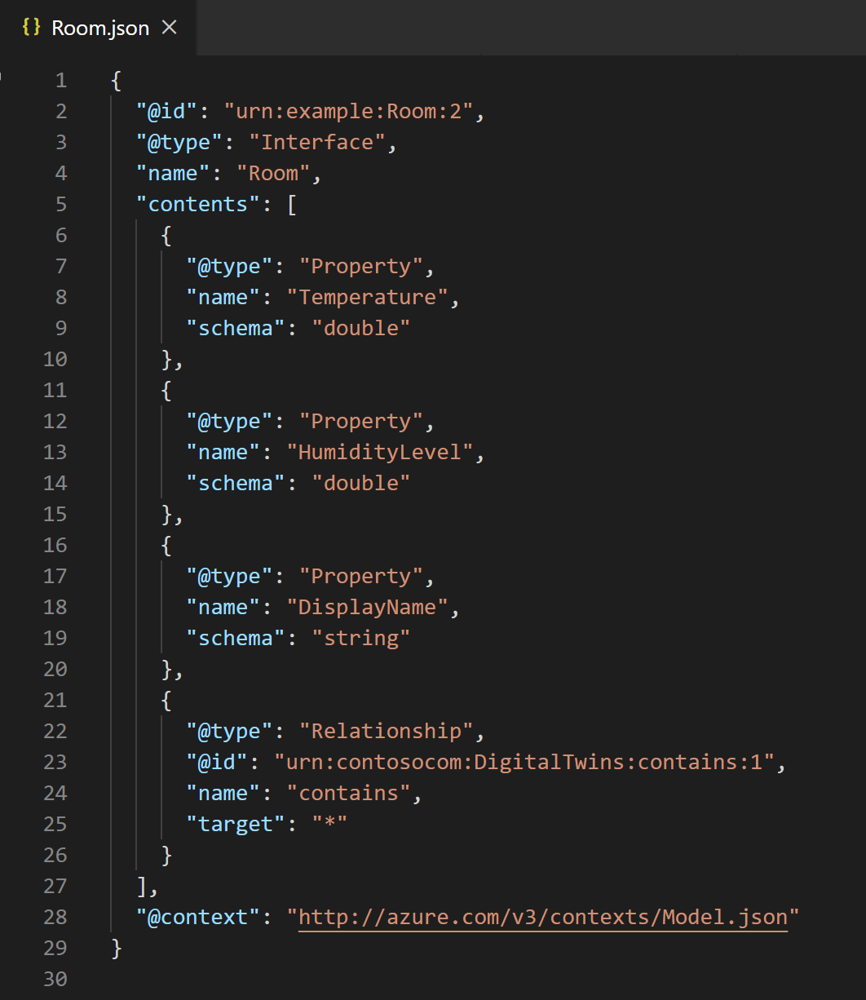
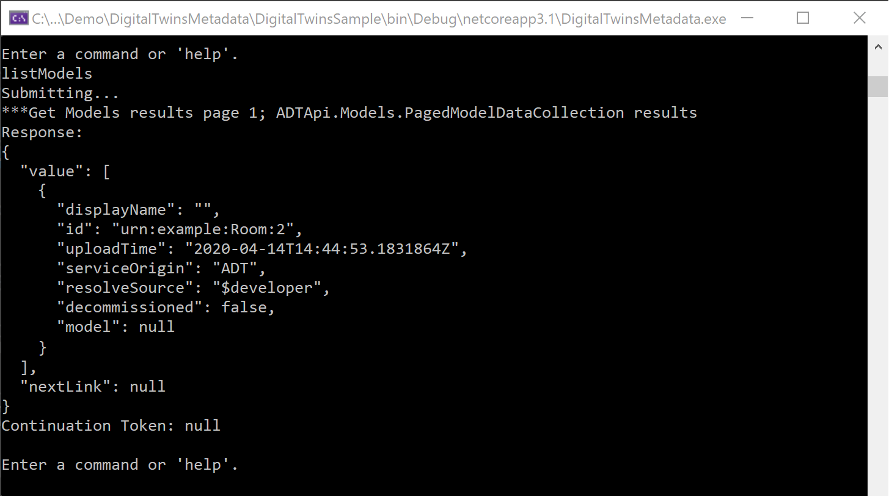
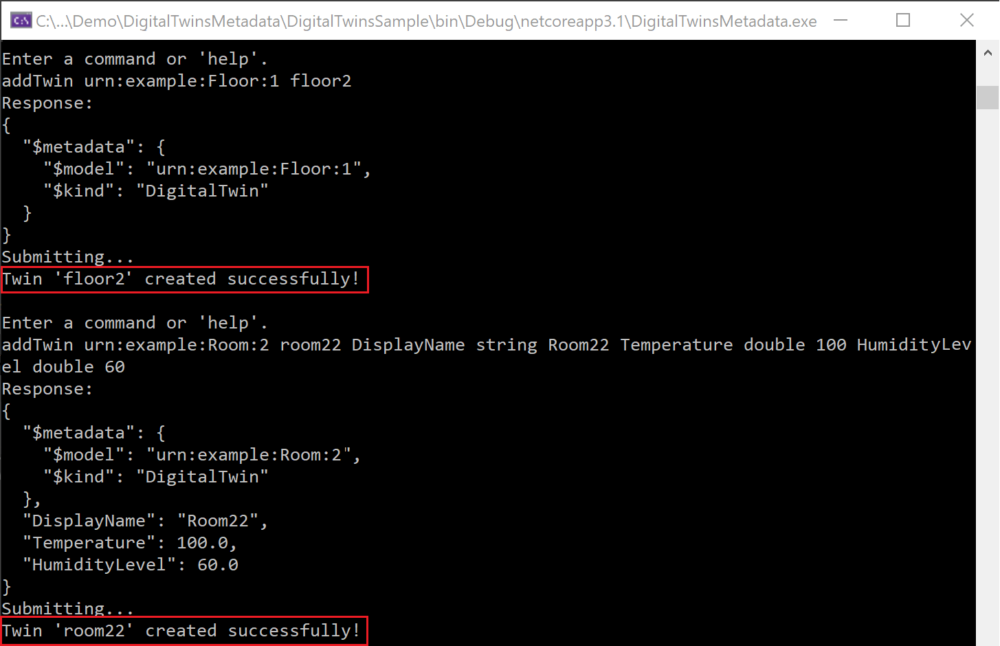
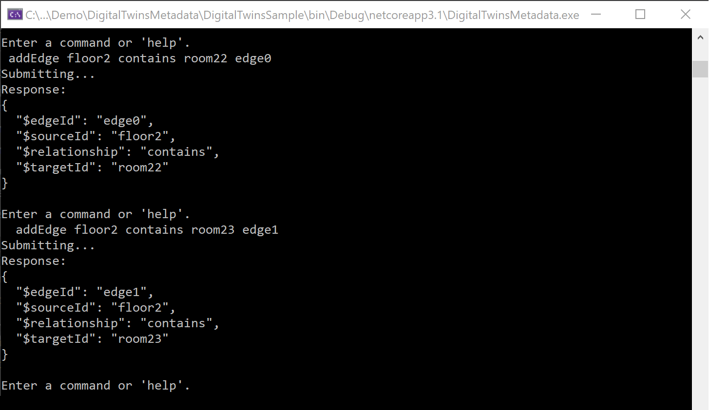

---
# Mandatory fields.
title: Build a basic Azure Digital Twins solution
titleSuffix: Azure Digital Twins
description: Tutorial to set up models, digital twins, and a twin graph in Azure Digital Twins.
author: baanders
ms.author: baanders # Microsoft employees only
ms.date: 4/15/2020
ms.topic: tutorial
ms.service: digital-twins

# Optional fields. Don't forget to remove # if you need a field.
# ms.custom: can-be-multiple-comma-separated
# ms.reviewer: MSFT-alias-of-reviewer
# manager: MSFT-alias-of-manager-or-PM-counterpart
---

# Build the basics of Azure Digital Twins

This tutorial shows you how to set up and work with three major Azure Digital Twins concepts: [models](concepts-models.md),  [digital twins](concepts-twins-graph.md), and the twin graph. 

You will start at the beginning of the solution process and reference pre-written sample code to create models, digital twins, and relationships to form a graph.

## Prerequisites

This tutorial uses the Azure Digital Twins instance and configured sample project from the Azure Digital Twins [quickstart](quickstart.md). 

You should complete the quickstart through the "Configure the sample project" step, in order to set up an Azure Digital Twins workspace before continuing with this tutorial. (The final step in the quickstart, "Use the sample project to answer environment questions", is not required for this).

> [!TIP]
> If you did complete the final quickstart step, there are already models, digital twins, and relationships in your Azure Digital Twins instance. These won't affect your ability to complete the tutorial, but be aware that they'll show up in query results. 

## Model a physical environment with DTDL

The first step in building out an Azure Digital Twins solution is concepting and defining twin [**models**](concepts-models.md) for your environment. 

Models are similar to classes in object-oriented programming languages; they provide user-defined templates for digital twins to follow and instantiate later. They are written in a JSON-like language called **Digital Twins Definition Language (DTDL)**, and can define a twin's *properties*, *telemetry*, *commands*, *relationships*, and *components*.

In the sample project you downloaded in the quickstart, you will find sample models in the *DigitalTwinsMetadata/DigitalTwinsSample/Models* folder. 

Open *Room.json*, and change it in the following ways:

* **Update the version number**, to indicate that you are providing a more-updated version of this model. Do this by changing the *1* at the end of the `@id` value to a *2*. Any number greater than the current version number will also work.
* **Edit a property**. Change the name of the `Humidity` property to *HumidityLevel* (or something different if you'd like. If you use something different than *HumidityLevel*, remember what you used and continue using that instead of *HumidityLevel* throughout this tutorial).
* **Add a property**. After the `HumidityLevel` property that ends on line 15, paste the following code to add a `DisplayName` property to the room:

    ```json
    ,
    {
      "@type": "Property",
      "name": "DisplayName",
      "schema": "string"
    }
    ```
* **Add a relationship**. After the `DisplayName` property that ends on line 20, paste the following code to add the ability for this type of twin to form *contains* relationships with other twins:

    ```json
    ,
    {
      "@type": "Relationship",
      "@id": "urn:contosocom:DigitalTwins:contains:1",
      "name": "contains",
      "target": "*"
    }
    ```

When you are finished, the updated model should look like this:



Make sure to save the file before moving on.

> [!TIP]
> If you want to try creating your own model, you can paste the Room model into a new file that you save with a *.json* extension in the *DigitalTwinsMetadata/DigitalTwinsSample/Models* folder. Then play around with adding properties and relationships to represent whatever you would like. You can also look at the other sample models in this folder for ideas.

### Upload models to Azure Digital Twins

Once you have designed your model(s), you need to upload them to your Azure Digital Twins instance before you can create twins that use them.

Open _DigitalTwinsMetadata/**DigitalTwinsSample.sln**_ in Visual Studio. Run the project with this button in the toolbar:


 
A console window will open, carry out authentication, and wait for a command. In this console, run the following command to upload both your edited model for *Room* and another model, *Floor*.

```cmd
addModels Room Floor
```

> [!TIP]
> If you designed your own model earlier, you can also upload it here, by adding the part of its file name before the *.json* extension to the `Room Floor` list in the command above.

Verify the models were created by running the `listModels` command. This will query the Azure Digital Twins instance for all models that have been uploaded. Look for the edited *Room* model in the results:



> [!NOTE]
> If you've added models to this Azure Digital Twins instance in another quickstart or tutorial without deleting them, they will also show up with this command.

Keep the project console window running for the following steps.

## Create digital twins

Now that some models have been uploaded to your Azure Digital Twins instance, you can create [**digital twins**](concepts-twins-graph.md) based on the model definitions. Digital twins represent the entities within your business environment—things like sensors on a farm, rooms in a building, or lights in a car. 

To create a digital twin, you use the `addTwin` command. You must reference the model that the twin is based on, and can optionally define initial values for any properties in the model. You do not have to pass any relationship information at this stage.

Run this code in the running project console to create several twins based on the *Floor* and *Room* models. Recall that *Room* has three properties, so you can provide arguments with the initial values for these.

```cmd
addTwin urn:example:Floor:1 floor2
addTwin urn:example:Room:2 room22 DisplayName string Room22 Temperature double 100 HumidityLevel double 60
addTwin urn:example:Room:2 room23 DisplayName string Room23 Temperature double 200 HumidityLevel double 30
```

> [!TIP]
> If you uploaded your own model earlier, try making your own `addTwin` command based on the commands above to add a twin of your own model type.

The output from these commands should indicate the twins were created successfully. Here is an excerpt showing the *Floor* twin and one of the *Room* twins:



You can also verify that the twins were created by running the `queryTwins` command. This command queries your Azure Digital Twins instance for all the digital twins it contains. Look for the *floor2*, *room22*, and *room23* twins in the results.

> [!NOTE]
> If you've added other twins to this Azure Digital Twins instance in another quickstart or tutorial without deleting them, they will also show up with this command.

## Create a graph by adding relationships

Next, you can create some **relationships** between these twins, to connect them into a **twin graph**. Twin graphs are used to represent an entire environment. 

To add a relationship, you use the `addEdge` command. Specify the twin that the relationship is coming from, the type of relationship to add, and the twin that the relationship is connecting to. Lastly, provide a name (ID) for the relationship.

Run the following code to add a "contains" relationship from *floor2* to each of the *Room* twins you created earlier. Note that there must be a *contains* relationship defined on the *Floor* model for this to be possible.

```cmd
addEdge floor2 contains room22 edge0
addEdge floor2 contains room23 edge1
```

The output from these commands shows information about the relationships being created:



To verify the relationships were created successfully, use either of the following commands to query the relationships in your Azure Digital Twins instance.
* To see all relationships coming off of floor2,
    ```cmd
    listEdges floor2
    ```
* To query for these relationships by ID, 
    ```csharp
    getEdgeById floor2 contains edge0
    getEdgeById floor2 contains edge1
    ```

The twins and relationships you have set up in this tutorial form the following conceptual graph:


## Clean up resources

If you no longer need the resources used in this tutorial, follow these steps to delete them. If you plan to continue to the next Azure Digital Twins tutorial, keep the resources to continue building on them. 

Using the Azure CLI via the [Azure Cloud Shell](../cloud-shell/overview.md), you can quickly run commands to delete Azure resources. Use this link to [launch Cloud Shell in a new window](https://shell.azure.com).

To delete all Azure resources in a resource group, use the [az group delete](https://docs.microsoft.com/cli/azure/group?view=azure-cli-latest#az-group-delete) command. This removes the resource group and the Azure Digital Twins instance.

> [!IMPORTANT]
> Deleting a resource group is irreversible. The resource group and all the resources contained in it are permanently deleted. Make sure that you do not accidentally delete the wrong resource group or resources. 

    ```Azure CLI
    az group delete --name <your-resource-group>
    ```

Next, delete the AAD app registration you created for your client app with this command:

    ```Azure CLI
    az ad app delete --id <your-application-ID>
    ```

Finally, delete the project sample folder you downloaded from your local machine.

## Next steps

In this tutorial, you built a basic Azure Digital Twins solutions from the beginning, by adding models, digital twins, and relationships.

Continue to the next tutorial to connect to other Azure services for a complete, data-driven scenario: 

> [!div class="nextstepaction"]
> [Tutorial: Connect your solution to other Azure services](tutorial-connect.md)