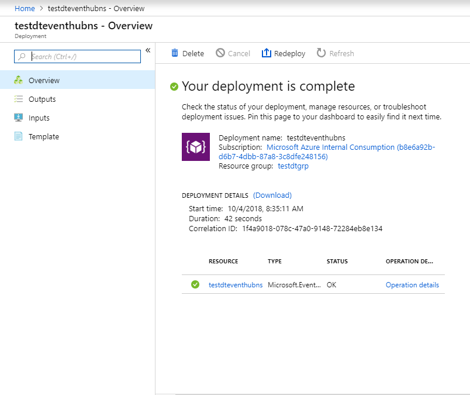
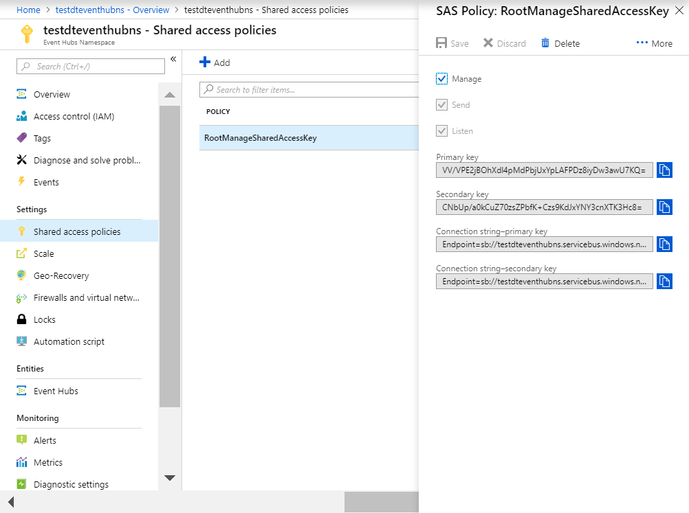
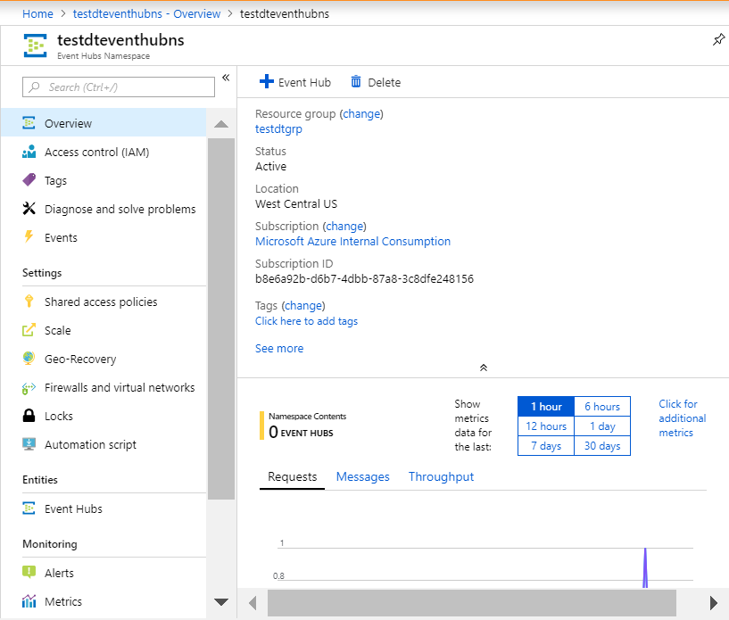
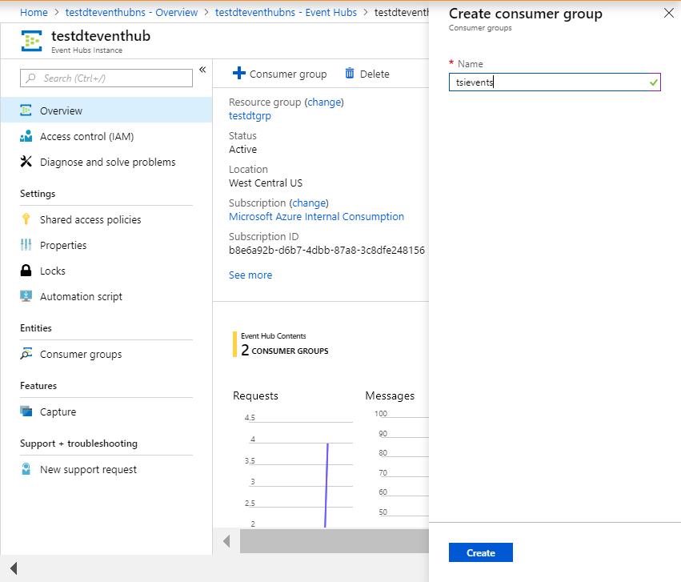
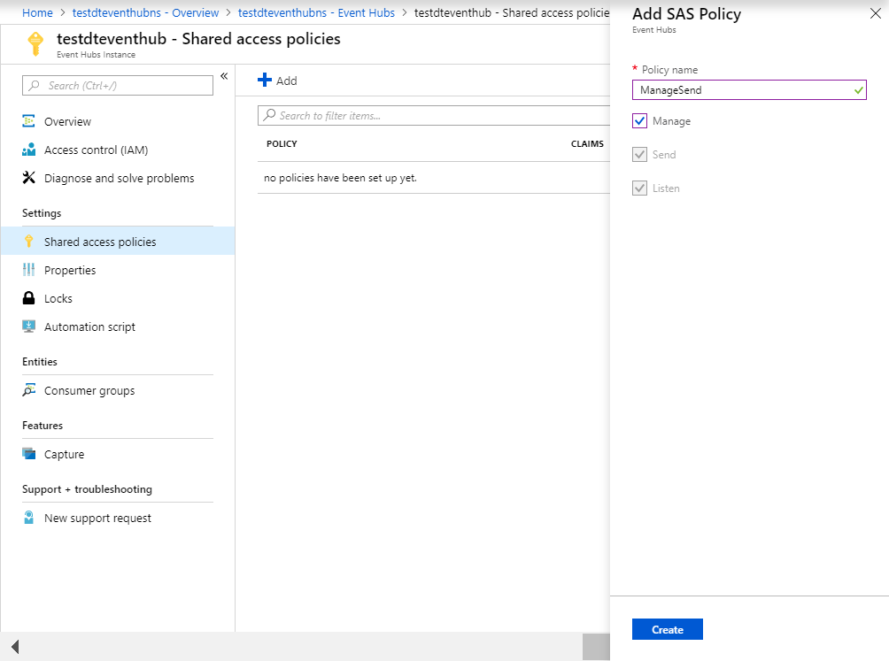
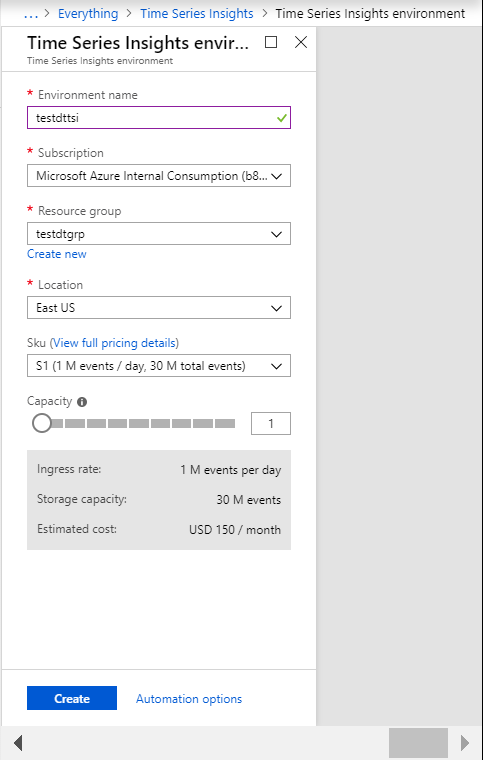
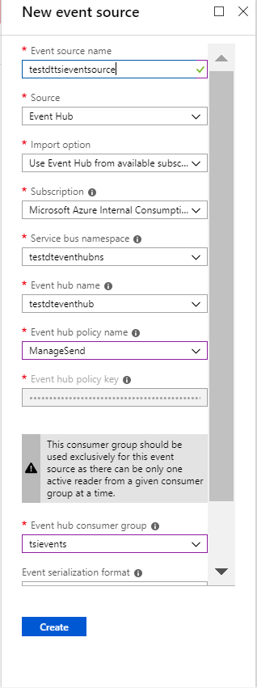
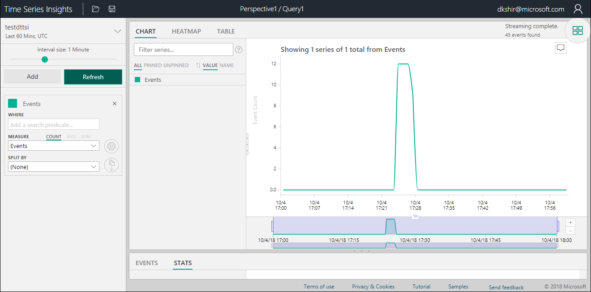

# Tutorial: Notify from and analyse your Azure Digital Twins setup

Azure Digital Twins service allows you to bring together people, places and things in a coherent spatial system. This is the third tutorial in a series that demonstrate how to use the Digital Twins to manage your facilities for efficient space utilization. Once you have provisioned the spatial graph and user-defined function using the steps in the previous tutorials, and simulate the device events, you can integrate the events with other services to create a custom notification and analysis system.

In this tutorial, you learn how to:

> [!div class="checklist"]
> * Create email notifications with Logic App
> * Analyse events using Time Series Insights

If you don’t have an Azure, create a [free account](https://azure.microsoft.com/free/?WT.mc_id=A261C142F).

## Prerequisites

This tutorial assumes that you have completed the steps to [Provision your Azure Digital Twins setup](tutorial-facilities-setup.md), as well as [Custom monitor your Azure Digital Twins setup](tutorial-facilities-udf.md). Before proceeding, make sure that you have:
- an instance of Digital Twins running, and 
- the [Azure Digital Twins sample application](https://github.com/Azure-Samples/digital-twins-samples-csharp) downloaded or cloned on your work machine.

## Create email notifications with Logic App
[Azure Logic Apps](../logic-apps/logic-apps-overview.md) allow you to create automated tasks like creating an email notification system for events received from other services. This section will show you how to use Logic Apps to create email notifications for telemetry data from your setup. We will use an [Event Grid Topic](../event-grid/overview.md) to route events coming from the sensors in your spatial graph to the Logic App. You will create an endpoint in your Digital Twins instance for the events to be routed to the Event Grid topic. 

1. Sign in to the [Azure portal](https://portal.azure.com).
1. In the left navigation pane, click **Resource groups**, and then select the resource group you created or used for your Digital Twins instance. 
1. Click **Add** button on top, and search and select a new **Logic App** resource. Click **Create**.
1. Enter a **Name** for your Logic App, and then select your **Subscription**, your **Resource group**, and **Location**. Click **Create**.
1. Open your Logic App when it is deployed, and click **Logic App Designer**. 
1. Pick the **When an Event Grid event occurs** trigger. Sign in with your Azure account when prompted. Confirm to **Allow access** to your Event Grid when prompted. Click **Continue**.
1. In the **When a resource event occurs (Preview)** window, 
    a. Select the **Subscription** that you used to create the Event Grid previously,
    b. Select **Microsoft.EventGrid.Topics** as the **Resource Type**,
    c. Select your Event Grid resource from the drop down for the **Resource Name**.
1. Click **New step**.
1. In the **Choose an action** window,
    a. Search *parse json*, and select the **Parse JSON** action.
    b. Click within the textbox in front of the **Content** field, and select **Body** from the **Dynamic content** list.
    c. Click **Use sample to payload to generate schema** and paste the following JSON payload:
        ```JSON
        {
        "id": "32162f00-a8f1-4d37-aee2-9312aabba0fd",
        "subject": "UdfCustom",
        "data": {
          "TopologyObjectId": "20efd3a8-34cb-4d96-a502-e02bffdabb14",
          "ResourceType": "Space",
          "Payload": "\"Air quality is poor.\"",
          "CorrelationId": "32162f00-a8f1-4d37-aee2-9312aabba0fd"
        },
        "eventType": "UdfCustom",
        "eventTime": "0001-01-01T00:00:00Z",
        "dataVersion": "1.0",
        "metadataVersion": "1",
        "topic": "/subscriptions/a382ee71-b48e-4382-b6be-eec7540cf271/resourceGroups/HOL/providers/Microsoft.EventGrid/topics/DigitalTwinEventGrid"
        }
        ```
      Click **Done**. Note that this payload has fictitious values. Logic App uses this sample payload to generate a **Schema**.
    
    

1. Click **New step**.
1. In the **Choose an action** window,
    a. Search and select **Condition** Action. 
    b. Click within the first **Choose a value** textbox, and select **eventType** from the **Dynamic content** list for the **Parse JSON** window.
    c. Click within the second **Choose a value** textbox, and type **UdfCustom**.
1. In the **If true** window,
    a. Click on **Add an action**, search for *email*, and select the email client of your choice. This tutorial uses *Office 365 Outlook*. 
    b. Select **Send an email** from the **Actions** list. Click **Sign in** and use your Azure account credentials. Click **Allow access** when prompted.
    c. In the **Send an email** window, enter your email ID to receive notifications. In the **Subject**, enter *Digital Twins notification for poor air quality in space * and then select **TopologyObject** from the **Dynamic content** list for **Parse JSON**.
    d. In the **Body** of the same window, enter text similar to this: *Poor air quality detected in a room, and temperature needs to be adjusted*. Feel free to elaborate using elements from the **Dynamic content** list as shown below.

    
1. Click **Save**, and then **Run**.
1. If your device simulation is not already running, open a command window and navigate to the Digital Twin sample. Run the following commands:
```cmd/sh
cd device-connectivity
dotnet run
```

In a few moments, observe the state of the Logic App change as it receives events from your simulated device. 

    

In a few minutes, you should start getting email notifications from this Logic App. To stop these emails, navigate to your **Logic App** in the portal and select the **Overview** pane. Click **Disable**.


## Analyse events using Time Series Insights

Now that you understood how to receive *hot data* (or instantaneous) events, you will now analyze *warm data*, which is a slightly less frequently accessed data on a slightly slower storage. This section shows you steps to perform *warm path analytics* to visualize and store the sensor telemetry data using [Azure Time Series Insights or TSI](../time-series-insights/time-series-insights-overview), with [Event Hubs](../event-hubs/event-hubs-about) as the connector between Digital Twins and TSI. 

### Create an Event Hub

1. Sign in to [Azure portal](https://portal.azure.com).
1. On the left navigation panel, select **Resource groups**, and search for the resource group you created or used for your Digital Twins instance. 

1. On the **Overview** pane of your resource group, click the **Add** button.

1. Search for and select **Event Hubs**. Click **Create**.

1. Enter a **Name** for your Event Hub namespace, choose *Standard* **Pricing tier**, your **Subscription**, your existing **Resource group**, and the **Location**. Click **Create**. 

1. Once deployed, navigate to the Event Hub namespace *deployment*, and click on the namespace under **RESOURCE**.

    

<!-->
1. In the Event Hub namespace, click the **Shared access policies** pane, and then click the **RootManageSharedAccessKey** default entry. Copy to your clipboard the values for **Connection string--primary key** and **Connection string--secondary key**. You will need these values to create an endpoint for Event Hub in your Digital Twin instance in the next section.
    
-->
1. In the Event Hub namespace **Overview** pane, click on the **Event Hub** button at the top. 
    

1. Enter a **Name** for your Event Hub resource, and click **Create**. Once deployed, it will appear in the **Event Hubs** pane of the Event Hub namespace with an *Active* **STATUS**. Click on the Event Hub instance to open its **Overview** pane.

1. Click **Consumer group** button at the top, and enter a name such as *tsievents* for the consumer group. Click **Create**.
    
   Once created, the consumer group will appear in the list at the bottom of the Event hub's **Overview** pane. 

1. Open the **Shared access policies** pane for your Event hub, and click **Add** button. **Create** a policy named *ManageSend*, and make sure all the checkboxes are checked. 

    

1. Open the *ManageSend* policy that you just created, and copy to clipboard the values for **Connection string--primary key** and **Connection string--secondary key**. You will need these values to create an endpoint for Event Hub in your Digital Twin instance in the next section.

### Create endpoint for the Event hub

1. In a command window, navigate to the Digital Twins sample, and then run `cd occupancy-quickstart\src`.
2. Open the file *actions\createEndpoints.yaml* in your editor. 
3. Enter the value for **Connection string--primary key** for the Event hub for `connectionString`, and the value for **Connection string--secondary key** for the `secondaryConnectionString`. Note that you have to add the same values twice, since we are creating two endpoints. 
4. Save and close the file. Run `dotnet run CreateEndpoints` in the command window. The endpoints for the Event hub will be created. 

    

### Create Time Series Insights

1. Sign in to the [Azure portal](https://portal.azure.com).
1. In the left navigation pane, click **Resource groups**, and then select the resource group you created or used for your Digital Twins instance. 
1. Click **Add** button on top, and search and select a new **Time Series Insights** resource. Click **Create**.
1. Enter a **Name** for your Time Series Insights instance, and then select your **Subscription**, your **Resource group**, and **Location**. Click **Create**.

    

1. Open the TSI instance once deployed, and then open the **Event Sources** pane. Click **Add** button at the top to add a consumer group.
1. In the **New event source** pane, enter a **Name**, make sure the other values are selected correctly, and then select *consumer group* we created in the previous section as the **Event hub consumer group**. Click **Create**.
    

1. Open the **Overview** pane for your Time Series Insights instance, and click **Go to Environment**. If you get a *data access warning*, then open the **Data Access Policies** pane for your TSI instance, click **Add**, select **Contributor** as the role, and select the appropriate user.

1. The **Go to Environment** button opens the [Time Series Insights Explorer](../time-series-insights/time-series-insights-explorer.md). If it does not show any events, navigate to your Digital Twins sample and then the *device-connectivity* project, and run `dotnet run` to generate simulated device events. In the TSI explorer in the portal, click the icon to **Refresh environment information**. You should see analyses and perspectives getting created for your simulated telemetry data.

    


## Clean up resources

If you wish to stop exploring Azure Digital Twins beyond this point, feel free to delete resources created in this tutorial:

1. From the left-hand menu in the [Azure portal](http://portal.azure.com), click **All resources**, select and **Delete** your Digital Twins resource group.
2. If you need to, you may proceed to delete the sample applications on your work machine as well. 


## Next steps

Proceed to the next article to learn more about the spatial intelligence graph and object model in Azure Digital Twins. 
> [!div class="nextstepaction"]
> [Next steps button](concepts-objectmodel-spatialgraph.md)

