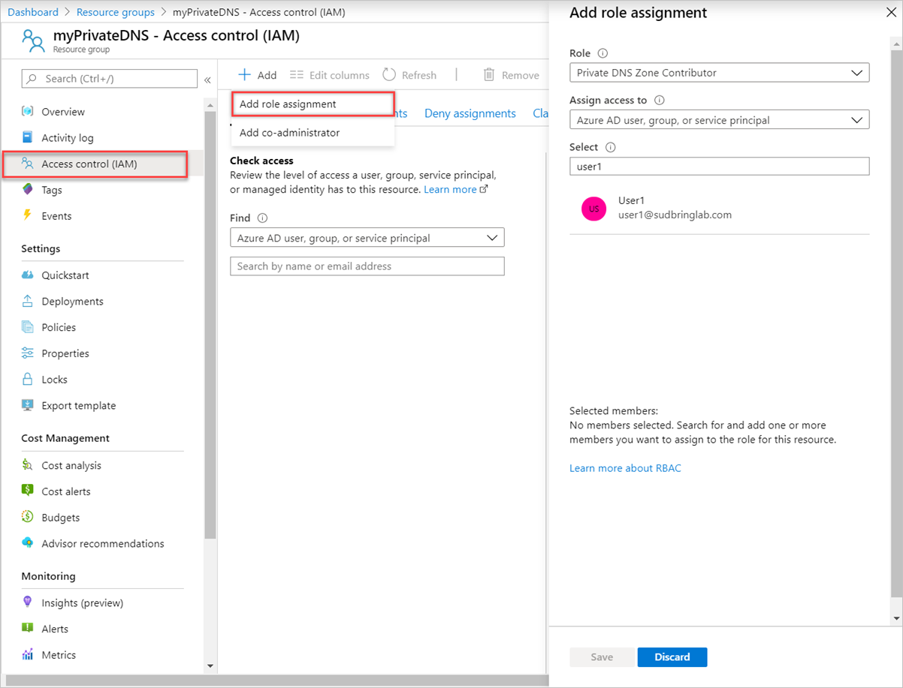
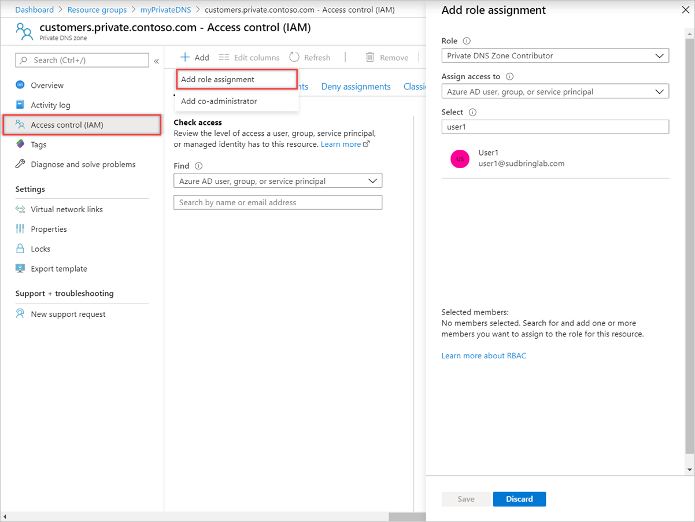
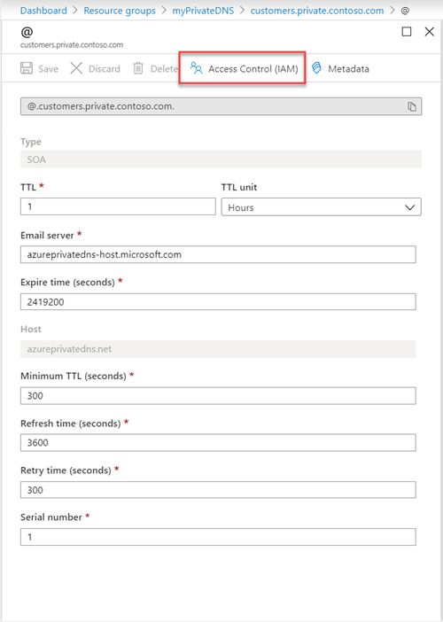
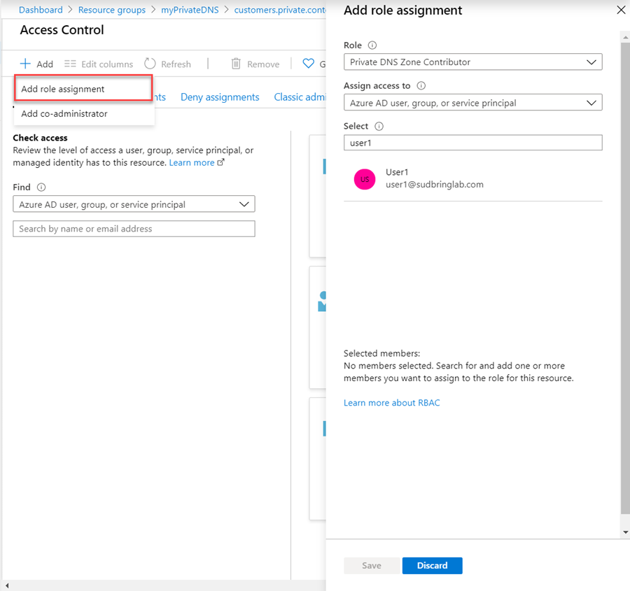

# How to protect private DNS zones and records

[!INCLUDE [updated-for-az](../../includes/updated-for-az.md)]

Private DNS zones and records are critical resources. Deleting a DNS zone or a single DNS record can result in a service outage. It's important that DNS zones and records are protected against unauthorized or accidental changes.

This article explains how Azure DNS enables you to protect your private DNS zones and records against such changes.  We apply two powerful securities features provided by Azure Resource Manager: [role-based access control](../role-based-access-control/overview.md) and [resource locks](../azure-resource-manager/management/lock-resources.md).

## Role-based access control

Azure Role-Based Access Control (RBAC) enables fine-grained access management for Azure users, groups, and resources. With RBAC, you can grant the level of access that users need. For more information about how RBAC helps you manage access, see [What is Role-Based Access Control](../role-based-access-control/overview.md).

### The Private DNS Zone Contributor role

The Private DNS Zone Contributor role is a built-in role for managing private DNS resources. This role applied to a user or group enables them to manage private DNS resources.

The resource group *myPrivateDNS* contains five zones for Contoso Corporation. Granting the DNS administrator Private DNS Zone Contributor permissions to that resource group, enables full control over those DNS zones. It avoids granting unnecessary permissions. The DNS administrator can't create or stop virtual machines.

The simplest way to assign RBAC permissions is [via the Azure portal](../role-based-access-control/role-assignments-portal.md).  

Open **Access control (IAM)** for the resource group, select **Add**, then select the **Private DNS Zone Contributor** role. Select the required users or groups to grant permissions.



Permissions can also be [granted using Azure PowerShell](../role-based-access-control/role-assignments-powershell.md):

```azurepowershell-interactive
# Grant 'Private DNS Zone Contributor' permissions to all zones in a resource group

$rsg = "<resource group name>"
$usr = "<user email address>"
$rol = "DNS Private Zone Contributor"

New-AzRoleAssignment -SignInName $usr -RoleDefinitionName $rol -ResourceGroupName $rsg
```

The equivalent command is also [available via the Azure CLI](../role-based-access-control/role-assignments-cli.md):

```azurecli-interactive
# Grant 'Private DNS Zone Contributor' permissions to all zones in a resource group

az role assignment create \
--assignee "<user email address>" \
--role "Private DNS Zone Contributor" \
--resource-group "<resource group name>"
```

### Private Zone level RBAC

Azure RBAC rules can be applied to a subscription, a resource group or to an individual resource. That resource can be an individual DNS zone, or an individual record set.

For example, the resource group *myPrivateDNS* contains the zone *private.contoso.com* and a subzone *customers.private.contoso.com*. CNAME records are created for each customer account. The administrator account used to manage CNAME records is assigned permissions to create records in the *customers.private.contoso.com* zone. The account can manage *customers.private.contoso.com* only.

Zone-level RBAC permissions can be granted via the Azure portal.  Open **Access control (IAM)** for the zone, select **Add**, then select the **Private DNS Zone Contributor** role. Select the required users or groups to grant permissions.



Permissions can also be [granted using Azure PowerShell](../role-based-access-control/role-assignments-powershell.md):

```azurepowershell-interactive
# Grant 'Private DNS Zone Contributor' permissions to a specific zone

$rsg = "<resource group name>"
$usr = "<user email address>"
$zon = "<zone name>"
$rol = "Private DNS Zone Contributor"
$rsc = "Microsoft.Network/privateDnsZones"

New-AzRoleAssignment -SignInName $usr -RoleDefinitionName $rol -ResourceGroupName $rsg -ResourceName $zon -ResourceType $rsc
```

The equivalent command is also [available via the Azure CLI](../role-based-access-control/role-assignments-cli.md):

```azurecli-interactive
# Grant 'Private DNS Zone Contributor' permissions to a specific zone

azure role assignment create \
--signInName <user email address> \
--roleName "Private DNS Zone Contributor" \
--resource-name <zone name> \
--resource-type Microsoft.Network/privateDnsZones \
--resource-group <resource group name>
```

### Record set level RBAC

Permissions are applied at the record set level.  The user is granted control to entries they need and are unable to make any other changes.

Record-set level RBAC permissions can be configured via the Azure portal, using the **Access Control (IAM)** button in the record set page:





Record-set level RBAC permissions can also be [granted using Azure PowerShell](../role-based-access-control/role-assignments-powershell.md):

```azurepowershell-interactive
# Grant permissions to a specific record set

$usr = "<user email address>"
$rol = "Private DNS Zone Contributor"
$sco = 
"/subscriptions/<subscription id>/resourceGroups/<resource group name>/providers/Microsoft.Network/privateDnsZones/<zone name>/<record type>/<record name>"

New-AzRoleAssignment -SignInName $usr -RoleDefinitionName $rol -Scope $sco
```

The equivalent command is also [available via the Azure CLI](../role-based-access-control/role-assignments-cli.md):

```azurecli-interactive
# Grant permissions to a specific record set

az role assignment create \
--signInName "<user email address>" \
--roleName "Private DNS Zone Contributor" \
--scope "/subscriptions/<subscription id>/resourceGroups/<resource group name>/providers/Microsoft.Network/privateDnsZones/<zone name>/<record type>/<record name>"
```

### Custom roles

The built-in Private DNS Zone Contributor role enables full control over a DNS resource. It's possible to build your own custom Azure roles to provide finer-grained control.

The account that is used to manage CNAMEs is granted permission to manage CNAME records only. The account is unable to modify records of other types. The account is unable to do zone-level operations such as zone delete.

The following example shows a custom role definition for managing CNAME records only:

```json
{
    "Name": "Private DNS CNAME Contributor",
    "Id": "",
    "IsCustom": true,
    "Description": "Can manage DNS CNAME records only.",
    "Actions": [
        "Microsoft.Network/privateDnsZones/CNAME/*",
        "Microsoft.Network/privateDNSZones/read",
        "Microsoft.Authorization/*/read",
        "Microsoft.Insights/alertRules/*",
        "Microsoft.ResourceHealth/availabilityStatuses/read",
        "Microsoft.Resources/deployments/*",
        "Microsoft.Resources/subscriptions/resourceGroups/read",
        "Microsoft.Support/*"
    ],
    "NotActions": [
    ],
    "AssignableScopes": [
        "/subscriptions/c276fc76-9cd4-44c9-99a7-4fd71546436e"
    ]
}
```

The Actions property defines the following DNS-specific permissions:

* `Microsoft.Network/privateDnsZones/CNAME/*` grants full control over CNAME records
* `Microsoft.Network/privateDNSZones/read` grants permission to read DNS private zones, but not to modify them, enabling you to see the zone in which the CNAME is being created.

> [!NOTE]
> Using a custom RBAC role to prevent deleting record sets while still allowing them to be updated is not an effective control. It prevents record sets from being deleted, but it does not prevent them from being modified.  Permitted modifications include adding and removing records from the record set, including removing all records to leave an empty record set. This has the same effect as deleting the record set from a DNS resolution viewpoint.

Custom role definitions can't currently be defined via the Azure portal. A custom role based on this role definition can be created using Azure PowerShell:

```azurepowershell-interactive
# Create new role definition based on input file

New-AzRoleDefinition -InputFile <file path>
```

It can also be created via the Azure CLI:

```azurecli-interactive
# Create new role definition based on input file

az role create -inputfile <file path>
```

The role can then be assigned in the same way as built-in roles, as described earlier in this article.

For more information on how to create, manage, and assign custom roles, see [Custom Roles in Azure RBAC](../role-based-access-control/custom-roles.md).

## Resource locks

Azure Resource Manager supports another type of security control, the ability to lock resources. Resource locks are applied to the resource, and are effective across all users and roles. For more information, see [Lock resources with Azure Resource Manager](../azure-resource-manager/management/lock-resources.md).

There are two types of resource lock: **CanNotDelete** and **ReadOnly**. These lock types can be applied either to a Private DNS zone, or to an individual record set.  The following sections describe several common scenarios, and how to support them using resource locks.

### Protecting against all changes

To prevent changes being made, apply a ReadOnly lock to the zone. This lock prevents new record sets from being created, and existing record sets from being modified or deleted.

Zone level resource locks can be created via the Azure portal.  From the DNS zone page, select **Locks**, then select **+Add**:


Zone-level resource locks can also be created via [Azure PowerShell](https://docs.microsoft.com/powershell/module/az.resources/new-azresourcelock?view=latest):

```azurepowershell-interactive
# Lock a DNS zone

$lvl = "<lock level>"
$lnm = "<lock name>"
$rsc = "<zone name>"
$rty = "Microsoft.Network/privateDnsZones"
$rsg = "<resource group name>

New-AzResourceLock -LockLevel $lvl -LockName $lnm -ResourceName $rsc -ResourceType $rty -ResourceGroupName $rsg
```

The equivalent command is also [available via the Azure CLI](https://docs.microsoft.com/cli/azure/lock?view=azure-cli-latest#az-lock-create):

```azurecli-interactive
# Lock a DNS zone

az lock create \
--lock-type "<lock level>" \
--name "<lock name>" \
--resource-name "<zone name"> \
--namespace "Microsoft.Network/privateDnsZones" \
--resource-group "<resource group name>
```
### Protecting individual records

To prevent an existing DNS record set against modification, apply a ReadOnly lock to the record set.

> [!NOTE]
> Applying a CanNotDelete lock to a record set is not an effective control. It prevents the record set from being deleted, but it does not prevent it from being modified.  Permitted modifications include adding and removing records from the record set, including removing all records to leave an empty record set. This has the same effect as deleting the record set from a DNS resolution viewpoint.

Record set level resource locks can currently only be configured using Azure PowerShell or Azure CLI.  They aren't supported in the Azure portal.

Azure PowerShell

```azurepowershell-interactive
# Lock a DNS record set

$lvl = "<lock level>"
$lnm = "<lock name>"
$rnm = "<zone name>/<record set name>"
$rty = "Microsoft.Network/privateDnsZones"
$rsg = "<resource group name>"

New-AzResourceLock -LockLevel $lvl -LockName $lnm -ResourceName $rnm -ResourceType $rty -ResourceGroupName $rsg
```

Azure CLI

```azurecli-interactive
# Lock a DNS record set

az lock create \
--lock-type "<lock level>" \
--name "<lock name>" \
--resource-name "<zone name>/<record set name>" \
--namespace "Microsoft.Network/privateDnsZones" \
--resource-group "<resource group name>

```
### Protecting against zone deletion

When a zone is deleted in Azure DNS, all record sets in the zone are deleted.  This operation can't be undone. Accidentally deleting a critical zone has the potential to have a significant business impact.  It's important to protect against accidental zone deletion.

Applying a CanNotDelete lock to a zone prevents the zone from being deleted. Locks are inherited by child resources. A lock prevents any record sets in the zone from being deleted. As described in the note above, it's ineffective since records can still be removed from the existing record sets.

As an alternative, apply a CanNotDelete lock to a record set in the zone, such as the SOA record set. The zone isn't deleted without also deleting the record sets. This lock protects against zone deletion, while still allowing record sets within the zone to be modified freely. If an attempt is made to delete the zone, Azure Resource Manager detects this removal. The removal would also delete the SOA record set, Azure Resource Manager blocks the call because the SOA is locked.  No record sets are deleted.

The following PowerShell command creates a CanNotDelete lock against the SOA record of the given zone:

```azurepowershell-interactive
# Protect against zone delete with CanNotDelete lock on the record set

$lvl = "CanNotDelete"
$lnm = "<lock name>"
$rnm = "<zone name>/@"
$rty = "Microsoft.Network/privateDnsZones/SOA"
$rsg = "<resource group name>"

New-AzResourceLock -LockLevel $lvl -LockName $lnm -ResourceName $rnm -ResourceType $rty -ResourceGroupName $rsg
```

Equivalent Azure CLI:

```azurecli-interactive
# Protect against zone delete with CanNotDelete lock on the record set

az lock create \
--lock-type "CanNotDelete" \
--name "<lock name>" \
--resource-name "<zone name>/@" \
--namespace "Microsoft.Network/privateDnsZones/SOA" \
--resource-group "<resource group name>
```

Another option to prevent accidental zone deletion is by using a custom role. This role ensures the accounts used to manage your zones don't have zone delete permissions. 

When you do need to delete a zone, you can enforce a two-step delete:

 - First, grant zone delete permissions
 - Second, grant permissions to delete the zone.

The custom role works for all zones accessed by those accounts. Accounts with zone delete permissions, such as the subscription owner, can still accidentally delete a zone.

It's possible to use both approaches - resource locks and custom roles - at the same time, as a defense-in-depth approach to DNS zone protection.

## Next steps

* For more information about working with RBAC, see [Get started with access management in the Azure portal](../role-based-access-control/overview.md).
* For more information about working with resource locks, see [Lock resources with Azure Resource Manager](../azure-resource-manager/management/lock-resources.md).
