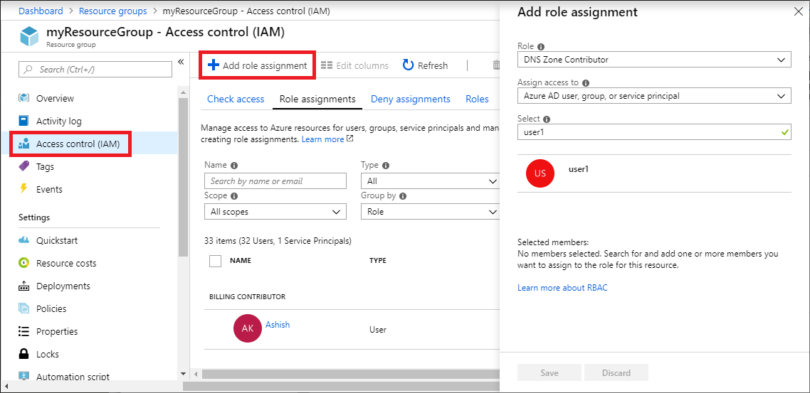
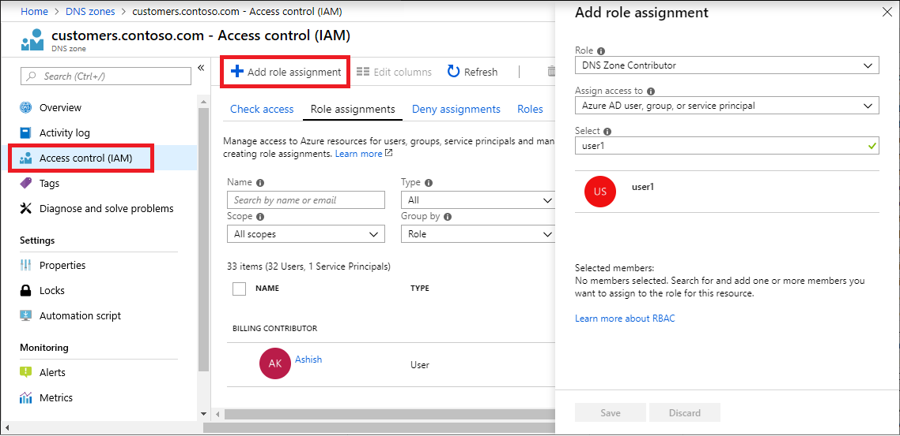
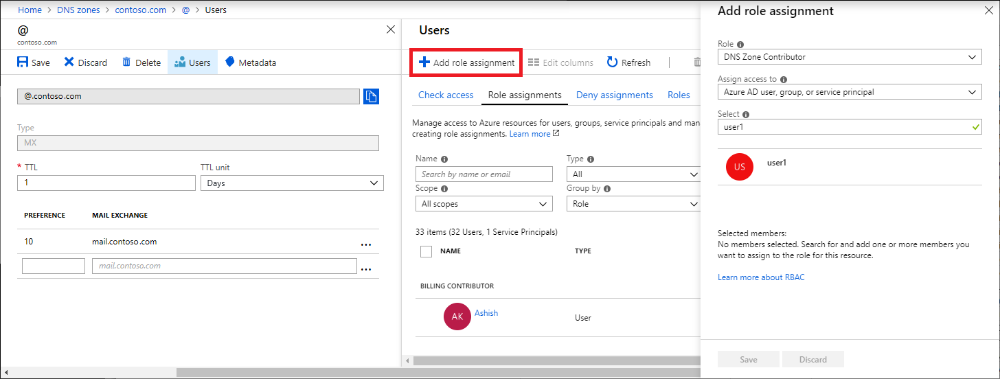
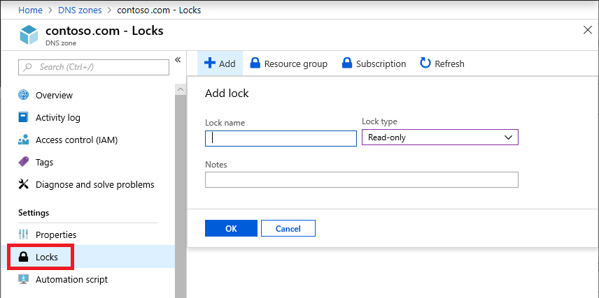

# How to protect DNS zones and records

[!INCLUDE [updated-for-az](../../includes/updated-for-az.md)]

DNS zones and records are critical resources. Deleting a DNS zone or even just a single DNS record can result in a total service outage.  It is therefore important that critical DNS zones and records are protected against unauthorized or accidental changes.

This article explains how Azure DNS enables you to protect your DNS zones and records against such changes.  We apply two powerful security features provided by Azure Resource Manager: [role-based access control](../role-based-access-control/overview.md) and [resource locks](../azure-resource-manager/management/lock-resources.md).

## Role-based access control

Azure Role-Based Access Control (RBAC) enables fine-grained access management for Azure users, groups, and resources. Using RBAC, you can grant precisely the amount of access that users need to perform their jobs. For more information about how RBAC helps you manage access, see [What is Role-Based Access Control](../role-based-access-control/overview.md).

### The DNS Zone Contributor role

The DNS Zone Contributor role is a built-in role provided by Azure for managing DNS resources.  Assigning DNS Zone Contributor permissions to a user or group enables that group to manage DNS resources, but not resources of any other type.

For example, suppose the resource group *myzones* contains five zones for Contoso Corporation. Granting the DNS administrator DNS Zone Contributor permissions to that resource group, enables full control over those DNS zones. It also avoids granting unnecessary permissions, for example the DNS administrator cannot create or stop Virtual Machines.

The simplest way to assign RBAC permissions is [via the Azure portal](../role-based-access-control/role-assignments-portal.md).  Open **Access control (IAM)** for the resource group, then select **Add**, then select the **DNS Zone Contributor** role and select the required users or groups to grant permissions.



Permissions can also be [granted using Azure PowerShell](../role-based-access-control/role-assignments-powershell.md):

```azurepowershell
# Grant 'DNS Zone Contributor' permissions to all zones in a resource group

$usr = "<user email address>"
$rol = "DNS Zone Contributor"
$rsg = "<resource group name>"

New-AzRoleAssignment -SignInName $usr -RoleDefinitionName $rol -ResourceGroupName $rsg
```

The equivalent command is also [available via the Azure CLI](../role-based-access-control/role-assignments-cli.md):

```azurecli
# Grant 'DNS Zone Contributor' permissions to all zones in a resource group

az role assignment create \
--signInName "<user email address>" \
--roleName "DNS Zone Contributor" \
--resourceGroup "<resource group name>"
```

### Zone level RBAC

Azure RBAC rules can be applied to a subscription, a resource group or to an individual resource. In the case of Azure DNS, that resource can be an individual DNS zone, or even an individual record set.

For example, suppose the resource group *myzones* contains the zone *contoso.com* and a subzone *customers.contoso.com* in which CNAME records are created for each customer account.  The account used to manage these CNAME records should be assigned permissions to create records in the *customers.contoso.com* zone only, it should not have access to the other zones.

Zone-level RBAC permissions can be granted via the Azure portal.  Open **Access control (IAM)** for the zone, then select **Add**, then select the **DNS Zone Contributor** role and select the required users or groups to grant permissions.



Permissions can also be [granted using Azure PowerShell](../role-based-access-control/role-assignments-powershell.md):

```azurepowershell
# Grant 'DNS Zone Contributor' permissions to a specific zone

$usr = "<user email address>"
$rol = "DNS Zone Contributor"
$rsg = "<resource group name>"
$zon = "<zone name>"
$typ = "Microsoft.Network/DNSZones"

New-AzRoleAssignment -SignInName $usr -RoleDefinitionName $rol -ResourceGroupName $rsg -ResourceName $zon -ResourceType $typ
```

The equivalent command is also [available via the Azure CLI](../role-based-access-control/role-assignments-cli.md):

```azurecli
# Grant 'DNS Zone Contributor' permissions to a specific zone

az role assignment create \
--signInName <user email address> \
--roleName "DNS Zone Contributor" \
--resource-name <zone name> \
--resource-type Microsoft.Network/DNSZones \
--resource-group <resource group name>
```

### Record set level RBAC

We can go one step further. Consider the mail administrator for Contoso Corporation, who needs access to the MX and TXT records at the apex of the contoso.com zone.  She doesn't need access to any other MX or TXT records, or to any records of any other type.  Azure DNS allows you to assign permissions at the record set level, to precisely the records that the mail administrator needs access to.  The mail administrator is granted precisely the control she needs, and is unable to make any other changes.

Record-set level RBAC permissions can be configured via the Azure portal, using the **Users** button in the record set page:



Record-set level RBAC permissions can also be [granted using Azure PowerShell](../role-based-access-control/role-assignments-powershell.md):

```azurepowershell
# Grant permissions to a specific record set
New-AzRoleAssignment -SignInName "<user email address>" -RoleDefinitionName "DNS Zone Contributor" -Scope "/subscriptions/<subscription id>/resourceGroups/<resource group name>/providers/Microsoft.Network/dnszones/<zone name>/<record type>/<record name>"
```

The equivalent command is also [available via the Azure CLI](../role-based-access-control/role-assignments-cli.md):

```azurecli
# Grant permissions to a specific record set
azure role assignment create --signInName "<user email address>" --roleName "DNS Zone Contributor" --scope "/subscriptions/<subscription id>/resourceGroups/<resource group name>/providers/Microsoft.Network/dnszones/<zone name>/<record type>/<record name>"
```

### Custom roles

The built-in DNS Zone Contributor role enables full control over a DNS resource. It is also possible to build your own customer Azure roles, to provide even finer-grained control.

Consider again the example in which a CNAME record in the zone *customers.contoso.com* is created for each Contoso Corporation customer account.  The account used to manage these CNAMEs should be granted permission to manage CNAME records only.  It is then unable to modify records of other types (such as changing MX records) or perform zone-level operations such as zone delete.

The following example shows a custom role definition for managing CNAME records only:

```json
{
    "Name": "DNS CNAME Contributor",
    "Id": "",
    "IsCustom": true,
    "Description": "Can manage DNS CNAME records only.",
    "Actions": [
        "Microsoft.Network/dnsZones/CNAME/*",
        "Microsoft.Network/dnsZones/read",
        "Microsoft.Authorization/*/read",
        "Microsoft.Insights/alertRules/*",
        "Microsoft.ResourceHealth/availabilityStatuses/read",
        "Microsoft.Resources/deployments/*",
        "Microsoft.Resources/subscriptions/resourceGroups/read",
        "Microsoft.Support/*"
    ],
    "NotActions": [
    ],
    "AssignableScopes": [
        "/subscriptions/ c276fc76-9cd4-44c9-99a7-4fd71546436e"
    ]
}
```

The Actions property defines the following DNS-specific permissions:

* `Microsoft.Network/dnsZones/CNAME/*` grants full control over CNAME records
* `Microsoft.Network/dnsZones/read` grants permission to read DNS zones, but not to modify them, enabling you to see the zone in which the CNAME is being created.

The remaining Actions are copied from the [DNS Zone Contributor built-in role](../role-based-access-control/built-in-roles.md#dns-zone-contributor).

> [!NOTE]
> Using a custom RBAC role to prevent deleting record sets while still allowing them to be updated is not an effective control. It prevents record sets from being deleted, but it does not prevent them from being modified.  Permitted modifications include adding and removing records from the record set, including removing all records to leave an empty record set. This has the same effect as deleting the record set from a DNS resolution viewpoint.

Custom role definitions cannot currently be defined via the Azure portal. A custom role based on this role definition can be created using Azure PowerShell:

```azurepowershell
# Create new role definition based on input file
New-AzRoleDefinition -InputFile <file path>
```

It can also be created via the Azure CLI:

```azurecli
# Create new role definition based on input file
azure role create -inputfile <file path>
```

The role can then be assigned in the same way as built-in roles, as described earlier in this article.

For more information on how to create, manage, and assign custom roles, see [Custom Roles in Azure RBAC](../role-based-access-control/custom-roles.md).

## Resource locks

In addition to RBAC, Azure Resource Manager supports another type of security control, namely the ability to lock resources. Where RBAC rules allow you to control the actions of specific users and groups, resource locks are applied to the resource, and are effective across all users and roles. For more information, see [Lock resources with Azure Resource Manager](../azure-resource-manager/management/lock-resources.md).

There are two types of resource lock: **CanNotDelete** and **ReadOnly**. These can be applied either to a DNS zone, or to an individual record set.  The following sections describe several common scenarios, and how to support them using resource locks.

### Protecting against all changes

To prevent any changes being made, apply a ReadOnly lock to the zone.  This prevents new record sets from being created, and existing record sets from being modified or deleted.

Zone level resource locks can be created via the Azure portal.  From the DNS zone page, select **Locks**, then select **+Add**:



Zone-level resource locks can also be created via Azure PowerShell:

```azurepowershell
# Lock a DNS zone
New-AzResourceLock -LockLevel <lock level> -LockName <lock name> -ResourceName <zone name> -ResourceType Microsoft.Network/DNSZones -ResourceGroupName <resource group name>
```

Configuring Azure resource locks is not currently supported via the Azure CLI.

### Protecting individual records

To prevent an existing DNS record set against modification, apply a ReadOnly lock to the record set.

> [!NOTE]
> Applying a CanNotDelete lock to a record set is not an effective control. It prevents the record set from being deleted, but it does not prevent it from being modified.  Permitted modifications include adding and removing records from the record set, including removing all records to leave an empty record set. This has the same effect as deleting the record set from a DNS resolution viewpoint.

Record set level resource locks can currently only be configured using Azure PowerShell.  They are not supported in the Azure portal or Azure CLI.

```azurepowershell
# Lock a DNS record set
New-AzResourceLock -LockLevel <lock level> -LockName "<lock name>" -ResourceName "<zone name>/<record set name>" -ResourceType "Microsoft.Network/DNSZones/<record type>" -ResourceGroupName "<resource group name>"
```

### Protecting against zone deletion

When a zone is deleted in Azure DNS, all record sets in the zone are also deleted.  This operation cannot be undone.  Accidentally deleting a critical zone has the potential to have a significant business impact.  It is therefore very important to protect against accidental zone deletion.

Applying a CanNotDelete lock to a zone prevents the zone from being deleted.  However, since locks are inherited by child resources, it also prevents any record sets in the zone from being deleted, which may be undesirable.  Furthermore, as described in the note above, it is also ineffective since records can still be removed from the existing record sets.

As an alternative, consider applying a CanNotDelete lock to a record set in the zone, such as the SOA record set.  Since the zone cannot be deleted without also deleting the record sets, this protects against zone deletion, while still allowing record sets within the zone to be modified freely. If an attempt is made to delete the zone, Azure Resource Manager detects this would also delete the SOA record set, and blocks the call because the SOA is locked.  No record sets are deleted.

The following PowerShell command creates a CanNotDelete lock against the SOA record of the given zone:

```azurepowershell
# Protect against zone delete with CanNotDelete lock on the record set
New-AzResourceLock -LockLevel CanNotDelete -LockName "<lock name>" -ResourceName "<zone name>/@" -ResourceType "Microsoft.Network/DNSZones/SOA" -ResourceGroupName "<resource group name>"
```

Another way to prevent accidental zone deletion is by using a custom role to ensure the operator and service accounts used to manage your zones do not have zone delete permissions. When you do need to delete a zone, you can enforce a two-step delete, first granting zone delete permissions (at the zone scope, to prevent deleting the wrong zone) and second to delete the zone.

This second approach has the advantage that it works for all zones accessed by those accounts, without having to remember to create any locks. It has the disadvantage that any accounts with zone delete permissions, such as the subscription owner, can still accidentally delete a critical zone.

It is possible to use both approaches - resource locks and custom roles - at the same time, as a defense-in-depth approach to DNS zone protection.

## Next steps

* For more information about working with RBAC, see [Get started with access management in the Azure portal](../role-based-access-control/overview.md).
* For more information about working with resource locks, see [Lock resources with Azure Resource Manager](../azure-resource-manager/management/lock-resources.md).
