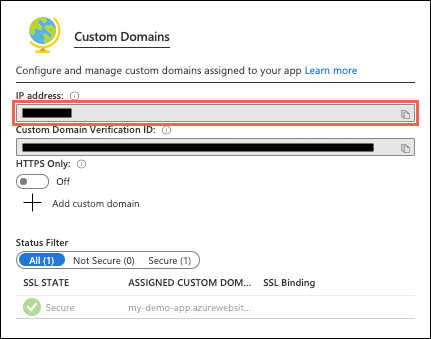

# Tutorial: Create DNS records for a web app in a custom domain

You can use Azure DNS to host a custom domain for your web apps. For example, you are creating an Azure web app and you want your users to access it by either using contoso.com, or www.contoso.com as an FQDN.

To do this, you have to create two records:

* A root "A" record pointing to contoso.com
* A "CNAME" record for the www name that points to the A record

Keep in mind that if you create an A record for a web app in Azure, the A record must be manually updated if the underlying IP address for the web app changes.

In this tutorial, you learn how to:

> [!div class="checklist"]
> * Create an A record for your custom domain
> * Create a CNAME record for your custom domain


If you don’t have an Azure subscription, create a [free account](https://azure.microsoft.com/free/?WT.mc_id=A261C142F) before you begin.

[!INCLUDE [cloud-shell-powershell.md](../../includes/cloud-shell-powershell.md)]

## Prerequisites

- [Create an App Service app](../app-service/app-service-web-get-started-html.md), or use an app that you created for another tutorial.

- Create a DNS zone in Azure DNS, and delegate the zone in your registrar to Azure DNS.

   1. To create a DNS zone, follow the steps in [Create a DNS zone](dns-getstarted-create-dnszone.md).
   2. To delegate your DNS to Azure DNS, follow the steps in [DNS domain delegation](dns-domain-delegation.md).

After creating a zone and delegating it to Azure DNS, you can then create records for your custom domain.

## Create an A record for your custom domain

An A record is used to map a name to its IP address. In the following example we will assign \@ as an A record to an IPv4 address:

### Create the record

Create an A record and assign to a variable $rs

```powershell
$rs= New-AzureRMDnsRecordSet -Name "@" -RecordType "A" -ZoneName "contoso.com" -ResourceGroupName "MyAzureResourceGroup" -Ttl 600
```

### Add the IPv4 value

Add the IPv4 value to the previously created record set "\@" using the $rs variable assigned. The IPv4 value assigned is the IP address for your web app.

In the left navigation of the app page in the Azure portal, select **Custom domains**. 


In the **Custom domains** page, copy the app's IP address.



```powershell
Add-AzureRMDnsRecordConfig -RecordSet $rs -Ipv4Address "<your web app IP address>"
```

### Commit the change

Commit the changes to the record set. Use `Set-AzureRMDnsRecordSet` to upload the changes to the record set to Azure DNS:

```powershell
Set-AzureRMDnsRecordSet -RecordSet $rs
```

## Create a CNAME record for your custom domain

If your domain is already managed by Azure DNS (see [DNS domain delegation](dns-domain-delegation.md), you can use the following the example to create a CNAME record for contoso.azurewebsites.net.

### Create the record

Open PowerShell and create a new CNAME record set and assign to a variable $rs. This example will create a record set type CNAME with a "time to live" of 600 seconds in DNS zone named "contoso.com".

```powershell
$rs = New-AzureRMDnsRecordSet -ZoneName contoso.com -ResourceGroupName myresourcegroup -Name "www" -RecordType "CNAME" -Ttl 600
```

The following example is the response.

```
Name              : www
ZoneName          : contoso.com
ResourceGroupName : myresourcegroup
Ttl               : 600
Etag              : 8baceeb9-4c2c-4608-a22c-229923ee1856
RecordType        : CNAME
Records           : {}
Tags              : {}
```

### Add the alias

Once the CNAME record set is created, you need to create an alias value which will point to the web app.

Using the previously assigned variable "$rs" you can use the PowerShell command below to create the alias for the web app contoso.azurewebsites.net.

```powershell
Add-AzureRMDnsRecordConfig -RecordSet $rs -Cname "contoso.azurewebsites.net"
```

The following example is the response.

```
    Name              : www
    ZoneName          : contoso.com
    ResourceGroupName : myresourcegroup
    Ttl               : 600
    Etag              : 8baceeb9-4c2c-4608-a22c-229923ee185
    RecordType        : CNAME
    Records           : {contoso.azurewebsites.net}
    Tags              : {}
```

### Commit the change

Commit the changes using the `Set-AzureRMDnsRecordSet` cmdlet:

```powershell
Set-AzureRMDnsRecordSet -RecordSet $rs
```

You can validate the record was created correctly by querying the "www.contoso.com" using nslookup, as shown below:

```
PS C:\> nslookup
Default Server:  Default
Address:  192.168.0.1

> www.contoso.com
Server:  default server
Address:  192.168.0.1

Non-authoritative answer:
Name:    <instance of web app service>.cloudapp.net
Address:  <ip of web app service>
Aliases:  www.contoso.com
contoso.azurewebsites.net
<instance of web app service>.vip.azurewebsites.windows.net
```

## Clean up resources

You can keep the **myresourcegroup** resource group if you intend to do the next tutorial. Otherwise, delete the **myresourcegroup** resource group to delete the resources created in this tutorial.

## Next steps

Now that you've created your custom domain, you can map it to your web app. Follow the steps in the App Service tutorial to configure your web app to use a custom domain.

> [!div class="nextstepaction"]
> [Configuring a custom domain name for App Service](../app-service/app-service-web-tutorial-custom-domain.md)
