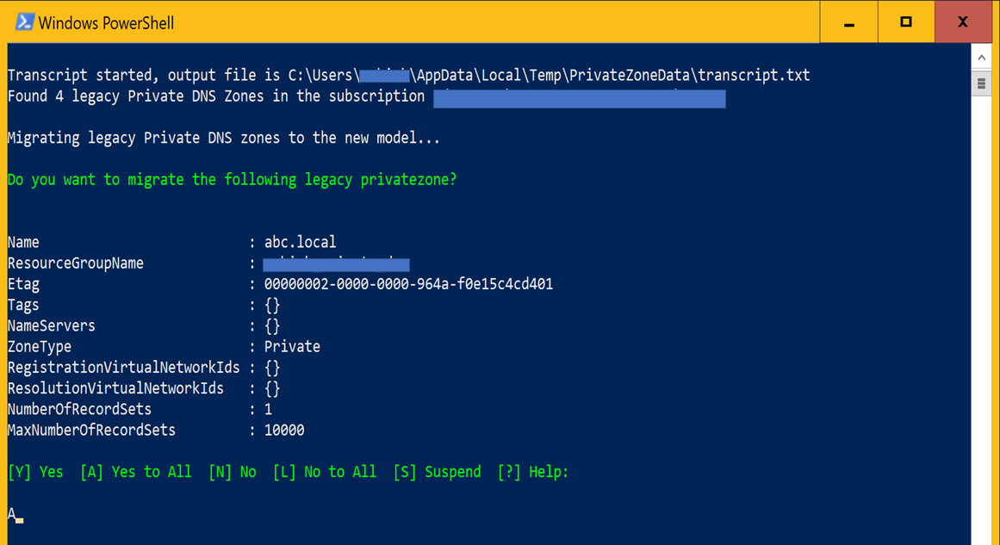

# Introduction

We shipped a new API/resource model for Azure DNS private zones as part of the preview refresh release. Preview refresh provides new functionality and removes several limitations and restrictions of the initial public preview. However, these benefits aren't available on the private DNS zones that have been created using legacy API. To get the benefits of the new release, you must migrate you legacy private DNS zone resources to new resource model. The migration process is  simple, and we've provided a PowerShell script to do this automatically for you. This guide provides step by step instruction for migrating your Azure DNS private zones to new resource model.

## Prerequisites

Make sure you have installed latest version of Azure PowerShell. For more information on Azure PowerShell (Az) and how to install it please visit

https://docs.microsoft.com/en-us/powershell/azure/new-azureps-module-az

Make sure that you've Az.PrivateDns module for the Azure PowerShell installed. To install this module, open an elevated PowerShell window (Administrative mode) and enter following command

```powershell
Install-Module -Name Az.PrivateDns -AllowPrerelease
```

Note: Though the migration process is fully automated and isn't expected to cause any downtime, If you're using Azure DNS private zones (preview) in a critical production environment you should execute below migration process during a planned maintenance time window. Please make sure that you don't modify the configuration or record-sets of a private DNS zones while you're migrating these zones to new resource model.

## Installing the Script

Open an elevated PowerShell window (Administrative mode) and run following command

```powershell
install-script PrivateDnsMigrationScript
```

Enter “A” when prompted to install the script


You can also manually obtain the latest version of PowerShell script at https://www.powershellgallery.com/packages/PrivateDnsMigrationScript

## Running the Script

Execute following command to run the script

```powershell
PrivateDnsMigrationScript.ps1
```


### Enter the Subscription Id and Login to Azure

You’ll be prompted to enter subscription id containing the private DNS zones that you intend to migrate. You’ll be asked to login to your Azure account. Complete the login so that script can access the private DNS zone resources in the subscription.


### Select the DNS Zones You want to Migrate

The script with get the list of all private DNS zones in the subscription and prompt you to confirm which ones you want to migrate. Enter “A” to migrate all private DNS zones. Once you execute this step, the script will create new private DNS zones using new resource model and copy the data into the new DSN zone. This step will not alter your existing private DNS zones in anyway.



### Switching DNS Resolution to the New DNS Zones

Once the zones and records have been copied to the new resource model, the script will prompt you to switch the DNS resolution to new DNS zones. This step removes the association between legacy private DNS zones and your virtual networks. When the legacy zone is unlinked from the virtual networks, the new DNS zones created in above step would automatically take over the DNS resolution for those virtual networks.

Select ‘A’ to switch the DNS resolution for all virtual networks.


### Verify the DNS Resolution

Before proceeding further, verify that DNS resolution on your DNS zones is working as expected. You can login to your azure VMs and issue nslookup query against the migrated zones to verify that DNS resolution is working.


If you find that DNS queries aren't resolving, wait for a few minutes and retry the queries. If DNS queries are working as expected, enter ‘Y’ when script prompts you to remove the virtual network from the private DNS zone.


Note: If because of any reason DNS resolution against the migrated zones isn't working as expected, enter ‘N’ in above step and script will switch the DNS resolution back to legacy zones. Please create a support ticket and we can help you with migration of your DNS zones.

## Cleanup

This step will delete the legacy DNS zones and should be executed only after you've verified that DNS resolution is working as expected from your virtual networks. You’ll be prompted to delete each private DNS zone. You should select ‘Y’ at every prompt after verifying that DNS resolution for that zones is working properly.


## Update Your Automations

If you're using automations including templates, PowerShell scripts and SDKs you must update your automation to use the new API and resource model for the private DNS zones. Below are the links to new private DNS CLI/PS/SDK documentation.

## Need Further Help

Please create a support ticket if you need further help with the migration process or because of any reason the above listed steps don't work for you. Include the transcript file generated by the PowerShell script with your support ticket.
