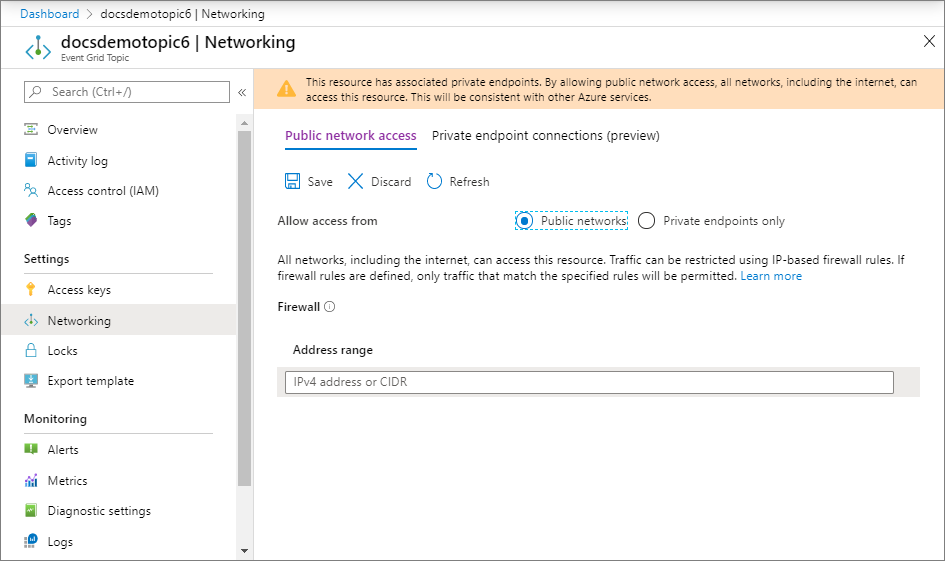
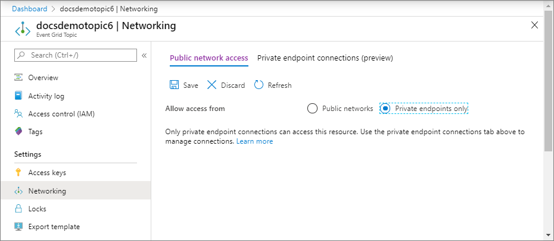

# Configure IP firewall for Azure Event Grid topics or domains (Preview)
By default, topic and domain are accessible from internet as long as the request comes with valid authentication and authorization. With IP firewall, you can restrict it further to only a set of IPv4 addresses or IPv4 address ranges in [CIDR (Classless Inter-Domain Routing)](https://en.wikipedia.org/wiki/Classless_Inter-Domain_Routing) notation. Publishers originating from any other IP address will be rejected and will receive a 403 (Forbidden) response. For more information about network security features supported by Event Grid, see [Network security for Event Grid](network-security.md).

This article describes how to configure IP firewall settings for Azure Event Grid topics or domains.

## Use Azure portal

1. In the [Azure portal](https://portal.azure.com), Navigate to your Event Grid topic or domain, and switch to the **Networking** tab. 

    
2. Select **Public networks** for the **Allow access from** field to allow all network, including the internet, to access the resource. You can restrict the traffic using IP-based firewall rules. 

    If you want to allow only sources with selected IP addresses to publish to the topic or domain, enter the **range of IP addresses**. Singular addresses can be entered in IPv4 notation while address ranges must be entered in CIDR notation. Several online tools exist for [converting IP ranges to CIDR](https://ipaddressguide.com/cidr).

    
3. Select **Private endpoints only** to allow only private endpoint connections to access this resource. Use the **Private endpoint connections** tab on this page to manage connections. 

    
4. Select **Save** on the toolbar. 

    > [!NOTE]
    > The steps shown in this section are mostly for topics. You can use similar steps to create inbound IP rules for **domains**. 

## Use Azure CLI
This section shows you how to use Azure CLI commands to create topics with inbound IP rules. 

> [!NOTE]
> The steps shown in this section are mostly for topics. You can use similar steps to create inbound IP rules for **domains**. 

### Create topic with inbound ip rules
The following sample CLI command creates an event grid topic with inbound IP rules in one step. 

```azurecli-interactive
az rest --method put \
    --uri "/subscriptions/<AZURE SUBSCRIPTION ID>/resourceGroups/<RESOURCE GROUP NAME>/providers/Microsoft.EventGrid/topics/<EVENT GRID TOPIC NAME>?api-version=2020-04-01-preview" \
    --body {\""location\"":\""<LOCATION>\", \""properties\"" :{ \""InboundIpRules\"": [ {\""ipMask\"": \""<IP ADDRESS or IP ADDRESS RANGE in CIDR notation>\"", \""action\"": \""allow\""} ]}}
```

### Create topic first and then add inbound ip rules
This example creates an event grid topic first and then adds inbound IP rules for the topic in a separate command. It also updates the inbound IP rules that were set in the second command. 

```azurecli-interactive

# create the event grid topic first
az rest --method put \
    --uri "/subscriptions/<AZURE SUBSCRIPTION ID>/resourceGroups/<RESOURCE GROUP NAME>/providers/Microsoft.EventGrid/topics/<EVENT GRID TOPIC NAME>?api-version=2020-04-01-preview" \
    --body {\""location\"":\""<LOCATION>\""}

# add inbound IP rules
az rest --method put \
    --uri "/subscriptions/<AZURE SUBSCRIPTION ID>/resourceGroups/<RESOURCE GROUP NAME>/providers/Microsoft.EventGrid/topics/<EVENT GRID TOPIC NAME>?api-version=2020-04-01-preview" 
    --body {\""location\"":\""<LOCATION>\", \""properties\"" :{ \""InboundIpRules\"": [ {\""ipMask\"": \""<IP ADDRESS or IP ADDRESS RANGE in CIDR notation>\"", \""action\"": \""allow\""} ]}}

# later, update topic with additional ip rules or remove them. 
az rest --method put \
    --uri "/subscriptions/<AZURE SUBSCRIPTION ID>/resourceGroups/<RESOURCE GROUP NAME>/providers/Microsoft.EventGrid/topics/<EVENT GRID TOPIC NAME>?api-version=2020-04-01-preview" 
    --body {\""location\"":\""<LOCATION>\", \""properties\"" :{ \""InboundIpRules\"": [ {\""ipMask\"": \""<IP ADDRESS or IP ADDRESS RANGE in CIDR notation>\"", \""action\"": \""allow\""}, {\""ipMask\"": \""<IP ADDRESS or IP ADDRESS RANGE in CIDR notation>\"", \""action\"": \""allow\""} ]}}
```

## Use PowerShell
This section shows you how to use Azure PowerShell commands to create Azure Event Grid topics with inbound rules. 

> [!NOTE]
> The steps shown in this section are mostly for topics. You can use similar steps to create inbound IP rules for **domains**. 

### Prerequisite
Follow instructions from [How to: Use the portal to create an Azure AD application and service principal that can access resources](../active-directory/develop/howto-create-service-principal-portal.md) to create an Azure Active Directory application and note down the following values:

- Directory (tenant) ID
- Application (Client) ID
- Application (client) secret

### Prepare token and headers for REST API calls 
Run the following prerequisite commands to get an authentication token to use with REST API calls and authorization and other header information. 

```azurepowershell-interactive
# replace <CLIENT ID> and <CLIENT SECRET>
$body = "grant_type=client_credentials&client_id=<CLIENT ID>&client_secret=<CLIENT SECRET>&resource=https://management.core.windows.net"

# get the authentication token. Replace <TENANT ID>
$Token = Invoke-RestMethod -Method Post `
    -Uri https://login.microsoftonline.com/<TENANT ID>/oauth2/token `
    -Body $body `
    -ContentType 'application/x-www-form-urlencoded'

# set authorization and content-type headers
$Headers = @{}
$Headers.Add("Authorization","$($Token.token_type) "+ " " + "$($Token.access_token)")
$Headers.Add("Content-Type","application/json")
```

### Create an event grid topic with inbound rules in one step

```azurepowershell-interactive

# prepare the body for the REST PUT method. Notice that inbound IP rules are included. 
$body = @{"location"="<LOCATION>"; "sku"= @{"name"="basic"}; "properties"=@{"publicNetworkAccess"="enabled"; "inboundIpRules"=@(@{"ipmask"="<IP ADDRESS or IP ADDRESS RANGE in CIDR notation>";"action"="allow"})}} | ConvertTo-Json -Depth 5

# create the event grid topic with inbound IP rules
Invoke-RestMethod -Method 'Put' `
    -Uri "https://management.azure.com/subscriptions/<AZURE SUBSCRIPTION ID>/resourceGroups/<RESOURCE GROUP NAME>/providers/Microsoft.EventGrid/topics/<EVENT GRID TOPIC NAME>?api-version=2020-04-01-preview" `
    -Headers $Headers `
    -Body $body

# verify that the topic was created
Invoke-RestMethod -Method 'Get' `
    -Uri "https://management.azure.com/subscriptions/<AZURE SUBSCRIPTION ID>/resourceGroups/<RESOURCE GROUP NAME>/providers/Microsoft.EventGrid/topics/<EVENT GRID TOPIC NAME>?api-version=2020-04-01-preview" `
    -Headers $Headers `
    | ConvertTo-Json -Depth 5
```


### Create event grid topic first and then add inbound ip rules

```azurepowershell-interactive

# prepare the body for the REST PUT method. Notice that no inbound IP rules are specified. 
$body = @{"location"="<LOCATION>"; "sku"= @{"name"="basic"}; "properties"=@{"publicNetworkAccess"="enabled";}} | ConvertTo-Json -Depth 5

# create the Event Grid topic
Invoke-RestMethod -Method 'Put' `
    -Uri "https://management.azure.com/subscriptions/<AZURE SUBSCRIPTION ID>/resourceGroups/<RESOURCE GROUP NAME>/providers/Microsoft.EventGrid/topics/<EVENT GRID TOPIC NAME>?api-version=2020-04-01-preview" `
    -Headers $Headers `
    -Body $body`

# verify that the topic was created
Invoke-RestMethod -Method 'Get' `
    -Uri "https://management.azure.com/subscriptions/<AZURE SUBSCRIPTION ID>/resourceGroups/<RESOURCE GROUP NAME>/providers/Microsoft.EventGrid/topics/<EVENT GRID TOPIC NAME>?api-version=2020-04-01-preview" `
    -Headers $Headers `
    | ConvertTo-Json -Depth 5

# prepare the body for REST PUT method. Notice that it includes inbound IP rules now. This feature available in both basic and premium tiers.
$body = @{"location"="<LOCATION>"; "sku"= @{"name"="basic"}; "properties"=@{"publicNetworkAccess"="enabled"; "inboundIpRules"=@(@{"ipmask"="<IP ADDRESS or IP ADDRESS RANGE in CIDR notation>";"action"="allow"}, @{"ipmask"="<IP ADDRESS or IP ADDRESS RANGE in CIDR notation>";"action"="allow"})}} | ConvertTo-Json -Depth 5

# update the topic with inbound IP rules
Invoke-RestMethod -Method 'Put' `
    -Uri "https://management.azure.com/subscriptions/<AZURE SUBSCRIPTION ID>/resourceGroups/<RESOURCE GROUP NAME>/providers/Microsoft.EventGrid/topics/<EVENT GRID TOPIC NAME>?api-version=2020-04-01-preview" `
    -Headers $Headers `
    -Body $body

# verify that the topic was updated
Invoke-RestMethod -Method 'Get' 
    -Uri "https://management.azure.com/subscriptions/<AzURE SUBSCRIPTION ID>/resourceGroups/<RESOURCE GROUP NAME>/providers/Microsoft.EventGrid/topics/<EVENT GRID TOPIC NAME>?api-version=2020-04-01-preview" `
    -Headers $Headers `
    | ConvertTo-Json -Depth 5

```

## Next steps

* For information about monitoring event deliveries, see [Monitor Event Grid message delivery](monitor-event-delivery.md).
* For more information about the authentication key, see [Event Grid security and authentication](security-authentication.md).
* For more information about creating an Azure Event Grid subscription, see [Event Grid subscription schema](subscription-creation-schema.md).
