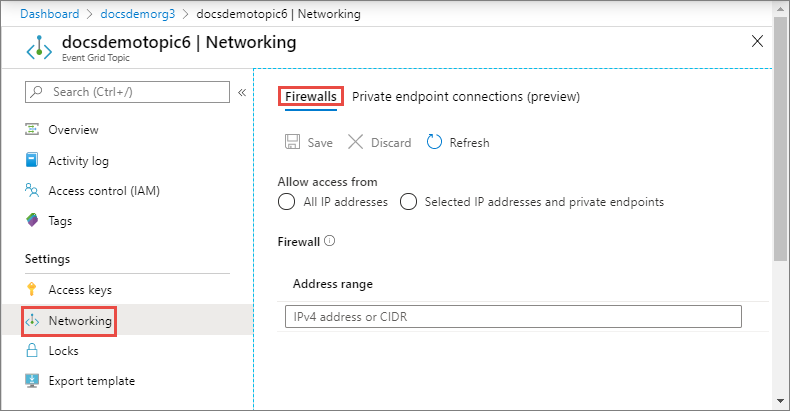

# Configure IP firewall for Event Grid topics or domains (Preview)
By default, topic and domain are accessible from internet as long as the request comes with valid authentication and authorization. With IP firewall, you can restrict it further to only a set of IP addresses or IP address ranges in CIDR (Classless Inter-Domain Routing) notation. Publishers originating from any other IP address will be rejected and will receive a 403 (Forbidden) response. 

This article describes how to configure IP firewall settings for Event Grid topics or domains.

## Use Azure portal

1. In the [Azure portal](https://portal.azure.com), Navigate to your Event Grid topic or domain, and switch to the **Networking** tab. 

    
2. Select one of the following options. 
    
    - Select **All IP addresses** if you want the Event Grid topic or domain to be accessed from all IP addresses. This is the default value. 
    - Select the **Selected IP addresses and private endpoints** option if you want the Event Grid to be accessed from only specified IP addresses and private endpoints. Then, enter the range of IP addresses that can access the Event Grid topic or domain. 
3. Select **Save** on the toolbar. 


## Use Azure CLI
This section shows you how to use Azure CLI commands to create Event Grid topics with inbound rules. Run the following commands if you need to create a resource group instead of using an existing one.

```azurecli
-- select a subscription (if you have multiple subscriptions)
az account set --subscription "<AZURE SUBSCRIPTION ID>"

-- create resource group
az group create --name <RESOURECE GROUP NAME> --location <LOCATION>
```


### Create topic with inbound ip rules
The following sample CLI command creates an Event Grid topic with inbound IP rules in one step. 

```azurecli
az rest --method put \
    --uri "/subscriptions/<AZURE SUBSCRIPTION ID>/resourceGroups/<RESOURCE GROUP NAME>/providers/Microsoft.EventGrid/topics/<EVENT GRID TOPIC NAME>?api-version=2020-04-01-preview" \
    --body {\""location\"":\""<LOCATION>\", \""properties\"" :{ \""InboundIpRules\"": [ {\""ipMask\"": \""0.0.0.0/0\"", \""action\"": \""allow\""} ]}}
```

### Create topic first and then add inbound ip rules
This example creates an Event Grid topic first and then adds inbound IP rules for the topic in a separate command. It also updates the inbound IP rules that were set in the second command. 

```azurecli

-- Create the EVent Grid topic first
az rest --method put \
    --uri "/subscriptions/<AZURE SUBSCRIPTION ID>/resourceGroups/<RESOURCE GROUP NAME>/providers/Microsoft.EventGrid/topics/<EVENT GRID TOPIC NAME>?api-version=2020-04-01-preview" \
    --body {\""location\"":\""<LOCATION>\"}

-- Add inbound IP rules
az rest --method put \
    --uri "/subscriptions/<AZURE SUBSCRIPTION ID>/resourceGroups/<RESOURCE GROUP NAME>/providers/Microsoft.EventGrid/topics/<EVENT GRID TOPIC NAME>?api-version=2020-04-01-preview" 
    --body {\""location\"":\""<LOCATION>\", \""properties\"" :{ \""InboundIpRules\"": [ {\""ipMask\"": \""0.0.0.0/0\"", \""action\"": \""allow\""} ]}}

-- Later, update topic with additional ip rules or remove them. 
az rest --method put \
    --uri "/subscriptions/<AZURE SUBSCRIPTION ID>/resourceGroups/<RESOURCE GROUP NAME>/providers/Microsoft.EventGrid/topics/<EVENT GRID TOPIC NAME>?api-version=2020-04-01-preview" 
    --body {\""location\"":\""<LOCATION>\", \""properties\"" :{ \""InboundIpRules\"": [ {\""ipMask\"": \""10.0.0.0/8\"", \""action\"": \""allow\""}, {\""ipMask\"": \""10.1.0.0/16\"", \""action\"": \""allow\""} ]}}
```

## Use PowerShell
This section shows you how to use Azure PowerShell commands to create Event Grid topics with inbound rules. Run the following prerequisite commands to get an authentication token to use with REST API calls and authorization and other header information. 

```azurepowershell
# replace <CLIENT ID> and <CLIENT SECRET>
$body = "grant_type=client_credentials&client_id=<CLIENT ID>&client_secret=<CLIENT SECRET>&resource=https://management.core.windows.net"

# get the authentication token
$Token = Invoke-RestMethod -Method Post -Uri https://login.microsoftonline.com/<TENANT ID>/oauth2/token -Body $body -ContentType 'application/x-www-form-urlencoded'

# set authorization and content-type headers
$Headers = @{}
$Headers.Add("Authorization","$($Token.token_type) "+ " " + "$($Token.access_token)")
$Headers.Add("Content-Type","application/json")
```

### Create an Event Grid topic with inbound rules in one step

```azurepowershell

# prepare the body for the REST PUT method. Notice that inbound IP rules are included. 
$body = @{"location"="<LOCATION>"; "sku"= @{"name"="basic"}; "properties"=@{"publicNetworkAccess"="enabled"; "inboundIpRules"=@(@{"ipmask"="0.0.0.0/0";"action"="allow"})}} | ConvertTo-Json -Depth 5

# create the Event Grid topic with inbound IP rules
Invoke-RestMethod -Method 'Put' -Uri "https://management.azure.com/subscriptions/<AZURE SUBSCRIPTION ID>/resourceGroups/<RESOURCE GROUP NAME>/providers/Microsoft.EventGrid/topics/<EVENT GRID TOPIC NAME>?api-version=2020-04-01-preview" -Headers $Headers -Body $body

# verify that the topic was created
Invoke-RestMethod -Method 'Get' -Uri "https://management.azure.com/subscriptions/<AZURE SUBSCRIPTION ID>/resourceGroups/<RESOURCE GROUP NAME>/providers/Microsoft.EventGrid/topics/<EVENT GRID TOPIC NAME>?api-version=2020-04-01-preview" -Headers $Headers | ConvertTo-Json -Depth 5
```


### Create Event Grid topic first and then add inbound ip rules

```azurepowershell

# prepare the body for the REST PUT method. Notice that no inbound IP rules are specified. 
$body = @{"location"="<LOCATION>"; "sku"= @{"name"="basic"}; "properties"=@{"publicNetworkAccess"="enabled";}} | ConvertTo-Json -Depth 5

# create the Event Grid topic
Invoke-RestMethod -Method 'Put' -Uri "https://management.azure.com/subscriptions/<AZURE SUBSCRIPTION ID>/resourceGroups/<RESOURCE GROUP NAME>/providers/Microsoft.EventGrid/topics/<EVENT GRID TOPIC NAME>?api-version=2020-04-01-preview" -Headers $Headers -Body $body

# verify that the topic was created
Invoke-RestMethod -Method 'Get' -Uri "https://management.azure.com/subscriptions/<AZURE SUBSCRIPTION ID>/resourceGroups/<RESOURCE GROUP NAME>/providers/Microsoft.EventGrid/topics/<EVENT GRID TOPIC NAME>?api-version=2020-04-01-preview" -Headers $Headers | ConvertTo-Json -Depth 5

# prepare the body for REST PUT method. Notice that it includes inbound IP rules now. 
$body = @{"location"="<LOCATION>"; "sku"= @{"name"="basic"}; "properties"=@{"publicNetworkAccess"="enabled"; "inboundIpRules"=@(@{"ipmask"="0.0.0.0/0";"action"="allow"}, @{"ipmask"="10.0.0.0/8";"action"="allow"})}} | ConvertTo-Json -Depth 5

# Update the topic with inbound IP rules
Invoke-RestMethod -Method 'Put' -Uri "https://management.azure.com/subscriptions/<AZURE SUBSCRIPTION ID>/resourceGroups/<RESOURCE GROUP NAME>/providers/Microsoft.EventGrid/topics/<EVENT GRID TOPIC NAME>?api-version=2020-04-01-preview" -Headers $Headers -Body $body

# Verify that the topic was updated
Invoke-RestMethod -Method 'Get' -Uri "https://management.azure.com/subscriptions/<AzURE SUBSCRIPTION ID>/resourceGroups/<RESOURCE GROUP NAME>/providers/Microsoft.EventGrid/topics/<EVENT GRID TOPIC NAME>?api-version=2020-04-01-preview" -Headers $Headers | ConvertTo-Json -Depth 5

```


## Next steps

* For information about monitoring event deliveries, see [Monitor Event Grid message delivery](monitor-event-delivery.md).
* For more information about the authentication key, see [Event Grid security and authentication](security-authentication.md).
* For more information about creating an Azure Event Grid subscription, see [Event Grid subscription schema](subscription-creation-schema.md).
