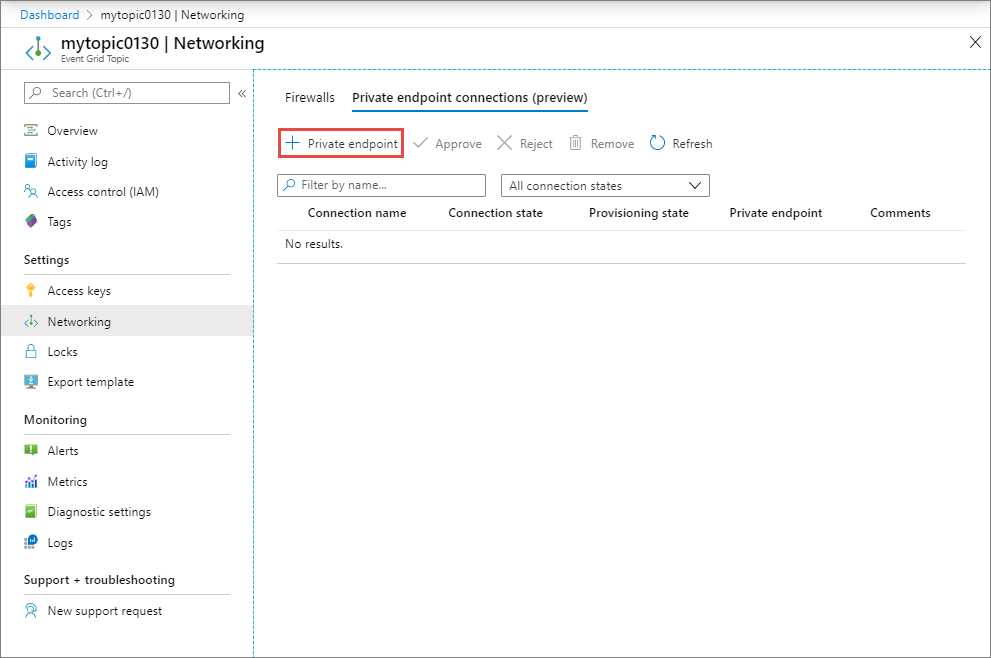
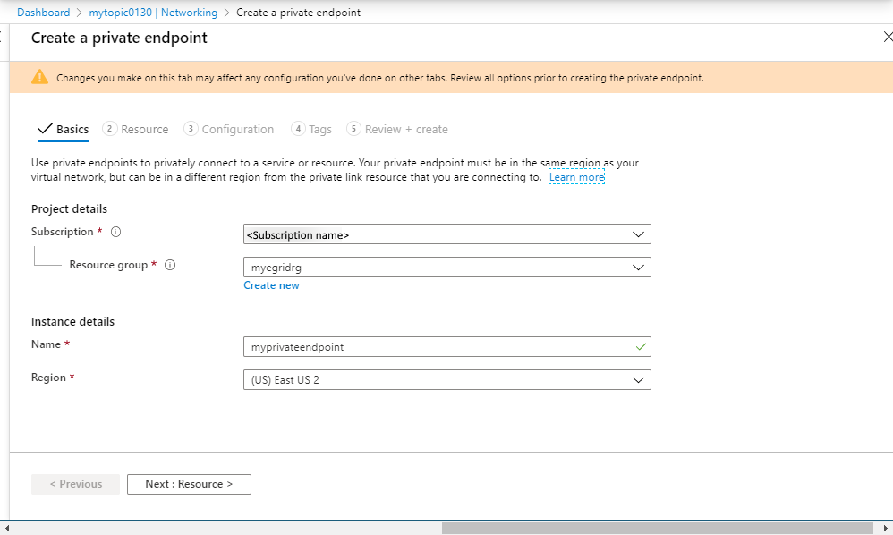
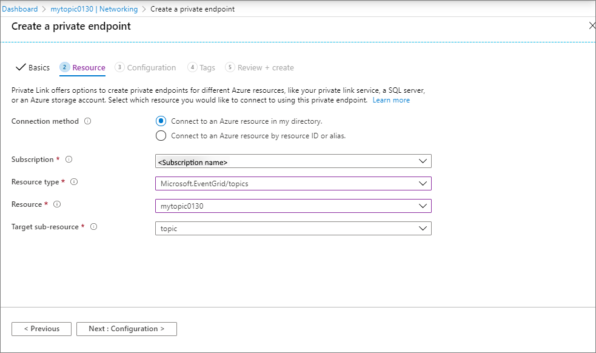
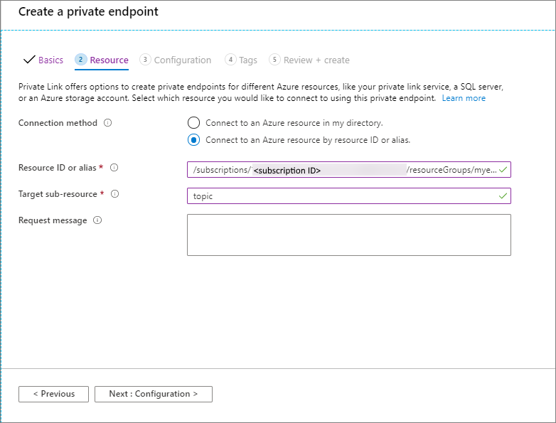
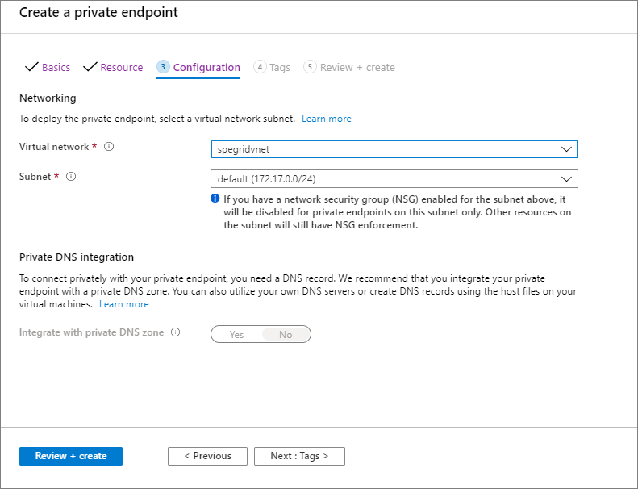
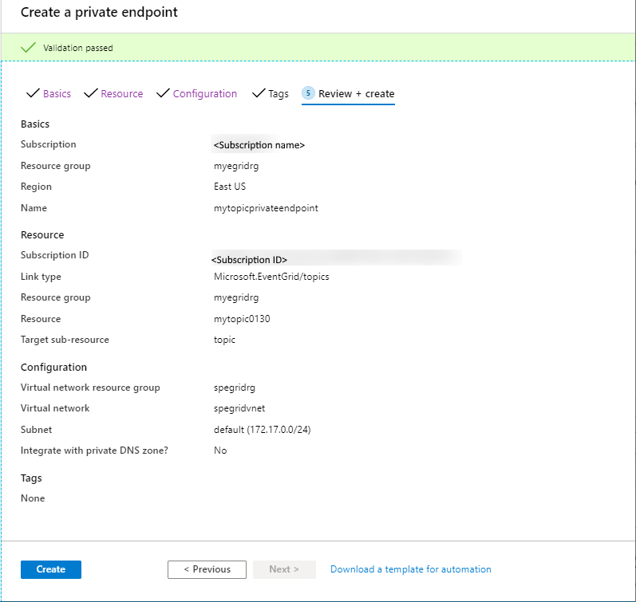

# Configure private endpoints for Event Grid topics or domains
You can use [private endpoints](../private-link/private-endpoint-overview.md) to allow ingress of events directly from your virtual network to your topics and domains securely over a [private link](../private-link/private-link-overview.md) without going through the public internet. The private endpoint uses an IP address from the VNet address space for your topic or domain. For more information, see [Network security](network-security.md).

This article describes how to configure private endpoints for Event Grid topics or domains.

## Use Azure portal 

1. Switch to the **Networking** tab of your Event Grid topic page. Select **+ Private endpoint** on the toolbar.

    
2. One the **Basics** page, follow these steps: 
    1. Select an **Azure subscription** in which you want to create the private endpoint. 
    2. Select an **Azure resource group** for the private endpoint. 
    3. Enter a **name** for the endpoint. 
    4. Select the **region** for the endpoint. Your private endpoint must be in the same region as your virtual network, but can in a different region from the private link resource (in this example, the Event Grid topic). 
    5. Then, select **Next: Resource >** button at the bottom of the page. 

      
3. On the **Resource** page, follow these steps: 
    1. For connection method, if you select **Connect to an Azure resource in my directory**. This example shows how to connect to an Azure resource in your directory. 
        1. Select the **Azure subscription** in which your **Event Grid topic/domain** exists. 
        1. For **Resource type**, Select **Microsoft.EventGrid/topics** or **Microsoft.EventGrid/domains** for the **Resource type**.
        2. For **Resource**, select an Event Grid topic/domain from the drop-down list. 
        3. Confirm that the **Target subresource** is set to **topic** or **domain** (based on the resource type you selected).    
        4. Select **Next: Configuration >** button at the bottom of the page. 

            
    2. If you select **Connect to a resource using a resource ID or an alias**, follow these steps:
        1. Enter the ID of the resource. For example: `/subscriptions/00000000000-0000-0000-0000-00000000000000/resourceGroups/myegridrg/providers/Microsoft.EventGrid/topics/mytopic0130`.  
        2. For **Resource**, enter **topic**. 
        3. (optional) Add a request message. 
        4. Select **Next: Configuration >** button at the bottom of the page. 

            
4. On the **Configuration** page, you select the subnet in a virtual network to where you want to deploy the private endpoint. 
    1. Select a **virtual network**. Only virtual networks in the currently selected subscription and location are listed in the drop-down list. 
    2. Select a **subnet** in the virtual network you selected. 
    3. Select **Next: Tags >** button at the bottom of the page. 

    
5. On the **Tags** page, create any tags (names and values) that you want to associate with the private endpoint resource. Then, select **Review + create** button at the bottom of the page. 
6. On the **Review + create**, review all the settings, and select **Create** to create the private endpoint. 

    
    

## Manage private link connection

When you create a private endpoint, the connection must be approved. If the resource for which you're creating a private endpoint is in your directory, you can approve the connection request provided you have sufficient permissions. If you're connecting to an Azure resource in another directory, you must wait for the owner of that resource to approve your connection request.

There are four provisioning states:

| Service action | Service consumer private endpoint state | Description |
|--|--|--|
| None | Pending | Connection is created manually and is pending approval from the Private Link resource owner. |
| Approve | Approved | Connection was automatically or manually approved and is ready to be used. |
| Reject | Rejected | Connection was rejected by the private link resource owner. |
| Remove | Disconnected | Connection was removed by the private link resource owner, the private endpoint becomes informative and should be deleted for cleanup. |
 
###  How to manage a private endpoint connection

1. Sign in to the Azure portal.
1. In the search bar, type in **Event Grid topics** or **Event Grid domains**.
1. Select the **topic** or **domain** that you want to manage.
1. Select the **Networking** tab.
1. If there are any connections that are pending, you will see a connection listed with **Pending** in the provisioning state. 
1. Select the **private endpoint** you wish to approve
1. Select the **Approve** button on the toolbar. 
1. If there are any private endpoint connections you want to reject, whether it is a pending request or existing connection, select the connection and click the **Reject** button.

## Use Azure CLI

## Use PowerShell

## Next steps
To learn about how to configure IP firewall settings, see [Configure IP firewall for Event Grid topics or domains](configure-firewall.md).