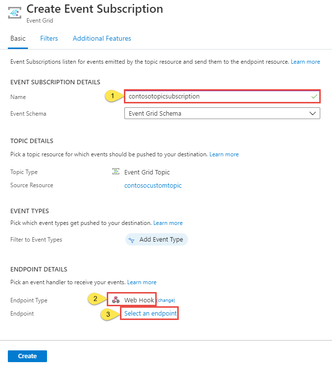

# Create and route custom events with Azure portal and Event Grid

Azure Event Grid is an eventing service for the cloud. In this article, you use the Azure portal to create a custom topic, subscribe to the topic, and trigger the event to view the result. Typically, you send events to an endpoint that responds to the event, such as, a webhook or Azure Function. However, to simplify this article, you send the events to a URL that merely collects the messages. You create this URL by using an open source, third-party tool called [RequestBin](https://requestb.in/).

>[!NOTE]
>**RequestBin** is an open source tool that is not intended for high throughput usage. The use of the tool here is purely demonstrative. If you push more than one event at a time, you might not see all of your events in the tool.

When you are finished, you see that the event data has been sent to an endpoint.


[!INCLUDE [quickstarts-free-trial-note.md](../../includes/quickstarts-free-trial-note.md)]

## Create a resource group

Event Grid topics are Azure resources, and must be placed in an Azure resource group. The resource group is a logical collection into which Azure resources are deployed and managed.

1. In the left navigation, select **Resource Groups**. Then, select **Add**.

   

1. Set the resource group name to *gridResourceGroup* and the location to *westus2*. Select **Create**.

   

## Create a custom topic

A topic provides a user-defined endpoint that you post your events to. 

1. To create a topic in your resource group, select **More services** and search for *event grid*. Select **Event Grid Topics** from the available options.

   

1. Select **Add**.

   

1. Provide a name for the topic. The topic name must be unique because it is represented by a DNS entry. For the preview release, Event Grid supports **westus2** and **westcentralus** locations. Select the resource group you created earlier. Select **Create**.

   

1. After the topic has been created, select **Refresh** to see the topic.

   

## Create a message endpoint

Before subscribing to the topic, let's create the endpoint for the event message. Rather than write code to respond to the event, let's create an endpoint that collects the messages so you can view them. RequestBin is an open source, third-party tool that enables you to create an endpoint, and view requests that are sent to it. Go to [RequestBin](https://requestb.in/), and click **Create a RequestBin**.  Copy the bin URL, because you need it when subscribing to the topic.

## Subscribe to a topic

You subscribe to a topic to tell Event Grid which events you want to track. 

1. To create an Event Grid subscription, again select **More Services** and search for *event grid*. Select **Event Grid Subscriptions** from the available options.

   

1. Select **+ Event Subscription**.

   

1. Provide a unique name for your event subscription. For the topic type, select **Event Grid Topics**. For the instance, select the custom topic you created. Provide the URL from RequestBin as the endpoint for event notification. When finished providing values, select **Create**.

   

Now, let's trigger an event to see how Event Grid distributes the message to your endpoint. To simplify this article, use Cloud Shell to send sample event data to the topic. Typically, an application or Azure service would send the event data.

[!INCLUDE [cloud-shell-try-it.md](../../includes/cloud-shell-try-it.md)]

## Send an event to your topic

First, let's get the URL and key for the topic. Use your topic name for `<topic_name>`.

```azurecli-interactive
endpoint=$(az eventgrid topic show --name <topic_name> -g gridResourceGroup --query "endpoint" --output tsv)
key=$(az eventgrid topic key list --name <topic_name> -g gridResourceGroup --query "key1" --output tsv)
```

The following example gets sample event data:

```azurecli-interactive
body=$(eval echo "'$(curl https://raw.githubusercontent.com/Azure/azure-docs-json-samples/master/event-grid/customevent.json)'")
```

If you `echo "$body"` you can see the full event. The `data` element of the JSON is the payload of your event. Any well-formed JSON can go in this field. You can also use the subject field for advanced routing and filtering.

CURL is a utility that performs HTTP requests. In this article, we use CURL to send the event to our topic. 

```azurecli-interactive
curl -X POST -H "aeg-sas-key: $key" -d "$body" $endpoint
```

You have triggered the event, and Event Grid sent the message to the endpoint you configured when subscribing. Browse to the RequestBin URL that you created earlier. Or, click refresh in your open RequestBin browser. You see the event you just sent.

```json
[{
  "id": "1807",
  "eventType": "recordInserted",
  "subject": "myapp/vehicles/motorcycles",
  "eventTime": "2017-08-10T21:03:07+00:00",
  "data": {
    "make": "Ducati",
    "model": "Monster"
  },
  "topic": "/subscriptions/{subscription-id}/resourceGroups/{resource-group}/providers/Microsoft.EventGrid/topics/{topic}"
}]
```

## Clean up resources

If you plan to continue working with this event, do not clean up the resources created in this article. If you do not plan to continue, delete the resources you created in this article.

Select the resource group, and select **Delete resource group**.

## Next steps

Now that you know how to create topics and event subscriptions, learn more about what Event Grid can help you do:

- [About Event Grid](overview.md)
- [Route Blob storage events to a custom web endpoint (preview)](../storage/blobs/storage-blob-event-quickstart.md?toc=%2fazure%2fevent-grid%2ftoc.json)
- [Monitor virtual machine changes with Azure Event Grid and Logic Apps](monitor-virtual-machine-changes-event-grid-logic-app.md)
- [Stream big data into a data warehouse](event-grid-event-hubs-integration.md)
