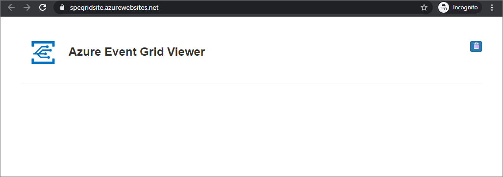
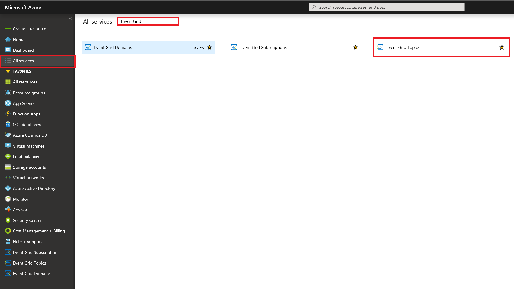
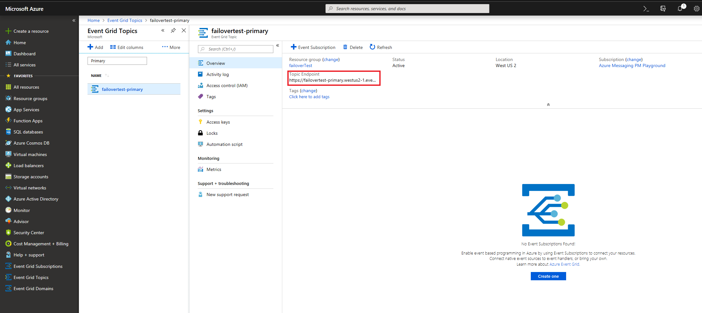
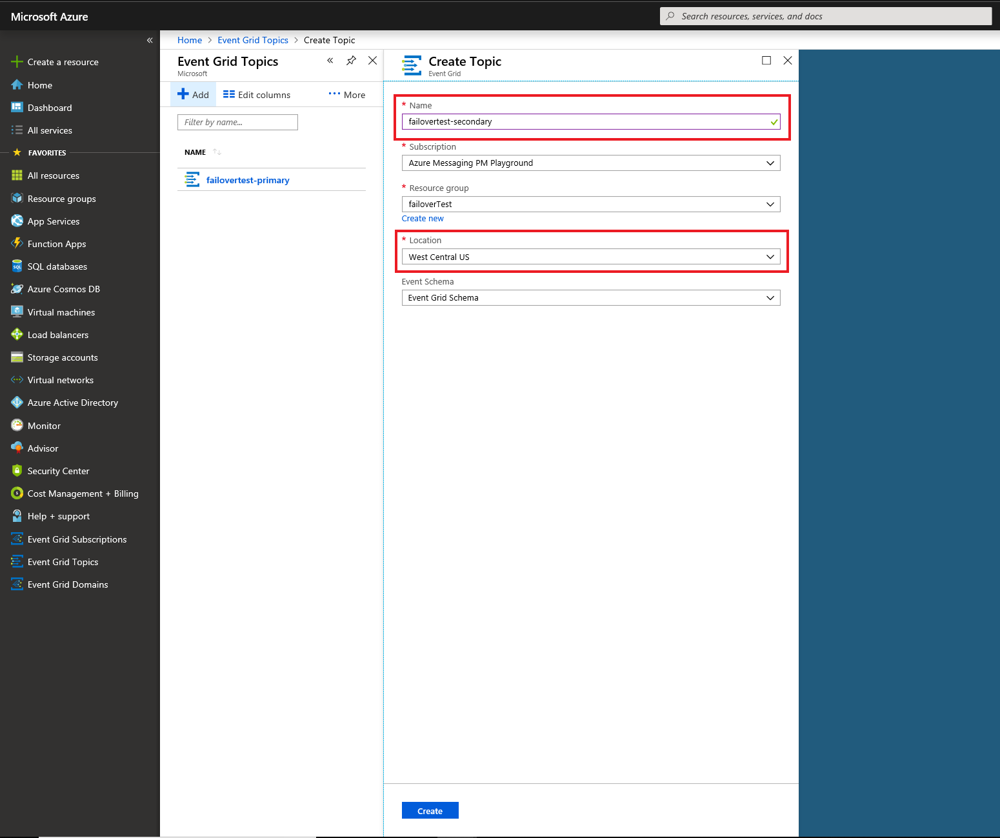

# Disaster recovery using Azure DNS and Traffic Manager

Disaster recovery focuses on recovering from a severe loss of application functionality. This tutorial will walk you through how to set up your eventing architecture to recover in the unlikely scenario in which the Event Grid service becomes unavailable in a particular region, or an entire region goes down.

In this tutorial, you'll learn how to create an active-passive failover architecture for custom topics. This will be accomplished by mirroring our topics and subscriptions across two regions and then managing a failover using Azure Traffic Manager. This fails over all new traffic, but it is important to note that events already in flight will not be recovered until the compromised region is healthy again.

## Prerequisites

In order to test your failover configuration, you'll need an endpoint to receive your events at.

### Create a message endpoint

To simplify testing, deploy a [pre-built web app](https://github.com/Azure-Samples/azure-event-grid-viewer) that displays the event messages. The deployed solution includes an App Service plan, an App Service web app, and source code from GitHub.

1. Select **Deploy to Azure** to deploy the solution to your subscription. In the Azure portal, provide values for the parameters.

   

1. The deployment may take a few minutes to complete. After the deployment has succeeded, view your web app to make sure it's running. In a web browser, navigate to: 
`https://<your-site-name>.azurewebsites.net`
Make sure to note this URL as you will need it later.

1. You see the site but no events have been posted to it yet.

   

[!INCLUDE [event-grid-register-provider-portal.md](../../includes/event-grid-register-provider-portal.md)]

## Create your primary and secondary topics

First, create two Event Grid topics. These will act as your primary and secondary. By default, your events will flow through your primary, but in the event of a service outage in the primary region, your secondary will take over.

1. Sign in to the [Azure portal](https://portal.azure.com). 

1. From the upper left corner of the main Azure menu, 
choose **All services** > search for **Event Grid** > select **Event Grid Topics**.

   

Select the start next to Event Grid Topics to add it to your left hand resource menu for easier access in the future.

1. In the Event Grid Topics Menu, select **+ADD** to create your primary topic. Give the topic a logical name and add "-primary" as a suffix to make it easy to track. This topic's region will be your primary region.

    

1. Once the Topic has been created, navigate to it and copy the **Topic Endpoint**. You will need this later.

    

1. In the Topic blade, click **+Event Subscription** to create a subscription connecting your 

1. Repeat the same flow to create your secondary topic. This time give it the suffix "-secondary", and make sure you put it in a different Azure Region. While you can put it anywhere you want, it is recommended that you use the [Azure Paired Regions](../best-practices-availability-paired-regions.md).

    

## Automatic failover using Azure Traffic Manager
When you have complex architectures and multiple sets of resources capable of performing the same function, you can configure Azure Traffic Manager (based on DNS) to check the health of your resources and route the traffic from the non-healthy resource to the healthy resource. 
In the following example, both the primary region and the secondary region have a full deployment. This deployment includes the cloud services and a synchronized database. 

*Figure - Automatic failover using Azure Traffic Manager*

However, only the primary region is actively handling network requests from the users. The secondary region becomes active only when the primary region experiences a service disruption. In that case, all new network requests route to the secondary region. Since the backup of the database is near instantaneous, both the load balancers have IPs that can be health checked, and the instances are always up and running, this topology provides an option for going in for a low RTO and failover without any manual intervention. The secondary failover region must be ready to go-live immediately after failure of the primary region.
This scenario is ideal for the use of Azure Traffic Manager that has inbuilt probes for various types of health checks including http / https and TCP. Azure Traffic manager also has a rule engine that can be configured to failover when a failure occurs as described below. Let’s consider the following solution using Traffic Manager:
- Customer has the Region #1 endpoint known as prod.contoso.com with a static IP as 100.168.124.44 and a Region #2 endpoint known as dr.contoso.com with a static IP as 100.168.124.43. 
-	Each of these environments is fronted via a public facing property like a load balancer. The load balancer can be configured to have a DNS-based endpoint or a fully qualified domain name (FQDN) as shown above.
-	All the instances in Region 2 are in near real-time replication with Region 1. Furthermore, the machine images are up-to-date, and all software/configuration data is patched and are in line with Region 1.  
-	Autoscaling is preconfigured in advance. 

The steps taken to configure the failover with Azure Traffic Manager are as follows:
1. Create a new Azure Traffic Manager profile
2. Create endpoints within the Traffic Manager profile
3. Set up health check and failover configuration

### Step 1: Create a new Azure Traffic Manager profile
Create a new Azure Traffic manager profile with the name contoso123 and select the Routing method as Priority. 
If you have a pre-existing resource group that you want to associate with, then you can select an existing resource group, otherwise, create a new resource group.

*Figure - Create a Traffic Manager profile*

### Step 2: Create endpoints within the Traffic Manager profile

In this step, you create endpoints that point to the production and disaster recovery sites. Here, choose the **Type** as an external endpoint, but if the resource is hosted in Azure, then you can choose **Azure endpoint** as well. If you choose **Azure endpoint**, then select a **Target resource** that is either an **App Service** or a **Public IP** that is allocated by Azure. The priority is set as **1** since it is the primary service for Region 1.
Similarly, create the disaster recovery endpoint within Traffic Manager as well.

*Figure - Create disaster recovery endpoints*

### Step 3: Set up health check and failover configuration

In this step, you set the DNS TTL to 10 seconds, which is honored by most internet-facing recursive resolvers. This configuration means that no DNS resolver will cache the information for more than 10 seconds. For the endpoint monitor settings, the path is current set at / or root, but you can customize the endpoint settings to evaluate a path, for example, prod.contoso.com/index. The example below shows the **https** as the probing protocol. However, you can choose **http** or **tcp** as well. The choice of protocol depends upon the end application. The probing interval is set to 10 seconds, which enables fast probing, and the retry is set to 3. As a result, Traffic Manager will failover to the second endpoint if three consecutive intervals register a failure. The following formula defines the total time for an automated failover:
Time for failover = TTL + Retry * Probing interval 
And in this case, the value is 10 + 3 * 10 = 40 seconds (Max).
If the Retry is set to 1 and TTL is set to 10 secs, then the time for failover 10 + 1 * 10 = 20 seconds. Set the Retry to a value greater than **1** to eliminate chances of failovers due to false positives or any minor network blips. 

*Figure - Set up health check and failover configuration*

### How automatic failover works using Traffic Manager

During a disaster, the primary endpoint gets probed and the status changes to **degraded** and the disaster recovery site remains **Online**. By default, Traffic Manager sends all traffic to the primary (highest-priority) endpoint. If the primary endpoint appears degraded, Traffic Manager routes the traffic to the second endpoint as long as it remains healthy. One has the option to configure more endpoints within Traffic Manager that can serve as additional failover endpoints, or, as load balancers sharing the load between endpoints.

## Next steps
- Learn more about [Azure Traffic Manager](../traffic-manager/traffic-manager-overview.md).
- Learn more about [Azure DNS](../dns/dns-overview.md).