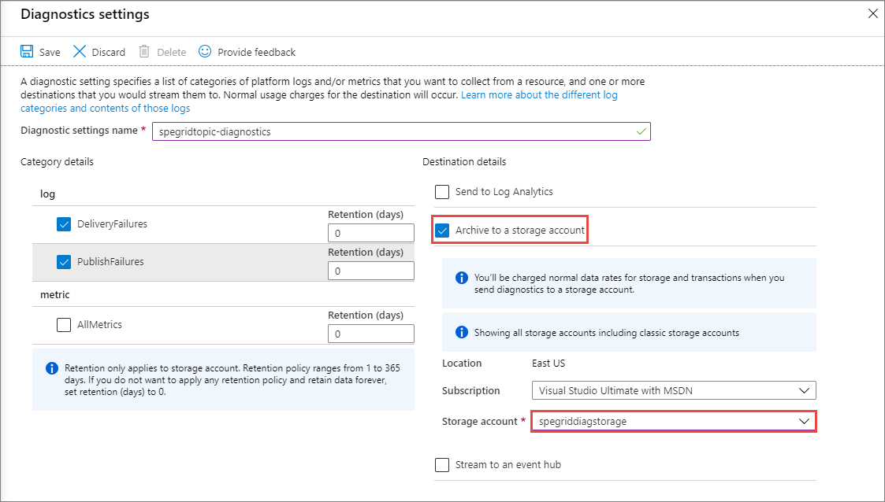
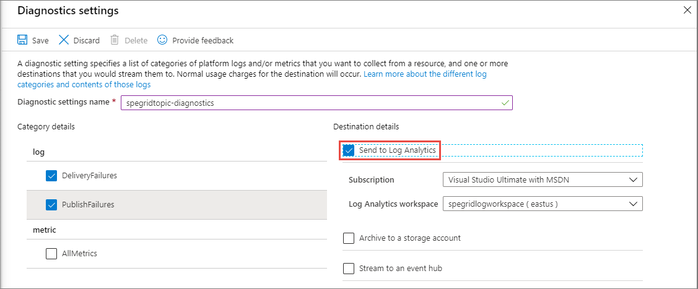
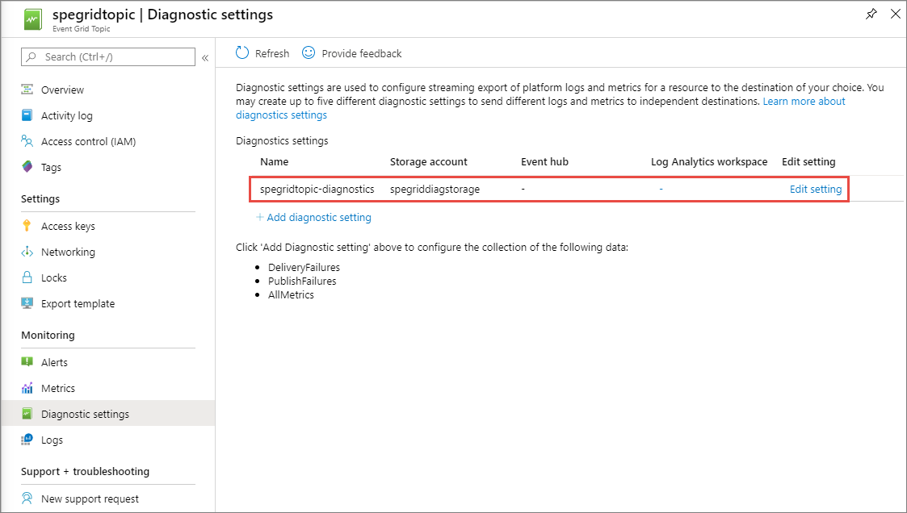
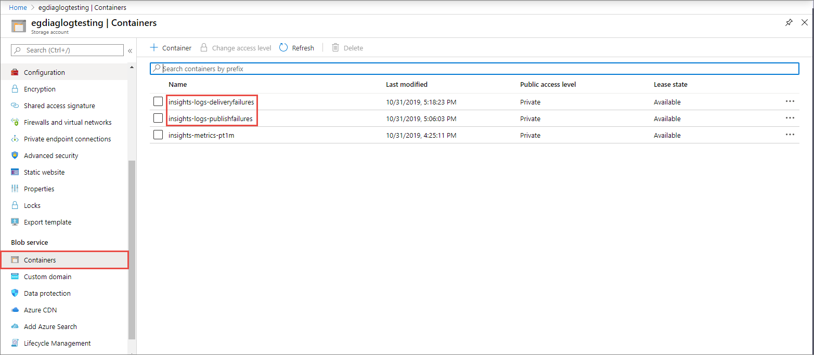

#  Diagnostic logs for an Azure event grid topic
Diagnostic Settings now allow Event Grid users to capture and view **publish and delivery failure** Logs in either a Storage account, an event hub or a Log Analytics Workspace. This article provides step-by-step instructions to enable these settings on an Event Grid Topic.

## Prerequisites

- A provisioned event grid topic
- A provisioned destination for capturing diagnostic logs. It can one of the following destinations in the same location as the event grid topic:
    - Azure storage account
    - Event hub
    - Log Analytics workspace


## Steps for enabling diagnostic logs for a topic

1. Sign in to the [Azure portal](https://portal.azure.com).
2. Navigate to the event grid topic for which you want to enable diagnostic log settings. 
3. Select **Diagnostic settings** under **Monitoring** in the left menu.
4. On the **Diagnostic settings** page, select **Add New Diagnostic Setting**. 
    
    
5. Specify a **name** for the diagnostic setting. 
7. Select the **DeliveryFailures** and **PublishFailures** options in the **Log** section. 
    
6. Enable one or more of the capture destinations for the logs, and then configure them by selecting a previous created capture resource. 
    - If you select **Archive to a storage account**, select **Storage account - Configure**, and then select the storage account in your Azure subscription. 

        
    - If you select **Stream to an event hub**, select **Event hub - Configure**, and then select the Event Hubs namespace, event hub, and the access policy. 
        
    - If you select **Send to Log Analytics**, select the Log Analytics workspace.
        
8. Select **Save**. Then, select **X** in the right-corner to close the page. 
9. Now, back on the **Diagnostic settings** page, confirm that you see a new entry in the **Diagnostics Settings** table. 
    

	 You can also enable collection of all metrics for the topic. 

## View diagnostic logs in Azure Storage 

1. Once you enable a storage account as a capture destination and Event Grid starts emitting diagnostic logs, you should see new containers named **insights-logs-deliveryfailures** and **insights-logs-publishfailures** in the storage account. 

    
2. As you navigate through one of the containers, you will end up at a blob in JSON format. The file contains log entries for either a delivery failure or a publish failure. The navigation path represents the **ResourceId** of the event grid topic and the timestamp (minute level) as to when the log entries were emitted. The blob/JSON file, which is downloadable, in the end adheres to the schema described in the next section. 

    
3. You should see content in the JSON file similar to the following example: 

    ```json
    {
        "time": "2019-11-01T00:17:13.4389048Z",
        "resourceId": "/SUBSCRIPTIONS/SAMPLE-SUBSCTIPTION-ID /RESOURCEGROUPS/SAMPLE-RESOURCEGROUP-NAME/PROVIDERS/MICROSOFT.EVENTGRID/TOPICS/SAMPLE-TOPIC-NAME ",
        "eventSubscriptionName": "SAMPLEDESTINATION",
        "category": "DeliveryFailures",
        "operationName": "Deliver",
        "message": "Message:outcome=NotFound, latencyInMs=2635, systemId=17284f7c-0044-46fb-84b7-59fda5776017, state=FilteredFailingDelivery, deliveryTime=11/1/2019 12:17:10 AM, deliveryCount=0, probationCount=0, deliverySchema=EventGridEvent, eventSubscriptionDeliverySchema=EventGridEvent, fields=InputEvent, EventSubscriptionId, DeliveryTime, State, Id, DeliverySchema, LastDeliveryAttemptTime, SystemId, fieldCount=, requestExpiration=1/1/0001 12:00:00 AM, delivered=False publishTime=11/1/2019 12:17:10 AM, eventTime=11/1/2019 12:17:09 AM, eventType=Type, deliveryTime=11/1/2019 12:17:10 AM, filteringState=FilteredWithRpc, inputSchema=EventGridEvent, publisher=DIAGNOSTICLOGSTEST-EASTUS.EASTUS-1.EVENTGRID.AZURE.NET, size=363, fields=Id, PublishTime, SerializedBody, EventType, Topic, Subject, FilteringHashCode, SystemId, Publisher, FilteringTopic, TopicCategory, DataVersion, MetadataVersion, InputSchema, EventTime, fieldCount=15, url=sb://diagnosticlogstesting-eastus.servicebus.windows.net/, deliveryResponse=NotFound: The messaging entity 'sb://diagnosticlogstesting-eastus.servicebus.windows.net/eh-diagnosticlogstest' could not be found. TrackingId:c98c5af6-11f0-400b-8f56-c605662fb849_G14, SystemTracker:diagnosticlogstesting-eastus.servicebus.windows.net:eh-diagnosticlogstest, Timestamp:2019-11-01T00:17:13, referenceId: ac141738a9a54451b12b4cc31a10dedc_G14:"
    }
    ```

## Publish and delivery failure log schema

| Property name | Data type | Description |
| ------------- | --------- | ----------- | 
| Time | DateTime | Time when the log entry was generated <p>**Example value:**  01-29-2020 09:52:02.700</p> |
| EventSubscriptionName | String | Name of the event subscription <p>**Example value:** "EVENTSUB1"</p> <p>This property exists only for delivery failure logs.</p>  |
| Category | String | Log category name. <p>**Example values:** "DeliveryFailures" or "PublishFailures" | 
| OperationName | String | Name of the operation performed while encountering the failure.<p>**Example Values:** "Deliver" for delivery failures. |
| Message | String | Log message for the user explaining the reason for the failure and other additional details. |
| ResourceId | String | ResourceId for the topic/domain resource<p>**Example Values:** `/SUBSCRIPTIONS/SAMPLE-SUBSCRIPTION-ID/RESOURCEGROUPS/SAMPLE-RESOURCEGROUP/PROVIDERS/MICROSOFT.EVENTGRID/TOPICS/TOPIC1` |

## Next steps
See the following article: [Create diagnostic setting to collect resource logs and metrics in Azure](../azure-monitor/platform/diagnostic-settings.md)
