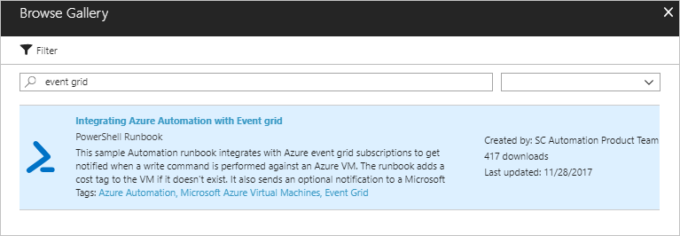

# Integrate Azure Automation with Event Grid and Microsoft Teams

In this tutorial, you learn how to:

> [!div class="checklist"]
> * Import an Event Grid sample runbook.
> * Create an optional Microsoft Teams webhook.
> * Create a webhook for the runbook.
> * Create an Event Grid subscription.
> * Create a VM that triggers the runbook.

## Prerequisites

To complete this tutorial, an [Azure Automation account](../automation/automation-offering-get-started.md) is required to hold the runbook that is triggered from the Azure Event Grid subscription.

## Import an Event Grid sample runbook
1. Select **Automation Accounts**, and select the **Runbooks** page.

2. Select the **Browse gallery** button.

    

3. Search for **Event Grid**, and import the runbook into the Automation account.

    

4. Select **Edit** to view the runbook source, and select the **Publish** button.

    

## Create an optional Microsoft Teams webhook
1. In Microsoft Teams, choose **More Options** next to the channel name, and then choose **Connectors**.

    

2. Scroll through the list of connectors to **Incoming Webhook**, and select **Add**.

    

3. Enter *AzureAutomationIntegration* for the name, and select **Create**.

    

4. Copy the webhook to the clipboard, and save it. The webhook URL is used to send information to Microsoft Teams.

5. Select **Done** to save the webhook.

## Create a webhook for the runbook
1. Open the Watch-VMWrite runbook.

2. Select **Webhooks**, and select the **Add Webhook** button

    

3. Enter *WatchVMEventGrid* for the name. Copy the URL to the clipboard, and save it.

    

4. Select **Parameters and run settings**, and enter the Microsoft Teams webhook URL. Leave the **WEBHOOKDATA** blank.

    

5. Select **OK** to create the Automation runbook webhook.

## Create an Event Grid subscription
1. On the **Automation Account** overview page, select **Event grid**.

    

2. Select the **Event Subscription** button.

3. Configure the subscription with the following information:

    *	Enter *AzureAutomation* for the name. 
    *	Under **Topic Type**, choose **Azure Subscriptions**.
    *	Clear the **Subscribe to all event types** check box.
    *	Under **Event Types**, choose **Resource Write Success**.
    *	Under **Full Endpoint URL**, enter the webhook URL for the Watch-VMWrite runbook.
    *	Under **Prefix Filter**, enter the subscription and resource group you want to look for the new VMs created. It should look like /subscriptions/124aa551-849d-46e4-a6dc-0bc4895422aB/resourcegroups/ContosoResourceGroup/providers/Microsoft.Compute/virtualMachines

    

4. Select **Create** to save the Event Grid subscription.

## Create a VM that triggers the runbook
1. Create a new VM in the resource group you specified in the Event Grid subscription prefix filter.

2. The Watch-VMWrite runbook should be called and a new tag added to the VM.

    

3. A new message is sent to the Microsoft Teams channel.

    

## Next steps
In this tutorial, you set up integration between Event Grid and Automation. You learned how to:

> [!div class="checklist"]
> * Import an Event Grid sample runbook.
> * Create an optional Microsoft Teams webhook.
> * Create a webhook for the runbook.
> * Create an Event Grid subscription.
> * Create a VM that triggers the runbook.

> [!div class="nextstepaction"]
> [Create and route custom events with Event Grid](../event-grid/custom-event-quickstart.md)
