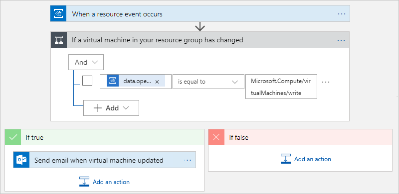
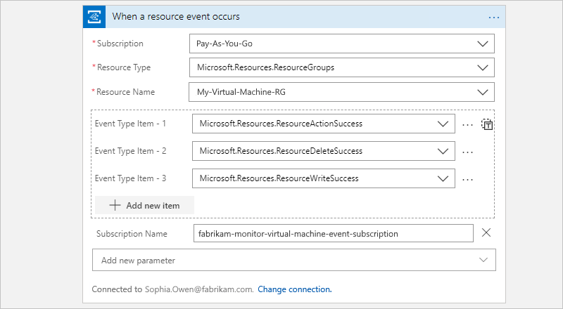
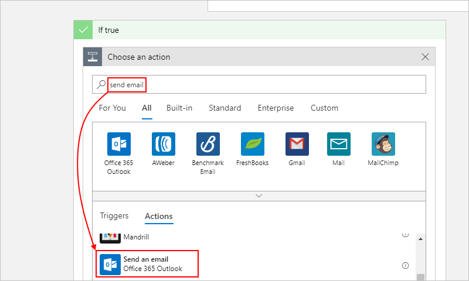
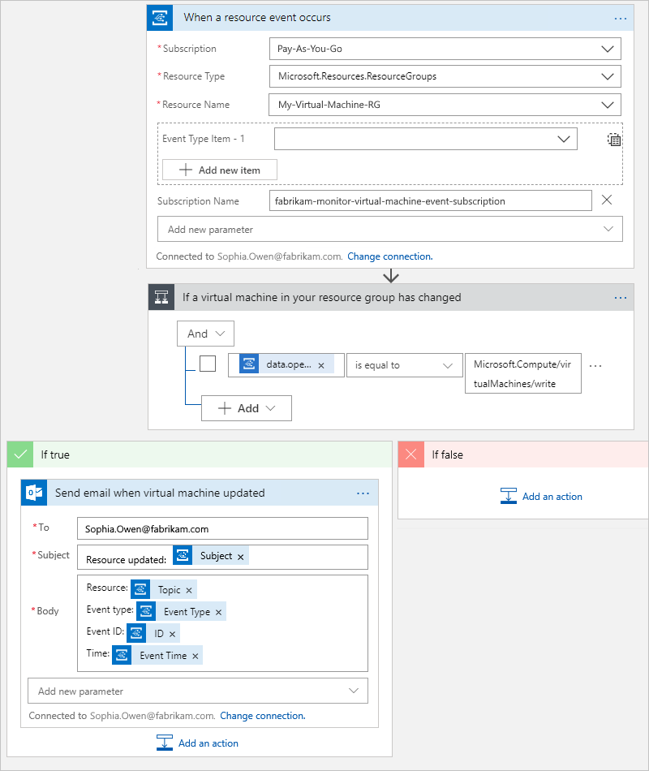

# Monitor changes to virtual machine configurations with event grids and logic apps

You can start an automated [logic app workflow](../logic-apps/logic-apps-what-are-logic-apps.md) 
when specific events happen in Azure resources or third-party resources. 
These resources can publish those events to an [Azure event grid](../event-grid/overview.md). 
In turn, the event grid pushes those events to subscribers that have queues, webhooks, 
or [event hubs](../event-hubs/event-hubs-what-is-event-hubs.md) as endpoints. 
As a subscriber, your logic app can wait for those events from the event grid 
before running automated workflows to perform tasks.

For example, here are some events that an event grid can send 
from publisher to subscriber:

* Create, read, update, or delete a resource
* New message in a queue
* New tweet

This tutorial shows how to create a logic app that monitors changes to a virtual machine 
and sends email about those changes. After you create and save a logic app with an event 
subscription to an Azure resource, events start flowing from the resource to an event grid. 
The event grid then pushes those events to subscribers, like your logic app. 
So beyond this set up, you [don't need to do anything else to make Azure resources publish events](../event-grid/overview.md).

## Requirements

For this tutorial, you need:

* A Windows virtual machine. 
[Learn how to create a virtual machine through the Azure portal](../virtual-machines/windows/quick-create-portal.md).

* An email account with 
[any email provider that's supported by Azure Logic Apps](../connectors/apis-list.md), 
like Office 365 Outlook, Outlook.com, or Gmail

## Create a logic app that listens to events through an event grid

First, create a logic app that monitors events in the resource group for your virtual machine. 
When these events happen, the resource group publishes those events to an event grid, 
which pushes those events to your logic app. If those events are changes to your virtual machine, 
your logic app sends you email that your virtual machine was updated. 

1. In the [Azure portal](https://portal.azure.com), from the main Azure menu, 
choose **New** > **Enterprise Integration** > **Logic App** as shown:

   

2. Create your logic app:

   1. Provide a name for your logic app.

   2. Select the Azure subscription, resource group, 
   and location that you want to use for your logic app. 

   3. When you're ready, select **Pin to dashboard**, and choose **Create**.

      

      You've now created an Azure resource for your logic app. 
      After Azure deploys your logic app, the Logic Apps Designer 
      shows you templates for common patterns so you can get started faster.

      > [!NOTE] 
      > When you select **Pin to dashboard**, 
      > your logic app automatically opens in Logic Apps Designer. 
      > Otherwise, you can manually find and open your logic app.

3. Now choose a logic app template. 
Under **Templates**, choose **Blank Logic App**, 
so you can build your logic app from scratch.

   The Logic Apps Designer shows you [*connectors*](../connectors/apis-list.md) 
   and [*triggers*](../logic-apps/logic-apps-what-are-logic-apps.md#logic-app-concepts) 
   that you can use to start your logic app. A trigger is an event that creates 
   a logic app instance and starts your logic app workflow. 
   Your logic app needs a trigger as the first item.

4. In the search box, enter "event grid" as your filter. 
Select this trigger: **Azure Event Grid - On a resource event**

   

5. In the trigger, provide these event subscription details 
so that your logic app can receive events from the publisher resource:

   

   | Setting  | Description  |
   | :------- | :----------- |
   | **Subscription** | The publisher resource's Azure subscription. For this tutorial, select the Azure subscription used for your virtual machine. | 
   | **Resource Type** | The publisher's resource type. For this tutorial, select **Microsoft.Resources.resourceGroups** so that your logic app monitors only resource groups. |
   | **Resource Name** | The publisher resource's name. For this tutorial, select the name of the resource group for your virtual machine. |
   | For optional settings, choose **Show advanced options**. | * **Prefix Filter**: Specify a prefix string as a filter, for example, a path and a parameter for a specific resource. However, for this tutorial, leave this setting empty. The default behavior matches all values. 
* **Suffix Filter**: Specify a suffix string as a filter, for example, a file name extension, if you want only specific file types. For this tutorial, leave this setting empty. The default behavior matches all values. 
* **Subscription Name**: Provide a name for your event subscription. |
   |||

   Your event grid trigger looks similar to this example:
   
   

6. Save your logic app. On the designer toolbar, choose **Save**. 
To collapse and hide an action's details in your logic app, 
choose the action's title bar.

   

After you save your logic app, Azure creates an event subscription 
between your logic app and the resource group. 
Now when the resource group publishes an event to the event grid, 
that event grid automatically pushes the event to your logic app. 
Your logic app then creates and starts running an instance 
of the workflow that you define in these next steps.

## Add a condition that checks for changes to virtual machines

Now add a condition that checks resource group events for 
virtual machine "write" operations. If this condition is true, 
your logic app sends you email with details about the updated virtual machine.

1. In Logic App Designer, under the event grid trigger, 
choose **New step** > **Add a condition**.

   

   The Logic App Designer adds a condition to your workflow, 
   including action paths to follow based whether the condition 
   evaluates as true or false.

2. Build the condition criteria. 

   * In the condition's left box, from the **Dynamic content** list that appears, 
   choose the **Data object** field under **On a resource event**. 
   Close the dynamic content list for now. (Choose **Add dynamic content**)

     

   * In the middle box, choose **contains** for your comparison operator. 

   * In the right box, enter "Microsoft.Compute/virtualMachines/write" 
   for the operation that you want your logic app to monitor. 

   * Optional: To provide a description for your condition, 
   choose the **ellipses** (**...**) button on the condition shape, 
   then choose **Rename**.

   Your condition looks similar to this example:

   

## Send email when your virtual machine is updated

Now add an [*action*](../logic-apps/logic-apps-what-are-logic-apps.md#logic-app-concepts) 
that sends email when your specified condition is true.

1. Under the condition, in the **If true** box, choose **Add an action**.

   

2. In the search box, enter "email" as your filter. 
Based on your email provider, find and select the matching connector. 
Then select the "send email" action for your connector. 

   For example, if you have an Azure work or school account, 
   select the Office 365 Outlook connector. 
   For personal Microsoft accounts, 
   select the Outlook.com connector. 
   For example, for Gmail accounts, select the Gmail connector. 

   If you're using Office 365 Outlook, 
   your workflow might look like this example:

   

4. If you don't already have a connection for your email provider, 
sign in to your email account when you're asked for authentication.

5. Provide the details for the email action. 
When the **Dynamic content** list appears, 
you can select from fields available in your workflow.

   * In the **Body** and **Subject** boxes, 
   select the fields that you want to include in the email. 
   For this tutorial:
   
     * **Body**: Select the **Event Time**, **Event ID**, and **Event Type** 
     fields so that your email includes the event timestamp, ID, 
     and type for your virtual machine update.

     * **Subject**: Select the **Subject** field so that your email 
     includes the name for the updated resource.

   * In the **To** box, enter the recipient's email address. 
   For testing purposes, use your own email address.

   * Optional: To provide a description for your email, 
   on the email shape, choose the **ellipses** (**...**) button, 
   then choose **Rename**.

   For example, if you're using Office 365 Outlook, 
   your logic app might look like this workflow:

   

   > [!NOTE] 
   > If you select a field that represents an array, 
   > the designer automatically adds a **For each** loop 
   > around the action that references the array. 
   > That way, your logic app performs that action on each array item.

   When you're done, your logic app looks similar to this example:

   

5. Save your logic app. To collapse and hide each action's details in your logic app, 
choose the action's title bar.

   

## Run and test your logic app

1. Update your virtual machine, for example, 
choose a different size.

## FAQ

**Q**: What other virtual machine monitoring tasks can I peform with event grids and logic apps?  
**A**: You can monitor other configuration changes, like these examples:

* A virtual machine gets role-based access control (RBAC) rights.
* Changes are made to a network security group (NSG) on a network interface (NIC).
* Disks for a virtual machine are added or removed.
* A public IP address is assigned to a virtual machine NIC.

**Q**: How do I set up publishing to an event grid for a third-party resource, 
like custom APIs?  
**A**: Here are more details for third-party resources that might need 
configuration for publishing to event grids: 

* [Event Grid publisher schema](../event-grid/publisher-registration-schema.md)
* [Event Grid event schema](../event-grid/event-schema.md)
* [Event Grid security and authentication](../event-grid/security-authentication.md)
* [Event Grid subscription schema](../event-grid/subscription-creation-schema.md)

## Next steps

