# Tutorial: Monitor virtual machine changes with Azure Event Grid and Logic Apps

You can start an automated [logic app workflow](../logic-apps/logic-apps-overview.md) 
when specific events happen in Azure resources or third-party resources. 
These resources can publish those events to an [Azure event grid](../event-grid/overview.md). 
In turn, the event grid pushes those events to subscribers that have queues, 
webhooks, or [event hubs](../event-hubs/event-hubs-what-is-event-hubs.md) as endpoints. 
As a subscriber, your logic app can wait for those events from the event grid 
before running automated workflows to perform tasks - without you writing any code.

For example, here are some events that publishers can send 
to subscribers through the Azure Event Grid service:

* Create, read, update, or delete a resource. 
For example, you can monitor changes that might 
incur charges on your Azure subscription and affect your bill. 
* Add or remove a person from an Azure subscription.
* Your app performs a particular action.
* A new message appears in a queue.

This tutorial creates a logic app that monitors changes to a virtual machine, 
and sends emails about those changes. When you create a logic app with an 
event subscription for an Azure resource, events flow from that resource 
through an event grid to the logic app. The tutorial walks you through building this logic app:

In this tutorial, you learn how to:

> [!div class="checklist"]
> * Create a logic app that monitors events from an event grid.
> * Add a condition that specifically checks for virtual machine changes.
> * Send email when your virtual machine changes.

## Prerequisites

* An Azure subscription. If you don't have an Azure subscription, [sign up for a free Azure account](https://azure.microsoft.com/free/).

* An email account from an email provider supported by Logic Apps 
for sending notifications, such as Office 365 Outlook, Outlook.com, 
or Gmail. For other providers, [review the connectors list here](/connectors/). 

  This tutorial uses an Office 365 Outlook account. If you use a different email account, 
  the general steps stay the same, but your UI might appear slightly different.

* A [virtual machine](https://azure.microsoft.com/services/virtual-machines). 
If you haven't already done so, create a virtual machine through the 
[Create a VM tutorial](../virtual-machines/windows/quick-create-portal.md). 
To make the virtual machine publish events, 
you [don't need to do anything else](../event-grid/overview.md).

## Create blank logic app

1. Sign in to the [Azure portal](https://portal.azure.com) with your Azure account credentials. 

1. From the main Azure menu, select **Create a resource** > **Integration** > **Logic App**.

   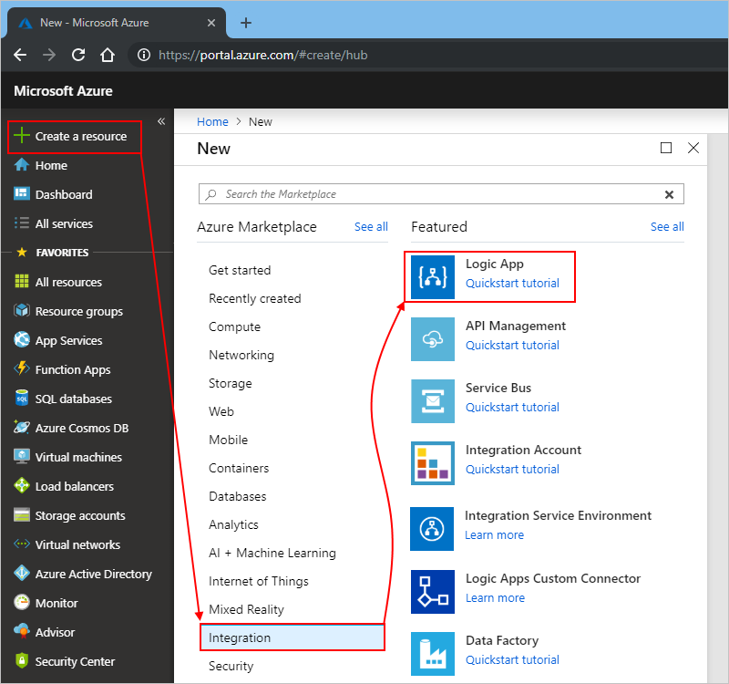

1. Under **Logic App**, provide information about your logic app. 
When you're done, choose **Create**.

   

   | Property | Suggested value | Description |
   | -------- | --------------- | ----------- |
   | **Name** | <*logic-app-name*> | Provide a unique name for your logic app. |
   | **Subscription** | <*Azure-subscription-name*> | Select the same Azure subscription for all services in this tutorial. |
   | **Resource group** | <*Azure-resource-group*> | Select the same Azure resource group for all services in this tutorial. |
   | **Location** | <*Azure-datacenter-region*> | Select the same region for all services in this tutorial. |
   |||

   You've now created an Azure resource for your logic app. 

1. After Azure deploys your logic app, the Logic Apps Designer 
shows a page with an introduction video and commonly used triggers. 
Scroll past the video and triggers. 

1. Under **Templates**, choose **Blank Logic App**.

   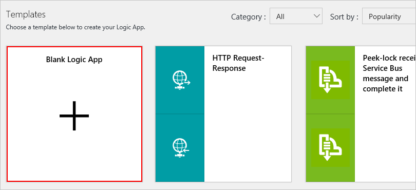

   The Logic Apps Designer now shows you [*triggers*](../logic-apps/logic-apps-overview.md#logic-app-concepts) that you can use to 
   start your logic app. Every logic app must start with a trigger, 
   which fires when a specific event happens or when a specific condition is met. 
   Each time the trigger fires, Azure Logic Apps creates a workflow instance 
   that runs your logic app.

## Add Event Grid trigger 

Now, add the Event Grid trigger that monitors the resource group for your virtual machine. 

1. On the designer, in the search box, enter "event grid" as your filter. 
From the triggers list, select this trigger: **When a resource event occurs - Azure Event Grid**

   

1. When prompted, sign in to Azure Event Grid with your Azure account credentials. 
In the **Tenant** list, which shows the Azure Active Directory tenant that's associated with your Azure subscription, check that the correct tenant appears.

   

   > [!NOTE]
   > If you're signed in with a personal Microsoft account, 
   > such as @outlook.com or @hotmail.com, 
   > the Event Grid trigger might not appear correctly. 
   > As a workaround, choose [Connect with Service Principal](../active-directory/develop/howto-create-service-principal-portal.md), 
   > or authenticate as a member of the Azure Active Directory 
   > that's associated with your Azure subscription, for example, 
   > *user-name*@emailoutlook.onmicrosoft.com.

1. Now subscribe your logic app to publisher events. 
Provide the details for your event subscription 
as specified in the following table:

   

   | Property | Required | Value | Description |
   | -------- | -------- | ----- | ----------- |
   | **Subscription** | Yes | <*event-publisher-Azure-subscription-name*> | Select the name for the Azure subscription associated with the event publisher. For this tutorial, select the Azure subscription name for your virtual machine. |
   | **Resource Type** | Yes | <*event-publisher-Azure-resource-type*> | Select the resource type for the event publisher. For this tutorial, select this value so that your logic app monitors only resource groups: 

**Microsoft.Resources.resourceGroups** |
   | **Resource Name** |  Yes | <*event-publisher-Azure-resource-name*> | Select the name for the Azure resource associated with the event publisher. For example, this resource might be an Event Grid topic. For this tutorial, select the name for the Azure resource group associated with for your virtual machine. |
   | **Event Type Item** |  No | <*event-types*> | Select one or more specific event types that you want to monitor. For this tutorial, leave this property empty. |
   | **Subscription Name** | No | <*event-subscription-name*> | Provide a unique name for your event subscription. |
   | For optional settings, choose **Add new parameter**. | No | {see descriptions} | * **Prefix Filter**: For this tutorial, leave this property empty. The default behavior matches all values. However, you can specify a prefix string as a filter, for example, a path and a parameter for a specific resource. 
* **Suffix Filter**: For this tutorial, leave this property empty. The default behavior matches all values. However, you can specify a suffix string as a filter, for example, a file name extension, when you want only specific file types. |
   |||

   When you're done, your Event Grid trigger might look like this example:
   
   

1. Save your logic app. On the designer toolbar, choose **Save**. 
To collapse and hide an action's details in your logic app, 
choose the action's title bar.

   

   When you save your logic app with an event grid trigger, 
   Azure automatically creates an event subscription for your 
   logic app to your selected resource. So when the resource 
   publishes an event to the event grid, that event grid automatically 
   pushes the event to your logic app. This event triggers your logic app, 
   then creates and runs an instance of the workflow that you define in these next steps.

Your logic app is now live and listens to events from the event grid, 
but doesn't do anything until you add actions to the workflow. 

## Add condition

To run your logic app workflow only when a specific event happens, 
add a condition that checks for virtual machine "write" operations. 
When this condition is true, your logic app sends you email with 
details about the updated virtual machine.

1. In Logic App Designer, under the event grid trigger, 
choose **New step**.

   

1. In the search box, enter "condition" as your filter. 
From the actions list, select this action: **Condition**

   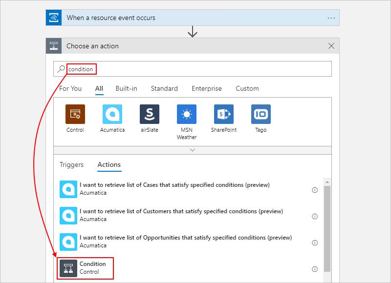

   The Logic App Designer adds an empty condition to your workflow, 
   including action paths to follow based whether the 
   condition is true or false.

   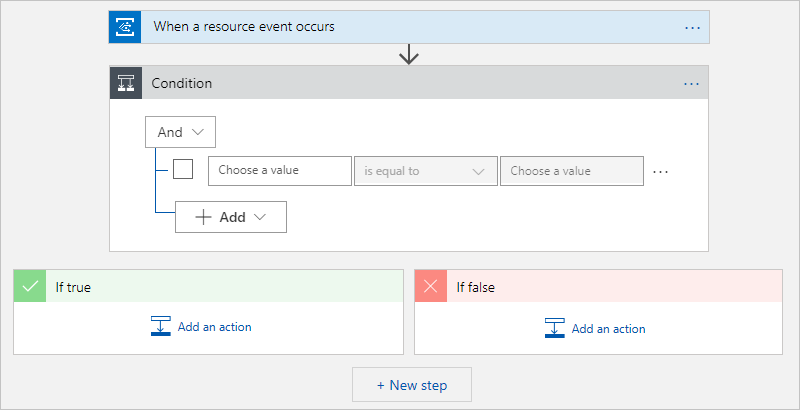

1. Rename the condition title to `If a virtual machine in your resource group has changed`. On the condition's title bar, choose the ellipses (**...**) button, and select **Rename**.

   

1. Create a condition that checks the event `body` for a `data` object where the `operationName` property is equal to the `Microsoft.Compute/virtualMachines/write` operation. Learn more about [Event Grid event schema](../event-grid/event-schema.md).

   1. On the first row under **And**, click inside the left box. In the dynamic content list that appears, choose **Expression**.

      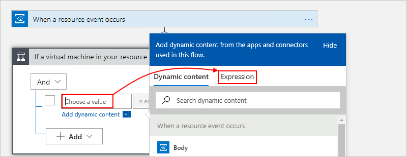

   1. In the expression editor, enter this expression, and choose **OK**: 

      `triggerBody()?['data']['operationName']`

      For example:

      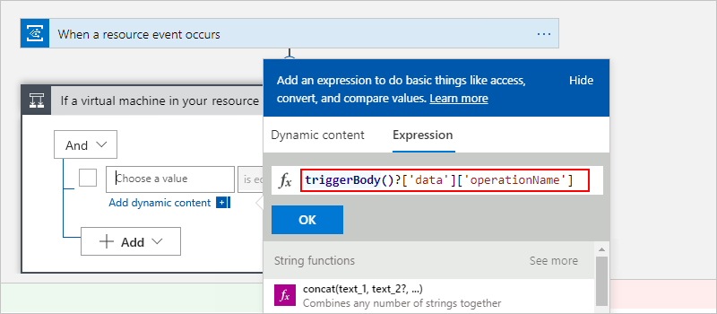

   1. In the middle box, keep the operator **is equal to**.

   1. In the right box, enter this value:

      `Microsoft.Compute/virtualMachines/write`

   Your finished condition now looks like this example:

   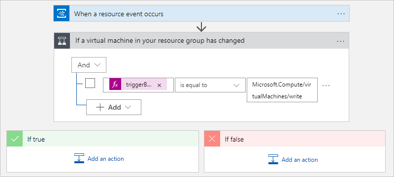

1. Save your logic app.

## Send email notifications

Now add an [*action*](../logic-apps/logic-apps-overview.md#logic-app-concepts) 
so that you get an email when the specified condition is true.

1. In the condition's **If true** box, choose **Add an action**.

   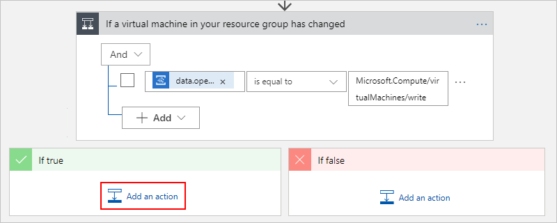

1. In the search box, enter "send an email" as your filter. 
Based on your email provider, find and select the matching connector. 
Then select the "send email" action for your connector. 
For example: 

   * For an Azure work or school account, 
   select the Office 365 Outlook connector. 

   * For personal Microsoft accounts, 
   select the Outlook.com connector. 

   * For Gmail accounts, select the Gmail connector. 

   This tutorial continues with the Office 365 Outlook connector. 
   If you use a different provider, the steps remain the same, 
   but your UI might appear slightly different. 

   

1. If you don't already have a connection for your email provider, 
sign in to your email account when you're asked for authentication.

1. Rename the send email title to this title: `Send email when virtual machine updated`. 

1. Provide details for the email as specified in the following table:

   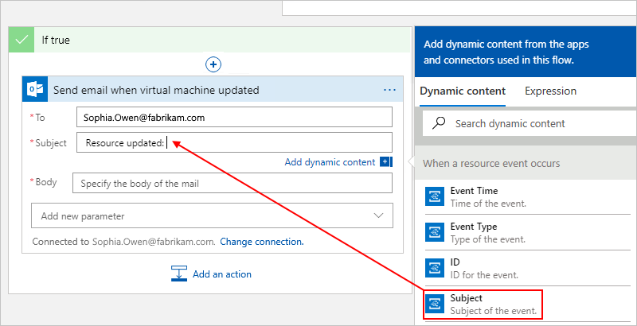

   > [!TIP]
   > To select from results from previous steps in your workflow, 
   > click in an edit box so that the dynamic content list appears, 
   > or choose **Add dynamic content**. 
   > For more results, choose **See more** for each section in the list. 
   > To close the dynamic content list, choose **Add dynamic content** again.

   | Property | Required | Value | Description |
   | -------- | -------- | ----- | ----------- |
   | **To** | Yes | <*recipient@domain*> | Enter the recipient's email address. For testing purposes, you can use your own email address. |
   | **Subject** | Yes | Resource updated: **Subject** | Enter the content for the email's subject. For this tutorial, enter the specified text, and select the event's **Subject** field. Here, your email subject includes the name for the updated resource (virtual machine). |
   | **Body** | Yes | Resource group: **Topic** 
Event type: **Event Type**
Event ID: **ID**
Time: **Event Time** | Enter the content for the email's body. For this tutorial, enter the specified text and select the event's **Topic**, **Event Type**, **ID**, and **Event Time** fields so that your email includes the resource group name, event type, event timestamp, and event ID for the update. 
To add blank lines in your content, press Shift + Enter. |
   ||||

   > [!NOTE] 
   > If you select a field that represents an array, 
   > the designer automatically adds a **For each** loop 
   > around the action that references the array. 
   > That way, your logic app performs that action on each array item.

   Now, your email action might look like this example:

   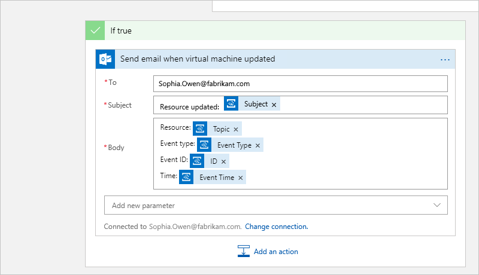

   And your finished logic app might look like this example:

   

1. Save your logic app. To collapse and hide each action's 
details in your logic app, choose the action's title bar.

   Your logic app is now live, but waits for changes 
   to your virtual machine before doing anything. 
   To test your logic app now, continue to the next section.

## Test your logic app workflow

1. To check that your logic app is getting the specified events, 
update your virtual machine.

   For example, you can resize your virtual machine in the Azure portal 
   or [resize your VM with Azure PowerShell](../virtual-machines/windows/resize-vm.md).

   After a few moments, you should get an email. For example:

   

1. To review the runs and trigger history for your logic app, 
on your logic app menu, select **Overview**. 
To view more details about a run, select the row for that run.

   

1. To view the inputs and outputs for each step, 
expand the step that you want to review. 
This information can help you diagnose and debug 
problems in your logic app.

   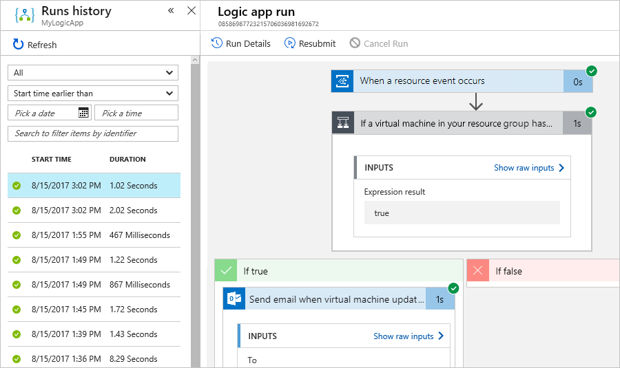

Congratulations, you've created and run a logic app 
that monitors resource events through an event 
grid and emails you when those events happen. 
You also learned how easily you can create workflows 
that automate processes and integrate systems and cloud services.

You can monitor other configuration changes with 
event grids and logic apps, for example:

* A virtual machine gets role-based access control (RBAC) rights.
* Changes are made to a network security group (NSG) on a network interface (NIC).
* Disks for a virtual machine are added or removed.
* A public IP address is assigned to a virtual machine NIC.

## Clean up resources

This tutorial uses resources and performs actions that incur 
charges on your Azure subscription. 
So when you're done with the tutorial and testing, 
make sure that you disable or delete any resources 
where you don't want to incur charges.

* To stop running your logic app without deleting your work, 
disable your app. On your logic app menu, select **Overview**. 
On the toolbar, choose **Disable**.

  

  > [!TIP]
  > If you don't see the logic app menu, 
  > try returning to the Azure dashboard, 
  > and reopen your logic app.

* To permanently delete your logic app, on the logic app menu, 
select **Overview**. On the toolbar, choose **Delete**. 
Confirm that you want to delete your logic app, and choose **Delete**.

## Next steps

* [Create and route custom events with Event Grid](../event-grid/custom-event-quickstart.md)
