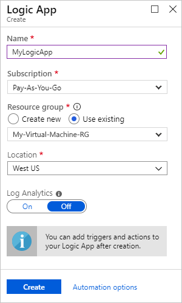
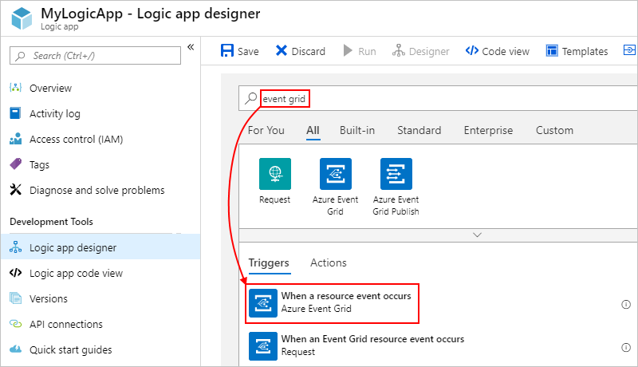
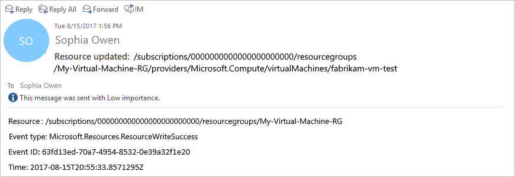
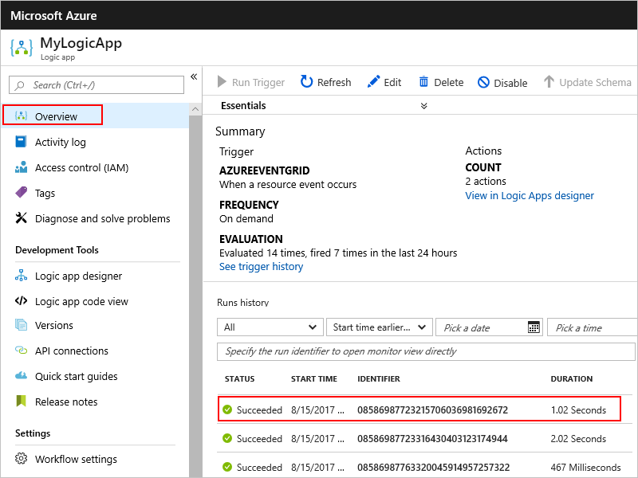

# Monitor virtual machine changes with Azure Event Grid and Logic Apps

You can start an automated [logic app workflow](../logic-apps/logic-apps-what-are-logic-apps.md) 
when specific events happen in Azure resources or third-party resources. 
These resources can publish those events to an [Azure event grid](../event-grid/overview.md). 
In turn, the event grid pushes those events to subscribers that have queues, 
webhooks, or [event hubs](../event-hubs/event-hubs-what-is-event-hubs.md) as endpoints. 
As a subscriber, your logic app can wait for those events from the event grid 
before running automated workflows to perform tasks - without you writing code.

For example, here are some events that publishers can send 
to subscribers through the Azure Event Grid service:

* Create, read, update, or delete a resource. 
For example, you can monitor changes that might 
incur charges on your Azure subscription and affect your bill. 
* Add or remove a person from an Azure subscription.
* Your app performs a particular action.
* A new message appears in a queue.

This tutorial creates a logic app that monitors changes 
to a virtual machine and sends emails about those changes. 
When you create a logic app with an event subscription for an Azure resource, 
events flow from that resource through an event grid to the logic app. 
The tutorial walks you through building this logic app:

In this tutorial, you learn how to:

> [!div class="checklist"]
> * Create a logic app that monitors events from an event grid.
> * Add a condition that specifically checks for virtual machine changes.
> * Send email when your virtual machine changes.

## Prerequisites

* An email account from 
[any email provider supported by Azure Logic Apps](../connectors/apis-list.md), 
such as Office 365 Outlook, Outlook.com, or Gmail, for sending notifications. 
This tutorial uses Office 365 Outlook.

* A [virtual machine](https://azure.microsoft.com/services/virtual-machines). 
If you haven't already done so, create a virtual machine through a 
[Create a VM tutorial](https://docs.microsoft.com/azure/virtual-machines/). 
To make the virtual machine publish events, 
you [don't need to do anything else](../event-grid/overview.md).

## Create a logic app that monitors events from an event grid

First, create a logic app and add an Event grid trigger that 
monitors the resource group for your virtual machine. 

1. Sign in to the [Azure portal](https://portal.azure.com). 

2. From the upper left corner of the main Azure menu, 
choose **New** > **Enterprise Integration** > **Logic App**.

   

3. Create your logic app with the settings 
specified in the following table:

   

   | Setting | Suggested value | Description | 
   | ------- | --------------- | ----------- | 
   | **Name** | *{your-logic-app-name}* | Provide a unique logic app name. | 
   | **Subscription** | *{your-Azure-subscription}* | Select the same Azure subscription for all services in this tutorial. | 
   | **Resource group** | *{your-Azure-resource-group}* | Select the same Azure resource group for all services in this tutorial. | 
   | **Location** | *{your-Azure-region}* | Select the same region for all services in this tutorial. | 
   | | | 

4. When you're ready, select **Pin to dashboard**, and choose **Create**.

   You've now created an Azure resource for your logic app. 
   After Azure deploys your logic app, the Logic Apps Designer 
   shows you templates for common patterns so you can get started faster.

   > [!NOTE] 
   > When you select **Pin to dashboard**, 
   > your logic app automatically opens in Logic Apps Designer. 
   > Otherwise, you can manually find and open your logic app.

5. Now choose a logic app template. 
Under **Templates**, choose **Blank Logic App** 
so you can build your logic app from scratch.

   

   The Logic Apps Designer now shows you [*connectors*](../connectors/apis-list.md) 
   and [*triggers*](../logic-apps/logic-apps-what-are-logic-apps.md#logic-app-concepts) 
   that you can use to start your logic app, and also actions that you can 
   add after a trigger to perform tasks. A trigger is an event that creates 
   a logic app instance and starts your logic app workflow. 
   Your logic app needs a trigger as the first item.

6. In the search box, enter "event grid" as your filter. 
Select this trigger: **Azure Event Grid - On a resource event**

   

7. When prompted, sign in to Azure Event Grid 
with your Azure credentials.

   

   > [!NOTE]
   > If you're signed in with a personal Microsoft account, 
   > such as @outlook.com or @hotmail.com, 
   > the Event Grid trigger might not appear correctly. 
   > As a workaround, choose [Connect with Service Principal](/azure-resource-manager/resource-group-create-service-principal-portal.md), 
   > or authenticate as a member of the Azure Active Directory 
   > that's associated with your Azure subscription, for example, 
   > *user-name*@emailoutlook.onmicrosoft.com.

8. Now subscribe your logic app to publisher events. 
Provide the details for your event subscription 
as specified in the following table:

   

   | Setting | Suggested value | Description | 
   | ------- | --------------- | ----------- | 
   | **Subscription** | *{virtual-machine-Azure-subscription}* | Select the event publisher's Azure subscription. For this tutorial, select the Azure subscription for your virtual machine. | 
   | **Resource Type** | Microsoft.Resources.resourceGroups | Select the event publisher's resource type. For this tutorial, select the specified value so your logic app monitors only resource groups. | 
   | **Resource Name** | *{virtual-machine-resource-group-name}* | Select the publisher's resource name. For this tutorial, select the name of the resource group for your virtual machine. | 
   | For optional settings, choose **Show advanced options**. | *{see descriptions}* | * **Prefix Filter**: For this tutorial, leave this setting empty. The default behavior matches all values. However, you can specify a prefix string as a filter, for example, a path and a parameter for a specific resource. 
* **Suffix Filter**: For this tutorial, leave this setting empty. The default behavior matches all values. However, you can specify a suffix string as a filter, for example, a file name extension, when you want only specific file types.
* **Subscription Name**: Provide a unique name for your event subscription. |
   | | | 

   When you're done, your event grid trigger might look like this example:
   
   

9. Save your logic app. On the designer toolbar, choose **Save**. 
To collapse and hide an action's details in your logic app, 
choose the action's title bar.

   

   When you save your logic app with an event grid trigger, 
   Azure automatically creates an event subscription for your 
   logic app to your selected resource. So when the resource 
   publishes an event to the event grid, that event grid automatically 
   pushes the event to your logic app. This event triggers your logic app, 
   then creates and runs an instance of the workflow that you define in these next steps.

Your logic app is now live and listens to events from the event grid, 
but doesn't do anything until you add actions to the workflow. 

## Add a condition that checks for virtual machine changes

To run your logic app workflow only when a specific event happens, 
add a condition that checks for virtual machine "write" operations. 
When this condition is true, your logic app sends you email with 
details about the updated virtual machine.

1. In Logic App Designer, under the event grid trigger, 
choose **New step** > **Add a condition**.

   

   The Logic App Designer adds an empty condition to your workflow, 
   including action paths to follow based whether the 
   condition is true or false.

   

2. In the **Condition** box, choose **Edit in advanced mode**.
Enter this expression:

   `@equals(triggerBody()?['data']['operationName'], 'Microsoft.Compute/virtualMachines/write')`

   Your condition now looks like this example:

   

   This expression checks the event `body` for a `data` object 
   where the `operationName` property is the 
   `Microsoft.Compute/virtualMachines/write` operation. 
   Learn more about [Event Grid event schema](../event-grid/event-schema.md).

3. To provide a description for the condition, 
choose the **ellipses** (**...**) button on the condition shape, 
then choose **Rename**.

   > [!NOTE] 
   > The later examples in this tutorial also provide 
   > descriptions for steps in the logic app workflow.

4. Now choose **Edit in basic mode** so that the expression 
automatically resolves as shown:

   

5. Save your logic app.

## Send email when your virtual machine changes

Now add an [*action*](../logic-apps/logic-apps-what-are-logic-apps.md#logic-app-concepts) 
so that you get an email when the specified condition is true.

1. In the condition's **If true** box, choose **Add an action**.

   

2. In the search box, enter "email" as your filter. 
Based on your email provider, find and select the matching connector. 
Then select the "send email" action for your connector. 
For example: 

   * For an Azure work or school account, 
   select the Office 365 Outlook connector. 
   * For personal Microsoft accounts, 
   select the Outlook.com connector. 
   * For Gmail accounts, select the Gmail connector. 

   We're going to continue with the Office 365 Outlook connector. 
   If you use a different provider, the steps remain the same, 
   but your UI might appear different. 

   

3. If you don't already have a connection for your email provider, 
sign in to your email account when you're asked for authentication.

4. Provide details for the email 
as specified in the following table:

   

   > [!TIP]
   > To select from fields available in your workflow, 
   > click in an edit box so that the **Dynamic content** list opens, 
   > or choose **Add dynamic content**. 
   > For more fields, choose **See more** for each section in the list. 
   > To close the **Dynamic content** list, choose **Add dynamic content**.

   | Setting | Suggested value | Description | 
   | ------- | --------------- | ----------- | 
   | **To** | *{recipient-email-address}* |Enter the recipient's email address. For testing purposes, you can use your own email address. | 
   | **Subject** | Resource updated: **Subject**| Enter the content for the email's subject. For this tutorial, enter the suggested text and select the event's **Subject** field. Here, your email subject includes the name for the updated resource (virtual machine). | 
   | **Body** | Resource group: **Topic** 
Event type: **Event Type**
Event ID: **ID**
Time: **Event Time** | Enter the content for the email's body. For this tutorial, enter the suggested text and select the event's **Topic**, **Event Type**, **ID**, and **Event Time** fields so that your email includes the resource group name, event type, event timestamp, and event ID for the update. 
To add blank lines in your content, press Shift + Enter. | 
   | | | 

   > [!NOTE] 
   > If you select a field that represents an array, 
   > the designer automatically adds a **For each** loop 
   > around the action that references the array. 
   > That way, your logic app performs that action on each array item.

   Now, your email action might look like this example:

   

   And your finished logic app might look like this example:

   

5. Save your logic app. To collapse and hide each action's 
details in your logic app, choose the action's title bar.

   

   Your logic app is now live, but waits for changes 
   to your virtual machine before doing anything. 
   To test your logic app now, continue to the next section.

## Test your logic app workflow

1. To check that your logic app is getting the specified events, 
update your virtual machine. 

   For example, you can resize your virtual machine in the Azure portal 
   or [resize your VM with Azure PowerShell](../virtual-machines/windows/resize-vm.md). 

   After a few moments, you should get an email. For example:

   

2. To review the runs and trigger history for your logic app, 
on your logic app menu, choose **Overview**. 
To view more details about a run, choose the row for that run.

   

3. To view the inputs and outputs for each step, 
expand the step that you want to review. 
This information can help you diagnose and debug 
problems in your logic app.
 
   

Congratulations, you've created and run a logic app 
that monitors resource events through an event 
grid and emails you when those events happen. 
You also learned how easily you can create workflows 
that automate processes and integrate systems and cloud services.

## Clean up resources

This tutorial uses resources and performs actions that incur 
charges on your Azure subscription. 
So when you're done with the tutorial and testing, 
make sure that you disable or delete any resources 
where you don't want to incur charges.

You can stop your logic app from running and sending email 
without deleting the app. On your logic app menu, 
choose **Overview**. On the toolbar, choose **Disable**.

## FAQ

**Q**: What other virtual machine monitoring tasks can I perform with event grids and logic apps?  
**A**: You can monitor other configuration changes, for example:

* A virtual machine gets role-based access control (RBAC) rights.
* Changes are made to a network security group (NSG) on a network interface (NIC).
* Disks for a virtual machine are added or removed.
* A public IP address is assigned to a virtual machine NIC.

## Next steps

* [Event Grid Overview](../event-grid/overview.md)
* [Event Grid Concepts](../event-grid/concepts.md)
* [Quickstart: Create and route custom events with Event Grid](../event-grid/custom-event-quickstart.md)
* [Event Grid event schema](../event-grid/event-schema.md)
* [Azure Logic Apps](../logic-apps/logic-apps-what-are-logic-apps.md)
* [Create logic app workflows with predefined templates](../logic-apps/logic-apps-use-logic-app-templates.md)