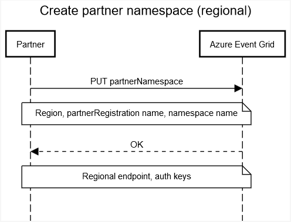
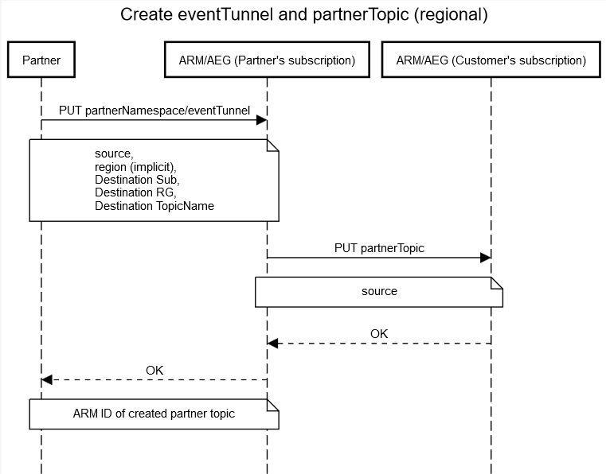

## Prerequisites

1. Please contact Azure Event Grid team (askgrid@microsoft.com) with a list of Azure subscriptions to be whitelisted in order to be allowed to try this feature. 
1. As of 01/15/2020, partner topic support is available in centraluseuap only; hence this sample code can used in this region only.
1. The following resources are expected to be pre-created and ready to be used:
    * At least one valid Azure Subscription, although the scenario is designed for three different Azure Subscriptions to be used for partner registration, namespaces/eventchannels, and partner topics, respectively. The first two Azure subscriptions are expected to be owned by the partner and the last one is owned by the user/customer.
    * At least one valid resource group. Similar to the Azure Subscriptions point above in 3.a, the scenario is also designed for three different resource groups, one for each Azure Subscription, to be used for partner registration, namespaces/eventchannels, and partner topics, respectively.

    The first two Azure subscriptions/Resource Groups are expected to be owned by the partner and the last one is owned by the user/customer.
1. Registrered App Id, and tenant Id. For simplicity, this console app assumes the same for both partner and customer but code can be updated to allow different values.
1. Valid certificate which is associated with the AppId to be installed on the machine.
1. Valid storage account and storage queue to be used as an event subscription destination. Here is a link for doing that using portal https://docs.microsoft.com/en-us/azure/storage/queues/storage-quickstart-queues-portal and cli https://docs.microsoft.com/en-us/cli/azure/storage/queue?view=azure-cli-latest
1. Fill out these required information in the App.Config file. Each entry is marked with Placeholder in the comment in the App.Config file.
1. Open the project using Visual Studio 2017 or higher. Build and run.
## Scenario Flow

The overall flow of the scenario demoed in the sample code is:

1. Create Partner Topic (owner: Partner)

2. Create Partner Namespace (owner: Partner)

3. Create Event Channel (owner: Partner)

4. Activate Partner Topic (owner: customer)

5. Create Event Subscription on Partner Topic (owner: customer)