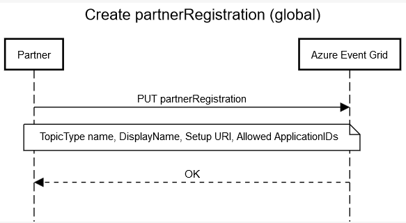
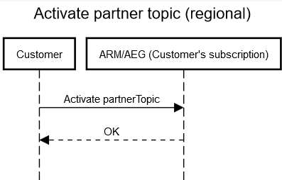

# Become and Event Grid partner

This article describes how to privately use the Event Grid partner resources and how to become a publicly available Partner Topic Type.

You don't need special permission to begin using the Event Grid resource types associated with publishing events as an Event Grid partner. In fact, you can use them today both to publish events privately to your own Azure Subscriptions, and to test out the resource model if you're considering becoming a partner.

## Becoming an Event Grid partner

If you're interested in becoming a public Event Grid partner, begin by filling out [this form](https://aka.ms/gridpartnerform), and then contacting the Event Grid team at [GridPartner@microsoft.com](mailto:gridpartner@microsoft.com).

## How partner topics work
Partner Topics take the existing architecture that Event Grid already uses in to publish events from Azure resoruces such as Storage and IoT Hub, and makes those tools publicly available for anyone to use. Using these tools is by default private to your Azure Subscription only. To make your events publicly available, fill out the above form and [contact the Event Grid team](mailto:gridpartner@microsoft.com).

Partner topics allow you to publish events to Azure Event Grid for multitenant consumption.

### Onboarding and event publishing overview

#### Partner flow

1. Create an Azure tenant if you don't already have one.
1. Using CLI create a new Event Grid `partnerRegistration`. This resource includes information such as display name, description, setup URI and so on. 

1. Create one or more `partnerNamespaces` in each region you want to publish events. As part of this, Event Grid service will provision a publishing endpoint (for example, https://contoso.westus-1.eventgrid.azure.net/api/events) and access keys.

1. Provide a way for customers to register in your system that they would like a partner topic.
1. Contact the Event Grid team to let us know you would like your Partner Topic Type to become public.

#### Customer flow

1. Your customer will visit the Azure Portal to note the Azure Subscription ID and Resource Group they would like the Partner Topic created in.
1. The customer will request a Partner Topic via your system. In response, you'll create an Event Tunnel your Partner Namespace.
1. Event Grid will create a **Pending** Partner Topic in the customer's Azure Subscription and Resoruce Group.

1. The customer activates the Partner Topic via the Azure Portal. Events may now flow from your service to the customer's Azure Subscription.


## Resource Model

Below is the resource model for Partner Topics.

### Partner Registrations
* Resource: `partnerRegistrations`
* Used by: Partners
* Description: Captures the global metadata of the SaaS partner (for example, name, display name, description, setup URI).
    
    Creating/updating a partner registration is a self-serve operation for the partners. This self-serve ability enables partners to build and test the complete end to end flow.
    
    Only Microsoft approved partnerRegistrations are discoverable by customers.
* Scope: Created in partner's Azure Subscription. Metadata visible to customers once public.

### Event Types
* Resource: `partnerRegistrations/eventTypes`
* Used by: Partners
* Description: Captures metadata about event types supported by a partner registration.
* Scope: Discoverable by customers once made public. Lives in a partner’s subscription as a child resource of Partner Registration.
		

### Partner Namespaces
* Resource: partnerNamespaces
* Used by: Partners
* Description: Provides a regional resource for publishing customer events to. Each Partner Namespace has a publishing endpoint and auth keys. The namespace is also how the partner requests a Partner Topic for a given customer and lists active customers.
* Scope: Lives in partner’s subscription.

### Event Tunnels
* Resource: `partnerNamespaces/eventTunnels`
* Used by: Partners
* Description: The Event Tunnels are a mirror of the customer's Partner Topic. By creating an Event Tunnel and specifying the customer's Azure Subscription and resource Group in the metadata, you're signaling to Event Grid to create a Partner Topic for the customer. Event Grid will issue an ARM call to create a corresponding partnerTopic in the customer’s subscription. The partner topic will be created in a "pending" state. There’s a 1-1 link between each eventTunnel and a partnerTopic.
* Scope: Lives in partner’s subscription.

### Partner Topics
* Resource: `partnerTopics`
* Used by: Customers
* Description: Partner Topics are similar to Custom Topic and System topic in Event Grid. Each Partner Topic is associated with a specific “source” (for example, `Contoso:myaccount`) and a specific partner topic type  (for example, “Contoso”). Customers create Event Subscriptions on the Partner Topic to route events to various event handlers.

    Customers can't directly create this resource. The only way to create a Partner Topic is through a partner operation creating an Event Tunnel.
* Scope: Lives in customer’s subscription.

### Partner Topic Types
* Resource: `partnerTopicTypes`
* Used by: Customers
* Description: Partner Topic Types are tenant-wide resource types that enable customers to discover the list of approved partner topic types. The URL will look as follows: https://management.azure.com/providers/Microsoft.EventGrid/partnerTopicTypes)
* Scope: Global

## Publishing Events to Event Grid
When you create a partnerNamespace in an Azure region, you'll get a regional endpoint and corresponding auth keys. Publish batches of events to this endpoint for all customer Event Tunnels in that namespace. Based on the “source” field in the event, Azure Event Grid will map each event with the corresponding partner topic(s).

### Event Schema: CloudEvents v1.0
Publish events to Azure Event Grid using the CloudEvents 1.0 schema. Event Grid supports both structured mode and batched mode. CloudEvents 1.0 is the only supported event schema for Partner Namespaces.

### Example Flow

1.	The publishing service does an HTTP POST to https://contoso.westus2-1.eventgrid.azure.net/api/events?api-version=2018-01-01.
2.	In the request, include a header value named aeg-sas-key that contains a key for authentication. This key is provisioned during the creation of the partnerNamespace. For example, a valid header value is aeg-sas-key: VXbGWce53249Mt8wuotr0GPmyJ/nDT4hgdEj9DpBeRr38arnnm5OFg==.
3.	Set the Content-Type header to “application/cloudevents-batch+json; charset=UTF-8”.
4.	Perform an HTTP POST to the above publish URL with a batch of events corresponding to that region. For example:

``` json
[
{
    "specversion" : "1.0-rc1",
    "type" : "com.contoso.ticketcreated",
    "source" : " com.contoso.account1",
    "subject" : "tickets/123",
    "id" : "A234-1234-1234",
    "time" : "2019-04-05T17:31:00Z",
    "comexampleextension1" : "value",
    "comexampleothervalue" : 5,
    "datacontenttype" : "application/json",
    "data" : {
          object-unique-to-each-publisher
    }
},
{
    "specversion" : "1.0-rc1",
    "type" : "com.contoso.ticketclosed",
    "source" : "https://contoso.com/account2",
    "subject" : "tickets/456",
    "id" : "A234-1234-1234",
    "time" : "2019-04-05T17:31:00Z",
    "comexampleextension1" : "value",
    "comexampleothervalue" : 5,
    "datacontenttype" : "application/json",
    "data" : {
          object-unique-to-each-publisher
    }
}
]
```

After posting to the partnerNamespace endpoint, you'll receive a response. The response is a standard HTTP response code. Some common responses are:
|Result | Response |
|-------|----------|
| Success | 200 OK |
| Event data has incorrect format | 400 Bad Request |
| Invalid access key | 401 Unauthorized |
| Incorrect endpoint | 404 Not Found |
| Array or event exceeds size limits | 413 Payload Too Large |

## Reference

  * [Swagger](https://github.com/ahamad-MS/azure-rest-api-specs/blob/master/specification/eventgrid/resource-manager/Microsoft.EventGrid/preview/2020-04-01-preview/EventGrid.json)
  * [ARM Template](https://docs.microsoft.com/azure/templates/microsoft.eventgrid/allversions)
  * [ARM Temaplate schema](https://github.com/Azure/azure-resource-manager-schemas/blob/master/schemas/2020-04-01-preview/Microsoft.EventGrid.json)
  * [REST APIs](https://docs.microsoft.com/rest/api/eventgrid/partnernamespaces)
  * [CLI Extension](https://docs.microsoft.com/cli/azure/ext/eventgrid/?view=azure-cli-latest)

### SDKs
  * [.Net](https://www.nuget.org/packages/Microsoft.Azure.Management.EventGrid/5.3.1-preview)
  * [Python](https://pypi.org/project/azure-mgmt-eventgrid/3.0.0rc6/)
  * [Java](https://search.maven.org/artifact/com.microsoft.azure.eventgrid.v2020_04_01_preview/azure-mgmt-eventgrid/1.0.0-beta-3/jar)
  * [Ruby](https://rubygems.org/gems/azure_mgmt_event_grid/versions/0.19.0)
  * [JS](https://www.npmjs.com/package/@azure/arm-eventgrid/v/7.0.0)
  * [Go](https://github.com/Azure/azure-sdk-for-go)


## Next Steps
- [Partner Topics overview](partner-topics-overview.md)
- [Partner Topics onboarding form](https://aka.ms/gridpartnerform)
- [Auth0 Partner Topic](auth0-overview.md)
- [How to use the Auth0 Partner Topic](auth0-how-to.md)
