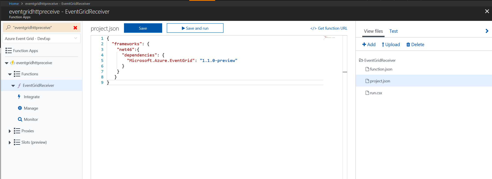
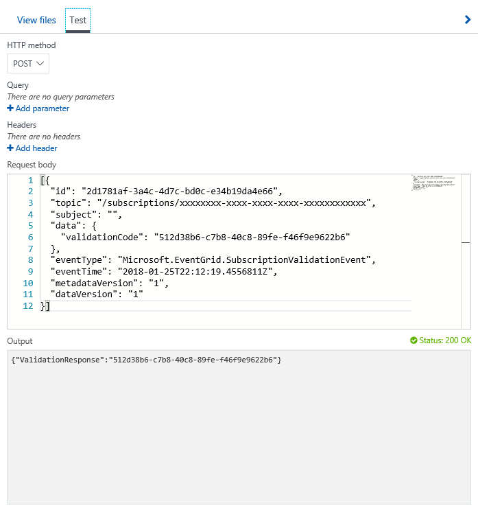
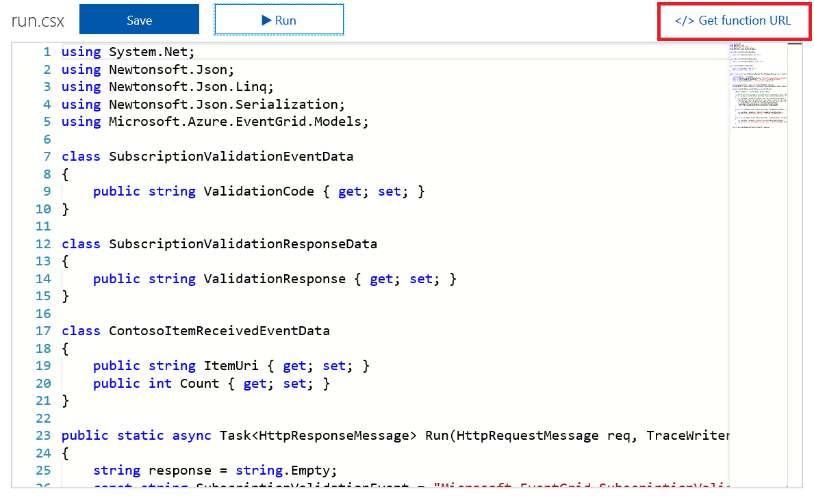

# Receive events to an HTTP endpoint

This article describes how to [validate an HTTP endpoint](security-authentication.md#webhook-event-delivery) to receive events from an Event Subscription and then receive and deserialize events. This article uses an Azure Function for demonstration purposes, however the same concepts apply regardless of where the application is hosted.

> [!NOTE]
> It is **strongly** recommended that you use an [Event Grid Trigger](../azure-functions/functions-bindings-event-grid.md) when triggering an Azure Function with Event Grid. The use of a generic WebHook trigger here is demonstrative.

## Prerequisites

* You'll need a function app with an [HTTP triggered function](../azure-functions/functions-create-generic-webhook-triggered-function.md)

## Add dependencies

If you're developing in .NET, [add a dependency](../azure-functions/functions-reference-csharp.md#referencing-custom-assemblies) to your function for the `Microsoft.Azure.EventGrid` [Nuget package](https://www.nuget.org/packages/Microsoft.Azure.EventGrid). The examples in this article require version 1.4.0 or later.

SDKs for other languages are available via the [Publish SDKs](./sdk-overview.md#data-plane-sdks) reference. These packages have the models for native event types such as `EventGridEvent`, `StorageBlobCreatedEventData`, and `EventHubCaptureFileCreatedEventData`.

Click on the "View Files" link in your Azure Function (right most pane in the Azure functions portal), and create a file called project.json. Add the following contents to the `project.json` file and save it:

 ```json
{
  "frameworks": {
    "net46":{
      "dependencies": {
        "Microsoft.Azure.EventGrid": "1.4.0"
      }
    }
   }
}
```



## Endpoint validation

The first thing you want to do is handle `Microsoft.EventGrid.SubscriptionValidationEvent` events. Every time someone subscribes to an event, Event Grid sends a validation event to the endpoint with a `validationCode` in the data payload. The endpoint is required to echo this back in the response body to [prove the endpoint is valid and owned by you](security-authentication.md#webhook-event-delivery). If you're using an [Event Grid Trigger](../azure-functions/functions-bindings-event-grid.md) rather than a WebHook triggered Function, endpoint validation is handled for you. If you use a third-party API service (like [Zapier](https://zapier.com) or [IFTTT](https://ifttt.com/)), you might not be able to programmatically echo the validation code. For those services, you can manually validate the subscription by using a validation URL that is sent in the subscription validation event. Copy that URL in the `validationUrl` property and send a GET request either through a REST client or your web browser.

Manual validation is in preview. To use it, you must install the [Event Grid extension](/cli/azure/azure-cli-extensions-list) for [Azure CLI](/cli/azure/install-azure-cli). You can install it with `az extension add --name eventgrid`. If you're using the REST API, make sure you're using `api-version=2018-05-01-preview`.

In C#, the `DeserializeEventGridEvents()` function deserializes the Event Grid events. For first-party events (not custom events), it deserializes the event data into the appropriate type, such as StorageBlobCreatedEventData. Use the `Microsoft.Azure.EventGrid.EventTypes` class to get supported event types and names.

To programmatically echo the validation code, use the following code. You can find related samples at [Event Grid Consumer example](https://github.com/Azure-Samples/event-grid-dotnet-publish-consume-events/tree/master/EventGridConsumer).

```csharp
using System.Net;
using Newtonsoft.Json;
using Newtonsoft.Json.Serialization;
using Microsoft.Azure.EventGrid.Models;
using Microsoft.Azure.EventGrid;

public static async Task<HttpResponseMessage> Run(HttpRequestMessage req, TraceWriter log)
{

    log.Info($"C# HTTP trigger function begun");
    string response = string.Empty;

    string requestContent = await req.Content.ReadAsStringAsync();
    log.Info($"Received events: {requestContent}");

    EventGridSubscriber eventGridSubscriber = new EventGridSubscriber();

    EventGridEvent[] eventGridEvents = eventGridSubscriber.DeserializeEventGridEvents(requestContent);

    foreach (EventGridEvent eventGridEvent in eventGridEvents)
    {
        if (eventGridEvent.Data is SubscriptionValidationEventData)
        {
            var eventData = (SubscriptionValidationEventData)eventGridEvent.Data;
            log.Info($"Got SubscriptionValidation event data, validation code: {eventData.ValidationCode}, topic: {eventGridEvent.Topic}");
            // Do any additional validation (as required) and then return back the below response

            var responseData = new SubscriptionValidationResponse()
            {
                ValidationResponse = eventData.ValidationCode
            };

            return req.CreateResponse(HttpStatusCode.OK, responseData);
        }
    }

    return req.CreateResponse(HttpStatusCode.OK, response);
}
```

```javascript
var http = require('http');

module.exports = function (context, req) {
    context.log('JavaScript HTTP trigger function begun');
    var validationEventType = "Microsoft.EventGrid.SubscriptionValidationEvent";

    for (var events in req.body) {
        var body = req.body[events];
        // Deserialize the event data into the appropriate type based on event type
        if (body.data && body.eventType == validationEventType) {
            context.log("Got SubscriptionValidation event data, validation code: " + body.data.validationCode + " topic: " + body.topic);

            // Do any additional validation (as required) and then return back the below response
            var code = body.data.validationCode;
            context.res = { status: 200, body: { "ValidationResponse": code } };
        }
    }
    context.done();
};
```

### Test validation response

Test the validation response function by pasting the sample event into the test field for the function:

```json
[{
  "id": "2d1781af-3a4c-4d7c-bd0c-e34b19da4e66",
  "topic": "/subscriptions/xxxxxxxx-xxxx-xxxx-xxxx-xxxxxxxxxxxx",
  "subject": "",
  "data": {
    "validationCode": "512d38b6-c7b8-40c8-89fe-f46f9e9622b6"
  },
  "eventType": "Microsoft.EventGrid.SubscriptionValidationEvent",
  "eventTime": "2018-01-25T22:12:19.4556811Z",
  "metadataVersion": "1",
  "dataVersion": "1"
}]
```

When you click Run, the Output should be 200 OK and `{"ValidationResponse":"512d38b6-c7b8-40c8-89fe-f46f9e9622b6"}` in the body:



## Handle Blob storage events

Now, let's extend the function to handle `Microsoft.Storage.BlobCreated`:

```cs
using System.Net;
using Newtonsoft.Json;
using Newtonsoft.Json.Serialization;
using Microsoft.Azure.EventGrid.Models;
using Microsoft.Azure.EventGrid;

public static async Task<HttpResponseMessage> Run(HttpRequestMessage req, TraceWriter log)
{

    log.Info($"C# HTTP trigger function begun");
    string response = string.Empty;

    string requestContent = await req.Content.ReadAsStringAsync();
    log.Info($"Received events: {requestContent}");

    EventGridSubscriber eventGridSubscriber = new EventGridSubscriber();

    EventGridEvent[] eventGridEvents = eventGridSubscriber.DeserializeEventGridEvents(requestContent);

    foreach (EventGridEvent eventGridEvent in eventGridEvents)
    {
        if (eventGridEvent.Data is SubscriptionValidationEventData)
        {
            var eventData = (SubscriptionValidationEventData)eventGridEvent.Data;
            log.Info($"Got SubscriptionValidation event data, validation code: {eventData.ValidationCode}, topic: {eventGridEvent.Topic}");
            // Do any additional validation (as required) and then return back the below response

            var responseData = new SubscriptionValidationResponse()
            {
                ValidationResponse = eventData.ValidationCode
            };

            return req.CreateResponse(HttpStatusCode.OK, responseData);
        }
        else if (eventGridEvent.Data is StorageBlobCreatedEventData)
        {
            var eventData = (StorageBlobCreatedEventData)eventGridEvent.Data;
            log.Info($"Got BlobCreated event data, blob URI {eventData.Url}");
        }
    }

    return req.CreateResponse(HttpStatusCode.OK, response);
}
```

```javascript
var http = require('http');

module.exports = function (context, req) {
    context.log('JavaScript HTTP trigger function begun');
    var validationEventType = "Microsoft.EventGrid.SubscriptionValidationEvent";
    var storageBlobCreatedEvent = "Microsoft.Storage.BlobCreated";

    for (var events in req.body) {
        var body = req.body[events];
        // Deserialize the event data into the appropriate type based on event type  
        if (body.data && body.eventType == validationEventType) {
            context.log("Got SubscriptionValidation event data, validation code: " + body.data.validationCode + " topic: " + body.topic);

            // Do any additional validation (as required) and then return back the below response
            var code = body.data.validationCode;
            context.res = { status: 200, body: { "ValidationResponse": code } };
        }

        else if (body.data && body.eventType == storageBlobCreatedEvent) {
            var blobCreatedEventData = body.data;
            context.log("Relaying received blob created event payload:" + JSON.stringify(blobCreatedEventData));
        }
    }
    context.done();
};

```

### Test Blob Created event handling

Test the new functionality of the function by putting a [Blob storage event](./event-schema-blob-storage.md#example-event) into the test field and running:

```json
[{
  "topic": "/subscriptions/{subscription-id}/resourceGroups/Storage/providers/Microsoft.Storage/storageAccounts/xstoretestaccount",
  "subject": "/blobServices/default/containers/testcontainer/blobs/testfile.txt",
  "eventType": "Microsoft.Storage.BlobCreated",
  "eventTime": "2017-06-26T18:41:00.9584103Z",
  "id": "831e1650-001e-001b-66ab-eeb76e069631",
  "data": {
    "api": "PutBlockList",
    "clientRequestId": "6d79dbfb-0e37-4fc4-981f-442c9ca65760",
    "requestId": "831e1650-001e-001b-66ab-eeb76e000000",
    "eTag": "0x8D4BCC2E4835CD0",
    "contentType": "text/plain",
    "contentLength": 524288,
    "blobType": "BlockBlob",
    "url": "https://example.blob.core.windows.net/testcontainer/testfile.txt",
    "sequencer": "00000000000004420000000000028963",
    "storageDiagnostics": {
      "batchId": "b68529f3-68cd-4744-baa4-3c0498ec19f0"
    }
  },
  "dataVersion": "",
  "metadataVersion": "1"
}]
```

You should see the blob URL output in the function log:


You can also test by creating a Blob storage account or General Purpose V2 (GPv2) Storage account, [adding and event subscription](../storage/blobs/storage-blob-event-quickstart.md), and setting the endpoint to the function URL:



## Handle Custom events

Finally, lets extend the function once more so that it can also handle custom events. 

In C#, the SDK supports mapping an event type name to the event data type. Use the `AddOrUpdateCustomEventMapping()` function to map the custom event.

Add a check for your event `Contoso.Items.ItemReceived`. Your final code should look like:

```cs
using System.Net;
using Newtonsoft.Json;
using Newtonsoft.Json.Serialization;
using Microsoft.Azure.EventGrid.Models;
using Microsoft.Azure.EventGrid;

class ContosoItemReceivedEventData
{
    [JsonProperty(PropertyName = "itemSku")]
    public string ItemSku { get; set; }
}

public static async Task<HttpResponseMessage> Run(HttpRequestMessage req, TraceWriter log)
{

    log.Info($"C# HTTP trigger function begun");
    string response = string.Empty;

    string requestContent = await req.Content.ReadAsStringAsync();
    log.Info($"Received events: {requestContent}");

    EventGridSubscriber eventGridSubscriber = new EventGridSubscriber();
    eventGridSubscriber.AddOrUpdateCustomEventMapping("Contoso.Items.ItemReceived", typeof(ContosoItemReceivedEventData));
    EventGridEvent[] eventGridEvents = eventGridSubscriber.DeserializeEventGridEvents(requestContent);

    foreach (EventGridEvent eventGridEvent in eventGridEvents)
    {
        if (eventGridEvent.Data is SubscriptionValidationEventData)
        {
            var eventData = (SubscriptionValidationEventData)eventGridEvent.Data;
            log.Info($"Got SubscriptionValidation event data, validation code: {eventData.ValidationCode}, topic: {eventGridEvent.Topic}");
            // Do any additional validation (as required) and then return back the below response

            var responseData = new SubscriptionValidationResponse()
            {
                ValidationResponse = eventData.ValidationCode
            };

            return req.CreateResponse(HttpStatusCode.OK, responseData);
        }
        else if (eventGridEvent.Data is StorageBlobCreatedEventData)
        {
            var eventData = (StorageBlobCreatedEventData)eventGridEvent.Data;
            log.Info($"Got BlobCreated event data, blob URI {eventData.Url}");
        }
        else if (eventGridEvent.Data is ContosoItemReceivedEventData)
        {
            var eventData = (ContosoItemReceivedEventData)eventGridEvent.Data;
            log.Info($"Got ContosoItemReceived event data, item SKU {eventData.ItemSku}");
        }
    }

    return req.CreateResponse(HttpStatusCode.OK, response);
}
```

```javascript
var http = require('http');
var t = require('tcomb');

module.exports = function (context, req) {
    context.log('JavaScript HTTP trigger function begun');
    var validationEventType = "Microsoft.EventGrid.SubscriptionValidationEvent";
    var storageBlobCreatedEvent = "Microsoft.Storage.BlobCreated";
    var customEventType = "Contoso.Items.ItemReceived";
    var ContosoItemReceivedEventData = t.struct({
        id: t.Str,
        message: t.Str,
        time: t.Str,
    })

    for (var events in req.body) {
        var body = req.body[events];
        // Deserialize the event data into the appropriate type based on event type
        if (body.data && body.eventType == validationEventType) {
            context.log("Got SubscriptionValidation event data, validation code: " + body.data.validationCode + " topic: " + body.topic);

            // Do any additional validation (as required) and then return back the below response
            var code = body.data.validationCode;
            context.res = { status: 200, body: { "ValidationResponse": code } };
        }

        else if (body.data && body.eventType == storageBlobCreatedEvent) {
            var blobCreatedEventData = body.data;
            context.log("Relaying received blob created event payload:" + JSON.stringify(blobCreatedEventData));
        }

        else if (body.data && body.eventType == customEventType) {
            var payload = new ContosoItemReceivedEventData(body.data);
            context.log("Relaying received custom payload:" + JSON.stringify(payload));
            context.log(payload instanceof ContosoItemReceivedEventData);
        }
    }
    context.done();
};

```

### Test custom event handling

Finally, test that your extented function can now handle your custom event type:

```json
[{
    "subject": "Contoso/foo/bar/items",
    "eventType": "Microsoft.EventGrid.CustomEventType",
    "eventTime": "2017-08-16T01:57:26.005121Z",
    "id": "602a88ef-0001-00e6-1233-1646070610ea",
    "data": { 
            "id": "831e1650-001e-001b-66ab-eeb76e069631",
            "message": "Contoso item Foo",
            "time": "2017-06-26T18:41:00.9584103Z"
            },
    "dataVersion": "",
    "metadataVersion": "1"
}]
```

You can also test this functionality live by [sending a custom event with CURL from the Portal](./custom-event-quickstart-portal.md) or by [posting to a custom topic](./post-to-custom-topic.md)  using any service or application that can POST to an endpoint such as [Postman](https://www.getpostman.com/). Create a custom topic and an event subscription with the endpoint set as the Function URL.

## Next steps

* Explore the [Azure Event Grid Mangement and Publish SDKs](./sdk-overview.md)
* Learn how to [post to a custom topic](./post-to-custom-topic.md)
* Try one of the in-depth Event Grid and Functions tutorials such as [resizing images uploaded to Blob storage](resize-images-on-storage-blob-upload-event.md)
