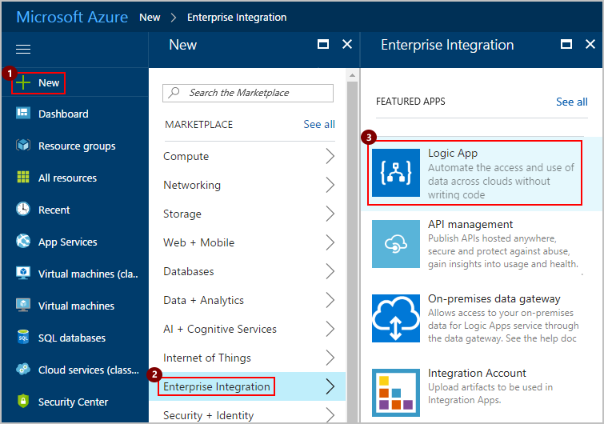
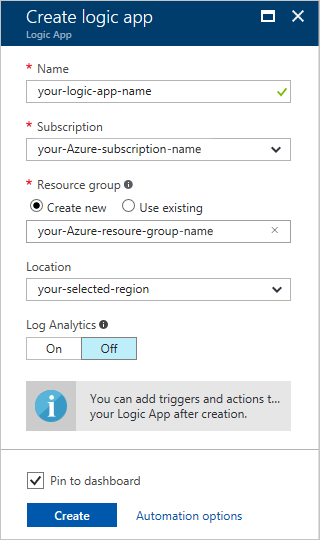
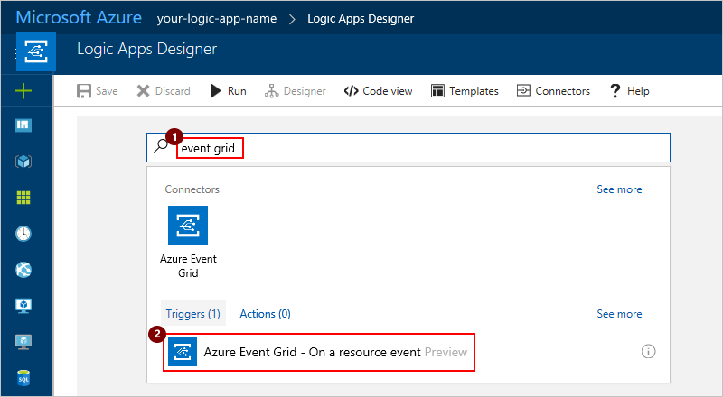

# Tag virtual machines at creation by triggering a logic app workflow with events from event grids

You can start an automated [logic app workflow](../logic-apps/logic-apps-what-are-logic-apps.md) 
when specific events happen in Azure resources or third-party resources. 
These resources can publish those events to an [Azure event grid](../event-grid/overview.md). 
In turn, the event grid pushes those events to subscribers that have queues, webhooks, 
or [event hubs](../event-hubs/event-hubs-what-is-event-hubs.md) as endpoints. 
As a subscriber, your logic app can wait for those events from the event grid 
before running automated workflows to perform tasks.

For example, here are some events that an event grid can send 
from publisher to subscriber:

* Create, read, update, or delete a resource
* New message in a queue
* New tweet

This tutorial shows how to create a logic app that starts 
running a workflow when you create an Azure virtual machine. 
At creation, the virtual machine publishes an event to an event grid, 
which pushes the event to your logic app. Your logic app passes 
data about the virtual machine to an Azure function 
that tags the virtual machine with a specified label. 
Your logic app can also send you email when the virtual 
machine is created, tagged, and ready to use.

## Requirements

To follow this tutorial, complete these other tasks first: 

* [Create a virtual machine resource with the Azure CLI](../virtual-machines/windows/quick-create-cli.md)

  This quickstart shows how to create an Azure virtual machine, 
  which automatically publishes events to an event grid. 
  The event grid pushes those events to subscribers, like your logic app.

* [Create an Azure Functions app and function]() 

  This tutorial shows how to create an Azure function 
  that tags a virtual machine. Your logic app 
  calls this function as a step in its workflow. 

For this tutorial, you also need an email account with 
[any email provider that's supported by Azure Logic Apps](../connectors/apis-list.md), 
like Outlook.com, Office 365 Outlook, or Gmail.

## Create a logic app that responds to events from an event grid

1. In the [Azure portal](https://portal.azure.com), from the main Azure menu, 
choose **New** > **Enterprise Integration** > **Logic App** as shown:

   

2. Create your logic app:

   1. Provide a name for your logic app.

   2. Select the Azure subscription, resource group, 
   and location that you want to use for your logic app. 

   3. When you're ready, select **Pin to dashboard**, and choose **Create**.

      

      You've now created an Azure resource for your logic app. 
      After Azure deploys your logic app, the Logic Apps Designer 
      shows you templates for common patterns so you can get started faster.

      > [!NOTE] 
      > When you select **Pin to dashboard**, 
      > your logic app automatically opens in Logic Apps Designer. 
      > Otherwise, you can manually find and open your logic app.

3. Now choose a logic app template. 
Under **Templates**, choose **Blank Logic App**, 
so you can build your logic app from scratch.

   The Logic Apps Designer shows you [*connectors*](../connectors/apis-list.md) 
   and [*triggers*](../logic-apps/logic-apps-what-are-logic-apps.md#logic-app-concepts) 
   that you can use to start your logic app. A trigger is an event that creates 
   a logic app instance and starts your logic app workflow. 
   Your logic app needs a trigger as the first item.

4. In the search box, enter "event grid" as your filter. 
Select this trigger: **Azure Event Grid - On a resource event**

   

5. Create an event subscription so that your logic app gets events 
from the publisher resource. Provide these event subscription details:

   * **Subscription**: Select the publisher resource's Azure subscription.

   * **Resource Type**: Select the publisher's resource type. 
   For this tutorial, select **Microsoft.EventGrid.topics**.

   * **Resource Name**: Select the publisher resource's name. 
   For this tutorial, select your event grid.

   * For optional settings, choose **Show advanced options**.

      * **Subscription Name**: Provide a name for your event subscription.

      * **Prefix Filter**: Specify a prefix string as a filter, for example, 
      a path and parameter to a specific resource. The default or empty 
      string matches all values.

      * **Suffix Filter**: Specify a suffix string as a filter, for example, 
      a file name extension, if you want only specific file types. 
      The default or an empty string matches all values.

      

6. Save your logic app. On the designer toolbar, choose **Save**.

   

   When you save your logic app, the Event Grid trigger 
   creates an event subscription between your logic app 
   and the publisher resource. 

So now when the publisher pushes an event to the event grid, 
that event grid pushes the event to your logic app. 
After getting this event, your logic app creates an instance of itself 
and starts running the workflow that you define in these next steps.

## Call an Azure function from your logic app

Now you can add an [action](../logic-apps/logic-apps-what-are-logic-apps.md#logic-app-concepts) 
that performs tasks on data in your logic app workflow. 
For this tutorial, add the Azure function that you created earlier 
in [this tutorial]() for tagging a virtual machine.

1. In your logic app, under your Event Grid trigger, 
choose **New step** > **Add an action**.

   

2. In the search box, enter "azure functions" as your filter. 
Select this action: **Azure Functions - Choose an Azure function**

   

   Azure shows all the existing Azure function apps that 
   were created under your Azure subscription.

3. In the search box, find your previously created Azure function app. 
Select your Azure function app: **Azure Functions - *your-function-app-name***

   

   Azure now shows all the functions that are 
   available in your selected function app.

4. Select your previously created function: 
**Azure Functions - *your-function-name***

   

5. In **Request Body**, specify the data that you want to pass to your function.

   For this example, enter this content: **{TBD}**

6. Save your logic app.

## Send email from your logic app

Now add an [*action*](../logic-apps/logic-apps-what-are-logic-apps.md#logic-app-concepts) 
that sends email when a virtual machine is created, tagged, and ready to use.

1. In your logic app, under your Azure function, 
choose **New step** > **Add an action**. 

2. In the search box, enter "email" as your filter. 
Based on your email provider, find and select the matching connector. 

   For example, for Azure work or school accounts, 
   select the Office 365 Outlook connector. 
   For personal Microsoft accounts, 
   select the Outlook.com connector. 
   For Gmail accounts, select the Gmail connector.

3. Select this action for your connector: 
***your-email-provider* - Send an email**

   For example, if you're using Office 365 Outlook, 
   your designer looks similar to this workflow:

   

3. If you didn't already create a connection for your email provider, 
sign in to your email account when you're asked for authentication.

4. Provide the details for the email action. 
When the **Dynamic content** list appears, 
you can select from fields available in your workflow.

   * In the **To** box, enter the recipient's email address. 
   For testing purposes, you can use your own email address.

   * In the **Subject** and **Body** boxes, 
   select the fields that you want to include in the email.

   For example, if you're using Office 365 Outlook, 
   your designer might look like this workflow:

   

   > [!IMPORTANT] 
   > If you select a field that represents an array, 
   > the designer automatically adds a **For each** loop 
   > around the action that references the array. 
   > That way, your logic app performs that action on each array item.

   When you're done, your logic app looks similar to this example: 

   

5. Save and run your logic app.

   

## FAQ

**Q**: How do I set up publishing to an event grid for a third-party resource, 
like custom APIs?  

**A**: Here are more details for third-party resources that might need 
configuration for publishing to event grids: 

* [Event Grid publisher schema](../event-grid/publisher-registration-schema.md)
* [Event Grid event schema](../event-grid/event-schema.md)
* [Event Grid security and authentication](../event-grid/security-authentication.md)
* [Event Grid subscription schema](../event-grid/subscription-creation-schema.md)

## Next steps

