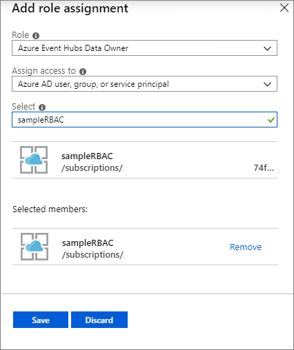

# Authenticate a managed identity with Azure Active Directory to access Event Hubs Resources
Azure Event Hubs supports Azure Active Directory (Azure AD) authentication with [managed identities for Azure resources](../active-directory/managed-identities-azure-resources/overview.md). Managed identities for Azure resources can authorize access to Event Hubs resources using Azure AD credentials from applications running in Azure Virtual Machines (VMs), Function apps, Virtual Machine Scale Sets, and other services. By using managed identities for Azure resources together with Azure AD authentication, you can avoid storing credentials with your applications that run in the cloud.

This article shows how to authorize access to an event hub by using a managed identity from an Azure VM.

## Enable managed identities on a VM
Before you can use managed identities for Azure Resources to authorize Event Hubs resources from your VM, you must first enable managed identities for Azure Resources on the VM. To learn how to enable managed identities for Azure Resources, see one of these articles:

- [Azure portal](../active-directory/managed-service-identity/qs-configure-portal-windows-vm.md)
- [Azure PowerShell](../active-directory/managed-identities-azure-resources/qs-configure-powershell-windows-vm.md)
- [Azure CLI](../active-directory/managed-identities-azure-resources/qs-configure-cli-windows-vm.md)
- [Azure Resource Manager template](../active-directory/managed-identities-azure-resources/qs-configure-template-windows-vm.md)
- [Azure Resource Manager client libraries](../active-directory/managed-identities-azure-resources/qs-configure-sdk-windows-vm.md)

## Grant permissions to a managed identity in Azure AD
To authorize a request to Event Hubs service from a managed identity in your application, first configure role-based access control (RBAC) settings for that managed identity. Azure Event Hubs defines RBAC roles that encompass permissions for sending and reading from Event Hubs. When the RBAC role is assigned to a managed identity, the managed identity is granted access to Event Hubs data at the appropriate scope.

For more information about assigning RBAC roles, see [Authenticate with Azure Active Directory for access to Event Hubs resources](authorize-access-azure-active-directory.md).

## Use Event Hubs with managed identities for Azure resources
To use Event Hubs with managed identities, you need to assign the identity the role and the appropriate scope. The procedure in this section uses a simple application that runs under a managed identity and accesses Event Hubs resources.

Here we're using a sample web application hosted in [Azure App Service](https://azure.microsoft.com/services/app-service/). For step-by-step instructions for creating a web application, see [Create an ASP.NET Core web app in Azure](../app-service/app-service-web-get-started-dotnet.md)

Once the application is created, follow these steps: 

1. Go to **Settings** and select **Identity**. 
1. Select the **Status** to be **On**. 
1. Select **Save** to save the setting. 

    

Once you've enabled this setting, a new service identity is created in your Azure Active Directory (Azure AD) and configured into the App Service host.

Now, assign this service identity to a role in the required scope in your Event Hubs resources.

### To Assign RBAC roles using the Azure portal
To assign a role to Event Hubs resources, navigate to that resource in the Azure portal. Display the Access Control (IAM) settings for the resource, and follow these instructions to manage role assignments:

> [!NOTE]
> The following steps assigns a service identity role to your Event Hubs namespaces. You can follow the same steps to assign a role scoped to any Event Hubs resource. 

1. In the Azure portal, navigate to your Event Hubs namespace and display the **Overview** for the namespace. 
1. Select **Access Control (IAM)** on the left menu to display access control settings for the event hub.
1.  Select the **Role assignments** tab to see the list of role assignments.
3.	Select **Add** to add a new role.
4.	On the **Add role assignment** page, select the Event Hubs roles that you want to assign. Then search to locate the service identity you had registered to assign the role.
    
    
5.	Select **Save**. The identity to whom you assigned the role appears listed under that role. For example, the following image shows that service identity has Event Hubs Data owner.
    
    

Once you've assigned the role, the web application will have access to the Event Hubs resources under the defined scope. You can now launch you web application and point your browser to the sample aspx page. You can find the sample web application that sends and receives data from Event Hubs resources in the [GitHub repo](https://github.com/Azure/azure-event-hubs/tree/master/samples/DotNet/Microsoft.Azure.EventHubs/Rbac/ManagedIdentityWebApp).

Install the latest package from [Nuget](https://www.nuget.org/packages/Microsoft.Azure.EventHubs/), and start sending to and receiving data from Event hubs using the EventHubClient as shown in the following code: 

```csharp
var ehClient = EventHubClient.CreateWithManagedIdentity(new Uri($"sb://{EventHubNamespace}/"), EventHubName);
```

## Next Steps
See the following article to learn about managed identities for Azure resources:

- [What is managed identities for Azure resources?](../active-directory/managed-identities-azure-resources/overview.md)

For more information about Event Hubs, visit the following links:
- Get started with an [Event Hubs tutorial](../event-hubs/event-hubs-dotnet-standard-getstarted-send.md)
- [Event Hubs FAQ](../event-hubs/event-hubs-faq.md)
- [Event Hubs pricing details](https://azure.microsoft.com/pricing/details/event-hubs/)
- [Sample applications that use Event Hubs](https://github.com/Azure/azure-event-hubs/tree/master/samples)

