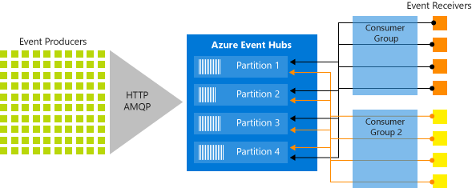

# What is Azure Event Hubs?

Azure Event Hubs is a Big Data streaming platform and event ingestion service, capable of receiving and processing millions of events per second. Event Hubs can process and store events, data, or telemetry produced by distributed software and devices. Data sent to an event hub can be transformed and stored using any real-time analytics provider or batching/storage adapters. 

Event Hubs is used in some of the following common scenarios:

- Anomaly detection (fraud/outliers)
- Application logging
- Analytics pipelines, such as clickstreams
- Live dashboarding
- Archiving data
- Transaction processing
- User telemetry processing
- Device telemetry streaming 

## Why use Event Hubs?

Organizations need data-driven strategies to increase competitive advantage, or to analyze data to get valuable insights. Event Hubs provides a distributed stream processing platform with low latency and seamless integration, with data and analytics services inside and outside Azure to build a complete Big Data pipeline.

The common role that Event Hubs plays in solution architectures is the "front door" for an event pipeline, often called an *event ingestor*. An event ingestor is a component or service that sits between event publishers and event consumers to decouple the production of an event stream from the consumption of those events. Event Hubs provides a unified streaming platform with time retention buffer, decoupling the event producers from event consumers. 

## Key features

Event Hubs provides message stream handling capability but has characteristics that are different from traditional enterprise messaging. Event Hubs capabilities are built around high throughput and event processing scenarios. Event Hubs contains the following [key components](event-hubs-features.md):

- **Event producers**: Any entity that sends data to an event hub. Event publishers can publish events using HTTPS or AMQP 1.0. 
- **Partitions**: Each consumer only reads a specific subset, or partition, of the message stream.
- **Consumer groups**: A view (state, position, or offset) of an entire event hub. Consumer groups enable multiple consuming applications to each have a separate view of the event stream, and to read the stream independently at their own pace and with their own offsets.
- **Throughput units**: Pre-purchased units of capacity that control the throughput capacity of Event Hubs.
- **Event receivers**: Any entity that reads event data from an event hub. All Event Hubs consumers connect via the AMQP 1.0 session, and events are delivered through the session as they become available.

The following figure shows the Event Hubs stream processing architecture:

## Fully managed PaaS 

Event Hubs is a managed service with little configuration or management overhead, so you focus on your business solutions. [Event Hubs for Apache Kafka ecosystems](event-hubs-for-kafka-ecosystem-overview.md) gives you the PaaS Kafka experience without having to manage, configure, or run your clusters.

## Real-time and batching

Ingest, buffer, store, and process your stream in real time to get actionable insights. Event Hubs uses a [partitioned consumer model](event-hubs-features.md#partitions), enabling multiple applications to process the stream concurrently and letting you control the velocity of processing.

[Capture](event-hubs-capture-overview.md) your data in near-real time in an [Azure Blob storage](https://azure.microsoft.com/services/storage/blobs/) or [Azure Data Lake Store](https://azure.microsoft.com/services/data-lake-store/) for long-term retention or micro-batch processing. You can achieve this on the same stream you use for deriving real-time analytics. Setting up Capture is fast, there are no administrative costs to run it, and it scales automatically with Event Hubs [throughput units](event-hubs-features.md#throughput-units). Event Hubs Capture enables you to focus on data processing rather than on data capture.

Azure Event Hubs also integrates with [Azure Functions](/azure/azure-functions/) for a serverless architecture.

## Scalable 

You can start with data streams in megabytes, and grow to gigabytes or terabytes of data streams using the [Auto-inflate](event-hubs-auto-inflate.md) feature. 

## Rich ecosystem

[Event Hubs for Apache Kafka ecosystems](event-hubs-for-kafka-ecosystem-overview.md) enables [Apache Kafka (1.0 and above)](https://kafka.apache.org/) clients and applications to talk to Event Hubs without having to manage any clusters.
 
With a broad ecosystem available in various [languages (.NET, Java, Python, Go, Node.js)](https://github.com/Azure/azure-event-hubs), you can easily start processing your streams from Event Hubs. All supported client languages provide low-level integration.

## Next steps

To get started using Event Hubs, see the following articles:

* [Ingest into Event Hubs](event-hubs-quickstart-powershell.md)
* [Event Hubs features overview](event-hubs-features.md)

