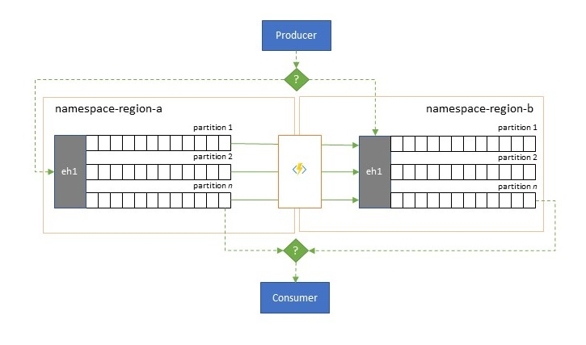
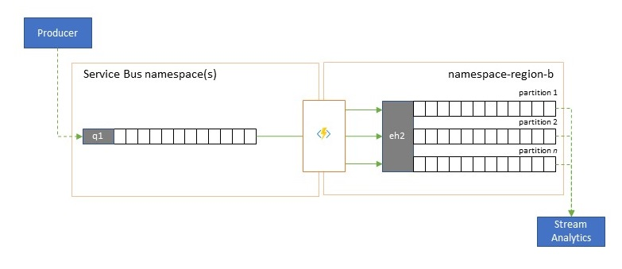
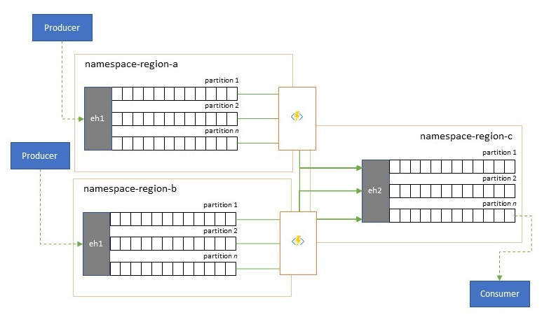
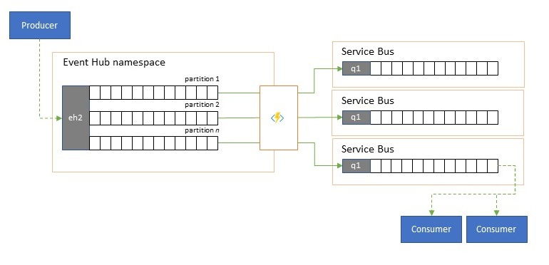

# Event replication and cross-region federation

Many sophisticated solutions require the same event streams to be made available for consumption in multiple locations and/or event streams to be collected in multiple locations and then consolidated into a specific locations for consumption.

Practically, that means your solution will maintain multiple Event Hubs in different regions or namespaces and replicate events between them, and/or that you will exchange events with sources and targets like [Azure Service Bus](../service-bus-messaging/service-bus-messaging-overview.md), [Azure IoT Hub](../iot-fundamentals/iot-introduction.md), or [Apache Kafka](https://kafka.apache.org). 

Maintaining multiple active Event Hubs in different regions also allows clients to choose and switch between them. 

## Federation Patterns

There are numerous potential motivations for why you may want to move events between different Event Hubs or other sources and targets, and we enumerate the most important patterns in this section:

### Resiliency against regional availability events 

While maximum availability and reliability are the top operational priorities for Event Hubs, there are nevertheless a lot of ways in which a producer or consumer might be prevented from talking to its assigned "primary" Event Hub due to networking or name resolution issues, or where an Event Hub might indeed be temporarily unresponsive or returning errors. Such conditions are generally not "disastrous" such that you will want to abandon the regional deployment altogether as you might do in a disaster recovery situation, but the business scenario of some applications might already be impacted by availability events that last not more than a few minutes or even seconds. 

### Latency optimization 

  

Event streams are written once by producers, but can be read any number of times by event consumers. For scenarios where an event stream in a region is shared by multiple consumers, and needs to be accessed repeatedly during analytics processing residing in a different region or with throughout demands that would starve out concurrent consumers, it may be beneficial to place a copy of the event stream near the analytics processor in order to reduce the roundtrip latency. 

### Validation, reduction, and enrichment

  

[TBD]

### Integration with analytics services

Several of Azure's cloud-native analytics services like Azure Stream Analytics or Azure Synapse work best with streamed or pre-batched data served up from Azure Event Hubs, and Azure Event Hubs also enables integration with several open-source analytics packages such as Apache Samza, Apache Flink, Apache Spark, and Apache Storm. Federation integration also makes data flows otherwise routed in Azure Service Bus available for analytics processing with these services and packages. 

### Consolidation and normalization of event streams

Global solutions are often composed of regional footprints that are largely independent including having their own analytics capabilities, but supra-regional and global analytics perspectives will require an integrated perspective and therefore a central consolidation of the same event streams that are evaluated in the respective regional footprints for the local perspective. 

Normalization is a flavor of the consolidation scenario, whereby two or more incoming event streams carry the same kind of events, but with different structures or different encodings, and the events most be transcoded or transformed before they can be consumed. 

Normalization may also include cryptographic work such as decrypting end-to-end encrypted payloads and re-encrypting it with different keys and algorithms for the downstream consumer audience. 

### Splitting and routing of event streams

Azure Event Hubs is occasionally used in "publish-subscribe" style scenarios where an incoming torrent of ingested events far exceeds the capacity of Azure Service Bus or Azure Event Grid, both of which have native publish-subscribe filtering and distribution capabilities and are generally preferred for this pattern. 

While a true "publish-subscribe" capability leaves it to subscribers to pick the events they want, the splitting pattern has the producer map events to partitions by a predetermined distribution model and designated consumers then exclusively pull from "their" partition. With the Event Hub buffering the overall traffic, the content of a particular partition, representing a fraction of he original throughput volume, may then be replicated into a queue for reliable, transactional, competing consumer consumption.

Many scenarios where Event Hubs is primarily used for moving events within an application within a region have some cases where select events, maybe just from a single partition, also have to be made available elsewhere. This is similar to the splitting scenario, but might use a scalable router that considers all the messages arriving in an Event Hub and cherry-picks just a few for onward routing and might differentiate routing targets by event metadata or content. 

## Event and Message Replication in Azure

Implementing the patterns above requires a scalable and reliable execution environment for the replication tasks that you want to configure and run. On Azure, the runtime environment that is best suited for these tasks is [Azure Functions](../azure-functions/functions-overview.md). 

Many replication tasks will be straightforward copy operations, but you will occasionally also need to create and run custom transcoding and/or transformation tasks, for which Azure Functions is ideal. You can write such tasks in Java, C#, Python, or JavScript/TypeScript.  

Azure Functions can run under a [Azure managed identity](../active-directory/managed-identities-azure-resources/overview.md) such that the replication tasks can integrate with the role-based access control rules of the source and target services without you having to manage secrets along the replication path. For replication sources and targets that require explicit credentials, Azure Functions can hold the configuration values for those credentials in tightly access-controlled storage inside of [Azure Key Vault](../key-vault/general/overview.md).

Azure Functions furthermore allows the replication tasks to directly integrate with Azure virtual networks and [service endpoints](../virtual-network/virtual-network-service-endpoints-overview.md) for all Azure messaging services, and it is readily integrated with [Azure Monitor](../azure-monitor/overview.md).

Most importantly, Azure Functions has prebuilt, scalable triggers and output bindings for [Azure Event Hubs](../azure-functions/functions-bindings-event-hubs.md), [Azure IoT Hub](../azure-functions/functions-bindings-event-iot), [Azure Service Bus](../azure-functions/functions-bindings-service-bus.md), [Azure Event Grid](../azure-functions/functions-bindings-event-grid.md), and [Azure Queue Storage](/azure-functions/functions-bindings-storage-queue.md), as well as custom extensions for [RabbitMQ](https://github.com/azure/azure-functions-rabbitmq-extension), and [Apache Kafka](https://github.com/azure/azure-functions-kafka-extension). Most triggers will dynamically adapt to the throughput needs by scaling the number of concurrently executing instance up and down based on documented metrics. 

With the Azure Functions consumption plan, the prebuilt triggers can even scale down to zero while no messages are available for replication, which means you incur no costs for keeping the configuration ready to scale back up; the key downside of using the consumption plan is that the latency for replication tasks "waking up" from this state is significantly higher than with the hosting plans where the infrastructure is kept running.  

In contrast to all of this, most common replication engines for messaging and eventing, such as Apache Kafka's [MirrorMaker](http://kafka.apache.org/documentation/#basic_ops_mirror_maker) require you to provide a hosting environment and manage scaling the replication engine yourself. That includes configuring and integrating the security and networking features and facilitating the flow of monitoring data, and then you usually still don't have an opportunity to inject custom replication tasks into the flow. 

## Next Steps

In this article, we explored a range of federation patterns and explained the role of Azure Functions as the event and messaging replication runtime in Azure. 

Next, you might want to read up how to set up a replicator application with Azure Functions and then how to replicate event flows between Event Hubs and various other eventing and messaging systems:

- [Event replicator applications in Azure Functions](event-hubs-federation-replicator-functions.md)
- Replicating events between Event Hubs, and from IoT Hub
- Replicating events from and to Apache Kafka
- Routing events from and to Azure Event Grid 
- Routing events from and to Azure Service Bus 
- Routing events from and to Queue Storage
- Routing events to Notification Hubs