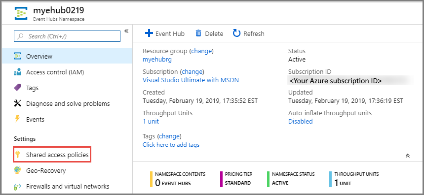
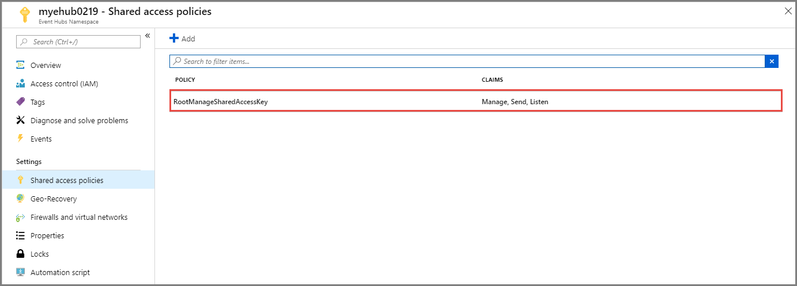
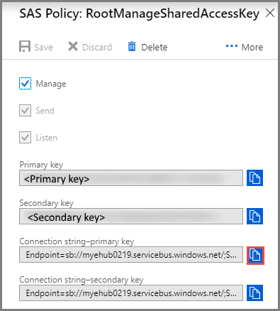

# Get an Event Hubs connection string

To use Event Hubs, you need to create an Event Hubs namespace. A namespace is a scoping container for multiple event hubs or Kafka topics. This namespace gives you a unique [FQDN](https://en.wikipedia.org/wiki/Fully_qualified_domain_name). Once a namespace is created, you can obtain the connection string required to communicate with Event Hubs.

The connection string for Azure Event Hubs has the following components embedded within it,

* FQDN = the FQDN of the EventHubs namespace you created (It includes the EventHubs namespace name followed by servicebus.windows.net)
* SharedAccessKeyName = the name you chose for your application's SAS keys
* SharedAccessKey = the generated value of the key.

The connection string template looks like
```
Endpoint=sb://<FQDN>/;SharedAccessKeyName=<KeyName>;SharedAccessKey=<KeyValue>
```

An example connection string might look like
`Endpoint=sb://dummynamespace.servicebus.windows.net/;SharedAccessKeyName=DummyAccessKeyName;SharedAccessKey=5dOntTRytoC24opYThisAsit3is2B+OGY1US/fuL3ly=`

This article walks you through various ways of obtaining the connection string.

## Get connection string from the portal
1. Sign in to [Azure portal](https://portal.azure.com). 
2. Select **All services** on the left navigational menu. 
3. Select **Event Hubs** in the **Analytics** section. 
4. In the list of event hubs, select your event hub.
6. On the **Event Hubs Namespace** page, select **Shared Access Policies** on the left menu.

    
7. Select a **shared access policy** in the list of policies. The default one is named: **RootManageSharedAccessPolicy**. You can add a policy with appropriate permissions (read, write), and use that policy. 

    
8. Select the **copy** button next to the **Connection string-primary key** field. 

    

## Getting the connection string with Azure PowerShell

[!INCLUDE [updated-for-az](../../includes/updated-for-az.md)]

You can use the [Get-AzEventHubNamespaceKey](/powershell/module/az.eventhub/get-azeventhubkey) to get the connection string for the specific policy/rule name as shown below:

```azurepowershell-interactive
Get-AzEventHubKey -ResourceGroupName dummyresourcegroup -NamespaceName dummynamespace -AuthorizationRuleName RootManageSharedAccessKey
```

## Getting the connection string with Azure CLI
You can use the following to get the connection string for the namespace:

```azurecli-interactive
az eventhubs namespace authorization-rule keys list --resource-group dummyresourcegroup --namespace-name dummynamespace --name RootManageSharedAccessKey
```

For more information about Azure CLI commands for Event Hubs, see [Azure CLI for Event Hubs](/cli/azure/eventhubs).

## Next steps

You can learn more about Event Hubs by visiting the following links:

* [Event Hubs overview](event-hubs-what-is-event-hubs.md)
* [Create an Event Hub](event-hubs-create.md)
