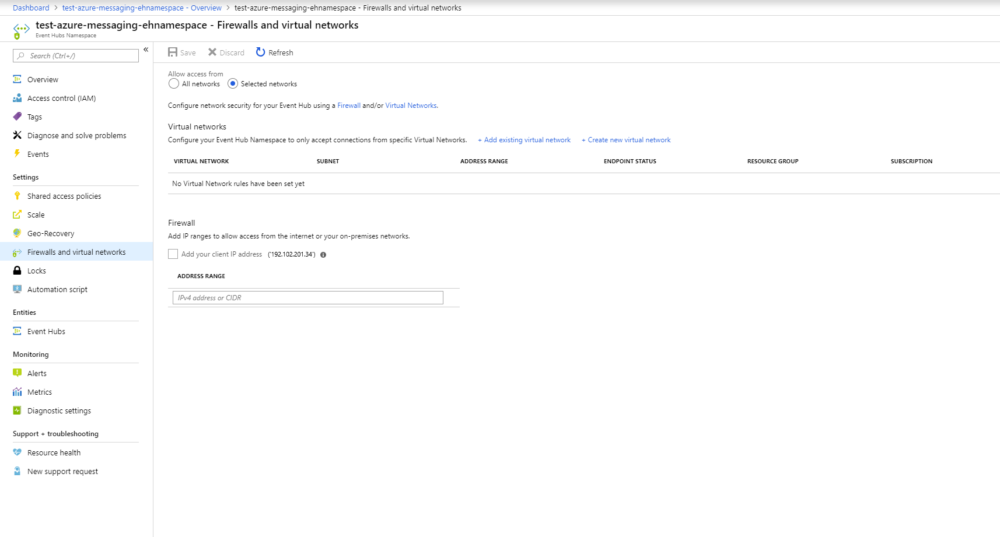
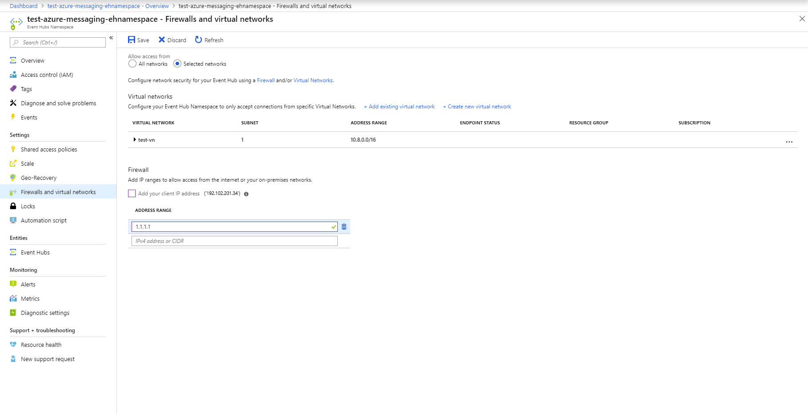
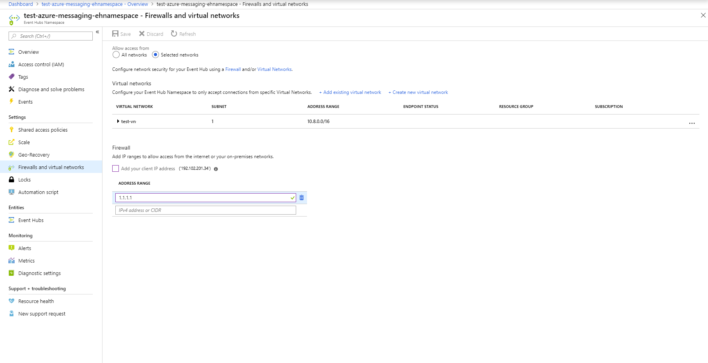
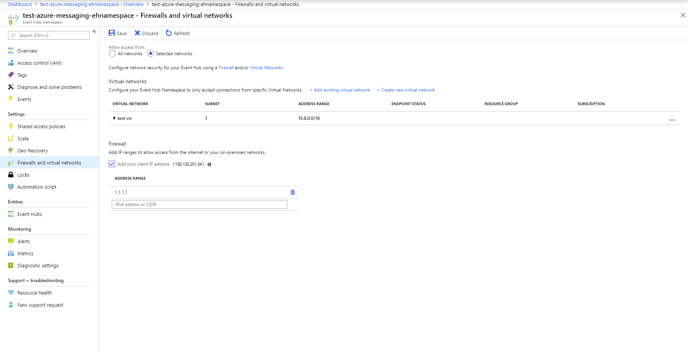

# Azure Event Hubs - Configure IP firewall rules
For scenarios in which Azure Event Hubs should be only accessible from certain well-known sites, firewall rules enable you to configure rules for accepting traffic originating from specific IPv4 addresses. For example, these addresses may be those of a corporate NAT gateway.

Firewalls allow you to limit access to the Event Hubs namespace from specific IP addresses (or IP address ranges)

## When to use

If you are looking to setup your Event Hubs namespace such that it should receive traffic from only a specified range of IP addresses and reject everything else, then you can leverage a *Firewall rule* to block Event Hub endpoints from other IP addresses. For example, if you use Event Hubs with [Azure Express Route][express-route], you can create a *Firewall rule* to restrict the traffic from your on-premises infrastructure IP addresses.

## How filter rules are applied
The IP filter rules are applied at the Event Hubs namespace level. Therefore, the rules apply to all connections from clients using any supported protocol.

Any connection attempt from an IP address that does not match an allowed IP rule on the Event Hubs namespace is rejected as unauthorized. The response does not mention the IP rule.

## Default setting
By default, the **IP Filter** grid in the portal for Event Hubs is empty. This default setting means that your event hub accepts connections from any IP address. This default setting is equivalent to a rule that accepts the 0.0.0.0/0 IP address range.

## IP filter rule evaluation
IP filter rules are applied in order, and the first rule that matches the IP address determines the accept or reject action.

## Add firewall for specified IP

We can limit access to the Event Hubs namespace for a limited range of IP addresses, or a specific IP address by using Firewall rules.

1. Navigate to your **Event Hubs namespace** in the [Azure portal](https://portal.azure.com).
2. On the left menu, select **Firewalls and Virtual Networks** option.
1. Click the **Selected Networks** radio button on the top of the page to enable the rest of the page with menu options.
  
2. In the **Firewall** section, under the ***Address Range*** grid, you may add one or many specific IP address, or ranges of IP addresses.
  
3. Once you have added the multiple IP addresses (or ranges of IP addresses), hit **Save** on the top ribbon to ensure that the configuration is saved on the service side. Please wait for a few minutes for the confirmation to show up on the portal notifications.
  

## Add your current IP address to the Firewall rules

1. You can also add your current IP address quickly by checking the ***Add your client IP address (YOUR CURRENT IP ADDRESS)*** checkbox just above the ***Address Range*** grid.
  
2. Once you have added your current IP address to the firewall rules, hit **Save** on the top ribbon to ensure that the configuration is saved on the service side. Please wait for a few minutes for the confirmation to show up on the portal notifications.
  


## Create a firewall rule with Resource Manager template

> [!IMPORTANT]
> Firewall rules are supported in **standard** and **dedicated** tiers of Event Hubs. It's not supported in basic tier.

The following Resource Manager template enables adding an IP filter rule to an existing Event Hubs namespace.

Template parameters:

- **ipMask** is a single IPv4 address or a block of IP addresses in CIDR notation. For example, in CIDR notation 70.37.104.0/24 represents the 256 IPv4 addresses from 70.37.104.0 to 70.37.104.255, with 24 indicating the number of significant prefix bits for the range.

> [!NOTE]
> While there are no deny rules possible, the Azure Resource Manager template has the default action set to **"Allow"** which doesn't restrict connections.
> When making Virtual Network or Firewalls rules, we must change the
> ***"defaultAction"***
> 
> from
> ```json
> "defaultAction": "Allow"
> ```
> to
> ```json
> "defaultAction": "Deny"
> ```
>

```json
{
    "$schema": "https://schema.management.azure.com/schemas/2015-01-01/deploymentTemplate.json#",
    "contentVersion": "1.0.0.0",
    "parameters": {
      "eventhubNamespaceName": {
        "type": "string",
        "metadata": {
          "description": "Name of the Event Hubs namespace"
        }
      },
      "location": {
        "type": "string",
        "metadata": {
          "description": "Location for Namespace"
        }
      }
    },
    "variables": {
      "namespaceNetworkRuleSetName": "[concat(parameters('eventhubNamespaceName'), concat('/', 'default'))]",
    },
    "resources": [
      {
        "apiVersion": "2018-01-01-preview",
        "name": "[parameters('eventhubNamespaceName')]",
        "type": "Microsoft.EventHub/namespaces",
        "location": "[parameters('location')]",
        "sku": {
          "name": "Standard",
          "tier": "Standard"
        },
        "properties": { }
      },
      {
        "apiVersion": "2018-01-01-preview",
        "name": "[variables('namespaceNetworkRuleSetName')]",
        "type": "Microsoft.EventHub/namespaces/networkruleset",
        "dependsOn": [
          "[concat('Microsoft.EventHub/namespaces/', parameters('eventhubNamespaceName'))]"
        ],
        "properties": {
		  "virtualNetworkRules": [<YOUR EXISTING VIRTUAL NETWORK RULES>],
          "ipRules": 
          [
            {
                "ipMask":"10.1.1.1",
                "action":"Allow"
            },
            {
                "ipMask":"11.0.0.0/24",
                "action":"Allow"
            }
          ],
          "defaultAction": "Deny"
        }
      }
    ],
    "outputs": { }
  }
```

To deploy the template, follow the instructions for [Azure Resource Manager][lnk-deploy].

## Next steps

For constraining access to Event Hubs to Azure virtual networks, see the following link:

- [Virtual Network Service Endpoints for Event Hubs][lnk-vnet]

<!-- Links -->

[express-route]:  /azure/expressroute/expressroute-faqs#supported-services
[lnk-deploy]: ../azure-resource-manager/templates/deploy-powershell.md
[lnk-vnet]: event-hubs-service-endpoints.md
