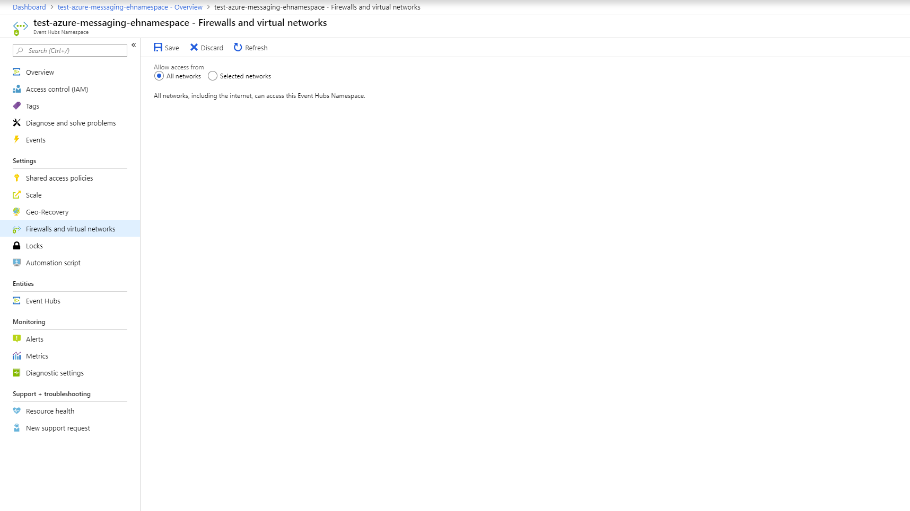

# Tutorial: Enable Virtual Networks Integration and Firewalls on Event Hubs namespace

[Virtual Network (VNet) service endpoints](../virtual-network/virtual-network-service-endpoints-overview) extend your virtual network private address space and the identity of your VNet to the Azure services, over a direct connection. Endpoints allow you to secure your critical Azure service resources to only your virtual networks. Traffic from your VNet to the Azure service always remains on the Microsoft Azure backbone network.

Firewalls allow you to limit access to the Event Hubs namespace from specific IP addresses (or IP address ranges)

This tutorial shows how to integrate Virtual Networks service endpoints and set up Firewalls (IP Filtering) with your existing Azure Event Hubs namespace, using the portal.

In this tutorial, you lean how to :
> [!div class="checklist"]
> * How to integrate Virtual Networks Service endpoints with your Event Hubs namespace.
> * How to setup Firewall (IP Filtering) with your Event Hubs namespace.

>[!WARNING]
> Implementing Virtual Networks integration can prevent other Azure services from interacting with Service Bus.
>
> First party integrations are not supported when Virtual Networks are enabled, and will be made available soon.
> Common Azure scenarios that don't work with Virtual Networks -
> * Azure Diagnostics and Logging
> * Azure Stream Analytics
> * Event Grid Integration
> * Web Apps & Functions are required to be on a Virtual network.
> * IoT Hub Routes
> * IoT Device Explorer

> [!IMPORTANT]
> Virtual networks are supported in **standard** and **dedicated** tiers of Event Hubs. It's not supported in basic tier.

If you do not have an Azure subscription, create a [free account][] before you begin.

## Prerequisites

We will leverage an existing Event Hubs namespace, so please make sure you have an Event Hubs namespace available. If you don't, please refer to [this tutorial](./event-hubs-create.md)

## Sign in to the Azure portal

First, go to the [Azure portal][Azure portal] and sign in using your Azure subscription.

## Select Event Hubs namespace

For the purpose of this tutorial, we created an Event Hubs namespace and will navigate to that.

## Navigate to Firewalls and Virtual Networks experience

Use the navigation menu on the left pane on the portal to pick the **'Firewalls and Virtual Networks'** option.

  

## Add Virtual Network Service Endpoint

## Add Firewall for specified IP

[Azure portal]: https://portal.azure.com/