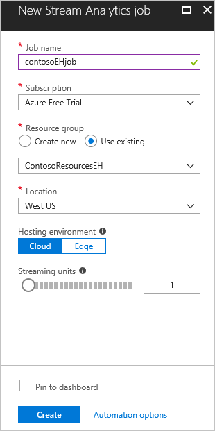
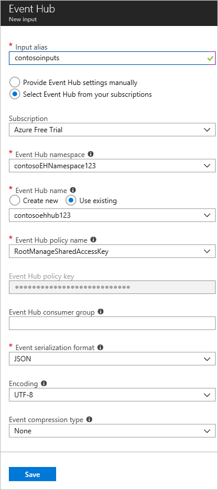
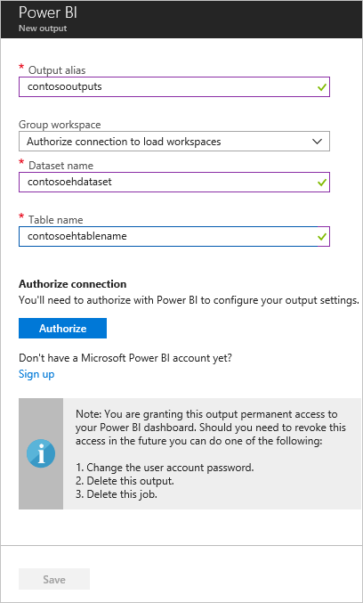
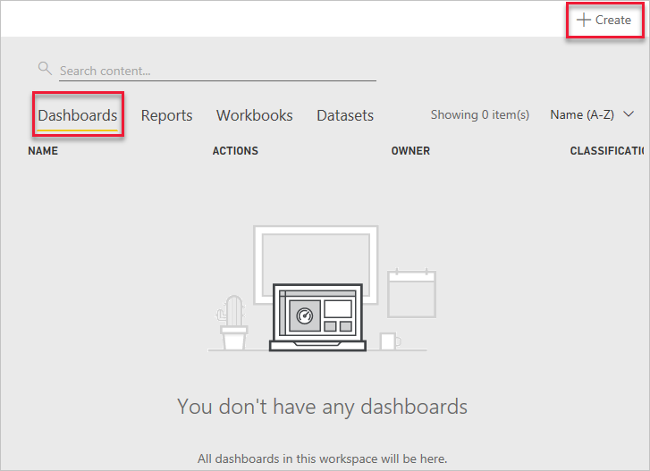
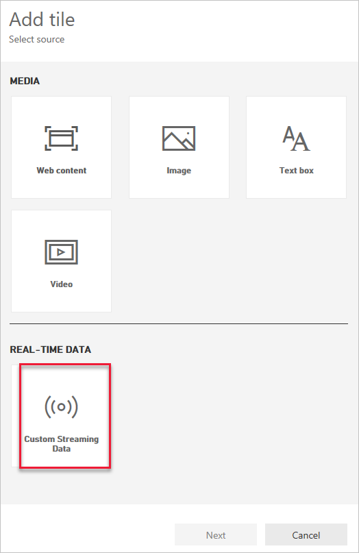
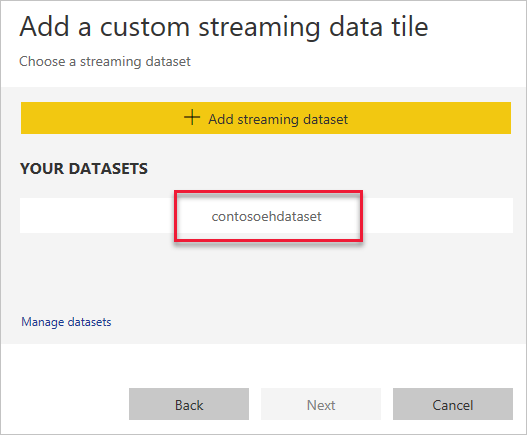
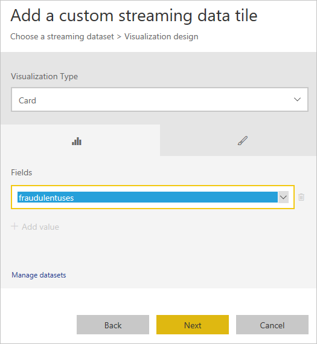
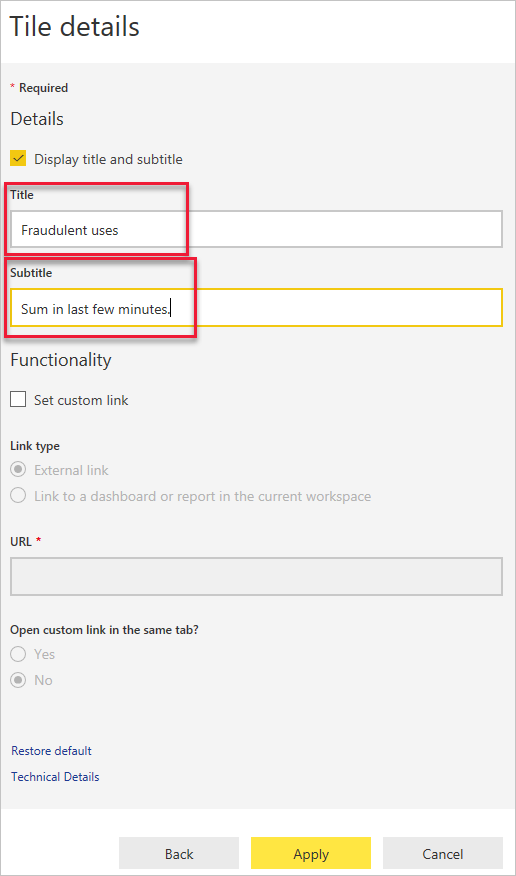
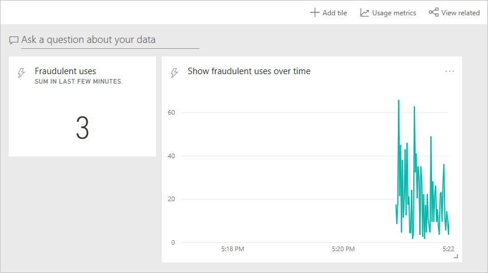

# Tutorial: Visualize data anomalies in real-time events sent to an Event Hub

Microsoft Azure Event Hubs is a big data streaming service that can collect and store millions of events per second. Event Hubs provides both real-time and batch streaming, while giving you low latency and configurable time retention. Event Hubs decouples smart endpoints, providing a durable time retention buffer in the cloud that enables you to focus on your business and big data analytics both fast and slow.
 
In this tutorial, you send simulated events to an event hub, then read the stream of data in real-time with Azure Stream Analytics and visualize the anomalies with a PowerBI visualization. This usage is similar to what a company might do if they were ingesting credit card transactions into an event hub, and then separating the valid transactions from the invalid transactions. 

In this tutorial, you learn how to:
> [!div class="checklist"]
> * Create an Event Hubs namespace
> * Create an Event Hub
> * Run the app that simulates events and sends them to the event hub
> * Configure a Stream Analytics job to process events sent to the hub
> * Configure a PowerBI visualization to show the results

## Prerequisites

- An Azure subscription. If you don't have an Azure subscription, create a [free account](https://azure.microsoft.com/free/?WT.mc_id=A261C142F) before you begin.

- Install [Visual Studio](https://www.visualstudio.com/). 

- A PowerBI account to analyze the stream analytics. ([Try PowerBI for free](https://app.powerbi.com/signupredirect?pbi_source=web))

You need either Azure CLI or Azure PowerShell to do the setup steps for this tutorial. 

To use Azure CLI, while you can install Azure CLI locally, we recommend you use the Azure Cloud Shell. Azure Cloud Shell is a free, interactive shell that you can use to run Azure CLI scripts. Common Azure tools are preinstalled and configured in Cloud Shell for you to use with your account, so you don't have to install them locally. 

To use PowerShell, install it locally using the instructions below. 

### Azure Cloud Shell

There are a few ways to open Cloud Shell:

|  |   |
|-----------------------------------------------|---|
| Select **Try It** in the upper-right corner of a code block. |  |
| Open Cloud Shell in your browser. | [](https://shell.azure.com) |
| Select the **Cloud Shell** button on the menu in the upper-right corner of the [Azure portal](https://portal.azure.com). |	 |
|  |  |

### Using Azure CLI locally

If you would rather use CLI locally than use Cloud Shell, you must have Azure CLI module version 2.0.30.0 or later. Run `az --version` to find the version. If you need to install or upgrade, see [Install Azure CLI 2.0](/cli/azure/install-azure-cli). 

### Using PowerShell locally

This tutorial requires Azure PowerShell module version 5.7 or later. Run `Get-Module -ListAvailable AzureRM` to find the version. If you need to install or upgrade, see [Install Azure PowerShell module](/powershell/azure/install-azurerm-ps).

## Set up resources

For this tutorial, you need an Event Hubs namespace and an event hub. These resources can all be created using Azure CLI or Azure PowerShell. Use the same resource group and location for all of the resources. Then at the end, you can remove everything in one step by deleting the resource group.

The following sections describe how to do these required steps. Follow the CLI *or* the PowerShell instructions.

1. Create a [resource group](../azure-resource-manager/resource-group-overview.md). 

2. Create an Event Hubs namespace. 

3. Create an Event Hub.

<!-- some day they will approve the tab control; 
  When that happens, put CLI and PSH in tabs. -->

### Azure CLI instructions

The easiest way to use this script is to copy it and paste it into Cloud Shell. Assuming you are already logged in, it will run the script one line at a time.

```azurecli-interactive

# Set the values for location and resource group name.
location=westus
resourceGroup=ContosoResourcesEH

# Create the resource group to be used
#   for all the resources for this tutorial.
az group create --name $resourceGroup \
    --location $location

# The Event Hub namespace must be globally unique, so add a random number to the end.
eventHubNamespace=ContosoEHNamespace$RANDOM
echo "Event Hub Namespace = " $eventHubNamespace

# Create the namespace.
az eventhubs namespace create --resource-group $resourceGroup \
   --name $eventHubNamespace \
   --location $location \
   --sku Standard

# The Event Hub name must be globally unique, so add a random number to the end.
eventHubName=ContosoEHhub$RANDOM
echo "Event Hub Name = " $eventHubName

# Create the event hub.
az eventhubs eventhub create --resource-group $resourceGroup \
    --namespace-name $eventHubNamespace \
    --name $eventHubName \
    --message-retention 3 \
    --partition-count 2

# Get the connection string.
connectionString=$(az eventhubs namespace authorization-rule keys list \
   --resource-group $resourceGroup \
   --namespace-name $eventHubNamespace \
   --name RootManageSharedAccessKey \
   --query primaryConnectionString \
   --output tsv)
echo "Connection string = " $connectionString 
```

### Azure PowerShell instructions

The easiest way to use this script is to open [PowerShell ISE](/powershell/scripting/core-powershell/ise/introducing-the-windows-powershell-ise.md), copy the script to the clipboard, and then paste the whole script into the script window. 

If you paste the script in one line at a time, you can change the values for the resource names (if you wish) before running the script. The variables that must be globally unique have `(Get-Random)` concatenated to them; using Get-Random results in a random numeric string being concatenated to the end of the fixed string, which will hopefully make it unique.

```azurepowershell-interactive
# Log into Azure account.
Login-AzureRMAccount

# Set the values for the location and resource group.
$location = "West US"
$resourceGroup = "ContosoResourcesEH"

# Create the resource group to be used  
#   for all resources for this tutorial.
New-AzureRmResourceGroup -Name $resourceGroup -Location $location

# The Event Hub namespace must be glocally unique, so add a random number to the end.
$eventHubNamespace = "contosoEHNamespace$(Get-Random)"
Write-Host "Event Hub Namespace is " $eventHubNamespace

# The Event Hub name must be glocally unique, so add a random number to the end.
$eventHubName = "contosoEHhub$(Get-Random)"
Write-Host "Event Hub Name is " $eventHubName

# Create the Event Hub namespace.
New-AzureRmEventHubNamespace -ResourceGroupName $resourceGroup `
     -NamespaceName $eventHubNamespace `
     -Location $location

# Create the event hub. 
$yourEventHub = New-AzureRmEventHub -ResourceGroupName $resourceGroup `
    -NamespaceName $eventHubNamespace `
    -Name $eventHubName `
    -MessageRetentionInDays 3 `
    -PartitionCount 2

# Get the event hub key, and retrieve the connection string from that object.
# You need this to run the app that sends test messages to the event hub.
$eventHubKey = Get-AzureRmEventHubKey -ResourceGroupName $resourceGroup `
    -Namespace $eventHubNamespace `
    -AuthorizationRuleName RootManageSharedAccessKey

# Save this value somewhere local for later use.
Write-Host "Connection string is " $eventHubKey.PrimaryConnectionString
 
```

## Run app to produce test data

There is an app that will produce test data for you. Download the [Azure Event Hubs samples](https://github.com/Azure/azure-event-hubs/archive/master.zip) from GitHub and unzip it locally. Go to the folder \azure-event-hubs-master\samples\DotNet\AnomalyDetector\ and double-click on AnomalyDetector.sln to open the solution in Visual Studio. 

Open Program.cs and replace **Event Hubs connection string** with the connection string you saved when running the script. Replace **Event Hub name** with your event hub name. Click F5 to run the application. It will start sending events to your event hub.

## Set up Azure Stream Analytics

To use the data in a PowerBI visualization, first set up a Stream Analytics job to retrieve the data. 

### Create the Stream Analytics job

1. In the [Azure portal](https://portal.azure.com), click **Create a resource**. Type `stream analytics` into the search box and click Enter. Select **Stream Analytics Job**. Click **Create** on the Stream Analytics job pane. 

2. Enter the following information for the job.

    **Job name**: The name of the job. The name must be globally unique. This tutorial uses **contosoEHjob**.

   **Subscription**: Select your subscription.

   **Resource group**: Use the same resource group used by your event hub. This tutorial uses **ContosoResourcesEH**. 

   **Location**: Use the same location used in the setup script. This tutorial uses **West US**. 

   

    Accept the defaults for the rest of the fields. Click **Create**. 

    To get to your Stream Analytics job, click **Resource Groups** in the portal, then select your resource group. This tutorial uses **ContosoResourcesEH**. This action shows all of the resources in the group; select your stream analytics job. 

### Add an input to the Stream Analytics job

1. Under **Job Topology**, click **Inputs**.

2. In the **Inputs** pane, click **Add stream input** and select Event Hub. On the screen that appears, fill in the following fields:

   **Input alias**: This tutorial uses **contosoinputs**.

   **Subscription**: Select your subscription.

   **Event Hub namespace**: Select your Event Hub namespace. This tutorial uses **contosoEHNamespace** with some trailing numbers.

   **Event Hub name**: Click **Use existing** and select your event hub. This tutorial uses **contosoehhub** with some trailing numbers.

   **Event Hub policy name**: Select **RootManageSharedAccessKey**.

   **Event Hub consumer group**: Leave this field blank to use the default consumer group.

   Accept the defaults for the rest of the fields.

   

5. Click **Save**.

### Add an output to the Stream Analytics job

1. Under **Job Topology**, click **Outputs**.

2. In the **Outputs** pane, click **Add**, and then select **PowerBI**. On the screen that comes up, fill in the following fields:

   **Output alias**: The unique alias for the output. This tutorial uses **contosooutputs**. 

   **Dataset name**: Name of the dataset to be used in PowerBI. This tutorial uses **contosoehdataset**. 

   **Table name**: Name of the table to be used in PowerBI. This tutorial uses **contosoehtable**.

   Accept the defaults for the rest of the fields.

3. Click **Authorize**, and sign into your PowerBI account.

4. Accept the defaults for the rest of the fields.

   

5. Click **Save**.

### Configure the query of the Stream Analytics job

1. Under **Job Topology**, click **Query**.

2. Replace the query with the following one. 

   ```SQL
   /* criteria for fraud:
      credit card purchases with the same card
      in different locations within 5 seconds
   */
   SELECT System.Timestamp AS WindowEnd, 
     COUNT(*) as FraudulentUses      
   INTO contosooutputs
   FROM contosoinputs CS1 TIMESTAMP BY [Timestamp]
       JOIN contosoinputs CS2 TIMESTAMP BY [Timestamp]
       /* where the credit card # is the same */
       ON CS1.CreditCardId = CS2.CreditCardId
       /* and time between the two is between 0 and 5 seconds */
       AND DATEDIFF(second, CS1, CS2) BETWEEN 0 AND 5
       /* where the location is different */
   WHERE CS1.Location != CS2.Location
   GROUP BY TumblingWindow(Duration(second, 1))
   ```

4. Click **Save**.

### Test the query for the Stream Analytics job 

This section is optional, but recommended.

1. Run the Anomaly Detector app to send data to the event hub while you're setting up and running the test. 

2. In the Query pane, click the dots next to the `contosoinputs` input and then select **Sample data from input**.

3. Specify that you want three minutes of data and click **OK**. Wait until you're notified that the data has been sampled.

4. Click **Test** and make sure you're getting results. Results are displayed in the Results section of the bottom pane on the right under the query.

5. Close the Query pane.

### Run the Stream Analytics job

In the Stream Analytics job, click **Start** > **Now** > **Start**. Once the job successfully starts, the job status changes from **Stopped** to **Running**.

## Set up the PowerBI Visualizations

1. Run the Anomaly Detector app. 

2. Sign in to your [PowerBI](https://powerbi.microsoft.com/) account.

3. Go to **My Workspace**.

4. Click **Datasets**.

   You should see the dataset that you specified when you created the output for the Stream Analytics job. This tutorial uses **contosoehdataset**. It may take 5-10 minutes for the dataset to show up the first time.

5. Click **Dashboards**, then click **Create** and select **Dashboard**.

   

6. Specify the name of the dashboard and click **Create**. This tutorial uses **Credit Card Anomalies**.

   

7. On the Dashboard page, click **Add tile**, select **Custom Streaming Data** in the **REAL - TIME DATA** section, then click **Next**.

   

8. Select your dataset and click **Next**. This tutorial uses **contosoehdataset**. 

   

9. Select **Card** for visualization type. Under **Fields**, click **Add value**, then select the name of the count of fraudulent uses; this tutorial uses **fraudulent uses**.

   

   Click **Next**.

10. Specify a title and subtitle for the tile. Click **Apply**. It will save the tile to your dashboard.

    

11. Add another visualization. First, go through the first few steps again:

   * Click **Add Tile**.
   * Select **Custom Streaming Data.** Click **Next**.
   * Select your dataset and click **Next**. 

12. Under **Visualization Type**, select **Line chart**.

13. Under Axis, click **Add Value** and select **windowend**. 

14. Under Values, click **Add value** and select **fraudulentuses**.

15. Under **Time window to display**, select the last five minutes. Click **Next**.

16. Specify a title and subtitle for the tile, click **Apply**. This tutorial uses **Show fraudulent uses over time** for the title, and specifies no subtitle. You are returned to your dashboard.

17. Run the Anomaly Detector app again to send some data to the event hub. You will see the Fraudulent Uses tile change as it analyzes the data, and the line chart will show data. 

    

## Clean up resources

If you want to remove all of the resources you've created, delete the resource group. This action deletes all resources contained within the group. In this case, it removes the event hub, event hub namespace, stream analytics job, and the resource group itself. 

### Clean up resources in the PowerBI visualization

Log into your [PowerBI](https://powerbi.microsoft.com/) account. Go to your workspace. This tutorial uses **My Workspace**. On the line with your Dashboard name, click the trash can icon. Next, go to DataSets and click the trash can icon to delete the dataset. This tutorial uses **contosoehdataset**. 
<!-- robin  how to delete the dashboard ? -->

### Clean up resources using Azure CLI

To remove the resource group, use the [az group delete](https://docs.microsoft.com/en-us/cli/azure/group?view=azure-cli-latest#az-group-delete) command.

```azurecli-interactive
az group delete --name $resourceGroup
```

### Clean up resources using PowerShell

To remove the resource group, use the [Remove-AzureRmResourceGroup](https://docs.microsoft.com/en-us/powershell/module/azurerm.resources/remove-azurermresourcegroup) command. $resourceGroup was set to **ContosoIoTRG1** back at the beginning of this tutorial.

```azurepowershell-interactive
Remove-AzureRmResourceGroup -Name $resourceGroup
```

## Next steps

In this tutorial, you learned how to:
> [!div class="checklist"]
> * Create an Event Hubs namespace
> * Create an Event Hub
> * Run the app that simulates events and sends them to the event hub
> * Configure a Stream Analytics job to process events sent to the hub
> * Configure a PowerBI visualization to show the results

Advance to the next article to learn about Event Hubs.


> [!div class="nextstepaction"]
> [Get started sending messages to Azure Event Hubs in .NET Standard](event-hubs-dotnet-standard-getstarted-send.md)