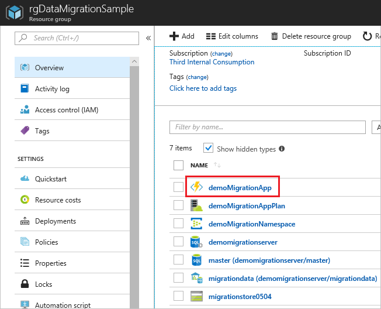
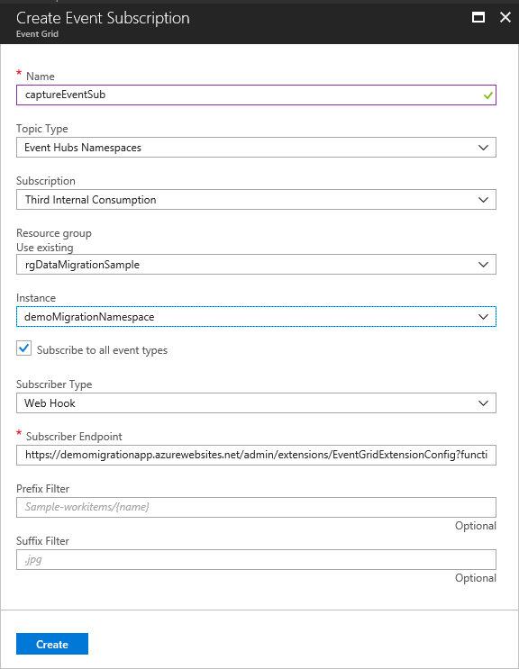
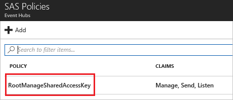
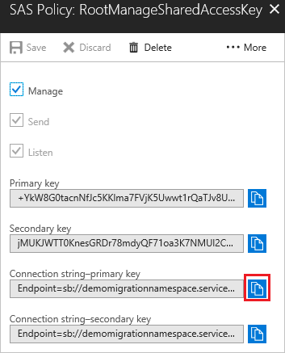

# Store captured Event Hubs data in a SQL Data Warehouse using Event Grid and Azure Functions

Event Hubs [Capture](https://docs.microsoft.com/en-us/azure/event-hubs/event-hubs-capture-overview) is the easiest way to automatically deliver streamed data in Event Hubs to an Azure Blob storage or Azure Data Lake store. You can subsequently process and deliver the data to any other storage destinations of your choice, such as SQL Data Warehouse or Cosmos DB. In this tutorial, you learn how you to capture data from your event hub into a SQL Database Warehouse by using an [Event Grid](https://docs.microsoft.com/azure/event-grid/overview) triggered Azure Function.


*	First, you create an event hub with the Capture feature enabled and set an Azure blob storage as the destination. Data generated by WindTurbineGenerator is streamed into the event hub and is automatically captured into Azure Storage as Avro files. 
*	Next, you create an Azure Event Grid subscription with the Event Hubs namespace as its source and the Azure Function endpoint as its destination.
*	Whenever a new Avro file is delivered to the Azure Storage blob by Event Hubs Capture, Event Grid notifies the Azure Function with the blob URI. The Function then migrates the data from the Storage blob to a SQL Database data warehouse.

In this tutorial, you do the following actions: 

> [!div class="checklist"]
> * Deploy the infrastructure for this solution 
> * Create a table in SQL Data Warehouse 
> * Publish code to the Functions App
> * Create an Event Grid subscription from the Functions app
> * Stream sample data intoEvent Hub. 
> * Verify captured data in SQL Data Warehouse

# Prerequisites

- [Visual studio 2017 Version 15.3.2 or greater](https://www.visualstudio.com/vs/). While installing, ensure that you install the following workloads: .NET desktop development, Azure development, ASP.NET and web development, Node.js development, Python development
- Download the [Git sample](https://github.com/Azure/azure-event-hubs/tree/master/samples/e2e/EventHubsCaptureEventGridDemo). The sample solution contains the following components:
    - *WindTurbineDataGenerator* – A simple publisher that sends sample wind turbine data to a Capture-enabled event hub
    - *FunctionDWDumper* – An Azure Function that receives an Event Grid notification when an Avro file is captured to the Azure Storage blob. It receives the blob’s URI path, reads its contents, and pushes this data to a SQL Data Warehouse.

## Deploy the infrastructure
Deploy the infrastructure needed for this tutorial by using this [Azure Resource Manager template](https://raw.githubusercontent.com/Azure/azure-docs-json-samples/master/event-grid/EventHubsDataMigration.json). This template creates the following resources:

-	Event Hub with the Capture feature enabled
-	Storage account for the captured event data
-	Azure app service plan for hosting the Functions app
-	Function app for processing captured event files
-	SQL Server for hosting the Data Warehouse
-	SQL Data Warehouse for storing the migrated data


To deploy the template using Azure CLI, use:

```azurecli-interactive
az group create -l westcentralus -n rgDataMigrationSample

az group deployment create \
  --resource-group rgDataMigrationSample \
  --template-uri https://raw.githubusercontent.com/Azure/azure-docs-json-samples/master/event-grid/EventHubsDataMigration.json \
  --parameters eventHubNamespaceName=<event-hub-namespace> eventHubName=hubdatamigration sqlServerName=<sql-server-name> sqlServerUserName=<user-name> sqlServerPassword=<password> sqlServerDatabaseName=<database-name> storageName=<unique-storage-name> functionAppName=<app-name>
```
To deploy the template using PowerShell, use:

```powershell
New-AzureRmResourceGroup -Name rgDataMigration -Location westcentralus

New-AzureRmResourceGroupDeployment -ResourceGroupName rgDataMigration -TemplateUri https://raw.githubusercontent.com/Azure/azure-docs-json-samples/master/event-grid/EventHubsDataMigration.json -eventHubNamespaceName <event-hub-namespace> -eventHubName hubdatamigration -sqlServerName <sql-server-name> -sqlServerUserName <user-name> -sqlServerDatabaseName <database-name> -storageName <unique-storage-name> -functionAppName <app-name>
```

## Create a table in SQL Data Warehouse 
Create a table in your SQL data warehouse by running the *CreateDataWarehouseTable.sql* script using Visual Studio or the Query Editor in the portal. 

## Publish code to the Functions App

1. Open the project solution *EventHubsCaptureEventGridDemo.sln* in Visual Studio 2017 (15.3.2 or greater). 

1. In Solution Explorer, right-click *FunctionEGDWDumper*, and select **Publish**.

   

1. Select **Azure Function App** and **Select Existing**. Select **Publish**.

   

1. Select the function app that you deployed through the template. Select **OK**.

   

1. When Visual Studio has configured the profile, select **Publish**.

   

After publishing the function, you are ready to subscribe to the Capture event!


## Create an Event Grid subscription from the Functions app
 
1. Go to the [Azure portal](https://portal.azure.com/). Select your resource group and function app.

   

1. Select the function.

   

1. Select **Add Event Grid subscription**.

   

1. Give the event grid subscription a name. Use **Event Hubs Namespaces** as the event type. Provide values to select your instance of the Event Hubs namespace. Leave the subscriber endpoint as the provided value. Select **Create**.

   

## Generate sample data  
You have now set up your Event Hub, SQL data warehouse, Azure Function App, and Event Grid subscription. Upon completing the simple configuration below, you can run WindTurbineDataGenerator.exe to generate data streams to the Event Hub. 

1. In the portal, select your event hub namespace. Select **Connection Strings**.

   

2. Select **RootManageSharedAccessKey**

   

3. Copy **Connection string - primary Key**

   

4. Go back to your Visual Studio project. In the *WindTurbineDataGenerator* project, open *program.cs*.

5. Replace the two constant values. Use the copied value for **EventHubConnectionString**. Use **hubdatamigration** the event hub name.

   ```cs
   private const string EventHubConnectionString = "Endpoint=sb://demomigrationnamespace.servicebus.windows.net/...";
   private const string EventHubName = "hubdatamigration";
   ```

6. Build the solution, then run the WindTurbineGenerator.exe application. 

## Verify captured data in data warehouse
After a couple of minutes, query the table in your data warehouse. You observe that data generated by the WindTurbineDataGenerator has been streamed to your Event Hub, Captured into an Azure Storage container, and then migrated into the SQL data table by Azure Function.  

## Next steps 
You can use powerful data visualization tools with your data warehouse to achieve your Actionable insights.

This article shows how to use [Power BI with SQL Data Warehouse](https://docs.microsoft.com/azure/sql-data-warehouse/sql-data-warehouse-integrate-power-bi)

Now you are all set to plug in the UI you need to get valuable business insights for your management.

