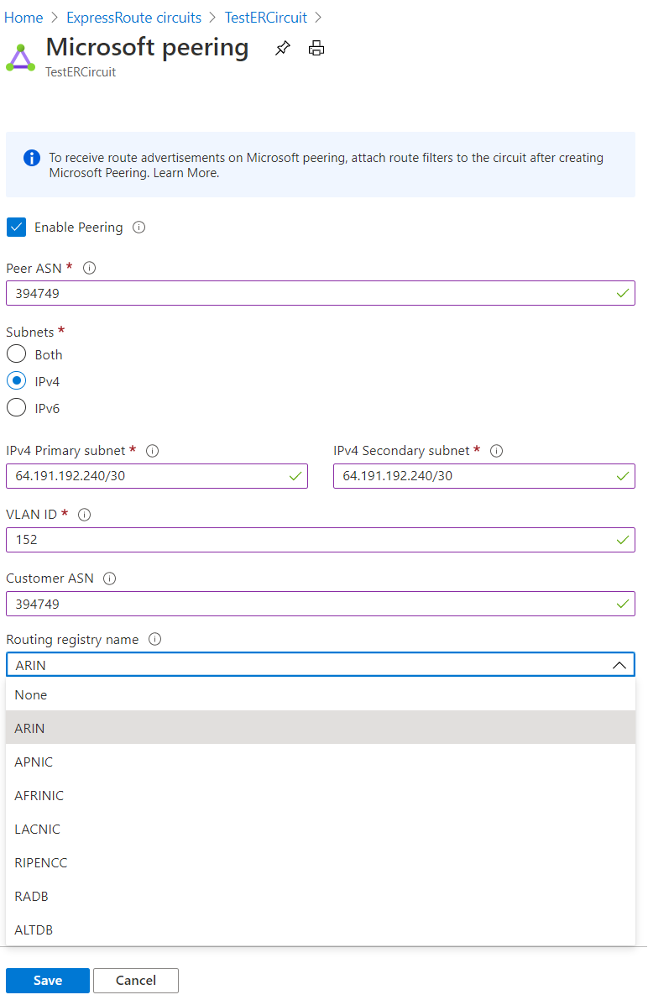
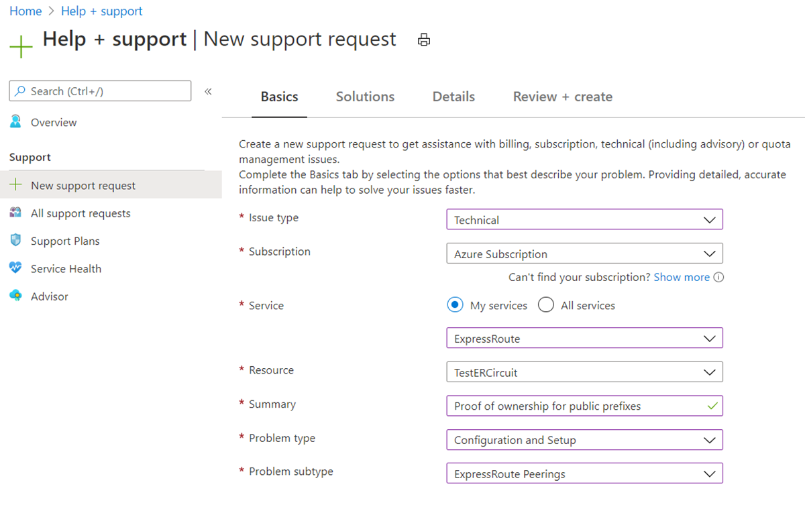
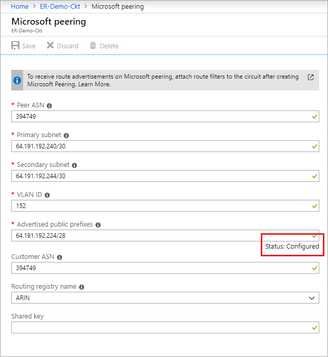
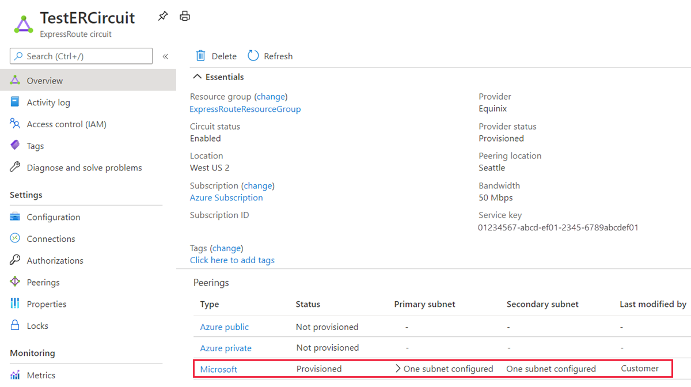
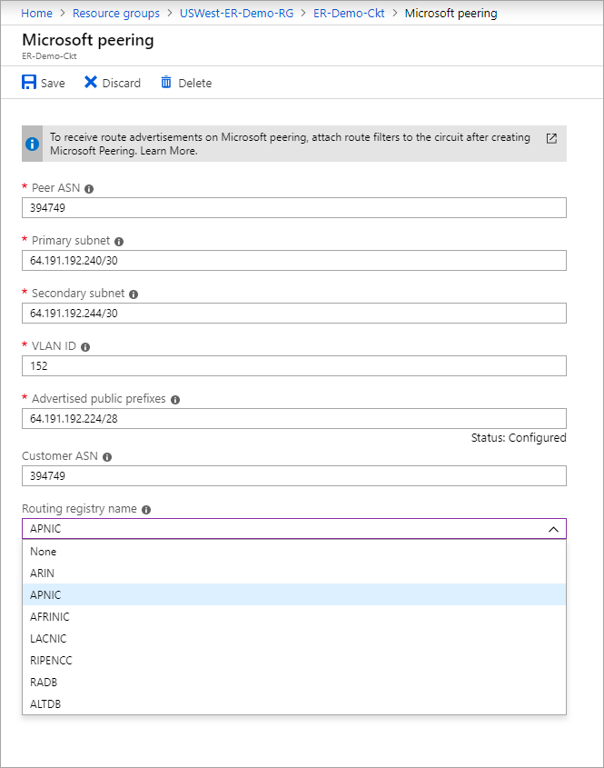
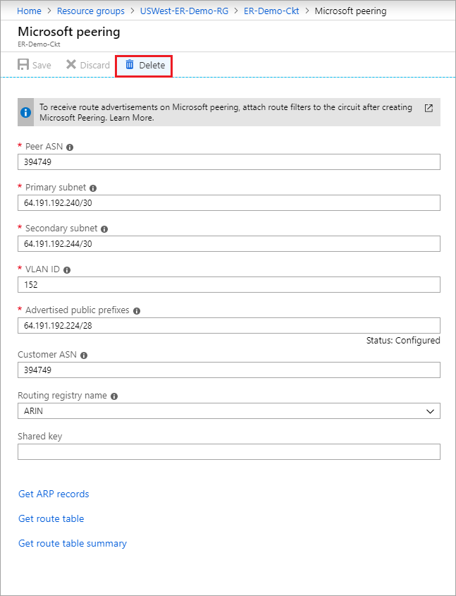
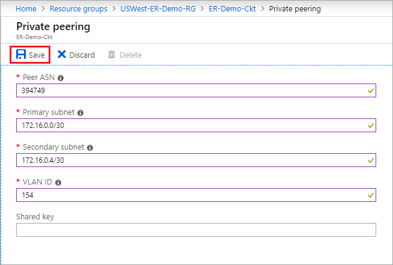
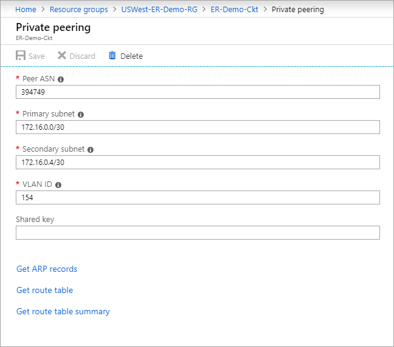
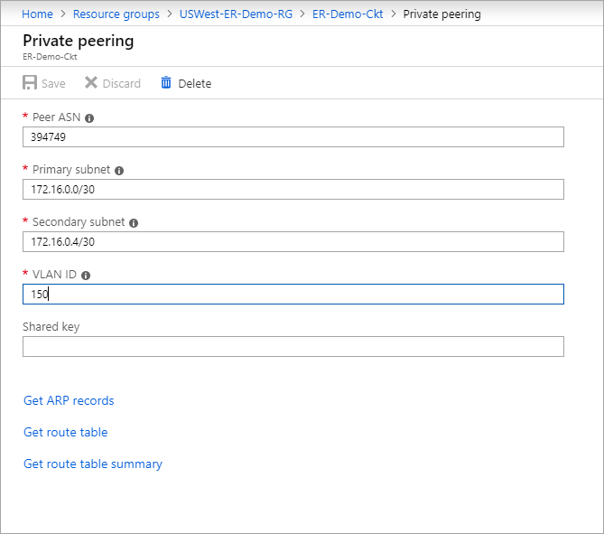
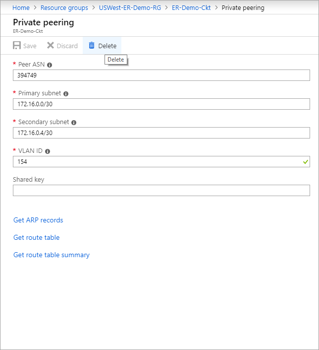

# Create and modify peering for an ExpressRoute circuit

This article helps you create and manage routing configuration for an Azure Resource Manager (ARM) ExpressRoute circuit, using the Azure portal. You can also check the status, update, or delete and deprovision peerings for an ExpressRoute circuit. If you want to use a different method to work with your circuit, select an article from the following list:

> [!div class="op_single_selector"]
> * [Azure portal](expressroute-howto-routing-portal-resource-manager.md)
> * [PowerShell](expressroute-howto-routing-arm.md)
> * [Azure CLI](howto-routing-cli.md)
> * [Video - Private peering](https://azure.microsoft.com/documentation/videos/azure-expressroute-how-to-set-up-azure-private-peering-for-your-expressroute-circuit)
> * [Video - Public peering](https://azure.microsoft.com/documentation/videos/azure-expressroute-how-to-set-up-azure-public-peering-for-your-expressroute-circuit)
> * [Video - Microsoft peering](https://azure.microsoft.com/documentation/videos/azure-expressroute-how-to-set-up-microsoft-peering-for-your-expressroute-circuit)
> * [PowerShell (classic)](expressroute-howto-routing-classic.md)
> 

You can configure Azure private and Microsoft peering for an ExpressRoute circuit (Azure public peering is deprecated for new circuits). You can configure peerings in any order you choose. However, you must make sure that you complete the configuration of each peering one at a time. For more information about routing domains and peerings, see [About circuits and peerings](expressroute-circuit-peerings.md).

## Configuration prerequisites

* Make sure that you have reviewed the [prerequisites](expressroute-prerequisites.md) page, the [routing requirements](expressroute-routing.md) page, and the [workflows](expressroute-workflows.md) page before you begin configuration.
* You must have an active ExpressRoute circuit. Follow the instructions to [Create an ExpressRoute circuit](expressroute-howto-circuit-portal-resource-manager.md) and have the circuit enabled by your connectivity provider before you proceed. In order to configure peering(s), the ExpressRoute circuit must be in a provisioned and enabled state. 
* If you plan to use a shared key/MD5 hash, be sure to use this on both sides of the tunnel and limit the number of alphanumeric characters to a maximum of 25. Special characters are not supported. 

These instructions only apply to circuits created with service providers offering Layer 2 connectivity services. If you are using a service provider that offers managed Layer 3 services (typically an IPVPN, like MPLS), your connectivity provider configures and manages routing for you. 

> [!IMPORTANT]
> We currently do not advertise peerings configured by service providers through the service management portal. We are working on enabling this capability soon. Check with your service provider before configuring BGP peerings.
> 
> 

## Microsoft peering

This section helps you create, get, update, and delete the Microsoft peering configuration for an ExpressRoute circuit.

> [!IMPORTANT]
> Microsoft peering of ExpressRoute circuits that were configured prior to August 1, 2017 will have all service prefixes advertised through the Microsoft peering, even if route filters are not defined. Microsoft peering of ExpressRoute circuits that are configured on or after August 1, 2017 will not have any prefixes advertised until a route filter is attached to the circuit. For more information, see [Configure a route filter for Microsoft peering](how-to-routefilter-powershell.md).
> 
> 

### To create Microsoft peering

1. Configure the ExpressRoute circuit. Ensure that the circuit is fully provisioned by the connectivity provider before continuing further.

   If your connectivity provider offers managed Layer 3 services, you can ask your connectivity provider to enable Microsoft peering for you. In that case, you won't need to follow the instructions listed in the next sections. However, if your connectivity provider does not manage routing for you, after creating your circuit, proceed with these steps.

   **Circuit - Provider status: Not provisioned**

   

    

   **Circuit - Provider status: Provisioned**

   
2. Configure Microsoft peering for the circuit. Make sure that you have the following information before you proceed.

   * A /30 subnet for the primary link. This must be a valid public IPv4 prefix owned by you and registered in an RIR / IRR. From this subnet you will assign the first useable IP address to your router as Microsoft uses the second useable IP for its router.
   * A /30 subnet for the secondary link. This must be a valid public IPv4 prefix owned by you and registered in an RIR / IRR. From this subnet you will assign the first useable IP address to your router as Microsoft uses the second useable IP for its router.
   * A valid VLAN ID to establish this peering on. Ensure that no other peering in the circuit uses the same VLAN ID. For both Primary and Secondary links you must use the same VLAN ID.
   * AS number for peering. You can use both 2-byte and 4-byte AS numbers.
   * Advertised prefixes: You must provide a list of all prefixes you plan to advertise over the BGP session. Only public IP address prefixes are accepted. If you plan to send a set of prefixes, you can send a comma-separated list. These prefixes must be registered to you in an RIR / IRR.
   * **Optional -** Customer ASN: If you are advertising prefixes that are not registered to the peering AS number, you can specify the AS number to which they are registered.
   * Routing Registry Name: You can specify the RIR / IRR against which the AS number and prefixes are registered.
   * **Optional -** An MD5 hash if you choose to use one.
3. You can select the peering you wish to configure, as shown in the following example. Select the Microsoft peering row.

   
4. Configure Microsoft peering. Save the configuration once you have specified all parameters. The following image shows a configuration example:

   

   If your circuit gets to a 'Validation needed' state, you must open a support ticket to show proof of ownership of the prefixes to our support team. You can open a support ticket directly from the portal, as shown in the following example:

   

5. After the configuration has been accepted successfully, you'll see something similar to the following image:

   

### To view Microsoft peering details

You can view the properties of Microsoft peering by selecting the row for the peering.

### To update Microsoft peering configuration

You can select the row for the peering that you want to modify, then modify the peering properties and save your modifications.

### To delete Microsoft peering

You can remove your peering configuration by clicking the delete icon, as shown in the following image:

## Azure private peering

This section helps you create, get, update, and delete the Azure private peering configuration for an ExpressRoute circuit.

### To create Azure private peering

1. Configure the ExpressRoute circuit. Ensure that the circuit is fully provisioned by the connectivity provider before continuing. 

   If your connectivity provider offers managed Layer 3 services, you can ask your connectivity provider to enable Azure private peering for you. In that case, you won't need to follow the instructions listed in the next sections. However, if your connectivity provider does not manage routing for you, after creating your circuit, proceed with the next steps.

   **Circuit - Provider status: Not provisioned**

   

   **Circuit - Provider status: Provisioned**

   

2. Configure Azure private peering for the circuit. Make sure that you have the following items before you proceed with the next steps:

   * A /30 subnet for the primary link. The subnet must not be part of any address space reserved for virtual networks. From this subnet you will assign the first useable IP address to your router as Microsoft uses the second useable IP for its router.
   * A /30 subnet for the secondary link. The subnet must not be part of any address space reserved for virtual networks. From this subnet you will assign the first useable IP address to your router as Microsoft uses the second useable IP for its router.
   * A valid VLAN ID to establish this peering on. Ensure that no other peering in the circuit uses the same VLAN ID. For both Primary and Secondary links you must use the same VLAN ID.
   * AS number for peering. You can use both 2-byte and 4-byte AS numbers. You can use a private AS number for this peering except for the number from 65515 to 65520, inclusively.
   * **Optional -** An MD5 hash if you choose to use one.
3. Select the Azure private peering row, as shown in the following example:

   
4. Configure private peering. Save the configuration once you have specified all parameters.

   
5. After the configuration has been accepted successfully, you see something similar to the following example:

   

### To view Azure private peering details

You can view the properties of Azure private peering by selecting the peering.

### To update Azure private peering configuration

You can select the row for peering and modify the peering properties. After updating, save your changes.

### To delete Azure private peering

You can remove your peering configuration by selecting the delete icon, as shown in the following image:

> [!WARNING]
> You must ensure that all virtual networks and ExpressRoute Global Reach connections are removed before running this example. 
> 
> 

## Azure public peering

This section helps you create, get, update, and delete the Azure public peering configuration for an ExpressRoute circuit.

> [!Note]
> Azure public peering is deprecated for new circuits. For more information, see [ExpressRoute peering](expressroute-circuit-peerings.md).
>

### To view Azure public peering details

View the properties of Azure public peering by selecting the peering.

### To update Azure public peering configuration

Select the row for peering, then modify the peering properties.

### To delete Azure public peering

Remove your peering configuration by selecting the delete icon.

## Next steps

Next step, [Link a VNet to an ExpressRoute circuit](expressroute-howto-linkvnet-portal-resource-manager.md)
* For more information about ExpressRoute workflows, see [ExpressRoute workflows](expressroute-workflows.md).
* For more information about circuit peering, see [ExpressRoute circuits and routing domains](expressroute-circuit-peerings.md).
* For more information about working with virtual networks, see [Virtual network overview](../virtual-network/virtual-networks-overview.md).
