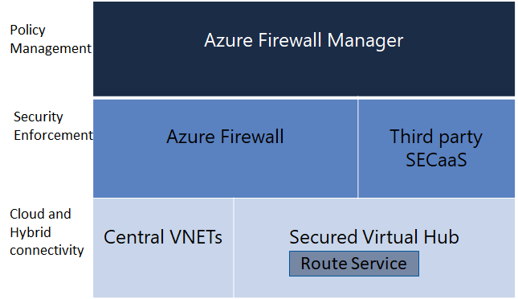
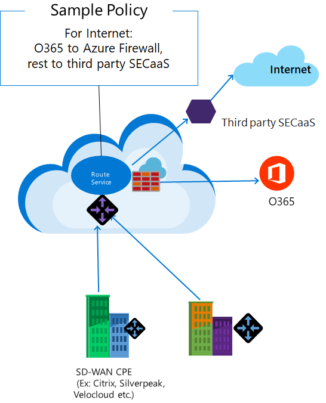

# What is Azure Firewall Manager?

Azure Firewall Manager is a globally distributed management service to centrally configure, deploy, log, and manage security and route policies. It protects and governs traffic flows to protect Azure workloads, devices, and users. Both Azure Firewall and third-party security services can be managed. It allows you to more easily create network segments and run their Internet edge on Azure.

## Azure Firewall Manager Features

Azure Firewall Manager offers the following features:

### Hierarchical policies (global and local)​

You can use Firewall Manager to centrally manage firewall and route policy across multiple secured virtual hubs. You can create global policies that span multiple secured virtual hubs and add local policies for specific hubs.​

### Centralized route management for traffic attraction​

You can use Azure Firewall for VNet to VNet traffic policies and micro-segmentation. To secure VNet to Internet traffic, you can use either Azure Firewall or third-party SECaaS (Security as a Service) providers. Firewall Manager automatically routes traffic to Azure Firewall or third-party SECaaS providers without the need to manually set up user defined routes.

### Integrated with third party SECaaS for advanced security

In addition to Azure Firewall, you can integrate third-party SECaaS (Security as a Service) providers to provide additional network protection for your VNet to Internet connections.

### Optimal Office 365 access from VNets (VDI) and branches

Using secured virtual hubs, you can route traffic from your VNets and branches to your secured virtual hub. On the secured virtual hub, you can configure Azure Firewall or third-party SECaaS providers to protect the branch-to-Internet and VNet-to-Intent traffic.

For Office 365 and other Azure PaaS traffic, you can create policies that bypass your third-party SECaaS from the hub. Using Azure Firewall, a single click is all that's required to configure this policy.

### Security policy configuration and logging across multiple Azure Firewall instances

### Automated multiple Azure Firewall deployment​

## Known issues

Azure Firewall Manager has the following known issues:

|Issue  |Description  |Mitigation  |
|---------|---------|---------|

## Next steps

