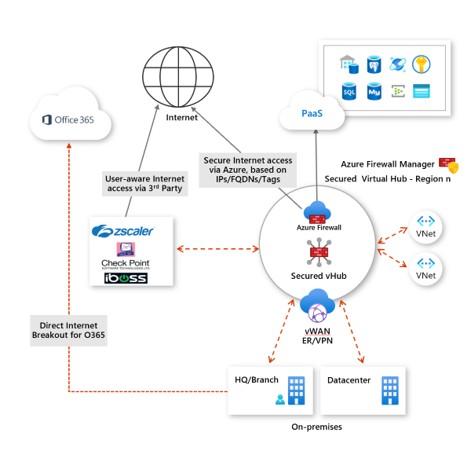

# What are trusted security partners (preview)?

> [!IMPORTANT]
> This public preview is provided without a service level agreement and should not be used for production workloads. Certain features may not be supported, may have constrained capabilities, or may not be available in all Azure locations. See the [Supplemental Terms of Use for Microsoft Azure Previews](https://azure.microsoft.com/support/legal/preview-supplemental-terms/) for details.

*Trusted security partners (preview)* in Azure Firewall Manager allows you to use your familiar, best-in-breed, third-party security as a service (SECaaS) offerings to protect Internet access for your users.

With a quick configuration, you can secure a hub with a supported security partner, and centrally route and filter Internet traffic from your Virtual Networks (VNets) or branch locations. This is done using automated route management, without setting up and managing User Defined Routes (UDRs).

You can deploy secured hubs configured with a security partner of your choice in multiple Azure regions to get optimal connectivity and security for your users anywhere across the globe in those regions. With the ability to use the security partner’s offering for Internet/SaaS application traffic, and Azure Firewall for private traffic in the secured hubs, you can now start building your security edge on Azure that is close to your globally distributed users and applications.

For this preview, the supported security partners are ZScaler and iboss.

## Key scenarios

You can use the security partners to filter Internet traffic in following scenarios:

- Virtual Network (VNet) to Internet

   Leverage advanced user-aware Internet protection for your cloud workloads running on Azure.

- Branch to Internet

   Leverage your Azure connectivity and global distribution to easily add third-party NSaaS filtering for branch to Internet scenarios. You can build your global transit network and security edge using Azure Virtual WAN.

The following scenarios are supported:
-	VNet to Internet via a third-party partner offering.
-	Branch to Internet via a third-party partner offering.
-	Branch to Internet via a third-party partner offering, the rest of the private traffic (Spoke-to-Spoke, Spoke-to-Branches, Branch-to-Spokes) via Azure Firewall.

The following scenario isn't supported:

- VNet to Internet via a partner offering can't be combined with Azure Firewall for private traffic. See the following limitations.

## Current Limitations

- For VNet to Internet, you can't mix adding Azure Firewall for private traffic and a partner offering for Internet traffic. You can either send Internet traffic to Azure Firewall or a third-party security partner offering in the secured virtual hub, but not both. 
- You can deploy at most one security partner per virtual hub. If you need to change the provider, you must remove the existing partner and add a new one.

## Best practices for Internet traffic filtering in secured virtual hubs

Internet traffic typically includes web traffic. But it also includes traffic destined to SaaS applications like Office 365 (O365) and Azure public PaaS services like Azure Storage, Azure Sql, and so on. 
 
- Use Azure Firewall for protection if your traffic consists mostly of Azure PaaS, and the resource access for your applications can be filtered using IP addresses, FQDNs, Service tags, or FQDN tags.

- Use a third-party partner solution in your hubs if your traffic consists of SaaS application access, or you need user-aware filtering (for example, for your virtual desktop infrastructure (VDI) workloads) or you need advanced Internet filtering capabilities.

## Handling Office 365 (O365) traffic

In globally distributed branch location scenarios, you should redirect Office 365 traffic directly at the branch before sending the remaining Internet traffic your Azure secured hub.

Office 365 runs on the Microsoft global network, with front-ends located close to the user’s location. Breaking out Office 365 locally ensures that you get the most optimal connectivity to Office 365 services across the globe.

To learn more about Office 365 connectivity principles, see [Office 365 Network Connectivity Principles](https://docs.microsoft.com/office365/enterprise/office-365-network-connectivity-principles).

For guidance about securing your Office 365 access, see [Assess bypassing proxies, traffic inspection devices and duplicate security technologies](https://docs.microsoft.com/office365/enterprise/office-365-network-connectivity-principles#assess-bypassing-proxies-traffic-inspection-devices-and-duplicate-security-technologies).

If you're an existing SD-WAN customer using Azure Virtual WAN, you can leverage Office 365 breakout policy APIs for on-boarded SD-WAN partners to configure direct breakout for Office 365 traffic.

For more information about how to configure Office 365 breakout policies in Azure, see [How do I set my O365 policies via Virtual WAN?](https://docs.microsoft.com/azure/virtual-wan/virtual-wan-office365-overview#how-do-i-set-my-o365-policies-via-virtual-wan).

## Next steps

Deploy a trusted security offering in a secured hub, using Azure Firewall Manager.