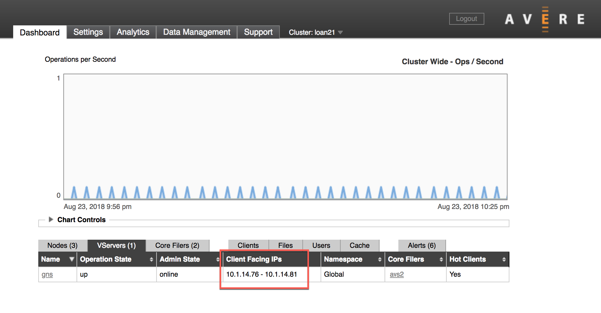

# Tutorial: Mount the cluster

[ **XXX needs careful review - adapted from the vFXT doc set XXX** ]

This tutorial teaches how to mount clients to the FXT Edge Filer cluster using the virtual namespace paths that you assigned when you added back-end storage. 

This tutorial teaches: 

> [!div class="checklist"]
> * Strategies for load balancing clients across the range of client-facing IP addresses
> * How to construct a mount path from a client-facing IP address and namespace junction
> * Which arguments to use in a mount command

This tutorial takes approximately 45 minutes to complete. 


## Steps to mount the cluster 

Follow these steps to connect client machines to your FXT Edge Filer cluster.

1. Decide how to load-balance client traffic among your cluster nodes. Read [Balance client load](#balance-client-load), below, for details. 
1. Identify the IP address and junction path to mount.
1. Issue the [mount command](#mount-command-arguments), with appropriate arguments.

## Balance client load

To help balance client requests among all the nodes in the cluster, you should mount clients to the full range of client-facing IP addresses. There are several ways to automate this task.

To learn about round-robin DNS load balancing for the cluster, read [Configure DNS for the FXT Edge Filer cluster](fxt-configure-network.md#configure-dns-for-the-fxt-edge-filer-cluster). This method requires you to maintain a DNS server, which is not explained in these articles. 

A simpler method for small installations is to use a script to assign IP addresses throughout the range at client mount time. Read the [sample balanced client mount script](#sample-balanced-client-mounting-script) below. 

Other load balancing methods might be appropriate for large or complicated systems. Consult your Microsoft representative or open a support request for help.

### Sample balanced client mounting script

This code example uses client IP addresses as a randomizing element to distribute clients to all of the Edge Filer cluster's available IP addresses.

```bash
function mount_round_robin() {
    # to ensure the nodes are spread out somewhat evenly the default 
    # mount point is based on this node's IP octet4 % FXT node count.
    declare -a FXT_NODES="($(echo ${NFS_IP_CSV} | sed "s/,/ /g"))"
    OCTET4=$((`hostname -i | sed -e 's/^.*\.\([0-9]*\)/\1/'`))
    DEFAULT_MOUNT_INDEX=$((${OCTET4} % ${#FXT_NODES[@]}))
    ROUND_ROBIN_IP=${FXT_NODES[${DEFAULT_MOUNT_INDEX}]}

    DEFAULT_MOUNT_POINT="${BASE_DIR}/default"

    # no need to write again if it is already there
    if ! grep --quiet "${DEFAULT_MOUNT_POINT}" /etc/fstab; then
        echo "${ROUND_ROBIN_IP}:${NFS_PATH}    ${DEFAULT_MOUNT_POINT}    nfs hard,nointr,proto=tcp,mountproto=tcp,retry=30 0 0" >> /etc/fstab
        mkdir -p "${DEFAULT_MOUNT_POINT}"
        chown nfsnobody:nfsnobody "${DEFAULT_MOUNT_POINT}"
    fi
    if ! grep -qs "${DEFAULT_MOUNT_POINT} " /proc/mounts; then
        retrycmd_if_failure 12 20 mount "${DEFAULT_MOUNT_POINT}" || exit 1
    fi   
} 
```

## Create the mount command 

From your client, the ``mount`` command maps the virtual server (vserver) on the FXT Edge Filer cluster to a path on the local filesystem. The format is ``mount <FXT path> <local path> {options}``

There are three elements to the mount command: 

* cluster path - (a combination of IP address and namespace junction path described below)
* local path - the path on the client 
* mount command options - (listed in [Mount command arguments](#mount-command-arguments))

### Junction and IP

The cluster path is a combination of the vserver *IP address* plus the path to a *namespace junction*. The namespace junction is a virtual path that you defined when you [added the storage system](fxt-add-storage.md#create-a-junction).

Example: ``mount 10.0.0.12:/sd-access /mnt/fxt``

If you added storage after creating the cluster, the namespace junction path corresponds to the value you set in **Namespace path** when creating the junction. For example, if you used ``/fxt/files`` as your namespace path, your clients would mount *IP_address*:/fxt/files to their local mount point.


[ xxx would be nice to replace that /\ screenshot xxx ]

The IP address is one of the client-facing IP addresses defined for the vserver. You can find the range of client-facing IPs in two places in the cluster Control Panel:

* **VServers** table (Dashboard tab) - 

  

* **Client Facing Network** settings page - 

  

In addition to the paths, include the [Mount command arguments](#mount-command-arguments) described below when mounting each client.

### Mount command arguments

To ensure a seamless client mount, pass these settings and arguments in your mount command: 

``mount -o hard,nointr,proto=tcp,mountproto=tcp,retry=30 ${VSERVER_IP_ADDRESS}:/${NAMESPACE_PATH} ${LOCAL_FILESYSTEM_MOUNT_POINT}``

[ xxx need to have someone review these settings which were based on vFTX clusters (not hardware) - what should change? xxx ]

| Required settings | |
--- | --- 
``hard`` | Soft mounts to the Edge Filer cluster are associated with application failures and possible data loss. 
``proto=netid`` | This option supports appropriate handling of NFS network errors.
``mountproto=netid`` | This option supports appropriate handling of network errors for mount operations.
``retry=n`` | Set ``retry=30`` to avoid transient mount failures. (A different value is recommended in foreground mounts.)

| Preferred settings  | |
--- | --- 
``nointr``            | The option "nointr" is recommended if your client operating systems are older kernels (prior to April 2008) and support this option. The option "intr" is the default.


## Next steps

After you have mounted clients, you can test your workflow and get started with your cluster.

If you need to move data to a new cloud core filer, use parallel data ingest strategies like those described in [Moving data to a vFXT cluster](https://docs.microsoft.com/azure/avere-vfxt/avere-vfxt-data-ingest). (The Avere vFXT for Azure is a cloud-based product that uses caching technology very similar to the FXT Edge Filer.)

Read [Monitor FXT Edge Server hardware status](fxt-monitor.md) if you need to troubleshoot any hardware issues. 
