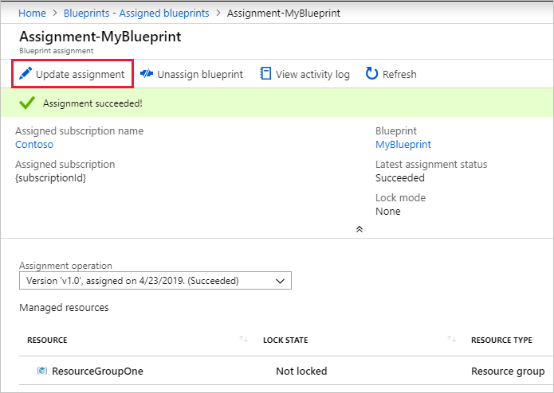
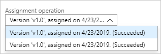

# How to update an existing blueprint assignment

When a blueprint is assigned, the assignment can be updated. There are several reasons for updating
an existing assignment, including:

- Add or remove [resource locking](../concepts/resource-locking.md)
- Change the value of [dynamic parameters](../concepts/parameters.md#dynamic-parameters)
- Upgrade the assignment to a newer **Published** version of the blueprint

## Updating assignments

1. Launch the Azure Blueprints service in the Azure portal by clicking on **All services** and searching for and selecting **Policy** in the left pane. On the **Policy** page, click on **Blueprints**.

1. Select **Assigned Blueprints** from the page on the left.

1. In the list of blueprints, left-click the blueprint assignment and then click the **Update Assignment** button OR right-click the blueprint assignment and select **Update Assignment**.

   

1. The **Assign Blueprint** page will load pre-filled with all values from the original assignment. You can change the **blueprint definition version**, the **Lock Assignment** state, and any of the dynamic parameters that exist on the blueprint definition. Click **Assign** when done making changes.

1. On the updated assignment details page, see the new status. In this example, we added **Locking** to the assignment.

   

1. Explore details about other **Assignment Operations** using the drop-down. The table of **Managed Resources** updates by selected assignment operation.

   

## Rules for updating assignments

The deployment of the updated assignments follows a few important rules. These rules determine what
happens to an existing resource depending on the requested change and the type of artifact resource being deployed or updated.

- Role Assignments
  - If the role or the role assignee (user, group, or app) changes, a new role assignment is created. The previously deployed role assignment is left in place.
- Policy Assignments
  - If the parameters of the policy assignment are changed, the existing assignment is updated.
  - If the definition of the policy assignment are changed, a new policy assignment is created. The previously deployed policy assignment is left in place.
  - If the policy assignment artifact is removed from the blueprint, the previously deployed policy assignment is left in place.
- Azure Resource Manager templates
  - The template is processed through Resource Manager as a **PUT**. As each resource type handles this differently, review the documentation for each included resource to determine the impact of this action when run by Blueprints.

## Possible errors on updating assignments

When updating assignments, it is possible to make changes that break when executed. An example of
this is changing the location of a resource group after it has already been deployed. Any change
that are supported by [Azure Resource
Manager](../../../azure-resource-manager/resource-group-overview.md) can be made, but any change
that would result in an error through Azure Resource Manager will also result in the failure of the
assignment.

There is no limit on how many times an assignment can be updated. Thus, if an error occurs, either
due to a bad parameter, an already existing object, or a change disallowed by Azure Resource
Manager, determine the error and make another update to the assignment.

## Next steps

- Learn about the [blueprint life-cycle](../concepts/lifecycle.md)
- Understand how to use [static and dynamic parameters](../concepts/parameters.md)
- Learn to customize the [blueprint sequencing order](../concepts/sequencing-order.md)
- Find out how to make use of [blueprint resource locking](../concepts/resource-locking.md)
- Resolve issues during the assignment of a blueprint with [general troubleshooting](../troubleshoot/general.md)