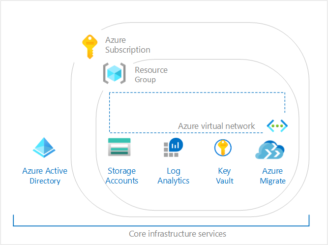

# Overview of the Microsoft Cloud Adoption Framework for Azure Migration landing zone blueprint sample

The Microsoft Cloud Adoption Framework for Azure (CAF) migration landing zone blueprint is a set of infrastructure to help you setup for migrating your first workload and manage your cloud estate in alignment with CAF.

The [CAF Foundation](../caf-governance/index.md) blueprint sample extends this sample.

## Architecture

The CAF Migration landing zone blueprint sample deploys foundation infrastructure resources in Azure that can be used by organizations to prepare their subscription for migrating virtual machines in to.  It also helps put in place the governance controls necessary to manage their cloud estate.
This sample will deploy and enforce resources, policies and templates that will allow an organization to confidently get started with Azure.

This environment is composed of several Azure services used to provide a secure, fully monitored,
enterprise-ready governance. This environment is
composed of:

- An [Azure Key Vault](../../../../key-vault/key-vault-whatis.md) instance used to host secrets used for the Certificates, Keys and Secrets deployed in the shared services environment
- Deploy [Log Analytics](../../../../azure-monitor/overview.md) is deployed to ensure all actions and services log to a central location from the moment you start your migration
- Deploy [Azure Security Center](../../../../security-center/security-center-intro.md) (standard version) provides threat protection for your migrated workloads.
- Deploy [Azure Virtual Network](../../../../virtual-network/virtual-networks-overview.md) providing an isolated network and subnets for your virtual machine.
- Deploy [Azure Migrate Project](../../../..//migrate/migrate-overview.md) for discovery and assessment. We are adding the tools for Server assessment, Server migration, Database assessment and Database migration.  

All these elements abide to the proven practices published in the [Azure Architecture Center - Reference Architectures](/azure/architecture/reference-architectures/).

> [!NOTE]
> The CAF Migration blueprint lays out a landing zone for your workloads.
> You still need to perform the assessment and migration of your Virtual Machines / Databases on top of this foundational architecture.

For more information, see the [Microsoft Cloud Adoption Framework for Azure - Migrate](/azure/architecture/cloud-adoption/migrate/).

## Next steps

You've reviewed the overview and architecture of the CAF Migrate landing zone blueprint sample.

> [!div class="nextstepaction"]
>  [CAF Migrate landing zone blueprint - Deploy steps](./deploy.md)

Addition articles about blueprints and how to use them:

- Learn about the [blueprint life-cycle](../../concepts/lifecycle.md).
- Understand how to use [static and dynamic parameters](../../concepts/parameters.md).
- Learn to customize the [blueprint sequencing order](../../concepts/sequencing-order.md).
- Find out how to make use of [blueprint resource locking](../../concepts/resource-locking.md).
- Learn how to [update existing assignments](../../how-to/update-existing-assignments.md).