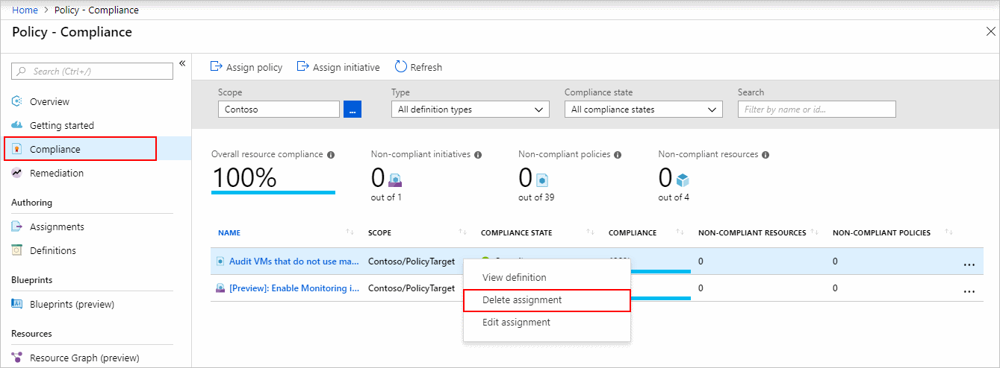

# Create a policy assignment to identify non-compliant resources by using Resource Manager template

The first step in understanding compliance in Azure is to identify the status of your resources.
This quickstart steps you through the process of creating a policy assignment to identify virtual
machines that aren't using managed disks.

At the end of this process, you'll successfully identify virtual machines that aren't using managed
disks. They're *non-compliant* with the policy assignment.

If you don't have an Azure subscription, create a [free](https://azure.microsoft.com/free/) account
before you begin.

## Create a policy assignment

Azure Policy comes with built-in policy definitions you can use. Many are available, such as:

* Enforce tag and its value
* Apply tag and its value
* Require SQL Server version 12.0

In this quickstart, you create a policy assignment and assign a built-in policy definition called *Audit VMs that do not use managed disks*. For a partial list of available built-in policies, see [Policy samples](/azure/governance/policy/samples/index).

There are several methods for creating policy assignments. In this quickstart, you use a [quickstart template](https://azure.microsoft.com/resources/templates/101-azurepolicy-assign-buildinpolicy-resourcegroup/). Here is a copy of the template:

[!resource-manager-template[create azure policy assignments resource manager templates](~/quickstart-templates/101-azurepolicy-assign-buildinpolicy-resourcegroup/azuredeploy.json)]

The template defines several parameters, which include the policy assignment name and the policy definition ID. Many people choose to use the policy display name as the policy assignment name. To retrieve the policy definition ID of *Audit VMs that do not use managed disks*, select **Try it** from the following code section to open the Azure Cloud shell. To paste the code, right-click the shell console, and then select **Paste**.

```azurepowershell-interactive
$definition = Get-AzPolicyDefinition | Where-Object { $_.Properties.DisplayName -eq 'Audit resource location matches resource group location' }
$policyAssignmentName = $definition.Properties.displayName
$policyDefinitionID = $definition.PolicyDefinitionId
```

1. Select the following image to sign in to the Azure portal and open the template:

    <a href="https://portal.azure.com/#create/Microsoft.Template/uri/https%3A%2F%2Fraw.githubusercontent.com%2FAzure%2Fazure-quickstart-templates%2Fmaster%2F101-azurepolicy-assign-buildinpolicy-resourcegroup%2Fazuredeploy.json"></a>

2. Select or enter the following values:

    | Name | Value |
    |------|-------|
    | Subscription | Select your Azure subscription. |
    | Resource group | Select **Create new**, specify a name, and then select **OK**. In the screenshot, the resource group name is *mypolicyquickstart<Date in MMDD>rg*. |
    | Location | Select a region. For exammple, **Central US**. |
    | Policy Assignment Name | Specify a policy assignment name. You can use the policy definition display if you want. For example, **Audit VMs that do not use managed disks**. |
    | Rg Name | Specify a resource group name where you want to assign the policy to. In this quickstart, use the default value **[resourceGroup().name]**. **resourceGroup()** is a template function that retrieve the resource group. |
    | Policy Definition ID | Specify the policy definition ID you retrieved by using the PowerShell script at the beginning of this section. |
    | I agree to the terms and conditions stated above | (Select) |

3. Select **Purchase**.

## Identify non-compliant resources

Select **Compliance** in the left side of the page. Then locate the **Audit VMs that do not use
managed disks** policy assignment you created.


If there are any existing resources that aren't compliant with this new assignment, they appear
under **Non-compliant resources**.

When a condition is evaluated against your existing resources and found true, then those resources
are marked as non-compliant with the policy. The following table shows how different policy effects
work with the condition evaluation for the resulting compliance state. Although you don’t see the
evaluation logic in the Azure portal, the compliance state results are shown. The compliance state
result is either compliant or non-compliant.

| **Resource State** | **Effect** | **Policy Evaluation** | **Compliance State** |
| --- | --- | --- | --- |
| Exists | Deny, Audit, Append\*, DeployIfNotExist\*, AuditIfNotExist\* | True | Non-Compliant |
| Exists | Deny, Audit, Append\*, DeployIfNotExist\*, AuditIfNotExist\* | False | Compliant |
| New | Audit, AuditIfNotExist\* | True | Non-Compliant |
| New | Audit, AuditIfNotExist\* | False | Compliant |

\* The Append, DeployIfNotExist, and AuditIfNotExist effects require the IF statement to be TRUE. The effects also require the existence condition to be FALSE to be non-compliant. When TRUE, the IF condition triggers evaluation of the existence condition for the related resources.

## Clean up resources

To remove the assignment created, follow these steps:

1. Select **Compliance** (or **Assignments**) in the left side of the Azure Policy page and locate the **Audit VMs that do not use managed disks** policy assignment you created.

1. Right-click the **Audit VMs that do not use managed disks** policy assignment and select **Delete assignment**

   

## Next steps

In this quickstart, you assigned a policy definition to a scope and evaluated its compliance
report. The policy definition validates that all the resources in the scope are compliant and
identifies which ones aren't.

To learn more about assigning policies to validate that new resources are compliant, continue to
the tutorial for:

> [!div class="nextstepaction"]
> [Creating and managing policies](./tutorials/create-and-manage.md)