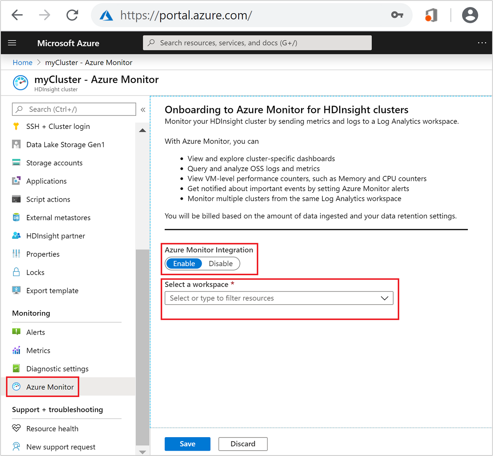
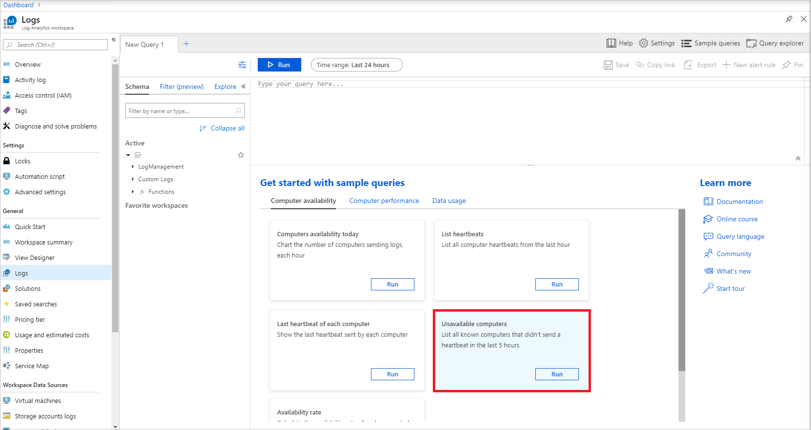
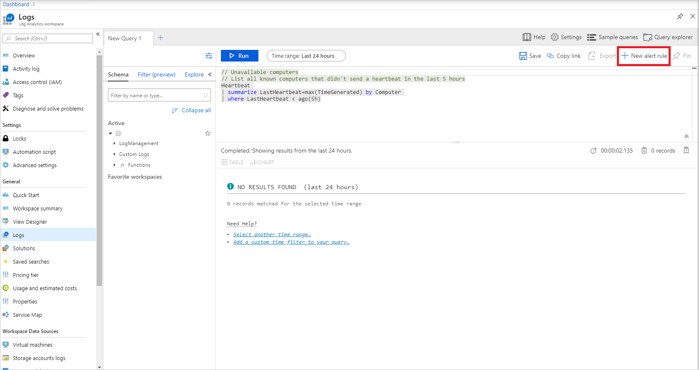
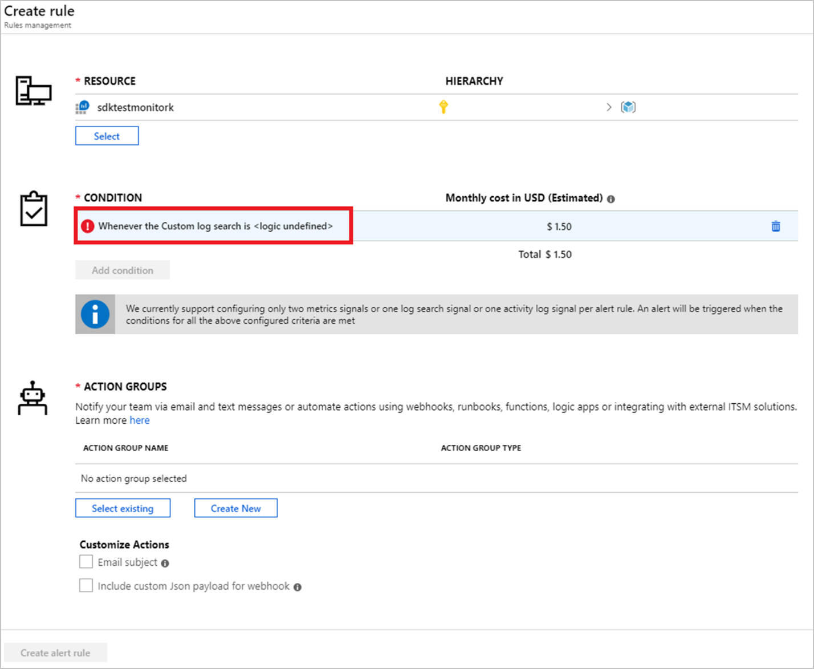
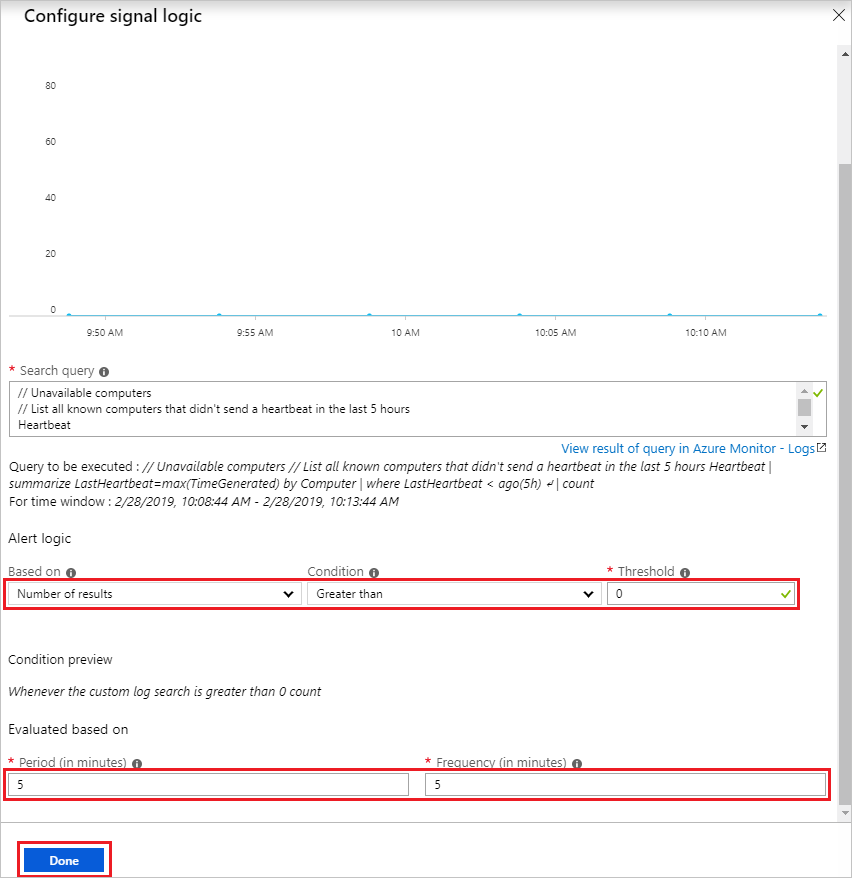
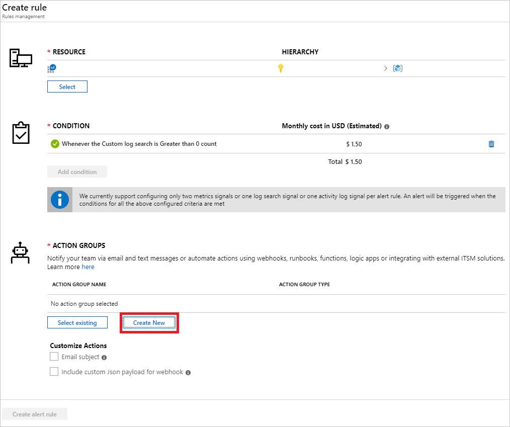
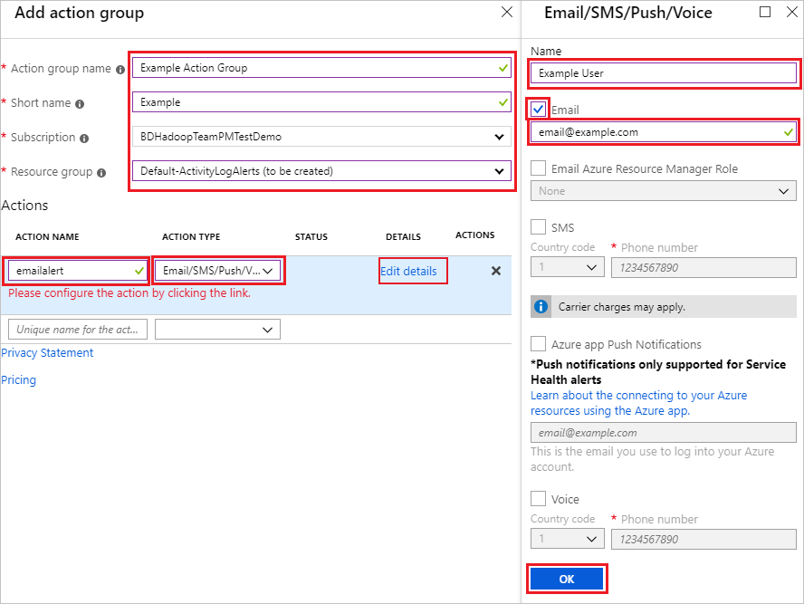
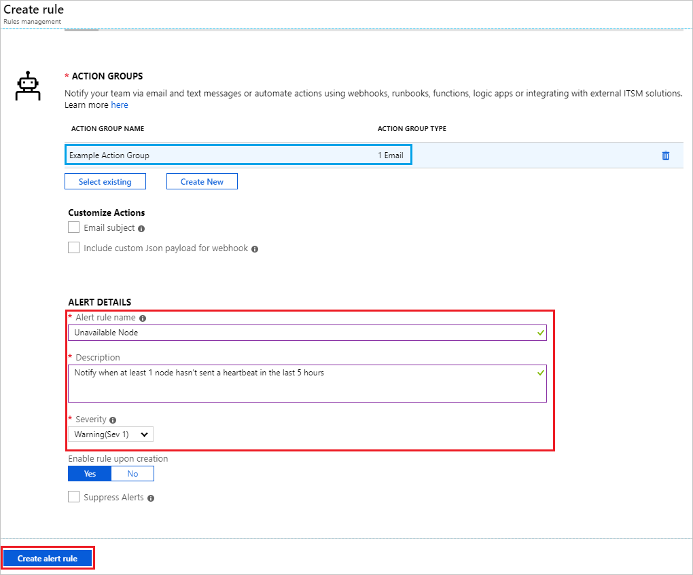

# How to monitor cluster availability with Azure Monitor logs in HDInsight

HDInsight clusters include Azure Monitor logs integration, which provides queryable metrics and logs, as well as configurable alerts. This article shows how to use Azure Monitor to monitor your cluster.

## Azure Monitor logs integration

Azure Monitor logs enable data generated by multiple resources, such as HDInsight clusters, to be collected and aggregated in one place to achieve a unified monitoring experience.

As a prerequisite, you'll need a Log Analytics Workspace to store the collected data. If you haven't already created one, you can follow instructions here: [Create a Log Analytics Workspace](https://docs.microsoft.com/azure/azure-monitor/learn/quick-create-workspace).

## Enable HDInsight Azure Monitor logs integration

From the HDInsight cluster resource page in the portal, select **Azure Monitor**. Then, select **enable** and select your Log Analytics workspace from the drop-down.

## Query metrics and logs tables

Once Azure Monitor log integration is enabled (this may take a few minutes), navigate to your **Log Analytics Workspace** resource and select **Logs**.

Logs list a number of sample queries, such as:

| Query Name                      | Description                                                               |
|---------------------------------|---------------------------------------------------------------------------|
| Computers availability today    | Chart the number of computers sending logs, each hour                     |
| List heartbeats                 | List all computer heartbeats from the last hour                           |
| Last heartbeat of each computer | Show the last heartbeat sent by each computer                             |
| Unavailable computers           | List all known computers that didn't send a heartbeat in the last 5 hours |
| Availability rate               | Calculate the availability rate of each connected computer                |

As an example, run the **Availability rate** sample query by selecting **Run** on that query, as shown in the screenshot above. This will show the availability rate of each node in your cluster as a percentage. If you have enabled multiple HDInsight clusters to send metrics to the same Log Analytics workspace, you'll see the availability rate for all nodes in those clusters displayed.

> [!NOTE]  
> Availability rate is measured over a 24-hour period, so your cluster will need to run for at least 24 hours before you see accurate availability rates.

You can pin this table to a shared dashboard by clicking **Pin** in the upper-right corner. If you don't have any writable shared dashboards, you can see how to create one here: [Create and share dashboards in the Azure portal](https://docs.microsoft.com/azure/azure-portal/azure-portal-dashboards#publish-and-share-a-dashboard).

## Azure Monitor alerts

You can also set up Azure Monitor alerts that will trigger when the value of a metric or the results of a query meet certain conditions. As an example, let's create an alert to send an email when one or more nodes hasn't sent a heartbeat in 5 hours (i.e. is presumed to be unavailable).

From **Logs**, run the **Unavailable computers** sample query by selecting **Run** on that query, as shown below.

If all nodes are available, this query should return zero results for now. Click **New alert rule** to begin configuring your alert for this query.

There are three components to an alert: the *resource* for which to create the rule (the Log Analytics workspace in this case), the *condition* to trigger the alert, and the *action groups* that determine what will happen when the alert is triggered.
Click the **condition title**, as shown below, to finish configuring the signal logic.

This will open **Configure signal logic**.

Set the **Alert logic** section as follows:

*Based on: Number of results, Condition: Greater than, Threshold: 0.*

Since this query only returns unavailable nodes as results, if the number of results is ever greater than 0, the alert should fire.

In the **Evaluated based on** section, set the **period** and **frequency** based on how often you want to check for unavailable nodes.

For the purpose of this alert, you want to make sure **Period=Frequency.** More information about period, frequency, and other alert parameters can be found [here](https://docs.microsoft.com/azure/azure-monitor/platform/alerts-unified-log#log-search-alert-rule---definition-and-types).

Select **Done** when you're finished configuring the signal logic.

If you don't already have an existing action group, click **Create New** under the **Action Groups** section.

This will open **Add action group**. Choose an **Action group name**, **Short name**, **Subscription**, and **Resource group.** Under the **Actions** section, choose an **Action Name** and select **Email/SMS/Push/Voice** as the **Action Type.**

> [!NOTE]
> There are several other actions an alert can trigger besides an Email/SMS/Push/Voice, such as an Azure Function, LogicApp, Webhook, ITSM, and Automation Runbook. [Learn More.](https://docs.microsoft.com/azure/azure-monitor/platform/action-groups#action-specific-information)

This will open **Email/SMS/Push/Voice**. Choose a **Name** for the recipient, **check** the **Email** box, and type an email address to which you want the alert sent. Select **OK** in  **Email/SMS/Push/Voice**, then in **Add action group** to finish configuring your action group.

After these blades close, you should see your action group listed under the **Action Groups** section. Finally, complete the **Alert Details** section by typing an **Alert Rule Name** and **Description** and choosing a **Severity**. Click **Create Alert Rule** to finish.

> [!TIP]
> The ability to specify **Severity** is a powerful tool that can be used when creating multiple alerts. For example, you could create one alert to raise a Warning (Sev 1) if a single head node goes down and another alert that raises Critical (Sev 0) in the unlikely event that both head nodes go down.

When the condition for this alert is met, the alert will fire and you'll receive an email with the alert details like this:

You can also view all alerts that have fired, grouped by severity, by going to **Alerts** in your **Log Analytics Workspace**.

Selecting on a severity grouping (i.e. **Sev 1,** as highlighted above) will show records for all alerts of that severity that have fired like below:

## Next steps

* [Cluster availability - Apache Ambari](./hdinsight-cluster-availability.md)
* [Use Azure Monitor logs](hdinsight-hadoop-oms-log-analytics-tutorial.md)