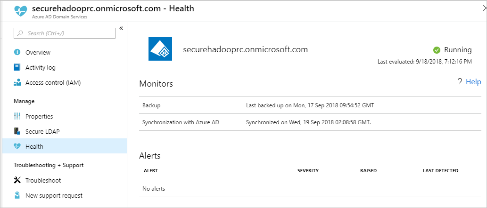
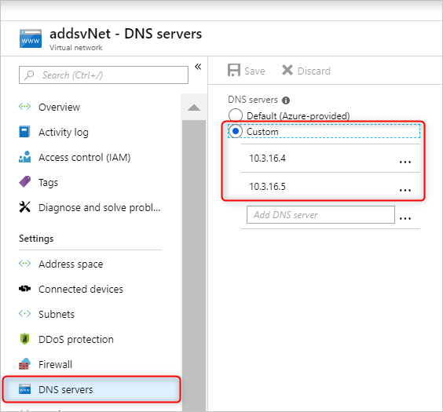
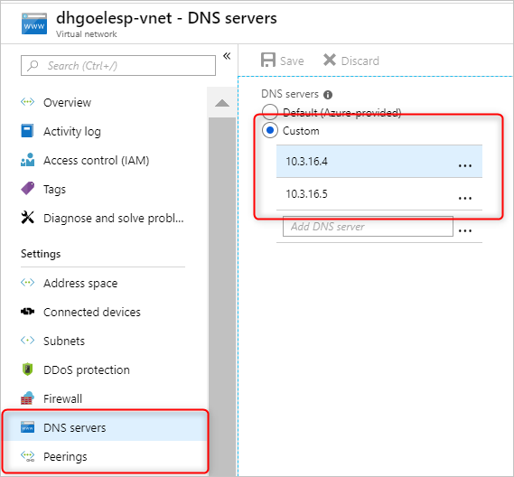
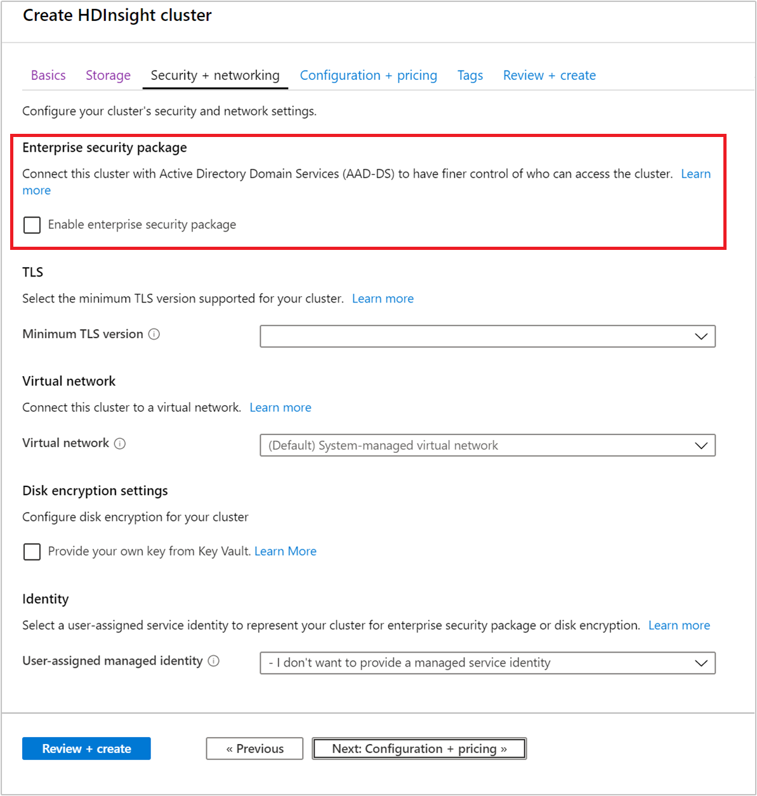
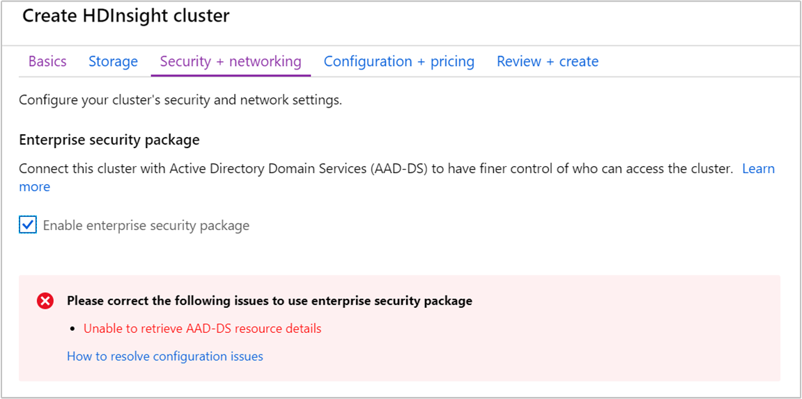
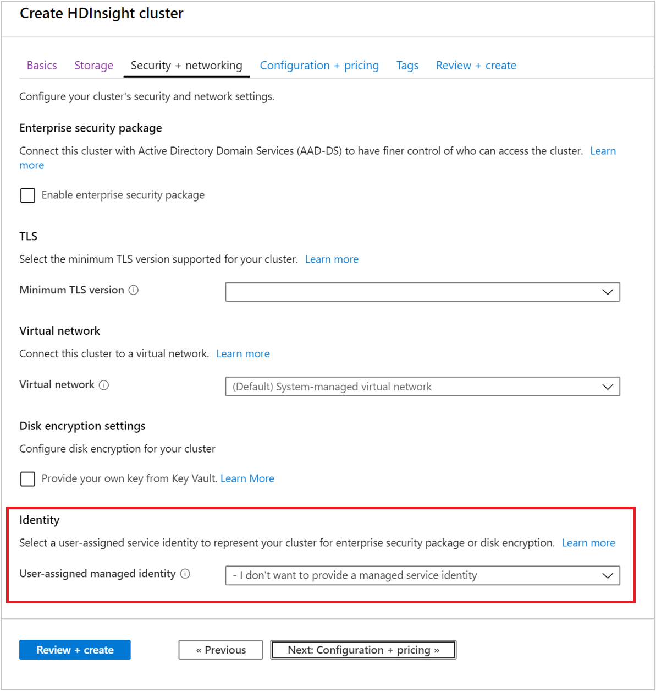

# Enterprise Security Package configurations with Azure Active Directory Domain Services in HDInsight

Enterprise Security Package (ESP) clusters provide multiuser access on Azure HDInsight clusters. HDInsight clusters with ESP are connected to a domain so that domain users can use their domain credentials to authenticate with the clusters and run big data jobs.

In this article, you learn how to configure an HDInsight cluster with ESP by using Azure Active Directory Domain Services (Azure AD DS).

> [!NOTE]  
> ESP is generally available in HDInsight 3.6 and 4.0 for these cluster types: Apache Spark, Interactive, Hadoop, and HBase. ESP for the Apache Kafka cluster type is in preview with best-effort support only. ESP clusters created before the ESP GA date (October 1, 2018) are not supported.

## Enable Azure AD DS

> [!NOTE]  
> Only tenant administrators have the privileges to enable Azure AD DS. If the cluster storage is Azure Data Lake Storage Gen1 or Gen2, you must disable Azure Multi-Factor Authentication only for users who will need to access the cluster by using basic Kerberos authentication. 
>
> You can use [trusted IPs](../../active-directory/authentication/howto-mfa-mfasettings.md#trusted-ips) or [Conditional Access](../../active-directory/conditional-access/overview.md) to disable Multi-Factor Authentication for specific users *only* when they're accessing the IP range for the HDInsight cluster's virtual network. If you're using Conditional Access, make sure that the Active Directory service endpoint in enabled on the HDInsight virtual network.
>
> If the cluster storage is Azure Blob storage, do not disable Multi-Factor Authentication.

Enabling Azure AD DS is a prerequisite before you can create an HDInsight cluster with ESP. For more information, see [Enable Azure Active Directory Domain Services by using the Azure portal](../../active-directory-domain-services/tutorial-create-instance.md). 

When Azure AD DS is enabled, all users and objects start synchronizing from Azure Active Directory (Azure AD) to Azure AD DS by default. The length of the sync operation depends on the number of objects in Azure AD. The sync might take a few days for hundreds of thousands of objects. 

The domain name that you use with Azure AD DS must be 39 characters or fewer, to work with HDInsight.

You can choose to sync only the groups that need access to the HDInsight clusters. This option of syncing only certain groups is called *scoped synchronization*. For instructions, see [Configure scoped synchronization from Azure AD to your managed domain](../../active-directory-domain-services/scoped-synchronization.md).

When you're enabling secure LDAP, put the domain name in the subject name and the subject alternative name in the certificate. For example, if your domain name is *contoso100.onmicrosoft.com*, make sure that exact name exists in your certificate subject name and subject alternative name. For more information, see [Configure secure LDAP for an Azure AD DS managed domain](../../active-directory-domain-services/tutorial-configure-ldaps.md). 

The following example creates a self-signed certificate. The domain name *contoso100.onmicrosoft.com* is in both `Subject` (subject name) and `DnsName` (subject alternative name).

```PowerShell
$lifetime=Get-Date
New-SelfSignedCertificate -Subject contoso100.onmicrosoft.com `
  -NotAfter $lifetime.AddDays(365) -KeyUsage DigitalSignature, KeyEncipherment `
  -Type SSLServerAuthentication -DnsName *.contoso100.onmicrosoft.com, contoso100.onmicrosoft.com
```

## Check Azure AD DS health status
View the health status of Azure Active Directory Domain Services by selecting **Health** in the **Manage** category. Make sure the status of Azure AD DS is green (running) and the synchronization is complete.



## Create and authorize a managed identity

You can use a *user-assigned managed identity* to simplify and help secure domain services operations. When you assign the **HDInsight Domain Services Contributor** role to the managed identity, it can read, create, modify, and delete domain services operations. 

Certain domain services operations, such as creating OUs and service principals, are needed for HDInsight Enterprise Security Package. You can create managed identities in any subscription. For more information on managed identities in general, see [Managed identities for Azure resources](../../active-directory/managed-identities-azure-resources/overview.md). For more information on how managed identities work in Azure HDInsight, see [Managed identities in Azure HDInsight](../hdinsight-managed-identities.md).

To set up ESP clusters, create a user-assigned managed identity if you don't have one already. For instructions, see [Create, list, delete, or assign a role to a user-assigned managed identity by using the Azure portal](../../active-directory/managed-identities-azure-resources/how-to-manage-ua-identity-portal.md). 

Next, assign the **HDInsight Domain Services Contributor** role to the managed identity in **Access control** for Azure AD DS. You need Azure AD DS admin privileges to make this role assignment.


Assigning the **HDInsight Domain Services Contributor** role ensures that this identity has proper (on behalf of) access to perform domain services operations on the Azure AD DS domain. These operations include creating and deleting OUs.

After the managed identity is created and given the correct role, the Azure AD DS admin can set up who can use this managed identity. First, the admin selects the managed identity in the portal, and then selects **Access Control (IAM)** under **Overview**. Then, on the right, the admin assigns the **Managed Identity Operator** role to the users or groups that want to create HDInsight ESP clusters. 

For example, the Azure AD DS admin can assign this role to the **MarketingTeam** group for the **sjmsi** managed identity, as shown in the following image. This assignment ensures that the right people in the organization can use the managed identity to create ESP clusters.


## Network considerations

> [!NOTE]  
> Azure AD DS must be deployed in an Azure Resource Manager-based virtual network. Classic virtual networks are not supported for Azure AD DS. For more information, see [Enable Azure Active Directory Domain Services by using the Azure portal](../../active-directory-domain-services/tutorial-create-instance-advanced.md#create-and-configure-the-virtual-network).

After you enable Azure AD DS, a local Domain Name System (DNS) server runs on the Active Directory virtual machines (VMs). Configure your Azure AD DS virtual network to use these custom DNS servers. To locate the right IP addresses, select **Properties** in the **Manage** category and look under **IP ADDRESS ON VIRTUAL NETWORK**.


Change the configuration of the DNS servers in the Azure AD DS virtual network to use these custom IPs by selecting **DNS servers** in the **Settings** category. Then select the **Custom** option, enter the first IP address in the text box, and select **Save**. Add more IP addresses by using the same steps.



It's easier to place both the Azure AD DS instance and the HDInsight cluster in the same Azure virtual network. If you plan to use different virtual networks, you must peer those virtual networks so that the domain controller is visible to HDInsight VMs. For more information, see [Virtual network peering](../../virtual-network/virtual-network-peering-overview.md). 

After the virtual networks are peered, configure the HDInsight virtual network to use a custom DNS server and enter the Azure AD DS private IPs as the DNS server addresses. When both virtual networks use the same DNS servers, your custom domain name will resolve to the right IP and will be reachable from HDInsight. For example, if your domain name is `contoso.com`, then after this step, `ping contoso.com` should resolve to the right Azure AD DS IP.



If you're using network security group (NSG) rules in your HDInsight subnet, you should allow the [required IPs](../hdinsight-management-ip-addresses.md) for both inbound and outbound traffic.

To test if your network is set up correctly, join a Windows VM to the HDInsight virtual network/subnet and ping the domain name. (It should resolve to an IP.) Run **ldp.exe** to access the Azure AD DS domain. Then join this Windows VM to the domain to confirm that all the required RPC calls succeed between the client and server. 

You can also use **nslookup** to confirm network access to your storage account or any external database that you might use (for example, external Hive metastore or Ranger DB). Make sure that all of the [required ports](/previous-versions/windows/it-pro/windows-server-2008-R2-and-2008/dd772723(v=ws.10)#communication-to-domain-controllers) are allowed in the Azure AD DS subnet's NSG rules, if an NSG helps secure Azure AD DS. If the domain joining of this Windows VM is successful, then you can continue to the next step and create ESP clusters.

## Create an HDInsight cluster with ESP

After you've set up the previous steps correctly, the next step is to create the HDInsight cluster with ESP enabled. When you create an HDInsight cluster, you can enable Enterprise Security Package on the **Security + networking** tab. If you prefer to use an Azure Resource Manager template for deployment, use the portal experience once and download the prefilled template on the **Review + create** page for future reuse. 

You can also enable the [HDInsight ID Broker](identity-broker.md) feature during cluster creation. The ID Broker feature lets you sign in to Ambari by using Multi-Factor Authentication and get the required Kerberos tickets without needing password hashes in Azure AD DS.

> [!NOTE]  
> The first six characters of the ESP cluster names must be unique in your environment. For example, if you have multiple ESP clusters in different virtual networks, choose a naming convention that ensures the first six characters on the cluster names are unique.



After you enable ESP, common misconfigurations related to Azure AD DS are automatically detected and validated. After you fix these errors, you can continue with the next step.



When you create an HDInsight cluster with ESP, you must supply the following parameters:

- **Cluster admin user**: Choose an admin for your cluster from your synced Azure AD DS instance. This domain account must be already synced and available in Azure AD DS.

- **Cluster access groups**: The security groups whose users you want to sync and have access to the cluster should be available in Azure AD DS. An example is the HiveUsers group. For more information, see [Create a group and add members in Azure Active Directory](../../active-directory/fundamentals/active-directory-groups-create-azure-portal.md).

- **LDAPS URL**: An example is `ldaps://contoso.com:636`.

The managed identity that you created can be chosen from the **User-assigned managed identity** drop-down list when you're creating a new cluster.

.

## Next steps

* For configuring Hive policies and running Hive queries, see [Configure Apache Hive policies for HDInsight clusters with ESP](apache-domain-joined-run-hive.md).
* For using SSH to connect to HDInsight clusters with ESP, see [Use SSH with Linux-based Apache Hadoop on HDInsight from Linux, Unix, or OS X](../hdinsight-hadoop-linux-use-ssh-unix.md#domainjoined).
