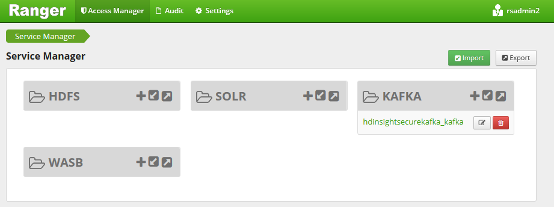
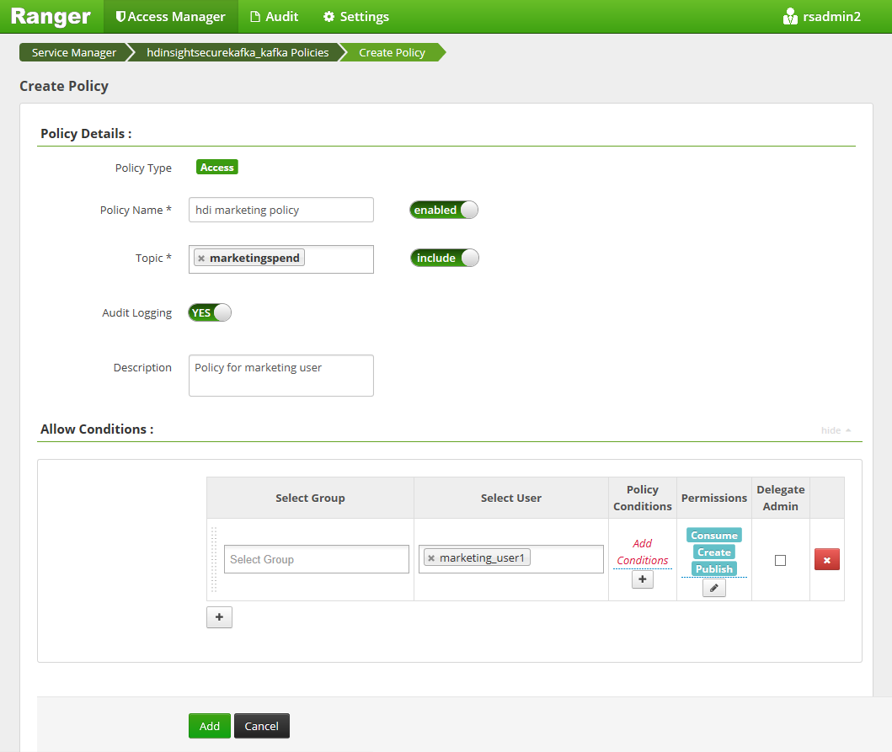

# Configure Kafka policies in Domain-joined HDInsight

Learn how to configure Apache Ranger policies for Kafka. In this tutorial, you 

create two Ranger policies to restrict access to the hivesampletable. The hivesampletable comes with HDInsight clusters. After you have configured the policies, you use Excel and ODBC driver to connect to Hive tables in HDInsight.

In this tutorial, you learn how to:

> [!div class="checklist"]
> * 
> * 
> * 

## Before you begin

* If you don't have an Azure subscription, create a [free account](https://azure.microsoft.com/free/).

* Sign in to the [Azure portal](https://portal.azure.com/).

* Create a [HDInsight Kafka cluster with Enterprise Security Package](https://docs.microsoft.com/azure/hdinsight/domain-joined/apache-domain-joined-run-hive).

## Connect to Apache Ranger Admin UI

1. From a browser, connect to Ranger Admin UI using the URL `https://<ClusterName>.azurehdinsight.net/Ranger/`.

   [!NOTE] Ranger uses different credentials than Hadoop cluster. To prevent browsers using cached Hadoop credentials, use a new InPrivate browser window to connect to the Ranger Admin UI.

2. Log in using the Azure AD admin credentials. The Azure AD admin credentials are neither the credentials of your HDInsight cluster nor the SSH credentials of the Linux type HDI node.

   

## Create domain users
Visit [Create a HDInsight cluster with Enterprise Security Package](https://docs.microsoft.com/azure/hdinsight/domain-joined/apache-domain-joined-configure-using-azure-adds#create-a-domain-joined-hdinsight-cluster), to learn how to create **sales_user** and **marketing_user**. We will use these user accounts in this tutorial. In a production scenario, domain users will come from the corresponding AD tenant.

## Create Ranger policy 
In this section, you will create a Ranger policy for **sales_user** and **marketing_user** created in the previous step.

1.	Open **Ranger Admin UI**.

2.	Click **\<ClusterName>_kafka** under **Kafka**. You should see one pre-configured policy.

3.	Click **Add New Policy**, and then enter the following values:
   |**Setting**  |**Suggested value**  |
   |---------|---------|
   |Policy Name  |  hdi sales* policy   |
   |Topic   |  sales* |
   |Select User  |  sales_user1 |
   |Permissions  | publish, consume, create |

      

   [!NOTE] If a domain user is not populated in Select User, wait a few moments for Ranger to sync with AAD.

   [!NOTE] Wildcards: Wildcards can be included in topic name.’*’ indicates zero or more occurs of characters.’?‘ indicates single character.

4. Click **Add** to save the policy.

5.	Click **Add New Policy**, and then enter the following values:
   |**Setting**  |**Suggested value**  |
   |---------|---------|
   |Policy Name  |  hdi marketing policy   |
   |Topic   |  marketingspend |
   |Select User  |  marketing_user1 |
   |Permissions  | publish, consume, create |

     

   [!NOTE] If a domain user is not populated in Select User, wait a few moments for Ranger to sync with AAD.

6.	Click **Add** to save the policy.

## Create topics in a domain-joined Kafka cluster
You will create two topics: **salesevents** and **marketingspend**.

1.	Use the following command to open an SSH connection to the cluster:

```
ssh SSHUSER@CLUSTERNAME-ssh.azurehdinsight.net
```

Replace `SSHUSER` with the SSH user for your cluster, and replace `CLUSTERNAME` with the name of your cluster. If prompted, enter the password for the SSH user account. For more information on using `scp` with HDInsight, see [Use SSH with HDInsight](https://docs.microsoft.com/azure/hdinsight/hdinsight-hadoop-linux-use-ssh-unix).

In a production scenario, domain users configured during the cluster creation can SSH into the cluster.

2.	Use the following commands to save the cluster name to a variable and install a JSON parsing utility (jq). When prompted, enter the Kafka cluster name.

```console
sudo apt -y install jq
read -p 'Enter your Kafka cluster name:' CLUSTERNAME
```

3. Use the following commands to get the Kafka broker hosts and the Zookeeper hosts. When prompted, enter the password for the cluster login admin account.

```console
export KAFKAZKHOSTS=`curl -sS -u admin -G https://$CLUSTERNAME.azurehdinsight.net/api/v1/clusters/$CLUSTERNAME/services/ZOOKEEPER/components/ZOOKEEPER_SERVER | jq -r '["\(.host_components[].HostRoles.host_name):2181"] | join(",")' | cut -d',' -f1,2`; \

export KAFKABROKERS=`curl -sS -u admin -G https://$CLUSTERNAME.azurehdinsight.net/api/v1/clusters/$CLUSTERNAME/services/KAFKA/components/KAFKA_BROKER | jq -r '["\(.host_components[].HostRoles.host_name):9092"] | join(",")' | cut -d',' -f1,2`; \
```

4. Run the following commands: 

```console
java -jar -Djava.security.auth.login.config=/usr/hdp/current/kafka-broker/config/kafka_client_jaas.conf kafka-producer-consumer.jar create salesevents $KAFKABROKERS

java -jar -Djava.security.auth.login.config=/usr/hdp/current/kafka-broker/config/kafka_client_jaas.conf kafka-producer-consumer.jar create marketingspend $KAFKABROKERS
```

[!NOTE] Only the process owner of Kafka service, such as root, can write to Zookeeper `znodes (/configs/topics)`. Ranger policies are not enforced when a non-privileged user creates a topic. This is because `kafka-topics.sh` script communicates directly with Zookeeper to create the topic. Entries are added to the Zookeeper nodes and the watchers on the broker side monitor and create topics accordingly. The authorization cannot be done through the ranger plugin and we execute the above command as sudo through kafka broker


## Test the ranger policies
Based on the ranger policies configured, **sales_user** should be able to produce/consume to topic **salesevents** but should not be able to produce/consume to topic **marketingspend**. Vice-versa is true for **marketing_user**.

1. Open a new SSH connection to the cluster. Use the following command to login as **sales_user1**:

```console
ssh sales_user1@CLUSTERNAME-ssh.azurehdinsight.net
```

2. Execute the following command:

```console
export KAFKA_OPTS="-Djava.security.auth.login.config=/usr/hdp/current/kafka-broker/config/kafka_client_jaas.conf"
```

3. Use the broker and Zookeeper names from the previous section to set the following environment variables:

```console
export KAFKABROKERS=<brokerlist>:9092 
For e.g. export KAFKABROKERS=wn0-khdicl.contoso.com:9092,wn1-khdicl.contoso.com:9092

export KAFKAZKHOSTS=<zklist>:2181
For e.g. export KAFKAZKHOSTS=zk1-khdicl.contoso.com:2181,zk2-khdicl.contoso.com:2181
```

Verification: **sales_user1** can produce to topic **salesevents**.

4. Execute the following command to start the console-producer for topic **salesevents**:

```console
/usr/hdp/current/kafka-broker/bin/kafka-console-producer.sh --broker-list $KAFKABROKERS --topic salesevents --security-protocol SASL_PLAINTEXT
```

Then, enter a few messages on the console. Press **Ctrl + C** to quit the console-producer.

5. Execute the following command to consume from topic **salesevents**:

```console
/usr/hdp/current/kafka-broker/bin/kafka-console-consumer.sh --zookeeper $KAFKAZKHOSTS --topic salesevents --security-protocol PLAINTEXTSASL --from-beginning
```
 
You should see the messages entered before.

Verification: **sales_user1** cannot produce to topic **marketingspend**.

6. From the same ssh window as above, execute the following command to produce to the topic **marketingspend**:

```console
/usr/hdp/current/kafka-broker/bin/kafka-console-producer.sh --broker-list $KAFKABROKERS --topic marketingspend --security-protocol SASL_PLAINTEXT
```

You should get an authorization error as expected.
 
Verification: **marketing_user1** cannot consume from topic **salesevents**.

Repeat steps 1-3 above, but this time as **marketing_user1**.

7. Execute the following command to consume from topic **salesevents**:

```console
/usr/hdp/current/kafka-broker/bin/kafka-console-consumer.sh --zookeeper $KAFKAZKHOSTS --topic marketingspend --security-protocol PLAINTEXTSASL --from-beginning
```

You should not see any messages that were previously sent.

8. You should be able to audit access events from the Ranger UI.

   

## Next steps
